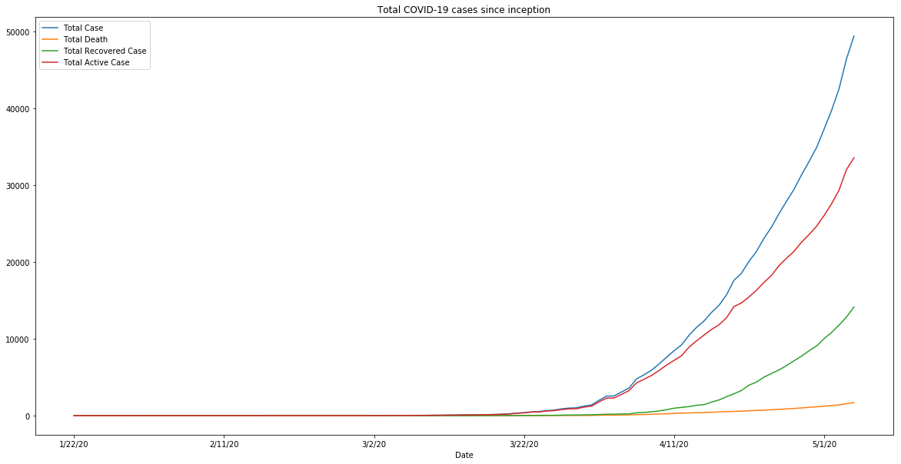
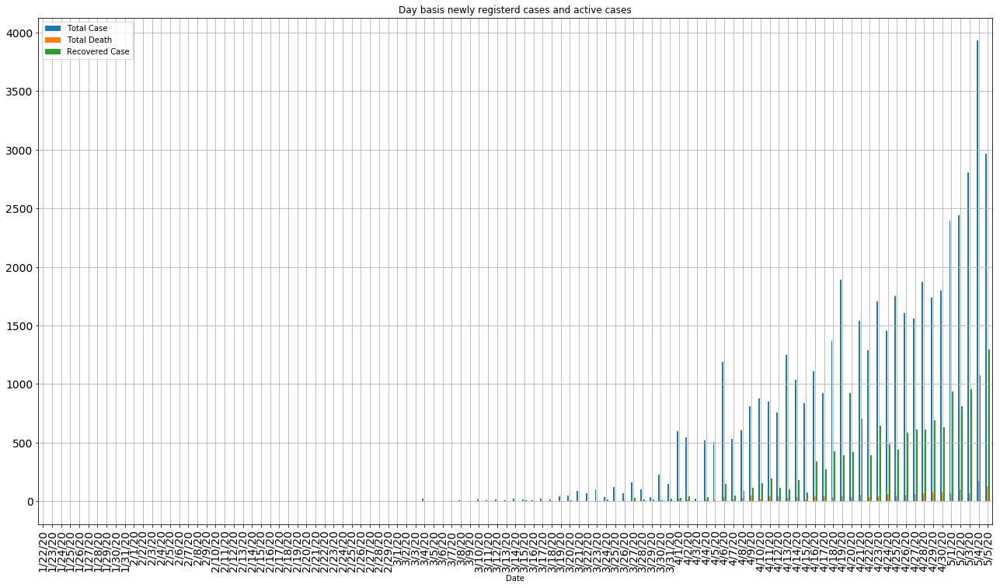
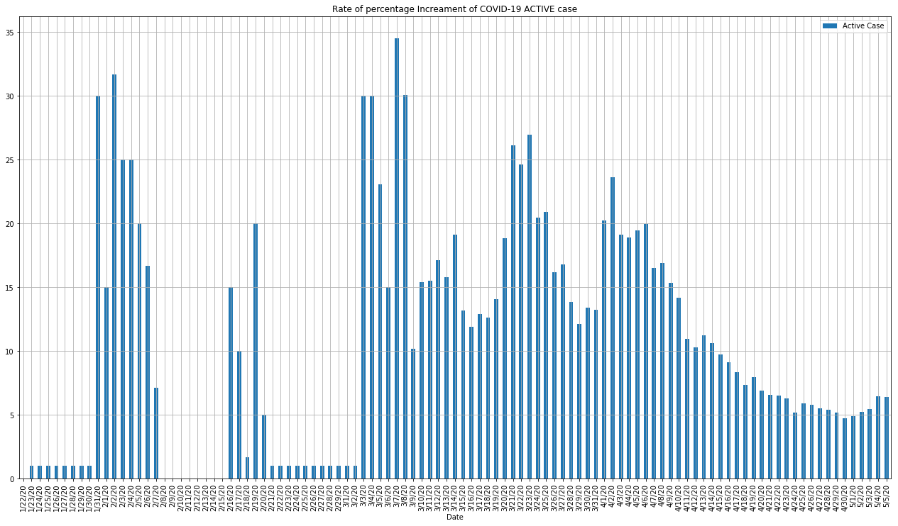
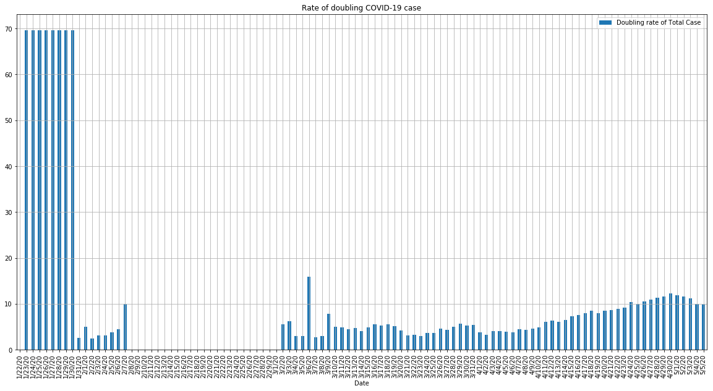
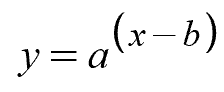

# Data Source and reference

- The data is collected from the source https://github.com/CSSEGISandData/COVID-19
- This is the data repository for the 2019 Novel Coronavirus Visual Dashboard operated by the 
`Johns Hopkins University Center for Systems Science and Engineering (JHU CSSE)`.
 Also, Supported by `ESRI Living Atlas Team and the Johns Hopkins University Applied Physics Lab (JHU APL)`.
 
- You can view their dashboard at
 https://www.arcgis.com/apps/opsdashboard/index.html#/bda7594740fd40299423467b48e9ecf6
 
 #### For SIR model fitting and analysis, we are taking help from the blogposts: 
 
 
 
 - https://towardsdatascience.com/infectious-disease-modelling-part-i-understanding-sir-28d60e29fdfc
 - https://towardsdatascience.com/infectious-disease-modelling-beyond-the-basic-sir-model-216369c584c4
 - https://towardsdatascience.com/infectious-disease-modelling-fit-your-model-to-coronavirus-data-2568e672dbc7 
 


```
import pandas as pd
from IPython.display import Image
import os
%matplotlib inline 
COUNTRY = 'India'
```


```
conf_case = pd.read_csv("https://raw.githubusercontent.com/CSSEGISandData/COVID-19/master/csse_covid_19_data/csse_covid_19_time_series/time_series_covid19_confirmed_global.csv")
conf_death = pd.read_csv("https://raw.githubusercontent.com/CSSEGISandData/COVID-19/master/csse_covid_19_data/csse_covid_19_time_series/time_series_covid19_deaths_global.csv")
conf_recovered = pd.read_csv("https://raw.githubusercontent.com/CSSEGISandData/COVID-19/master/csse_covid_19_data/csse_covid_19_time_series/time_series_covid19_recovered_global.csv")
```


```
cdf_conf_case = conf_case[conf_case['Country/Region']==COUNTRY].sum().drop(['Province/State','Country/Region','Lat','Long'])
cdf_conf_death = conf_death[conf_death['Country/Region']==COUNTRY].sum().drop(['Province/State','Country/Region','Lat','Long'])
cdf_conf_recovered = conf_recovered[conf_recovered['Country/Region']==COUNTRY].sum().drop(['Province/State','Country/Region','Lat','Long'])
```


```
def perDayCalc(totalList):
    pdf = []
    for idx, num in enumerate(totalList):
        if idx == 0:
            pdf.append(num)
            prev = num
        else:
            pdf.append(num - prev)
            prev = num
    return pdf

def rateOfChange(totalList, interval=5):
    changeVal = []
    changePer = []
    for idx, num in enumerate(totalList):
        if idx < interval:
            changeVal.append(sum(totalList[:(idx+1)])/(idx+1))
        else:
            changeVal.append(sum(totalList[idx-interval+1:(idx+1)])/interval)
    for idx, newVal in enumerate(changeVal):
        if idx == 0:
            changePer.append(0)
            prevVal = newVal
        elif prevVal!=0:
            changePer.append(100*(newVal-prevVal)/prevVal)
            prevVal = newVal
        else:
            changePer.append(1)
            prevVal = newVal
    changePer = [i%35 for i in changePer]
    return changePer #changeVal

def doublingRate(changePer):
    return [np.log(2)/np.log(1+(per/100)) for per in changePer]
```


```
cdf_case_list = cdf_conf_case.to_frame().T.sum().tolist()
cdf_death_list = cdf_conf_death.to_frame().T.sum().tolist()
cdf_recovered_list = cdf_conf_recovered.to_frame().T.sum().tolist()
cdf_active_list = np.subtract(np.subtract(cdf_case_list, cdf_recovered_list).tolist(), cdf_death_list).tolist()

pdf_case_list = perDayCalc(cdf_case_list)
pdf_death_list = perDayCalc(cdf_death_list)
pdf_recovered_list = perDayCalc(cdf_recovered_list)
pdf_active_list = perDayCalc(cdf_active_list)
```

### Cummulative visualization of COVID-19 cases in India since inception


```
data = {"Date": cdf_conf_case.to_frame().T.columns.to_list(),
        "Total Case": cdf_case_list, 
        "Total Death": cdf_death_list, 
        "Total Recovered Case": cdf_recovered_list, 
        "Total Active Case": cdf_active_list}
df = pd.DataFrame(data).set_index("Date")
df.plot(figsize=(20, 10), title ="Total COVID-19 cases since inception", fontsize = 10, kind="line")
plt.show()
```





### Daily basis newly added case visualization along with active cases


```
data = {"Date": cdf_conf_case.to_frame().T.columns.to_list(),
        "Total Case": pdf_case_list, 
        "Total Death": pdf_death_list, 
        "Recovered Case": pdf_recovered_list, 
        "Active Case": pdf_active_list}
dictfilt = lambda x, y: dict([ (i,x[i]) for i in x if i in set(y) ])
data = dictfilt(data, ("Total Case", "Recovered Case", "Total Death", 'Date'))
df = pd.DataFrame(data).set_index("Date")
df.plot(figsize=(22, 12), title ="Day basis newly registerd cases and active cases", fontsize = 14, 
        kind="bar", grid = True)
plt.show()
```





```
print(f"Total New cases added on last day: {np.round(df.iloc[-1].tolist()[0], 0)}")
print(f"Total Death cases added on last day: {np.round(df.iloc[-1].tolist()[1], 0)}")
print(f"Total Recovered cases added on last day: {np.round(df.iloc[-1].tolist()[2], 0)}")
```

    Total New cases added on last day: 2963.0
    Total Death cases added on last day: 127.0
    Total Recovered cases added on last day: 1295.0
    

# Rate of Increase of COVID-19 cases

### Percentage wise increment of daily NEW cases as compared to previous day


```
data = {"Date": cdf_conf_case.to_frame().T.columns.to_list(),
        "Total Case": rateOfChange(cdf_case_list), 
        "Total Death": rateOfChange(cdf_death_list), 
        "Recovered Case": rateOfChange(cdf_recovered_list), 
        "Active Case": rateOfChange(cdf_active_list),
        "Doubling rate of Total Case": doublingRate(rateOfChange(cdf_case_list))
       }
dictfilt = lambda x, y: dict([ (i,x[i]) for i in x if i in set(y) ])
data = dictfilt(data, ("Total Case", 'Date'))
df = pd.DataFrame(data).set_index("Date")
df.plot(figsize=(22, 12), title ="Rate of percentage Increament of COVID-19 NEW case", fontsize = 10, kind="bar", grid = True)
plt.show()
```

    C:\Anaconda3\lib\site-packages\ipykernel_launcher.py:34: RuntimeWarning: divide by zero encountered in double_scalars
    


```
print(f"Percentage increment of total cases as compared to previous day: {np.round(df.iloc[-1].tolist()[0], 2)}%")
```

    Percentage increment of total cases as compared to previous day: 7.24%
    

### Percentage wise increment of daily ACTIVE cases as compared to previous day


```
data = {"Date": cdf_conf_case.to_frame().T.columns.to_list(),
        "Total Case": rateOfChange(cdf_case_list), 
        "Total Death": rateOfChange(cdf_death_list), 
        "Recovered Case": rateOfChange(cdf_recovered_list), 
        "Active Case": rateOfChange(cdf_active_list),
        "Doubling rate of Total Case": doublingRate(rateOfChange(cdf_case_list))
       }
dictfilt = lambda x, y: dict([ (i,x[i]) for i in x if i in set(y) ])
data = dictfilt(data, ("Active Case", 'Date'))
df = pd.DataFrame(data).set_index("Date")
df.plot(figsize=(22, 12), title ="Rate of percentage Increament of COVID-19 ACTIVE case", fontsize = 10, kind="bar", grid = True)
plt.show()
```

    C:\Anaconda3\lib\site-packages\ipykernel_launcher.py:34: RuntimeWarning: divide by zero encountered in double_scalars
    





```
print(f"Percentage increment of active cases as compared to previous day: {np.round(df.iloc[-1].tolist()[0], 2)}%")
```

    Percentage increment of active cases as compared to previous day: 6.39%
    

### Doubling rate of the cases in last 5 days


```
data = {"Date": cdf_conf_case.to_frame().T.columns.to_list(),
        "Total Case": rateOfChange(cdf_case_list), 
        "Total Death": rateOfChange(cdf_death_list), 
        "Recovered Case": rateOfChange(cdf_recovered_list), 
        "Active Case": rateOfChange(cdf_active_list),
        "Doubling rate of Total Case": doublingRate(rateOfChange(cdf_case_list))
       }
dictfilt = lambda x, y: dict([ (i,x[i]) for i in x if i in set(y) ])
data = dictfilt(data, ("Doubling rate of Total Case", 'Date'))
df = pd.DataFrame(data).set_index("Date")
df.plot(figsize=(20, 10), title ="Rate of doubling COVID-19 case", fontsize = 10, kind="bar", grid = True)
plt.show()
```

    C:\Anaconda3\lib\site-packages\ipykernel_launcher.py:34: RuntimeWarning: divide by zero encountered in double_scalars
    





```
print(f"Doubling rate of cases: {np.round(df.iloc[-1].tolist()[0], 2)} days")
```

    Doubling rate of cases: 9.92 days
    

# Epidemic modelling using Extended SIR and fitting it to COVID-19 data

Models are always simplifications of the real world. It is a way to put the real world scenarios in some mathemetical equation so that we can derive/infer information out of it. To model something, we have to assume some facts in the first place for the sake of simplicity and interpretability.

In Data Science terminology, these are some handcrafted features we are building to approximate the current COVID-19 scenarion. SIR(Susceptible, Infected, Recovered) is a very popular model for infectious diseases modelling. But the simple vanila SIR won't help us much in real life scenario. Thats why, here we are building a extended SIR model for COVID-19 India scenario.

### Paramenters/Features

- N: total population
- S(t): number of people susceptible on day t
- E(t): number of people exposed on day t
- I(t): number of people infected on day t
- R(t): number of people recovered on day t
- D(t): number of people dead on day t
- β: expected amount of people an infected person infects per day
- D: number of days an infected person has and can spread the disease
- γ: the proportion of infected recovering per day (γ = 1/D)
- R₀: the total number of people an infected person infects (R₀ = β / γ)
- δ: length of incubation period
- α: fatality rate
- ρ: rate at which people die (= 1/days from infected until death)


Below are the equations that go with it


```
import numpy as np
import pandas as pd
pd.options.mode.chained_assignment = None  # default='warn'

import matplotlib.pyplot as plt
import matplotlib.dates as mdates
%matplotlib inline 
import mpld3
mpld3.enable_notebook()

from scipy.integrate import odeint
import lmfit
from lmfit.lineshapes import gaussian, lorentzian

import warnings
warnings.filterwarnings('ignore')
```


```
# Load the data
ROOT_DIR = "D:/New folder/Covid19-India-finding-insight/data"
beds = pd.read_csv(os.path.join(ROOT_DIR, "beds.csv"), header=0)
agegroups = pd.read_csv(os.path.join(ROOT_DIR, "agegroups.csv"))
probabilities = pd.read_csv(os.path.join(ROOT_DIR, "probabilities.csv"))

covid_data = pd.read_csv("https://tinyurl.com/t59cgxn", parse_dates=["Date"], skiprows=[1])
covid_data["Location"] = covid_data["Country/Region"]


beds_lookup = dict(zip(beds["Country"], beds["ICU_Beds"]))
agegroup_lookup = dict(zip(agegroups['Location'], 
                           agegroups[['0_9', '10_19', '20_29', '30_39', '40_49', 
                                      '50_59', '60_69', '70_79', '80_89', '90_100']].values))

prob_I_to_C_1 = list(probabilities.prob_I_to_ICU_1.values)
prob_I_to_C_2 = list(probabilities.prob_I_to_ICU_2.values)
prob_C_to_Death_1 = list(probabilities.prob_ICU_to_Death_1.values)
prob_C_to_Death_2 = list(probabilities.prob_ICU_to_Death_2.values)
```


```
covid_data.groupby("Date").sum()[["Value"]].plot(figsize=(12, 8), title="Covid-19 total fatalities (world)")
```


    <matplotlib.axes._subplots.AxesSubplot at 0x2e3ad80d588>


<style>

</style>

<div id="fig_el426031768918003207395123216"></div>
<script>
function mpld3_load_lib(url, callback){
  var s = document.createElement('script');
  s.src = url;
  s.async = true;
  s.onreadystatechange = s.onload = callback;
  s.onerror = function(){console.warn("failed to load library " + url);};
  document.getElementsByTagName("head")[0].appendChild(s);
}

if(typeof(mpld3) !== "undefined" && mpld3._mpld3IsLoaded){
   // already loaded: just create the figure
   !function(mpld3){
       
       mpld3.draw_figure("fig_el426031768918003207395123216", {"width": 864.0, "height": 576.0, "axes": [{"bbox": [0.125, 0.125, 0.775, 0.755], "xlim": [18283.0, 18387.0], "ylim": [-12844.1, 270100.1], "xdomain": [[51, 0, 21, 0, 0, 0, 0.0], [51, 4, 5, 0, 0, 0, 0.0]], "ydomain": [-12844.1, 270100.1], "xscale": "date", "yscale": "linear", "axes": [{"position": "bottom", "nticks": 6, "tickvalues": null, "tickformat": null, "scale": "linear", "fontsize": 10.0, "grid": {"gridOn": false}, "visible": true}, {"position": "left", "nticks": 8, "tickvalues": null, "tickformat": null, "scale": "linear", "fontsize": 10.0, "grid": {"gridOn": false}, "visible": true}], "axesbg": "#FFFFFF", "axesbgalpha": null, "zoomable": true, "id": "el42603176891733384", "lines": [{"data": "data01", "xindex": 0, "yindex": 1, "coordinates": "data", "id": "el42603176891324568", "color": "#1F77B4", "linewidth": 1.5, "dasharray": "none", "alpha": 1, "zorder": 2, "drawstyle": "default"}, {"data": "data02", "xindex": 0, "yindex": 1, "coordinates": "axes", "id": "el42603176892015840", "color": "#1F77B4", "linewidth": 1.5, "dasharray": "none", "alpha": 1, "zorder": 1000002.0, "drawstyle": "default"}], "paths": [{"data": "data03", "xindex": 0, "yindex": 1, "coordinates": "axes", "pathcodes": ["M", "L", "S", "L", "S", "L", "S", "L", "S", "Z"], "id": "el42603176891799480", "dasharray": "none", "alpha": 0.8, "facecolor": "#FFFFFF", "edgecolor": "#CCCCCC", "edgewidth": 1.0, "zorder": 1000000.0}], "markers": [], "texts": [{"text": "Date", "position": [0.49999999999999994, -0.07496320824135393], "coordinates": "axes", "h_anchor": "middle", "v_baseline": "hanging", "rotation": -0.0, "fontsize": 10.0, "color": "#000000", "alpha": 1, "zorder": 3, "id": "el42603176891323224"}, {"text": "Covid-19 total fatalities (world)", "position": [0.49999999999999994, 1.0137969094922736], "coordinates": "axes", "h_anchor": "middle", "v_baseline": "auto", "rotation": -0.0, "fontsize": 12.0, "color": "#000000", "alpha": 1, "zorder": 3, "id": "el42603176891868720"}, {"text": "Value", "position": [0.9441830943847073, 0.9609087564385577], "coordinates": "axes", "h_anchor": "start", "v_baseline": "auto", "rotation": -0.0, "fontsize": 10.0, "color": "#000000", "alpha": 1, "zorder": 1000003.0, "id": "el42603176891964440"}], "collections": [], "images": [], "sharex": [], "sharey": []}], "data": {"data01": [[18283.0, 17.0], [18284.0, 18.0], [18285.0, 26.0], [18286.0, 42.0], [18287.0, 56.0], [18288.0, 82.0], [18289.0, 131.0], [18290.0, 133.0], [18291.0, 171.0], [18292.0, 213.0], [18293.0, 259.0], [18294.0, 362.0], [18295.0, 426.0], [18296.0, 492.0], [18297.0, 564.0], [18298.0, 634.0], [18299.0, 719.0], [18300.0, 806.0], [18301.0, 906.0], [18302.0, 1013.0], [18303.0, 1113.0], [18304.0, 1118.0], [18305.0, 1371.0], [18306.0, 1523.0], [18307.0, 1666.0], [18308.0, 1770.0], [18309.0, 1868.0], [18310.0, 2007.0], [18311.0, 2122.0], [18312.0, 2247.0], [18313.0, 2251.0], [18314.0, 2458.0], [18315.0, 2469.0], [18316.0, 2629.0], [18317.0, 2708.0], [18318.0, 2770.0], [18319.0, 2814.0], [18320.0, 2872.0], [18321.0, 2941.0], [18322.0, 2996.0], [18323.0, 3085.0], [18324.0, 3160.0], [18325.0, 3254.0], [18326.0, 3347.0], [18327.0, 3459.0], [18328.0, 3558.0], [18329.0, 3801.0], [18330.0, 3987.0], [18331.0, 4263.0], [18332.0, 4614.0], [18333.0, 4722.0], [18334.0, 5408.0], [18335.0, 5830.0], [18336.0, 6472.0], [18337.0, 7150.0], [18338.0, 7956.0], [18339.0, 8823.0], [18340.0, 9946.0], [18341.0, 11422.0], [18342.0, 13125.0], [18343.0, 14825.0], [18344.0, 16759.0], [18345.0, 19014.0], [18346.0, 21785.0], [18347.0, 24788.0], [18348.0, 28288.0], [18349.0, 31797.0], [18350.0, 35323.0], [18351.0, 39439.0], [18352.0, 44238.0], [18353.0, 49675.0], [18354.0, 55817.0], [18355.0, 61812.0], [18356.0, 67981.0], [18357.0, 73076.0], [18358.0, 78767.0], [18359.0, 86662.0], [18360.0, 93354.0], [18361.0, 100882.0], [18362.0, 108113.0], [18363.0, 114146.0], [18364.0, 119853.0], [18365.0, 125561.0], [18366.0, 132439.0], [18367.0, 140658.0], [18368.0, 147946.0], [18369.0, 156804.0], [18370.0, 163214.0], [18371.0, 167773.0], [18372.0, 173098.0], [18373.0, 180237.0], [18374.0, 186914.0], [18375.0, 193667.0], [18376.0, 199999.0], [18377.0, 206187.0], [18378.0, 209900.0], [18379.0, 214444.0], [18380.0, 220799.0], [18381.0, 227665.0], [18382.0, 233357.0], [18383.0, 238619.0], [18384.0, 243808.0], [18385.0, 247470.0], [18386.0, 251537.0], [18387.0, 257239.0]], "data02": [[0.9023670848267623, 0.968956953642384], [0.9322356630824373, 0.968956953642384]], "data03": [[0.8993802270011947, 0.947111846946284], [0.9895459976105138, 0.947111846946284], [0.9925328554360812, 0.947111846946284], [0.9925328554360812, 0.9517108167770418], [0.9925328554360812, 0.9839036055923474], [0.9925328554360812, 0.9885025754231052], [0.9895459976105138, 0.9885025754231052], [0.8993802270011947, 0.9885025754231052], [0.8963933691756273, 0.9885025754231052], [0.8963933691756273, 0.9839036055923474], [0.8963933691756273, 0.9517108167770418], [0.8963933691756273, 0.947111846946284], [0.8993802270011947, 0.947111846946284]]}, "id": "el42603176891800320", "plugins": [{"type": "reset"}, {"type": "zoom", "button": true, "enabled": false}, {"type": "boxzoom", "button": true, "enabled": false}]});
   }(mpld3);
}else if(typeof define === "function" && define.amd){
   // require.js is available: use it to load d3/mpld3
   require.config({paths: {d3: "https://mpld3.github.io/js/d3.v3.min"}});
   require(["d3"], function(d3){
      window.d3 = d3;
      mpld3_load_lib("https://mpld3.github.io/js/mpld3.v0.3.js", function(){
         
         mpld3.draw_figure("fig_el426031768918003207395123216", {"width": 864.0, "height": 576.0, "axes": [{"bbox": [0.125, 0.125, 0.775, 0.755], "xlim": [18283.0, 18387.0], "ylim": [-12844.1, 270100.1], "xdomain": [[51, 0, 21, 0, 0, 0, 0.0], [51, 4, 5, 0, 0, 0, 0.0]], "ydomain": [-12844.1, 270100.1], "xscale": "date", "yscale": "linear", "axes": [{"position": "bottom", "nticks": 6, "tickvalues": null, "tickformat": null, "scale": "linear", "fontsize": 10.0, "grid": {"gridOn": false}, "visible": true}, {"position": "left", "nticks": 8, "tickvalues": null, "tickformat": null, "scale": "linear", "fontsize": 10.0, "grid": {"gridOn": false}, "visible": true}], "axesbg": "#FFFFFF", "axesbgalpha": null, "zoomable": true, "id": "el42603176891733384", "lines": [{"data": "data01", "xindex": 0, "yindex": 1, "coordinates": "data", "id": "el42603176891324568", "color": "#1F77B4", "linewidth": 1.5, "dasharray": "none", "alpha": 1, "zorder": 2, "drawstyle": "default"}, {"data": "data02", "xindex": 0, "yindex": 1, "coordinates": "axes", "id": "el42603176892015840", "color": "#1F77B4", "linewidth": 1.5, "dasharray": "none", "alpha": 1, "zorder": 1000002.0, "drawstyle": "default"}], "paths": [{"data": "data03", "xindex": 0, "yindex": 1, "coordinates": "axes", "pathcodes": ["M", "L", "S", "L", "S", "L", "S", "L", "S", "Z"], "id": "el42603176891799480", "dasharray": "none", "alpha": 0.8, "facecolor": "#FFFFFF", "edgecolor": "#CCCCCC", "edgewidth": 1.0, "zorder": 1000000.0}], "markers": [], "texts": [{"text": "Date", "position": [0.49999999999999994, -0.07496320824135393], "coordinates": "axes", "h_anchor": "middle", "v_baseline": "hanging", "rotation": -0.0, "fontsize": 10.0, "color": "#000000", "alpha": 1, "zorder": 3, "id": "el42603176891323224"}, {"text": "Covid-19 total fatalities (world)", "position": [0.49999999999999994, 1.0137969094922736], "coordinates": "axes", "h_anchor": "middle", "v_baseline": "auto", "rotation": -0.0, "fontsize": 12.0, "color": "#000000", "alpha": 1, "zorder": 3, "id": "el42603176891868720"}, {"text": "Value", "position": [0.9441830943847073, 0.9609087564385577], "coordinates": "axes", "h_anchor": "start", "v_baseline": "auto", "rotation": -0.0, "fontsize": 10.0, "color": "#000000", "alpha": 1, "zorder": 1000003.0, "id": "el42603176891964440"}], "collections": [], "images": [], "sharex": [], "sharey": []}], "data": {"data01": [[18283.0, 17.0], [18284.0, 18.0], [18285.0, 26.0], [18286.0, 42.0], [18287.0, 56.0], [18288.0, 82.0], [18289.0, 131.0], [18290.0, 133.0], [18291.0, 171.0], [18292.0, 213.0], [18293.0, 259.0], [18294.0, 362.0], [18295.0, 426.0], [18296.0, 492.0], [18297.0, 564.0], [18298.0, 634.0], [18299.0, 719.0], [18300.0, 806.0], [18301.0, 906.0], [18302.0, 1013.0], [18303.0, 1113.0], [18304.0, 1118.0], [18305.0, 1371.0], [18306.0, 1523.0], [18307.0, 1666.0], [18308.0, 1770.0], [18309.0, 1868.0], [18310.0, 2007.0], [18311.0, 2122.0], [18312.0, 2247.0], [18313.0, 2251.0], [18314.0, 2458.0], [18315.0, 2469.0], [18316.0, 2629.0], [18317.0, 2708.0], [18318.0, 2770.0], [18319.0, 2814.0], [18320.0, 2872.0], [18321.0, 2941.0], [18322.0, 2996.0], [18323.0, 3085.0], [18324.0, 3160.0], [18325.0, 3254.0], [18326.0, 3347.0], [18327.0, 3459.0], [18328.0, 3558.0], [18329.0, 3801.0], [18330.0, 3987.0], [18331.0, 4263.0], [18332.0, 4614.0], [18333.0, 4722.0], [18334.0, 5408.0], [18335.0, 5830.0], [18336.0, 6472.0], [18337.0, 7150.0], [18338.0, 7956.0], [18339.0, 8823.0], [18340.0, 9946.0], [18341.0, 11422.0], [18342.0, 13125.0], [18343.0, 14825.0], [18344.0, 16759.0], [18345.0, 19014.0], [18346.0, 21785.0], [18347.0, 24788.0], [18348.0, 28288.0], [18349.0, 31797.0], [18350.0, 35323.0], [18351.0, 39439.0], [18352.0, 44238.0], [18353.0, 49675.0], [18354.0, 55817.0], [18355.0, 61812.0], [18356.0, 67981.0], [18357.0, 73076.0], [18358.0, 78767.0], [18359.0, 86662.0], [18360.0, 93354.0], [18361.0, 100882.0], [18362.0, 108113.0], [18363.0, 114146.0], [18364.0, 119853.0], [18365.0, 125561.0], [18366.0, 132439.0], [18367.0, 140658.0], [18368.0, 147946.0], [18369.0, 156804.0], [18370.0, 163214.0], [18371.0, 167773.0], [18372.0, 173098.0], [18373.0, 180237.0], [18374.0, 186914.0], [18375.0, 193667.0], [18376.0, 199999.0], [18377.0, 206187.0], [18378.0, 209900.0], [18379.0, 214444.0], [18380.0, 220799.0], [18381.0, 227665.0], [18382.0, 233357.0], [18383.0, 238619.0], [18384.0, 243808.0], [18385.0, 247470.0], [18386.0, 251537.0], [18387.0, 257239.0]], "data02": [[0.9023670848267623, 0.968956953642384], [0.9322356630824373, 0.968956953642384]], "data03": [[0.8993802270011947, 0.947111846946284], [0.9895459976105138, 0.947111846946284], [0.9925328554360812, 0.947111846946284], [0.9925328554360812, 0.9517108167770418], [0.9925328554360812, 0.9839036055923474], [0.9925328554360812, 0.9885025754231052], [0.9895459976105138, 0.9885025754231052], [0.8993802270011947, 0.9885025754231052], [0.8963933691756273, 0.9885025754231052], [0.8963933691756273, 0.9839036055923474], [0.8963933691756273, 0.9517108167770418], [0.8963933691756273, 0.947111846946284], [0.8993802270011947, 0.947111846946284]]}, "id": "el42603176891800320", "plugins": [{"type": "reset"}, {"type": "zoom", "button": true, "enabled": false}, {"type": "boxzoom", "button": true, "enabled": false}]});
      });
    });
}else{
    // require.js not available: dynamically load d3 & mpld3
    mpld3_load_lib("https://mpld3.github.io/js/d3.v3.min.js", function(){
         mpld3_load_lib("https://mpld3.github.io/js/mpld3.v0.3.js", function(){
                 
                 mpld3.draw_figure("fig_el426031768918003207395123216", {"width": 864.0, "height": 576.0, "axes": [{"bbox": [0.125, 0.125, 0.775, 0.755], "xlim": [18283.0, 18387.0], "ylim": [-12844.1, 270100.1], "xdomain": [[51, 0, 21, 0, 0, 0, 0.0], [51, 4, 5, 0, 0, 0, 0.0]], "ydomain": [-12844.1, 270100.1], "xscale": "date", "yscale": "linear", "axes": [{"position": "bottom", "nticks": 6, "tickvalues": null, "tickformat": null, "scale": "linear", "fontsize": 10.0, "grid": {"gridOn": false}, "visible": true}, {"position": "left", "nticks": 8, "tickvalues": null, "tickformat": null, "scale": "linear", "fontsize": 10.0, "grid": {"gridOn": false}, "visible": true}], "axesbg": "#FFFFFF", "axesbgalpha": null, "zoomable": true, "id": "el42603176891733384", "lines": [{"data": "data01", "xindex": 0, "yindex": 1, "coordinates": "data", "id": "el42603176891324568", "color": "#1F77B4", "linewidth": 1.5, "dasharray": "none", "alpha": 1, "zorder": 2, "drawstyle": "default"}, {"data": "data02", "xindex": 0, "yindex": 1, "coordinates": "axes", "id": "el42603176892015840", "color": "#1F77B4", "linewidth": 1.5, "dasharray": "none", "alpha": 1, "zorder": 1000002.0, "drawstyle": "default"}], "paths": [{"data": "data03", "xindex": 0, "yindex": 1, "coordinates": "axes", "pathcodes": ["M", "L", "S", "L", "S", "L", "S", "L", "S", "Z"], "id": "el42603176891799480", "dasharray": "none", "alpha": 0.8, "facecolor": "#FFFFFF", "edgecolor": "#CCCCCC", "edgewidth": 1.0, "zorder": 1000000.0}], "markers": [], "texts": [{"text": "Date", "position": [0.49999999999999994, -0.07496320824135393], "coordinates": "axes", "h_anchor": "middle", "v_baseline": "hanging", "rotation": -0.0, "fontsize": 10.0, "color": "#000000", "alpha": 1, "zorder": 3, "id": "el42603176891323224"}, {"text": "Covid-19 total fatalities (world)", "position": [0.49999999999999994, 1.0137969094922736], "coordinates": "axes", "h_anchor": "middle", "v_baseline": "auto", "rotation": -0.0, "fontsize": 12.0, "color": "#000000", "alpha": 1, "zorder": 3, "id": "el42603176891868720"}, {"text": "Value", "position": [0.9441830943847073, 0.9609087564385577], "coordinates": "axes", "h_anchor": "start", "v_baseline": "auto", "rotation": -0.0, "fontsize": 10.0, "color": "#000000", "alpha": 1, "zorder": 1000003.0, "id": "el42603176891964440"}], "collections": [], "images": [], "sharex": [], "sharey": []}], "data": {"data01": [[18283.0, 17.0], [18284.0, 18.0], [18285.0, 26.0], [18286.0, 42.0], [18287.0, 56.0], [18288.0, 82.0], [18289.0, 131.0], [18290.0, 133.0], [18291.0, 171.0], [18292.0, 213.0], [18293.0, 259.0], [18294.0, 362.0], [18295.0, 426.0], [18296.0, 492.0], [18297.0, 564.0], [18298.0, 634.0], [18299.0, 719.0], [18300.0, 806.0], [18301.0, 906.0], [18302.0, 1013.0], [18303.0, 1113.0], [18304.0, 1118.0], [18305.0, 1371.0], [18306.0, 1523.0], [18307.0, 1666.0], [18308.0, 1770.0], [18309.0, 1868.0], [18310.0, 2007.0], [18311.0, 2122.0], [18312.0, 2247.0], [18313.0, 2251.0], [18314.0, 2458.0], [18315.0, 2469.0], [18316.0, 2629.0], [18317.0, 2708.0], [18318.0, 2770.0], [18319.0, 2814.0], [18320.0, 2872.0], [18321.0, 2941.0], [18322.0, 2996.0], [18323.0, 3085.0], [18324.0, 3160.0], [18325.0, 3254.0], [18326.0, 3347.0], [18327.0, 3459.0], [18328.0, 3558.0], [18329.0, 3801.0], [18330.0, 3987.0], [18331.0, 4263.0], [18332.0, 4614.0], [18333.0, 4722.0], [18334.0, 5408.0], [18335.0, 5830.0], [18336.0, 6472.0], [18337.0, 7150.0], [18338.0, 7956.0], [18339.0, 8823.0], [18340.0, 9946.0], [18341.0, 11422.0], [18342.0, 13125.0], [18343.0, 14825.0], [18344.0, 16759.0], [18345.0, 19014.0], [18346.0, 21785.0], [18347.0, 24788.0], [18348.0, 28288.0], [18349.0, 31797.0], [18350.0, 35323.0], [18351.0, 39439.0], [18352.0, 44238.0], [18353.0, 49675.0], [18354.0, 55817.0], [18355.0, 61812.0], [18356.0, 67981.0], [18357.0, 73076.0], [18358.0, 78767.0], [18359.0, 86662.0], [18360.0, 93354.0], [18361.0, 100882.0], [18362.0, 108113.0], [18363.0, 114146.0], [18364.0, 119853.0], [18365.0, 125561.0], [18366.0, 132439.0], [18367.0, 140658.0], [18368.0, 147946.0], [18369.0, 156804.0], [18370.0, 163214.0], [18371.0, 167773.0], [18372.0, 173098.0], [18373.0, 180237.0], [18374.0, 186914.0], [18375.0, 193667.0], [18376.0, 199999.0], [18377.0, 206187.0], [18378.0, 209900.0], [18379.0, 214444.0], [18380.0, 220799.0], [18381.0, 227665.0], [18382.0, 233357.0], [18383.0, 238619.0], [18384.0, 243808.0], [18385.0, 247470.0], [18386.0, 251537.0], [18387.0, 257239.0]], "data02": [[0.9023670848267623, 0.968956953642384], [0.9322356630824373, 0.968956953642384]], "data03": [[0.8993802270011947, 0.947111846946284], [0.9895459976105138, 0.947111846946284], [0.9925328554360812, 0.947111846946284], [0.9925328554360812, 0.9517108167770418], [0.9925328554360812, 0.9839036055923474], [0.9925328554360812, 0.9885025754231052], [0.9895459976105138, 0.9885025754231052], [0.8993802270011947, 0.9885025754231052], [0.8963933691756273, 0.9885025754231052], [0.8963933691756273, 0.9839036055923474], [0.8963933691756273, 0.9517108167770418], [0.8963933691756273, 0.947111846946284], [0.8993802270011947, 0.947111846946284]]}, "id": "el42603176891800320", "plugins": [{"type": "reset"}, {"type": "zoom", "button": true, "enabled": false}, {"type": "boxzoom", "button": true, "enabled": false}]});
            })
         });
}
</script>


## Model definition


```
def deriv(y, t, beta, gamma, sigma, N, p_I_to_C, p_C_to_D, Beds):
    S, E, I, C, R, D = y

    dSdt = -beta(t) * I * S / N
    dEdt = beta(t) * I * S / N - sigma * E
    dIdt = sigma * E - 1/12.0 * p_I_to_C * I - gamma * (1 - p_I_to_C) * I
    dCdt = 1/12.0 * p_I_to_C * I - 1/7.5 * p_C_to_D * min(Beds(t), C) - max(0, C-Beds(t)) - (1 - p_C_to_D) * 1/6.5 * min(Beds(t), C)
    dRdt = gamma * (1 - p_I_to_C) * I + (1 - p_C_to_D) * 1/6.5 * min(Beds(t), C)
    dDdt = 1/7.5 * p_C_to_D * min(Beds(t), C) + max(0, C-Beds(t))
    return dSdt, dEdt, dIdt, dCdt, dRdt, dDdt
```


```
gamma = 1.0/9.0
sigma = 1.0/3.0

def logistic_R_0(t, R_0_start, k, x0, R_0_end):
    return (R_0_start-R_0_end) / (1 + np.exp(-k*(-t+x0))) + R_0_end

def Model(days, agegroups, beds_per_100k, R_0_start, k, x0, R_0_end, prob_I_to_C, prob_C_to_D, s):

    def beta(t):
        return logistic_R_0(t, R_0_start, k, x0, R_0_end) * gamma

    N = sum(agegroups)
    
    def Beds(t):
        beds_0 = beds_per_100k / 100_000 * N
        return beds_0 + s*beds_0*t  # 0.003

    y0 = N-1.0, 1.0, 0.0, 0.0, 0.0, 0.0
    t = np.linspace(0, days-1, days)
    ret = odeint(deriv, y0, t, args=(beta, gamma, sigma, N, prob_I_to_C, prob_C_to_D, Beds))
    S, E, I, C, R, D = ret.T
    R_0_over_time = [beta(i)/gamma for i in range(len(t))]

    return t, S, E, I, C, R, D, R_0_over_time, Beds, prob_I_to_C, prob_C_to_D
```


```
def plotter(t, S, E, I, C, R, D, R_0, B, S_1=None, S_2=None, x_ticks=None):
    if S_1 is not None and S_2 is not None:
        print(f"percentage going to ICU: {S_1*100}; percentage dying in ICU: {S_2 * 100}")

    f, ax = plt.subplots(1,1,figsize=(13,6))
    if x_ticks is None:
        ax.plot(t, S, 'b', alpha=0.7, linewidth=2, label='Susceptible')
        ax.plot(t, E, 'y', alpha=0.7, linewidth=2, label='Exposed')
        ax.plot(t, I, 'r', alpha=0.7, linewidth=2, label='Infected')
        ax.plot(t, C, 'r--', alpha=0.7, linewidth=2, label='Critical')
        ax.plot(t, R, 'g', alpha=0.7, linewidth=2, label='Recovered')
        ax.plot(t, D, 'k', alpha=0.7, linewidth=2, label='Dead')
    else:
        ax.plot(x_ticks, S, 'b', alpha=0.7, linewidth=2, label='Susceptible')
        ax.plot(x_ticks, E, 'y', alpha=0.7, linewidth=2, label='Exposed')
        ax.plot(x_ticks, I, 'r', alpha=0.7, linewidth=2, label='Infected')
        ax.plot(x_ticks, C, 'r--', alpha=0.7, linewidth=2, label='Critical')
        ax.plot(x_ticks, R, 'g', alpha=0.7, linewidth=2, label='Recovered')
        ax.plot(x_ticks, D, 'k', alpha=0.7, linewidth=2, label='Dead')

        ax.xaxis.set_major_locator(mdates.YearLocator())
        ax.xaxis.set_major_formatter(mdates.DateFormatter('%Y-%m-%d'))
        ax.xaxis.set_minor_locator(mdates.MonthLocator())
        f.autofmt_xdate()


    ax.title.set_text('extended SEIR-Model')

    ax.grid(b=True, which='major', c='w', lw=2, ls='-')
    legend = ax.legend()
    legend.get_frame().set_alpha(0.5)
    for spine in ('top', 'right', 'bottom', 'left'):
        ax.spines[spine].set_visible(False)

    plt.show();
    
    f = plt.figure(figsize=(13,6))
    # sp1
    ax1 = f.add_subplot(131)
    if x_ticks is None:
        ax1.plot(t, R_0, 'b--', alpha=0.7, linewidth=2, label='R_0')
    else:
        ax1.plot(x_ticks, R_0, 'b--', alpha=0.7, linewidth=2, label='R_0')
        ax1.xaxis.set_major_locator(mdates.YearLocator())
        ax1.xaxis.set_major_formatter(mdates.DateFormatter('%Y-%m-%d'))
        ax1.xaxis.set_minor_locator(mdates.MonthLocator())
        f.autofmt_xdate()

 
    ax1.title.set_text('R_0 over time')
    ax1.grid(b=True, which='major', c='w', lw=2, ls='-')
    legend = ax1.legend()
    legend.get_frame().set_alpha(0.5)
    for spine in ('top', 'right', 'bottom', 'left'):
        ax.spines[spine].set_visible(False)
    
    # sp2
    ax2 = f.add_subplot(132)
    total_CFR = [0] + [100 * D[i] / sum(sigma*E[:i]) if sum(sigma*E[:i])>0 else 0 for i in range(1, len(t))]
    daily_CFR = [0] + [100 * ((D[i]-D[i-1]) / ((R[i]-R[i-1]) + (D[i]-D[i-1]))) if max((R[i]-R[i-1]), (D[i]-D[i-1]))>10 else 0 for i in range(1, len(t))]
    if x_ticks is None:
        ax2.plot(t, total_CFR, 'r--', alpha=0.7, linewidth=2, label='total')
        ax2.plot(t, daily_CFR, 'b--', alpha=0.7, linewidth=2, label='daily')
    else:
        ax2.plot(x_ticks, total_CFR, 'r--', alpha=0.7, linewidth=2, label='total')
        ax2.plot(x_ticks, daily_CFR, 'b--', alpha=0.7, linewidth=2, label='daily')
        ax2.xaxis.set_major_locator(mdates.YearLocator())
        ax2.xaxis.set_major_formatter(mdates.DateFormatter('%Y-%m-%d'))
        ax2.xaxis.set_minor_locator(mdates.MonthLocator())
        f.autofmt_xdate()

    ax2.title.set_text('Fatality Rate (%)')
    ax2.grid(b=True, which='major', c='w', lw=2, ls='-')
    legend = ax2.legend()
    legend.get_frame().set_alpha(0.5)
    for spine in ('top', 'right', 'bottom', 'left'):
        ax.spines[spine].set_visible(False)

    # sp3
    ax3 = f.add_subplot(133)
    newDs = [0] + [D[i]-D[i-1] for i in range(1, len(t))]
    if x_ticks is None:
        ax3.plot(t, newDs, 'r--', alpha=0.7, linewidth=2, label='total')
        ax3.plot(t, [max(0, C[i]-B(i)) for i in range(len(t))], 'b--', alpha=0.7, linewidth=2, label="over capacity")
    else:
        ax3.plot(x_ticks, newDs, 'r--', alpha=0.7, linewidth=2, label='total')
        ax3.plot(x_ticks, [max(0, C[i]-B(i)) for i in range(len(t))], 'b--', alpha=0.7, linewidth=2, label="over capacity")
        ax3.xaxis.set_major_locator(mdates.YearLocator())
        ax3.xaxis.set_major_formatter(mdates.DateFormatter('%Y-%m-%d'))
        ax3.xaxis.set_minor_locator(mdates.MonthLocator())
        f.autofmt_xdate()

    ax3.title.set_text('Deaths per day')
    ax3.yaxis.set_tick_params(length=0)
    ax3.xaxis.set_tick_params(length=0)
    ax3.grid(b=True, which='major', c='w', lw=2, ls='-')
    legend = ax3.legend()
    legend.get_frame().set_alpha(0.5)
    for spine in ('top', 'right', 'bottom', 'left'):
        ax.spines[spine].set_visible(False)

    plt.show();
```

## Fitting to available India's data


```
data = covid_data[covid_data["Location"] == "India"]["Value"].values[::-1]
agegroups = agegroup_lookup["India"]
beds_per_100k = beds_lookup["India"]
outbreak_shift = 30
# parameters to fit; form: {parameter: (initial guess, minimum value, max value)}
params_init_min_max = {"R_0_start": (3.0, 2.0, 5.0), "k": (2.5, 0.01, 5.0), 
                       "x0": (90, 0, 120), "R_0_end": (0.9, 0.3, 3.5),
                       "prob_I_to_C": (0.05, 0.01, 0.1), "prob_C_to_D": (0.5, 0.05, 0.8),
                       "s": (0.003, 0.001, 0.01)}
```


```
days = outbreak_shift + len(data)
if outbreak_shift >= 0:
    y_data = np.concatenate((np.zeros(outbreak_shift), data))
else:
    y_data = y_data[-outbreak_shift:]

x_data = np.linspace(0, days - 1, days, dtype=int)  # x_data is just [0, 1, ..., max_days] array

def fitter(x, R_0_start, k, x0, R_0_end, prob_I_to_C, prob_C_to_D, s):
    ret = Model(days, agegroups, beds_per_100k, R_0_start, k, x0, R_0_end, prob_I_to_C, prob_C_to_D, s)
    return ret[6][x]
```


```
def fitter(x, R_0_start, k, x0, R_0_end, prob_I_to_C, prob_C_to_D, s):
    ret = Model(days, agegroups, beds_per_100k, R_0_start, k, x0, R_0_end, prob_I_to_C, prob_C_to_D, s)
    return ret[6][x]
```


```
mod = lmfit.Model(fitter)

for kwarg, (init, mini, maxi) in params_init_min_max.items():
    mod.set_param_hint(str(kwarg), value=init, min=mini, max=maxi, vary=True)

params = mod.make_params()
fit_method = "leastsq"
```


```
result = mod.fit(y_data, params, method="least_squares", x=x_data)
```


```
result.plot_fit(datafmt="-")
```


<style>

</style>

<div id="fig_el426031768921521283822437239"></div>
<script>
function mpld3_load_lib(url, callback){
  var s = document.createElement('script');
  s.src = url;
  s.async = true;
  s.onreadystatechange = s.onload = callback;
  s.onerror = function(){console.warn("failed to load library " + url);};
  document.getElementsByTagName("head")[0].appendChild(s);
}

if(typeof(mpld3) !== "undefined" && mpld3._mpld3IsLoaded){
   // already loaded: just create the figure
   !function(mpld3){
       
       mpld3.draw_figure("fig_el426031768921521283822437239", {"width": 432.0, "height": 288.0, "axes": [{"bbox": [0.125, 0.125, 0.775, 0.755], "xlim": [-6.7, 140.7], "ylim": [-84.65, 1777.65], "xdomain": [-6.7, 140.7], "ydomain": [-84.65, 1777.65], "xscale": "linear", "yscale": "linear", "axes": [{"position": "bottom", "nticks": 10, "tickvalues": null, "tickformat": null, "scale": "linear", "fontsize": 10.0, "grid": {"gridOn": false}, "visible": true}, {"position": "left", "nticks": 10, "tickvalues": null, "tickformat": null, "scale": "linear", "fontsize": 10.0, "grid": {"gridOn": false}, "visible": true}], "axesbg": "#FFFFFF", "axesbgalpha": null, "zoomable": true, "id": "el42603176892516728", "lines": [{"data": "data01", "xindex": 0, "yindex": 1, "coordinates": "data", "id": "el42603176892705200", "color": "#1F77B4", "linewidth": 1.5, "dasharray": "none", "alpha": 1, "zorder": 2, "drawstyle": "default"}, {"data": "data01", "xindex": 0, "yindex": 2, "coordinates": "data", "id": "el42603176892465896", "color": "#FF7F0E", "linewidth": 1.5, "dasharray": "none", "alpha": 1, "zorder": 2, "drawstyle": "default"}, {"data": "data02", "xindex": 0, "yindex": 1, "coordinates": "axes", "id": "el42603176892749080", "color": "#1F77B4", "linewidth": 1.5, "dasharray": "none", "alpha": 1, "zorder": 1000002.0, "drawstyle": "default"}, {"data": "data02", "xindex": 0, "yindex": 2, "coordinates": "axes", "id": "el42603176892749024", "color": "#FF7F0E", "linewidth": 1.5, "dasharray": "none", "alpha": 1, "zorder": 1000002.0, "drawstyle": "default"}], "paths": [{"data": "data03", "xindex": 0, "yindex": 1, "coordinates": "axes", "pathcodes": ["M", "L", "S", "L", "S", "L", "S", "L", "S", "Z"], "id": "el42603176892585520", "dasharray": "none", "alpha": 0.8, "facecolor": "#FFFFFF", "edgecolor": "#CCCCCC", "edgewidth": 1.0, "zorder": 1000000.0}], "markers": [], "texts": [{"text": "x", "position": [0.49999999999999994, -0.09657836644591611], "coordinates": "axes", "h_anchor": "middle", "v_baseline": "hanging", "rotation": -0.0, "fontsize": 10.0, "color": "#000000", "alpha": 1, "zorder": 3, "id": "el42603176892515104"}, {"text": "y", "position": [-0.10864695340501793, 0.49999999999999994], "coordinates": "axes", "h_anchor": "middle", "v_baseline": "auto", "rotation": -90.0, "fontsize": 10.0, "color": "#000000", "alpha": 1, "zorder": 3, "id": "el42603176892515496"}, {"text": "Model(fitter)", "position": [0.49999999999999994, 1.0275938189845473], "coordinates": "axes", "h_anchor": "middle", "v_baseline": "auto", "rotation": -0.0, "fontsize": 12.0, "color": "#000000", "alpha": 1, "zorder": 3, "id": "el42603176892585016"}, {"text": "data", "position": [0.11051373954599761, 0.9218175128771156], "coordinates": "axes", "h_anchor": "start", "v_baseline": "auto", "rotation": -0.0, "fontsize": 10.0, "color": "#000000", "alpha": 1, "zorder": 1000003.0, "id": "el42603176892748520"}, {"text": "best-fit", "position": [0.11051373954599761, 0.8528329654157469], "coordinates": "axes", "h_anchor": "start", "v_baseline": "auto", "rotation": -0.0, "fontsize": 10.0, "color": "#000000", "alpha": 1, "zorder": 1000003.0, "id": "el42603176892749696"}], "collections": [], "images": [], "sharex": [], "sharey": []}], "data": {"data01": [[0.0, 0.0, 0.0], [1.0, 0.0, 2.6778474370430623e-07], [2.0, 0.0, 1.8846010932998844e-06], [3.0, 0.0, 5.668313891603355e-06], [4.0, 0.0, 1.2118791395832003e-05], [5.0, 0.0, 2.1589265898198e-05], [6.0, 0.0, 3.438305980842109e-05], [7.0, 0.0, 5.080937701262314e-05], [8.0, 0.0, 7.121697370022012e-05], [9.0, 0.0, 9.601624352979488e-05], [10.0, 0.0, 0.00012569564871226543], [11.0, 0.0, 0.0001608358821079065], [12.0, 0.0, 0.00020212374292446014], [13.0, 0.0, 0.0002503669465219442], [14.0, 0.0, 0.0003065106863215191], [15.0, 0.0, 0.00037165656671629053], [16.0, 0.0, 0.0004470844361004857], [17.0, 0.0, 0.0005342776490171151], [18.0, 0.0, 0.000634952295168128], [19.0, 0.0, 0.0007510910012115532], [20.0, 0.0, 0.0008849819937132838], [21.0, 0.0, 0.0010392641419071117], [22.0, 0.0, 0.001216979046544513], [23.0, 0.0, 0.0014216309309854653], [24.0, 0.0, 0.0016572557486396013], [25.0, 0.0, 0.0019285007840259686], [26.0, 0.0, 0.002240716292013873], [27.0, 0.0, 0.002600061037562593], [28.0, 0.0, 0.0030136237872285475], [29.0, 0.0, 0.003489563122253071], [30.0, 0.0, 0.004037268400773169], [31.0, 0.0, 0.004667544984239949], [32.0, 0.0, 0.00539282740974977], [33.0, 0.0, 0.006227424704286887], [34.0, 0.0, 0.007187802683261401], [35.0, 0.0, 0.008292908806956469], [36.0, 0.0, 0.009564545992886465], [37.0, 0.0, 0.01102780277390727], [38.0, 0.0, 0.012711548274757645], [39.0, 0.0, 0.014649001778136767], [40.0, 0.0, 0.01687838812545495], [41.0, 0.0, 0.01944369186115983], [42.0, 0.0, 0.022395525030329683], [43.0, 0.0, 0.025792125719172457], [44.0, 0.0, 0.029700507055804633], [45.0, 0.0, 0.03419777934888009], [46.0, 0.0, 0.03937267147868826], [47.0, 0.0, 0.04532728136254314], [48.0, 0.0, 0.052179090284050295], [49.0, 0.0, 0.06006328089720502], [50.0, 0.0, 0.06913540404080035], [51.0, 0.0, 0.0795744479422702], [52.0, 0.0, 0.09158636936351208], [53.0, 0.0, 0.10540815699002716], [54.0, 0.0, 0.12131250719215299], [55.0, 0.0, 0.13961320439038608], [56.0, 0.0, 0.16067130976509716], [57.0, 0.0, 0.1849022883517228], [58.0, 0.0, 0.21278420358265357], [59.0, 0.0, 0.24486714854376307], [60.0, 0.0, 0.281784100028754], [61.0, 0.0, 0.32426340602747583], [62.0, 0.0, 0.3731431555925879], [63.0, 0.0, 0.42938771311019674], [64.0, 0.0, 0.4941067434132606], [65.0, 0.0, 0.5685771051613224], [66.0, 0.0, 0.6542680406822287], [67.0, 0.0, 0.752870161585057], [68.0, 0.0, 0.866328801841602], [69.0, 0.0, 0.9968823951722428], [70.0, 0.0, 1.147106633918138], [71.0, 0.0, 1.3199652814516931], [72.0, 0.0, 1.5188686392233601], [73.0, 0.0, 1.7477408201986269], [74.0, 0.0, 2.0110971581566193], [75.0, 0.0, 2.314133277996434], [76.0, 0.0, 2.662827579791927], [77.0, 0.0, 3.0640591620927515], [78.0, 0.0, 3.5257435088650295], [79.0, 1.0, 4.056988605485037], [80.0, 1.0, 4.668274568024961], [81.0, 2.0, 5.371660335204333], [82.0, 2.0, 6.181021457898996], [83.0, 2.0, 7.112323692292233], [84.0, 2.0, 8.183937866259262], [85.0, 3.0, 9.417001972782227], [86.0, 3.0, 10.835837910996439], [87.0, 4.0, 12.468430877834262], [88.0, 5.0, 14.346980892448041], [89.0, 4.0, 16.50853724681472], [90.0, 7.0, 18.99572853490476], [91.0, 10.0, 21.857601641422043], [92.0, 10.0, 25.150588789581384], [93.0, 12.0, 28.93961720181968], [94.0, 20.0, 33.299387344787725], [95.0, 20.0, 38.315842311995745], [96.0, 24.0, 44.08785726701696], [97.0, 27.0, 50.72918333927254], [98.0, 32.0, 58.370680438340855], [99.0, 35.0, 67.16279204716353], [100.0, 58.0, 77.2723260568174], [101.0, 72.0, 88.83942564736031], [102.0, 72.0, 101.93966541342301], [103.0, 86.0, 116.60485022583681], [104.0, 99.0, 132.84609335897366], [105.0, 136.0, 150.6675116240553], [106.0, 150.0, 170.07400279393121], [107.0, 178.0, 191.0755124445086], [108.0, 226.0, 213.68924502780962], [109.0, 246.0, 237.94069283490398], [110.0, 288.0, 263.86400545277473], [111.0, 331.0, 291.5020098014214], [112.0, 358.0, 320.906062790957], [113.0, 393.0, 352.13584161538034], [114.0, 405.0, 385.25913099906853], [115.0, 448.0, 420.3516391672742], [116.0, 486.0, 457.4968584840782], [117.0, 521.0, 496.7859776820717], [118.0, 559.0, 538.3178472583617], [119.0, 592.0, 582.1989971603745], [120.0, 645.0, 628.5437036860777], [121.0, 681.0, 677.4741039339431], [122.0, 721.0, 729.1203532642834], [123.0, 780.0, 783.6208244151109], [124.0, 825.0, 841.1223444565637], [125.0, 881.0, 901.7804684181415], [126.0, 939.0, 965.7597871604086], [127.0, 1008.0, 1033.2342684698174], [128.0, 1079.0, 1104.3876271878655], [129.0, 1154.0, 1179.4137294829206], [130.0, 1223.0, 1258.5170246563353], [131.0, 1323.0, 1341.9130060313144], [132.0, 1391.0, 1429.8287006386754], [133.0, 1566.0, 1522.5031865772949], [134.0, 1693.0, 1620.1881424022024]], "data02": [[0.026881720430107503, 0.9379139072847682, 0.8689293598233996], [0.08661887694145756, 0.9379139072847682, 0.8689293598233996]], "data03": [[0.020908004778972505, 0.8252391464311994], [0.22252090800477894, 0.8252391464311994], [0.22849462365591397, 0.8252391464311994], [0.22849462365591397, 0.8344370860927152], [0.22849462365591397, 0.9678072111846947], [0.22849462365591397, 0.9770051508462105], [0.22252090800477894, 0.9770051508462105], [0.020908004778972505, 0.9770051508462105], [0.014934289127837508, 0.9770051508462105], [0.014934289127837508, 0.9678072111846947], [0.014934289127837508, 0.8344370860927152], [0.014934289127837508, 0.8252391464311994], [0.020908004778972505, 0.8252391464311994]]}, "id": "el42603176892152128", "plugins": [{"type": "reset"}, {"type": "zoom", "button": true, "enabled": false}, {"type": "boxzoom", "button": true, "enabled": false}]});
   }(mpld3);
}else if(typeof define === "function" && define.amd){
   // require.js is available: use it to load d3/mpld3
   require.config({paths: {d3: "https://mpld3.github.io/js/d3.v3.min"}});
   require(["d3"], function(d3){
      window.d3 = d3;
      mpld3_load_lib("https://mpld3.github.io/js/mpld3.v0.3.js", function(){
         
         mpld3.draw_figure("fig_el426031768921521283822437239", {"width": 432.0, "height": 288.0, "axes": [{"bbox": [0.125, 0.125, 0.775, 0.755], "xlim": [-6.7, 140.7], "ylim": [-84.65, 1777.65], "xdomain": [-6.7, 140.7], "ydomain": [-84.65, 1777.65], "xscale": "linear", "yscale": "linear", "axes": [{"position": "bottom", "nticks": 10, "tickvalues": null, "tickformat": null, "scale": "linear", "fontsize": 10.0, "grid": {"gridOn": false}, "visible": true}, {"position": "left", "nticks": 10, "tickvalues": null, "tickformat": null, "scale": "linear", "fontsize": 10.0, "grid": {"gridOn": false}, "visible": true}], "axesbg": "#FFFFFF", "axesbgalpha": null, "zoomable": true, "id": "el42603176892516728", "lines": [{"data": "data01", "xindex": 0, "yindex": 1, "coordinates": "data", "id": "el42603176892705200", "color": "#1F77B4", "linewidth": 1.5, "dasharray": "none", "alpha": 1, "zorder": 2, "drawstyle": "default"}, {"data": "data01", "xindex": 0, "yindex": 2, "coordinates": "data", "id": "el42603176892465896", "color": "#FF7F0E", "linewidth": 1.5, "dasharray": "none", "alpha": 1, "zorder": 2, "drawstyle": "default"}, {"data": "data02", "xindex": 0, "yindex": 1, "coordinates": "axes", "id": "el42603176892749080", "color": "#1F77B4", "linewidth": 1.5, "dasharray": "none", "alpha": 1, "zorder": 1000002.0, "drawstyle": "default"}, {"data": "data02", "xindex": 0, "yindex": 2, "coordinates": "axes", "id": "el42603176892749024", "color": "#FF7F0E", "linewidth": 1.5, "dasharray": "none", "alpha": 1, "zorder": 1000002.0, "drawstyle": "default"}], "paths": [{"data": "data03", "xindex": 0, "yindex": 1, "coordinates": "axes", "pathcodes": ["M", "L", "S", "L", "S", "L", "S", "L", "S", "Z"], "id": "el42603176892585520", "dasharray": "none", "alpha": 0.8, "facecolor": "#FFFFFF", "edgecolor": "#CCCCCC", "edgewidth": 1.0, "zorder": 1000000.0}], "markers": [], "texts": [{"text": "x", "position": [0.49999999999999994, -0.09657836644591611], "coordinates": "axes", "h_anchor": "middle", "v_baseline": "hanging", "rotation": -0.0, "fontsize": 10.0, "color": "#000000", "alpha": 1, "zorder": 3, "id": "el42603176892515104"}, {"text": "y", "position": [-0.10864695340501793, 0.49999999999999994], "coordinates": "axes", "h_anchor": "middle", "v_baseline": "auto", "rotation": -90.0, "fontsize": 10.0, "color": "#000000", "alpha": 1, "zorder": 3, "id": "el42603176892515496"}, {"text": "Model(fitter)", "position": [0.49999999999999994, 1.0275938189845473], "coordinates": "axes", "h_anchor": "middle", "v_baseline": "auto", "rotation": -0.0, "fontsize": 12.0, "color": "#000000", "alpha": 1, "zorder": 3, "id": "el42603176892585016"}, {"text": "data", "position": [0.11051373954599761, 0.9218175128771156], "coordinates": "axes", "h_anchor": "start", "v_baseline": "auto", "rotation": -0.0, "fontsize": 10.0, "color": "#000000", "alpha": 1, "zorder": 1000003.0, "id": "el42603176892748520"}, {"text": "best-fit", "position": [0.11051373954599761, 0.8528329654157469], "coordinates": "axes", "h_anchor": "start", "v_baseline": "auto", "rotation": -0.0, "fontsize": 10.0, "color": "#000000", "alpha": 1, "zorder": 1000003.0, "id": "el42603176892749696"}], "collections": [], "images": [], "sharex": [], "sharey": []}], "data": {"data01": [[0.0, 0.0, 0.0], [1.0, 0.0, 2.6778474370430623e-07], [2.0, 0.0, 1.8846010932998844e-06], [3.0, 0.0, 5.668313891603355e-06], [4.0, 0.0, 1.2118791395832003e-05], [5.0, 0.0, 2.1589265898198e-05], [6.0, 0.0, 3.438305980842109e-05], [7.0, 0.0, 5.080937701262314e-05], [8.0, 0.0, 7.121697370022012e-05], [9.0, 0.0, 9.601624352979488e-05], [10.0, 0.0, 0.00012569564871226543], [11.0, 0.0, 0.0001608358821079065], [12.0, 0.0, 0.00020212374292446014], [13.0, 0.0, 0.0002503669465219442], [14.0, 0.0, 0.0003065106863215191], [15.0, 0.0, 0.00037165656671629053], [16.0, 0.0, 0.0004470844361004857], [17.0, 0.0, 0.0005342776490171151], [18.0, 0.0, 0.000634952295168128], [19.0, 0.0, 0.0007510910012115532], [20.0, 0.0, 0.0008849819937132838], [21.0, 0.0, 0.0010392641419071117], [22.0, 0.0, 0.001216979046544513], [23.0, 0.0, 0.0014216309309854653], [24.0, 0.0, 0.0016572557486396013], [25.0, 0.0, 0.0019285007840259686], [26.0, 0.0, 0.002240716292013873], [27.0, 0.0, 0.002600061037562593], [28.0, 0.0, 0.0030136237872285475], [29.0, 0.0, 0.003489563122253071], [30.0, 0.0, 0.004037268400773169], [31.0, 0.0, 0.004667544984239949], [32.0, 0.0, 0.00539282740974977], [33.0, 0.0, 0.006227424704286887], [34.0, 0.0, 0.007187802683261401], [35.0, 0.0, 0.008292908806956469], [36.0, 0.0, 0.009564545992886465], [37.0, 0.0, 0.01102780277390727], [38.0, 0.0, 0.012711548274757645], [39.0, 0.0, 0.014649001778136767], [40.0, 0.0, 0.01687838812545495], [41.0, 0.0, 0.01944369186115983], [42.0, 0.0, 0.022395525030329683], [43.0, 0.0, 0.025792125719172457], [44.0, 0.0, 0.029700507055804633], [45.0, 0.0, 0.03419777934888009], [46.0, 0.0, 0.03937267147868826], [47.0, 0.0, 0.04532728136254314], [48.0, 0.0, 0.052179090284050295], [49.0, 0.0, 0.06006328089720502], [50.0, 0.0, 0.06913540404080035], [51.0, 0.0, 0.0795744479422702], [52.0, 0.0, 0.09158636936351208], [53.0, 0.0, 0.10540815699002716], [54.0, 0.0, 0.12131250719215299], [55.0, 0.0, 0.13961320439038608], [56.0, 0.0, 0.16067130976509716], [57.0, 0.0, 0.1849022883517228], [58.0, 0.0, 0.21278420358265357], [59.0, 0.0, 0.24486714854376307], [60.0, 0.0, 0.281784100028754], [61.0, 0.0, 0.32426340602747583], [62.0, 0.0, 0.3731431555925879], [63.0, 0.0, 0.42938771311019674], [64.0, 0.0, 0.4941067434132606], [65.0, 0.0, 0.5685771051613224], [66.0, 0.0, 0.6542680406822287], [67.0, 0.0, 0.752870161585057], [68.0, 0.0, 0.866328801841602], [69.0, 0.0, 0.9968823951722428], [70.0, 0.0, 1.147106633918138], [71.0, 0.0, 1.3199652814516931], [72.0, 0.0, 1.5188686392233601], [73.0, 0.0, 1.7477408201986269], [74.0, 0.0, 2.0110971581566193], [75.0, 0.0, 2.314133277996434], [76.0, 0.0, 2.662827579791927], [77.0, 0.0, 3.0640591620927515], [78.0, 0.0, 3.5257435088650295], [79.0, 1.0, 4.056988605485037], [80.0, 1.0, 4.668274568024961], [81.0, 2.0, 5.371660335204333], [82.0, 2.0, 6.181021457898996], [83.0, 2.0, 7.112323692292233], [84.0, 2.0, 8.183937866259262], [85.0, 3.0, 9.417001972782227], [86.0, 3.0, 10.835837910996439], [87.0, 4.0, 12.468430877834262], [88.0, 5.0, 14.346980892448041], [89.0, 4.0, 16.50853724681472], [90.0, 7.0, 18.99572853490476], [91.0, 10.0, 21.857601641422043], [92.0, 10.0, 25.150588789581384], [93.0, 12.0, 28.93961720181968], [94.0, 20.0, 33.299387344787725], [95.0, 20.0, 38.315842311995745], [96.0, 24.0, 44.08785726701696], [97.0, 27.0, 50.72918333927254], [98.0, 32.0, 58.370680438340855], [99.0, 35.0, 67.16279204716353], [100.0, 58.0, 77.2723260568174], [101.0, 72.0, 88.83942564736031], [102.0, 72.0, 101.93966541342301], [103.0, 86.0, 116.60485022583681], [104.0, 99.0, 132.84609335897366], [105.0, 136.0, 150.6675116240553], [106.0, 150.0, 170.07400279393121], [107.0, 178.0, 191.0755124445086], [108.0, 226.0, 213.68924502780962], [109.0, 246.0, 237.94069283490398], [110.0, 288.0, 263.86400545277473], [111.0, 331.0, 291.5020098014214], [112.0, 358.0, 320.906062790957], [113.0, 393.0, 352.13584161538034], [114.0, 405.0, 385.25913099906853], [115.0, 448.0, 420.3516391672742], [116.0, 486.0, 457.4968584840782], [117.0, 521.0, 496.7859776820717], [118.0, 559.0, 538.3178472583617], [119.0, 592.0, 582.1989971603745], [120.0, 645.0, 628.5437036860777], [121.0, 681.0, 677.4741039339431], [122.0, 721.0, 729.1203532642834], [123.0, 780.0, 783.6208244151109], [124.0, 825.0, 841.1223444565637], [125.0, 881.0, 901.7804684181415], [126.0, 939.0, 965.7597871604086], [127.0, 1008.0, 1033.2342684698174], [128.0, 1079.0, 1104.3876271878655], [129.0, 1154.0, 1179.4137294829206], [130.0, 1223.0, 1258.5170246563353], [131.0, 1323.0, 1341.9130060313144], [132.0, 1391.0, 1429.8287006386754], [133.0, 1566.0, 1522.5031865772949], [134.0, 1693.0, 1620.1881424022024]], "data02": [[0.026881720430107503, 0.9379139072847682, 0.8689293598233996], [0.08661887694145756, 0.9379139072847682, 0.8689293598233996]], "data03": [[0.020908004778972505, 0.8252391464311994], [0.22252090800477894, 0.8252391464311994], [0.22849462365591397, 0.8252391464311994], [0.22849462365591397, 0.8344370860927152], [0.22849462365591397, 0.9678072111846947], [0.22849462365591397, 0.9770051508462105], [0.22252090800477894, 0.9770051508462105], [0.020908004778972505, 0.9770051508462105], [0.014934289127837508, 0.9770051508462105], [0.014934289127837508, 0.9678072111846947], [0.014934289127837508, 0.8344370860927152], [0.014934289127837508, 0.8252391464311994], [0.020908004778972505, 0.8252391464311994]]}, "id": "el42603176892152128", "plugins": [{"type": "reset"}, {"type": "zoom", "button": true, "enabled": false}, {"type": "boxzoom", "button": true, "enabled": false}]});
      });
    });
}else{
    // require.js not available: dynamically load d3 & mpld3
    mpld3_load_lib("https://mpld3.github.io/js/d3.v3.min.js", function(){
         mpld3_load_lib("https://mpld3.github.io/js/mpld3.v0.3.js", function(){
                 
                 mpld3.draw_figure("fig_el426031768921521283822437239", {"width": 432.0, "height": 288.0, "axes": [{"bbox": [0.125, 0.125, 0.775, 0.755], "xlim": [-6.7, 140.7], "ylim": [-84.65, 1777.65], "xdomain": [-6.7, 140.7], "ydomain": [-84.65, 1777.65], "xscale": "linear", "yscale": "linear", "axes": [{"position": "bottom", "nticks": 10, "tickvalues": null, "tickformat": null, "scale": "linear", "fontsize": 10.0, "grid": {"gridOn": false}, "visible": true}, {"position": "left", "nticks": 10, "tickvalues": null, "tickformat": null, "scale": "linear", "fontsize": 10.0, "grid": {"gridOn": false}, "visible": true}], "axesbg": "#FFFFFF", "axesbgalpha": null, "zoomable": true, "id": "el42603176892516728", "lines": [{"data": "data01", "xindex": 0, "yindex": 1, "coordinates": "data", "id": "el42603176892705200", "color": "#1F77B4", "linewidth": 1.5, "dasharray": "none", "alpha": 1, "zorder": 2, "drawstyle": "default"}, {"data": "data01", "xindex": 0, "yindex": 2, "coordinates": "data", "id": "el42603176892465896", "color": "#FF7F0E", "linewidth": 1.5, "dasharray": "none", "alpha": 1, "zorder": 2, "drawstyle": "default"}, {"data": "data02", "xindex": 0, "yindex": 1, "coordinates": "axes", "id": "el42603176892749080", "color": "#1F77B4", "linewidth": 1.5, "dasharray": "none", "alpha": 1, "zorder": 1000002.0, "drawstyle": "default"}, {"data": "data02", "xindex": 0, "yindex": 2, "coordinates": "axes", "id": "el42603176892749024", "color": "#FF7F0E", "linewidth": 1.5, "dasharray": "none", "alpha": 1, "zorder": 1000002.0, "drawstyle": "default"}], "paths": [{"data": "data03", "xindex": 0, "yindex": 1, "coordinates": "axes", "pathcodes": ["M", "L", "S", "L", "S", "L", "S", "L", "S", "Z"], "id": "el42603176892585520", "dasharray": "none", "alpha": 0.8, "facecolor": "#FFFFFF", "edgecolor": "#CCCCCC", "edgewidth": 1.0, "zorder": 1000000.0}], "markers": [], "texts": [{"text": "x", "position": [0.49999999999999994, -0.09657836644591611], "coordinates": "axes", "h_anchor": "middle", "v_baseline": "hanging", "rotation": -0.0, "fontsize": 10.0, "color": "#000000", "alpha": 1, "zorder": 3, "id": "el42603176892515104"}, {"text": "y", "position": [-0.10864695340501793, 0.49999999999999994], "coordinates": "axes", "h_anchor": "middle", "v_baseline": "auto", "rotation": -90.0, "fontsize": 10.0, "color": "#000000", "alpha": 1, "zorder": 3, "id": "el42603176892515496"}, {"text": "Model(fitter)", "position": [0.49999999999999994, 1.0275938189845473], "coordinates": "axes", "h_anchor": "middle", "v_baseline": "auto", "rotation": -0.0, "fontsize": 12.0, "color": "#000000", "alpha": 1, "zorder": 3, "id": "el42603176892585016"}, {"text": "data", "position": [0.11051373954599761, 0.9218175128771156], "coordinates": "axes", "h_anchor": "start", "v_baseline": "auto", "rotation": -0.0, "fontsize": 10.0, "color": "#000000", "alpha": 1, "zorder": 1000003.0, "id": "el42603176892748520"}, {"text": "best-fit", "position": [0.11051373954599761, 0.8528329654157469], "coordinates": "axes", "h_anchor": "start", "v_baseline": "auto", "rotation": -0.0, "fontsize": 10.0, "color": "#000000", "alpha": 1, "zorder": 1000003.0, "id": "el42603176892749696"}], "collections": [], "images": [], "sharex": [], "sharey": []}], "data": {"data01": [[0.0, 0.0, 0.0], [1.0, 0.0, 2.6778474370430623e-07], [2.0, 0.0, 1.8846010932998844e-06], [3.0, 0.0, 5.668313891603355e-06], [4.0, 0.0, 1.2118791395832003e-05], [5.0, 0.0, 2.1589265898198e-05], [6.0, 0.0, 3.438305980842109e-05], [7.0, 0.0, 5.080937701262314e-05], [8.0, 0.0, 7.121697370022012e-05], [9.0, 0.0, 9.601624352979488e-05], [10.0, 0.0, 0.00012569564871226543], [11.0, 0.0, 0.0001608358821079065], [12.0, 0.0, 0.00020212374292446014], [13.0, 0.0, 0.0002503669465219442], [14.0, 0.0, 0.0003065106863215191], [15.0, 0.0, 0.00037165656671629053], [16.0, 0.0, 0.0004470844361004857], [17.0, 0.0, 0.0005342776490171151], [18.0, 0.0, 0.000634952295168128], [19.0, 0.0, 0.0007510910012115532], [20.0, 0.0, 0.0008849819937132838], [21.0, 0.0, 0.0010392641419071117], [22.0, 0.0, 0.001216979046544513], [23.0, 0.0, 0.0014216309309854653], [24.0, 0.0, 0.0016572557486396013], [25.0, 0.0, 0.0019285007840259686], [26.0, 0.0, 0.002240716292013873], [27.0, 0.0, 0.002600061037562593], [28.0, 0.0, 0.0030136237872285475], [29.0, 0.0, 0.003489563122253071], [30.0, 0.0, 0.004037268400773169], [31.0, 0.0, 0.004667544984239949], [32.0, 0.0, 0.00539282740974977], [33.0, 0.0, 0.006227424704286887], [34.0, 0.0, 0.007187802683261401], [35.0, 0.0, 0.008292908806956469], [36.0, 0.0, 0.009564545992886465], [37.0, 0.0, 0.01102780277390727], [38.0, 0.0, 0.012711548274757645], [39.0, 0.0, 0.014649001778136767], [40.0, 0.0, 0.01687838812545495], [41.0, 0.0, 0.01944369186115983], [42.0, 0.0, 0.022395525030329683], [43.0, 0.0, 0.025792125719172457], [44.0, 0.0, 0.029700507055804633], [45.0, 0.0, 0.03419777934888009], [46.0, 0.0, 0.03937267147868826], [47.0, 0.0, 0.04532728136254314], [48.0, 0.0, 0.052179090284050295], [49.0, 0.0, 0.06006328089720502], [50.0, 0.0, 0.06913540404080035], [51.0, 0.0, 0.0795744479422702], [52.0, 0.0, 0.09158636936351208], [53.0, 0.0, 0.10540815699002716], [54.0, 0.0, 0.12131250719215299], [55.0, 0.0, 0.13961320439038608], [56.0, 0.0, 0.16067130976509716], [57.0, 0.0, 0.1849022883517228], [58.0, 0.0, 0.21278420358265357], [59.0, 0.0, 0.24486714854376307], [60.0, 0.0, 0.281784100028754], [61.0, 0.0, 0.32426340602747583], [62.0, 0.0, 0.3731431555925879], [63.0, 0.0, 0.42938771311019674], [64.0, 0.0, 0.4941067434132606], [65.0, 0.0, 0.5685771051613224], [66.0, 0.0, 0.6542680406822287], [67.0, 0.0, 0.752870161585057], [68.0, 0.0, 0.866328801841602], [69.0, 0.0, 0.9968823951722428], [70.0, 0.0, 1.147106633918138], [71.0, 0.0, 1.3199652814516931], [72.0, 0.0, 1.5188686392233601], [73.0, 0.0, 1.7477408201986269], [74.0, 0.0, 2.0110971581566193], [75.0, 0.0, 2.314133277996434], [76.0, 0.0, 2.662827579791927], [77.0, 0.0, 3.0640591620927515], [78.0, 0.0, 3.5257435088650295], [79.0, 1.0, 4.056988605485037], [80.0, 1.0, 4.668274568024961], [81.0, 2.0, 5.371660335204333], [82.0, 2.0, 6.181021457898996], [83.0, 2.0, 7.112323692292233], [84.0, 2.0, 8.183937866259262], [85.0, 3.0, 9.417001972782227], [86.0, 3.0, 10.835837910996439], [87.0, 4.0, 12.468430877834262], [88.0, 5.0, 14.346980892448041], [89.0, 4.0, 16.50853724681472], [90.0, 7.0, 18.99572853490476], [91.0, 10.0, 21.857601641422043], [92.0, 10.0, 25.150588789581384], [93.0, 12.0, 28.93961720181968], [94.0, 20.0, 33.299387344787725], [95.0, 20.0, 38.315842311995745], [96.0, 24.0, 44.08785726701696], [97.0, 27.0, 50.72918333927254], [98.0, 32.0, 58.370680438340855], [99.0, 35.0, 67.16279204716353], [100.0, 58.0, 77.2723260568174], [101.0, 72.0, 88.83942564736031], [102.0, 72.0, 101.93966541342301], [103.0, 86.0, 116.60485022583681], [104.0, 99.0, 132.84609335897366], [105.0, 136.0, 150.6675116240553], [106.0, 150.0, 170.07400279393121], [107.0, 178.0, 191.0755124445086], [108.0, 226.0, 213.68924502780962], [109.0, 246.0, 237.94069283490398], [110.0, 288.0, 263.86400545277473], [111.0, 331.0, 291.5020098014214], [112.0, 358.0, 320.906062790957], [113.0, 393.0, 352.13584161538034], [114.0, 405.0, 385.25913099906853], [115.0, 448.0, 420.3516391672742], [116.0, 486.0, 457.4968584840782], [117.0, 521.0, 496.7859776820717], [118.0, 559.0, 538.3178472583617], [119.0, 592.0, 582.1989971603745], [120.0, 645.0, 628.5437036860777], [121.0, 681.0, 677.4741039339431], [122.0, 721.0, 729.1203532642834], [123.0, 780.0, 783.6208244151109], [124.0, 825.0, 841.1223444565637], [125.0, 881.0, 901.7804684181415], [126.0, 939.0, 965.7597871604086], [127.0, 1008.0, 1033.2342684698174], [128.0, 1079.0, 1104.3876271878655], [129.0, 1154.0, 1179.4137294829206], [130.0, 1223.0, 1258.5170246563353], [131.0, 1323.0, 1341.9130060313144], [132.0, 1391.0, 1429.8287006386754], [133.0, 1566.0, 1522.5031865772949], [134.0, 1693.0, 1620.1881424022024]], "data02": [[0.026881720430107503, 0.9379139072847682, 0.8689293598233996], [0.08661887694145756, 0.9379139072847682, 0.8689293598233996]], "data03": [[0.020908004778972505, 0.8252391464311994], [0.22252090800477894, 0.8252391464311994], [0.22849462365591397, 0.8252391464311994], [0.22849462365591397, 0.8344370860927152], [0.22849462365591397, 0.9678072111846947], [0.22849462365591397, 0.9770051508462105], [0.22252090800477894, 0.9770051508462105], [0.020908004778972505, 0.9770051508462105], [0.014934289127837508, 0.9770051508462105], [0.014934289127837508, 0.9678072111846947], [0.014934289127837508, 0.8344370860927152], [0.014934289127837508, 0.8252391464311994], [0.020908004778972505, 0.8252391464311994]]}, "id": "el42603176892152128", "plugins": [{"type": "reset"}, {"type": "zoom", "button": true, "enabled": false}, {"type": "boxzoom", "button": true, "enabled": false}]});
            })
         });
}
</script>


```
result.best_values
```


    {'R_0_start': 3.2124291874483233,
     'k': 4.999907424277086,
     'x0': 99.13559269371902,
     'R_0_end': 1.7127801555365811,
     'prob_I_to_C': 0.010000001434844547,
     'prob_C_to_D': 0.05000060272486658,
     's': 0.003}


```
print(f"Current R0 value in India is:{result.best_values['R_0_end']}")
```

    Current R0 value in India is:1.7127801555365811
    


```
full_days = 500
first_date = np.datetime64(covid_data.Date.min()) - np.timedelta64(outbreak_shift,'D')
x_ticks = pd.date_range(start=first_date, periods=full_days, freq="D")
print("Prediction for India")
plotter(*Model(full_days, agegroup_lookup["India"], beds_lookup["India"], **result.best_values), x_ticks=x_ticks);
```

    Prediction for India
    percentage going to ICU: 1.0000001434844548; percentage dying in ICU: 5.0000602724866585
    


<style>

</style>

<div id="fig_el426031768920175762757258658"></div>
<script>
function mpld3_load_lib(url, callback){
  var s = document.createElement('script');
  s.src = url;
  s.async = true;
  s.onreadystatechange = s.onload = callback;
  s.onerror = function(){console.warn("failed to load library " + url);};
  document.getElementsByTagName("head")[0].appendChild(s);
}

if(typeof(mpld3) !== "undefined" && mpld3._mpld3IsLoaded){
   // already loaded: just create the figure
   !function(mpld3){
       
       mpld3.draw_figure("fig_el426031768920175762757258658", {"width": 936.0, "height": 432.0, "axes": [{"bbox": [0.125, 0.20000000000000007, 0.775, 0.6799999999999999], "xlim": [737391.05, 737939.95], "ylim": [-68997799.95, 1448953798.95], "xdomain": [[2019, 10, 28, 1, 12, 0, 0.0], [2021, 4, 29, 22, 48, 0, 0.0]], "ydomain": [-68997799.95, 1448953798.95], "xscale": "date", "yscale": "linear", "axes": [{"position": "bottom", "nticks": 3, "tickvalues": null, "tickformat": null, "scale": "linear", "fontsize": 10.0, "grid": {"gridOn": true, "color": "#FFFFFF", "dasharray": "none", "alpha": 1.0}, "visible": true}, {"position": "left", "nticks": 10, "tickvalues": null, "tickformat": null, "scale": "linear", "fontsize": 10.0, "grid": {"gridOn": true, "color": "#FFFFFF", "dasharray": "none", "alpha": 1.0}, "visible": true}], "axesbg": "#FFFFFF", "axesbgalpha": null, "zoomable": true, "id": "el42603176913432080", "lines": [{"data": "data01", "xindex": 0, "yindex": 1, "coordinates": "data", "id": "el42603176892891264", "color": "#0000FF", "linewidth": 2.0, "dasharray": "none", "alpha": 0.7, "zorder": 2, "drawstyle": "default"}, {"data": "data01", "xindex": 0, "yindex": 2, "coordinates": "data", "id": "el42603176892467184", "color": "#BFBF00", "linewidth": 2.0, "dasharray": "none", "alpha": 0.7, "zorder": 2, "drawstyle": "default"}, {"data": "data01", "xindex": 0, "yindex": 3, "coordinates": "data", "id": "el42603176914661216", "color": "#FF0000", "linewidth": 2.0, "dasharray": "none", "alpha": 0.7, "zorder": 2, "drawstyle": "default"}, {"data": "data01", "xindex": 0, "yindex": 4, "coordinates": "data", "id": "el42603176905673304", "color": "#FF0000", "linewidth": 2.0, "dasharray": "7.4,3.2", "alpha": 0.7, "zorder": 2, "drawstyle": "default"}, {"data": "data01", "xindex": 0, "yindex": 5, "coordinates": "data", "id": "el42603176905671400", "color": "#007F00", "linewidth": 2.0, "dasharray": "none", "alpha": 0.7, "zorder": 2, "drawstyle": "default"}, {"data": "data01", "xindex": 0, "yindex": 6, "coordinates": "data", "id": "el42603176892996968", "color": "#000000", "linewidth": 2.0, "dasharray": "none", "alpha": 0.7, "zorder": 2, "drawstyle": "default"}, {"data": "data02", "xindex": 0, "yindex": 1, "coordinates": "axes", "id": "el42603176892850472", "color": "#0000FF", "linewidth": 2.0, "dasharray": "none", "alpha": 0.7, "zorder": 1000002.0, "drawstyle": "default"}, {"data": "data02", "xindex": 0, "yindex": 2, "coordinates": "axes", "id": "el42603176892853048", "color": "#BFBF00", "linewidth": 2.0, "dasharray": "none", "alpha": 0.7, "zorder": 1000002.0, "drawstyle": "default"}, {"data": "data02", "xindex": 0, "yindex": 3, "coordinates": "axes", "id": "el42603176914114208", "color": "#FF0000", "linewidth": 2.0, "dasharray": "none", "alpha": 0.7, "zorder": 1000002.0, "drawstyle": "default"}, {"data": "data02", "xindex": 0, "yindex": 4, "coordinates": "axes", "id": "el42603176914115328", "color": "#FF0000", "linewidth": 2.0, "dasharray": "7.4,3.2", "alpha": 0.7, "zorder": 1000002.0, "drawstyle": "default"}, {"data": "data02", "xindex": 0, "yindex": 5, "coordinates": "axes", "id": "el42603176914115776", "color": "#007F00", "linewidth": 2.0, "dasharray": "none", "alpha": 0.7, "zorder": 1000002.0, "drawstyle": "default"}, {"data": "data02", "xindex": 0, "yindex": 6, "coordinates": "axes", "id": "el42603176914114320", "color": "#000000", "linewidth": 2.0, "dasharray": "none", "alpha": 0.7, "zorder": 1000002.0, "drawstyle": "default"}], "paths": [{"data": "data03", "xindex": 0, "yindex": 1, "coordinates": "axes", "pathcodes": ["M", "L", "S", "L", "S", "L", "S", "L", "S", "Z"], "id": "el42603176892818040", "dasharray": "none", "alpha": 0.5, "facecolor": "#FFFFFF", "edgecolor": "#CCCCCC", "edgewidth": 1.0, "zorder": 1000000.0}], "markers": [], "texts": [{"text": "extended SEIR-Model", "position": [0.5, 1.0204248366013071], "coordinates": "axes", "h_anchor": "middle", "v_baseline": "auto", "rotation": -0.0, "fontsize": 12.0, "color": "#000000", "alpha": 1, "zorder": 3, "id": "el42603176915617272"}, {"text": "Susceptible", "position": [0.9079818031430934, 0.6174428104575165], "coordinates": "axes", "h_anchor": "start", "v_baseline": "auto", "rotation": -0.0, "fontsize": 10.0, "color": "#000000", "alpha": 1, "zorder": 1000003.0, "id": "el42603176892819664"}, {"text": "Exposed", "position": [0.9079818031430934, 0.5663807189542485], "coordinates": "axes", "h_anchor": "start", "v_baseline": "auto", "rotation": -0.0, "fontsize": 10.0, "color": "#000000", "alpha": 1, "zorder": 1000003.0, "id": "el42603176892850528"}, {"text": "Infected", "position": [0.9079818031430934, 0.5153186274509804], "coordinates": "axes", "h_anchor": "start", "v_baseline": "auto", "rotation": -0.0, "fontsize": 10.0, "color": "#000000", "alpha": 1, "zorder": 1000003.0, "id": "el42603176914113312"}, {"text": "Critical", "position": [0.9079818031430934, 0.4642565359477125], "coordinates": "axes", "h_anchor": "start", "v_baseline": "auto", "rotation": -0.0, "fontsize": 10.0, "color": "#000000", "alpha": 1, "zorder": 1000003.0, "id": "el42603176914115944"}, {"text": "Recovered", "position": [0.9079818031430934, 0.4131944444444445], "coordinates": "axes", "h_anchor": "start", "v_baseline": "auto", "rotation": -0.0, "fontsize": 10.0, "color": "#000000", "alpha": 1, "zorder": 1000003.0, "id": "el42603176892627040"}, {"text": "Dead", "position": [0.9079818031430934, 0.36213235294117646], "coordinates": "axes", "h_anchor": "start", "v_baseline": "auto", "rotation": -0.0, "fontsize": 10.0, "color": "#000000", "alpha": 1, "zorder": 1000003.0, "id": "el42603176892820112"}], "collections": [], "images": [], "sharex": [], "sharey": []}], "data": {"data01": [[737416.0, 1379955999.0, 1.0, 0.0, 0.0, 0.0, 0.0], [737417.0, 1379955998.9480774, 0.7629670564652662, 0.272832245936063, 0.00011508211663420598, 0.01600697327155644, 2.6778474370430623e-07], [737418.0, 1379955998.814589, 0.6618270522183225, 0.46601102286071655, 0.00038967386911584466, 0.05718070194060192, 1.8846010932998844e-06], [737419.0, 1379955998.6198838, 0.6410980062729472, 0.6209866718256104, 0.0007575147843261033, 0.11726743750826912, 5.668313891603355e-06], [737420.0, 1379955998.3729322, 0.6705587838004777, 0.7617959056937084, 0.0011862053296802775, 0.19351390667387286, 1.2118791395832003e-05], [737421.0, 1379955998.0760021, 0.7341740114453525, 0.9029101050311986, 0.0016623525758068841, 0.2852288003044693, 2.1589265898198e-05], [737422.0, 1379955997.7272155, 0.8239370587519601, 1.0536309549036809, 0.002183388725850128, 0.39299761461634786, 3.438305980842109e-05], [737423.0, 1379955997.3219094, 0.9364566161566397, 1.2205648592943892, 0.002753112635342887, 0.5182641689819313, 5.080937701262314e-05], [737424.0, 1379955996.8533235, 1.0710753080746365, 1.40903014879205, 0.003379312358072776, 0.6631194016792495, 7.121697370022012e-05], [737425.0, 1379955996.3129022, 1.2288453365156773, 1.623873731697283, 0.004072555578692872, 0.8302090166819172, 9.601624352979488e-05], [737426.0, 1379955995.6903672, 1.4119855281006097, 1.86996341121916, 0.004845641507824239, 1.022711211357744, 0.00012569564871226543], [737427.0, 1379955994.9736507, 1.6236109112078128, 2.152505029968423, 0.005713434451951112, 1.2443578699714555, 0.0001608358821079065], [737428.0, 1379955994.148731, 1.8676190430178397, 2.477268420068127, 0.0066929259267914844, 1.499485052054726, 0.00020212374292446014], [737429.0, 1379955993.1993997, 2.1486692949241624, 2.8507699293759385, 0.00780344308769331, 1.7931056415274773, 0.0002503669465219442], [737430.0, 1379955992.1069643, 2.4722203747403926, 3.280439272174295, 0.009066961114181543, 2.131001057708346, 0.0003065106863215191], [737431.0, 1379955990.849892, 2.844607709028132, 3.774787459156128, 0.010508499870029005, 2.519831316870664, 0.00037165656671629053], [737432.0, 1379955989.4033926, 3.2731515023582385, 4.343586596899457, 0.012156598151533804, 2.967264174223202, 0.0004470844361004857], [737433.0, 1379955987.738934, 3.7662917757679533, 4.998069322186245, 0.014043867171265496, 3.4821251760047067, 0.0005342776490171151], [737434.0, 1379955985.823681, 4.333749616715843, 5.751154116116833, 0.016207629497295862, 4.074571081633707, 0.000634952295168128], [737435.0, 1379955983.6198487, 4.986716047085735, 6.617702236538114, 0.018690653752461324, 4.7562898628089645, 0.0007510910012115532], [737436.0, 1379955981.083957, 5.738071230794402, 7.614812130877536, 0.021541998359568545, 5.540731131260621, 0.0008849819937132838], [737437.0, 1379955978.1659753, 6.6026374458140165, 8.762157110601077, 0.02481797903167915, 6.443371125701144, 0.0010392641419071117], [737438.0, 1379955974.8083334, 7.597471473773677, 10.082374440326166, 0.028583282314704576, 7.4820184522701805, 0.001216979046544513], [737439.0, 1379955970.9447873, 8.742200444275268, 11.601511676964583, 0.032912241278695194, 8.677165007742012, 0.0014216309309854653], [737440.0, 1379955966.4991102, 10.059409018907811, 13.349540784084645, 0.03789030328149285, 10.052390345245271, 0.0016572557486396013], [737441.0, 1379955961.3835924, 11.575084941437622, 15.360949629347255, 0.043615716852011543, 11.63482694550442, 0.0019285007840259686], [737442.0, 1379955955.4973063, 13.319131639365796, 17.67542232585479, 0.0502014705043212, 13.455695432089685, 0.002240716292013873], [737443.0, 1379955948.7241194, 15.32595823006021, 20.338622287222357, 0.057777522815052385, 15.550920598412132, 0.002600061037562593], [737444.0, 1379955940.9303992, 17.635158421190905, 23.40309320918007, 0.0664933671613476, 17.961840226613347, 0.0030136237872285475], [737445.0, 1379955931.9623797, 20.292291554774696, 26.92929555604172, 0.07652098118279467, 20.73602052927713, 0.003489563122253071], [737446.0, 1379955921.6431265, 23.349781514626606, 30.986799560487913, 0.0880582205185621, 23.928194692313912, 0.004037268400773169], [737447.0, 1379955909.769046, 26.867951050330102, 35.655657743146044, 0.10133272275318343, 27.60134271617423, 0.004667544984239949], [737448.0, 1379955896.1058683, 30.916211866177257, 41.02798435188605, 0.11660639885809998, 31.827933978137843, 0.00539282740974977], [737449.0, 1379955880.384026, 35.574434097774265, 47.20977270565327, 0.13418060085309155, 36.69135701554071, 0.006227424704286887], [737450.0, 1379955862.2933345, 40.93452212486364, 54.32298636498091, 0.15440206757512742, 42.28756473737924, 0.007187802683261401], [737451.0, 1379955841.4768744, 47.10222770779023, 62.507965486261966, 0.1776697657601312, 48.72696752229525, 0.008292908806956469], [737452.0, 1379955817.5239468, 54.19923657286021, 71.9261955290281, 0.20444276182431229, 56.13661157337034, 0.009564545992886465], [737453.0, 1379955789.9619727, 62.365569009311905, 82.76349342384096, 0.23524927890263325, 64.66268545357968, 0.01102780277390727], [737454.0, 1379955758.2471685, 71.76234250709864, 95.23367355443146, 0.27069711869946833, 74.47340432562243, 0.012711548274757645], [737455.0, 1379955721.7538173, 82.57495058836751, 109.58276613056731, 0.31148565329536543, 85.76232875482837, 0.014649001778136767], [737456.0, 1379955679.7619243, 95.01672016907305, 126.09387146627846, 0.35841962301477476, 98.75218351314052, 0.01687838812545495], [737457.0, 1379955631.443011, 109.33312089806228, 145.09274500851515, 0.4124250143125231, 113.69925188946654, 0.01944369186115983], [737458.0, 1379955575.8437705, 125.8066075483214, 166.95422469569743, 0.47456732826757336, 130.89843194482188, 0.022395525030329683], [737459.0, 1379955511.867259, 144.7621930124546, 192.10962603121922, 0.5460726028475085, 150.68905473446674, 0.025792125719172457], [737460.0, 1379955438.2512538, 166.57386076657482, 221.0552515333958, 0.6283516022255878, 173.4615791435005, 0.029700507055804633], [737461.0, 1379955353.5433514, 191.67194224266578, 254.3621831139929, 0.7230276488348577, 199.66529524140802, 0.03419777934888009], [737462.0, 1379955256.0723095, 220.5516090152608, 292.6875485246995, 0.8319686543928022, 229.81718916872234, 0.03937267147868826], [737463.0, 1379955143.9150784, 253.7826396201309, 336.78748630532743, 0.9573239674626995, 264.51214196344085, 0.04532728136254314], [737464.0, 1379955014.8588595, 292.0206624908807, 387.53206289489333, 1.1015667813198153, 304.43466653390306, 0.052179090284050295], [737465.0, 1379954866.3574471, 336.02009030755187, 445.92244045516026, 1.2675429295597918, 350.3724133329544, 0.06006328089720502], [737466.0, 1379954695.480996, 386.64900375025553, 513.1106263439276, 1.4585270291112788, 403.2317089696016, 0.06913540404080035], [737467.0, 1379954498.8582149, 444.90627824996085, 590.4222039449156, 1.6782870902057123, 464.0554388339237, 0.0795744479422702], [737468.0, 1379954272.6098566, 511.9412906347459, 679.3824833839487, 1.9311588540705942, 534.0436216565588, 0.09158636936351208], [737469.0, 1379954012.2721844, 589.0765940177247, 781.746594877717, 2.2221313321616387, 614.5770848059866, 0.10540815699002716], [737470.0, 1379953712.708904, 677.8340115643779, 899.5341161843941, 2.5569452391886442, 707.2447079122344, 0.12131250719215299], [737471.0, 1379953368.0098271, 779.9646604905747, 1035.0689189362322, 2.942206256403254, 813.8747715291531, 0.13961320439038608], [737472.0, 1379952971.3743062, 897.4834882583234, 1191.0250003656163, 3.3855153138096408, 936.5710159111044, 0.16067130976509716], [737473.0, 1379952514.9770012, 1032.7090433901924, 1370.4792650819968, 3.89561862385903, 1077.7541669323846, 0.1849022883517228], [737474.0, 1379951989.8135366, 1188.309203667779, 1576.9722111087763, 4.482580187582082, 1240.2096816592548, 0.21278420358265357], [737475.0, 1379951385.5228713, 1367.3538049581043, 1814.5777741620618, 5.157980334541525, 1427.1426995602776, 0.24486714854376307], [737476.0, 1379950690.1828701, 1573.375207037634, 2087.9837089694856, 5.93514421089725, 1642.2412831730678, 0.281784100028754], [737477.0, 1379949890.0751126, 1810.4379761628657, 2402.5840646639194, 6.829404656677516, 1889.7491764142446, 0.32426340602747583], [737478.0, 1379948969.4142528, 2083.2190666205142, 2764.585600917936, 7.85840470237065, 2174.549529623263, 0.3731431555925879], [737479.0, 1379947910.03662, 2397.1000787431412, 3181.130230450633, 9.04244562795377, 2502.261235369868, 0.42938771311019674], [737480.0, 1379946691.0419064, 2758.2734164303342, 3660.435903345791, 10.404887459042271, 2879.349777381185, 0.4941067434132606], [737481.0, 1379945288.3808498, 3173.8644388686616, 4211.9587327047875, 11.97260982837038, 3313.2547893978394, 0.5685771051613224], [737482.0, 1379943674.380839, 3652.0720008400403, 4846.579527711652, 13.776542225248171, 3812.53681997365, 0.6542680406822287], [737483.0, 1379941817.200038, 4202.330177684316, 5576.818423370847, 15.852274160538995, 4387.046214615076, 0.752870161585057], [737484.0, 1379939680.1992843, 4835.494333930249, 6417.081853444539, 18.240757235391033, 5048.117440087253, 0.866328801841602], [737485.0, 1379937221.219396, 5564.055203949306, 7383.946723617767, 20.989112947891986, 5808.792678856057, 0.9968823951722428], [737486.0, 1379934391.7495987, 6402.385255008196, 8496.48736038184, 24.151562250244403, 6684.079115016267, 1.147106633918138], [737487.0, 1379931135.9707265, 7367.022101367638, 9776.651736650025, 27.79049506686034, 7691.244973258543, 1.3199652814516931], [737488.0, 1379927389.6543412, 8476.994574578745, 11249.694364393448, 31.97770088219898, 8850.16014831792, 1.5188686392233601], [737489.0, 1379923078.89602, 9754.197987129059, 12944.674306344681, 36.79578482199308, 10183.688159061456, 1.7477408201986269], [737490.0, 1379918118.6579509, 11223.825768996929, 14895.028258418955, 42.3397968534289, 11718.13712566136, 2.0110971581566193], [737491.0, 1379912411.0921068, 12914.866047757685, 17139.22993362268, 48.71910631604896, 13483.778670042868, 2.314133277996434], [737492.0, 1379905843.6108875, 14860.673150194436, 19721.548578942904, 56.0595590032879, 15515.44499451793, 2.662827579791927], [737493.0, 1379898286.6674094, 17099.62491968557, 22692.92179130312, 64.50595882269853, 17853.215859481465, 3.0640591620927515], [737494.0, 1379889591.2017727, 19675.87875785837, 26111.95980626316, 74.22492289929728, 20543.20899440156, 3.5257435088650295], [737495.0, 1379879585.7028494, 22640.24179281923, 30046.10061420125, 85.40816709115342, 23638.489585491974, 4.056988605485037], [737496.0, 1379868072.8280592, 26051.171721943083, 34572.93897433234, 98.276285868477, 27200.11668156489, 4.668274568024961], [737497.0, 1379854825.5149875, 29975.927330485334, 39781.75587626283, 113.08310009545787, 31298.34704278259, 5.371660335204333], [737498.0, 1379839582.5078166, 34491.89307470998, 45775.27708687536, 130.12066064976872, 36014.020336983005, 6.181021457898996], [737499.0, 1379822043.2113442, 39688.10230277168, 52671.696248134234, 149.7250044529875, 41440.152774130846, 7.112323692292233], [737500.0, 1379801861.7712843, 45666.98763925045, 60607.003700979825, 172.28277512016743, 47683.770660225324, 8.183937866259262], [737501.0, 1379778640.2663286, 52546.39607407564, 69737.66228106523, 198.23884046524407, 54868.01947148159, 9.417001972782227], [737502.0, 1379751920.876662, 60461.90450146575, 80243.68737783768, 228.10505458419522, 63134.59056407698, 10.835837910996439], [737503.0, 1379721176.8773353, 69569.48296609895, 92332.18819941331, 262.47033738413546, 72646.51272895387, 12.468430877834262], [737504.0, 1379685802.2807424, 80048.55603765599, 106241.44057462788, 302.01226780200153, 83591.36339498353, 14.346980892448041], [737505.0, 1379645099.927008, 92105.52170724589, 122245.57004518044, 347.5104172831972, 96184.96228317209, 16.50853724681472], [737506.0, 1379598267.7872036, 105977.7966918205, 140659.93769123353, 399.8616880788479, 110675.62099471377, 18.99572853490476], [737507.0, 1379544383.2315235, 121938.46049073881, 161847.32627816315, 460.0979355551761, 127349.0261681493, 21.857601641422043], [737508.0, 1379482384.908666, 140301.60160905588, 186225.0658055606, 529.4062732988917, 146533.86705514733, 25.150588789581384], [737509.0, 1379411051.9690325, 161428.4435753478, 214273.20359497328, 609.1523636152507, 168608.29181403335, 28.93961720181968], [737510.0, 1379328980.1530635, 185734.3899543163, 246543.90729949778, 700.9072342086735, 194007.34305902114, 33.299387344787725], [737511.0, 1379234554.3325295, 213697.1075540762, 283672.2628389853, 806.478088792366, 223231.50314430057, 38.315842311995745], [737512.0, 1379125916.9794047, 245865.79782375917, 326388.6747831856, 927.9437107631696, 256856.51641820717, 44.08785726701696], [737513.0, 1379000932.2188392, 282871.5745315326, 375533.0955904566, 1067.6951676731082, 295544.686685677, 50.72918333927254], [737514.0, 1378857190.8331342, 325395.9234051369, 432068.597743242, 1228.4821044394916, 340057.7929302566, 58.370680438340855], [737515.0, 1378698344.9143763, 368232.6231645675, 496679.438924858, 1413.3963236203392, 391262.4644167115, 67.16279204716353], [737516.0, 1378579257.1640255, 364154.8531993754, 561138.1014147851, 1623.0625196606607, 449749.5465130633, 77.2723260568174], [737517.0, 1378467012.877024, 356604.2025409721, 615641.0025007479, 1848.8298625181615, 514804.2486448952, 88.83942564736031], [737518.0, 1378345335.516947, 359208.21705428, 663772.500361203, 2081.9331307146745, 585499.8928397016, 101.93966541342301], [737519.0, 1378214855.1440954, 368546.6940897707, 708831.9996728057, 2317.8142269954246, 661331.7430631106, 116.60485022583681], [737520.0, 1378075945.1154583, 382402.14507874195, 752880.9700860839, 2554.584282940025, 742084.3389994145, 132.84609335897366], [737521.0, 1377928667.2361267, 399447.3755956083, 797219.3674151198, 2791.8890313275297, 827723.4643186785, 150.6675116240553], [737522.0, 1377772883.8857222, 418898.9484276894, 842686.4075102737, 3030.2315530189067, 918330.4527829622, 170.07400279393121], [737523.0, 1377608326.8269799, 440305.34773342445, 889843.6743756222, 3270.5731091245825, 1014062.5022883604, 191.0755124445086], [737524.0, 1377434638.5752802, 463418.2039067108, 939086.6102213024, 3514.101370910962, 1115128.8199747535, 213.68924502780962], [737525.0, 1377251397.050456, 488114.0464406444, 990712.4509098614, 3762.099012645377, 1221776.4124869022, 237.94069283490398], [737526.0, 1377058130.038337, 514346.7853761718, 1044961.6821463614, 4015.8720908513706, 1334281.7580429495, 263.86400545277473], [737527.0, 1376854323.4305305, 542118.8820638171, 1102043.399128473, 4276.713718887472, 1452946.0725472313, 291.5020098014214], [737528.0, 1376639425.6549683, 571463.8873341691, 1162150.8844243353, 4545.888297122273, 1578092.7789120383, 320.906062790957], [737529.0, 1376412849.7620409, 602435.8984644789, 1225471.2410596048, 4824.627476466531, 1710066.3351155918, 352.13584161538034], [737530.0, 1376173974.0590339, 635103.2208844661, 1292191.42195539, 5114.132587313962, 1849231.9064065549, 385.25913099906853], [737531.0, 1375922141.831044, 669544.5953711431, 1362502.0699462479, 5415.5804510232, 1995975.571546971, 420.3516391672742], [737532.0, 1375656660.4778614, 705846.9849610899, 1436600.0361839158, 5730.130768485366, 2150704.8733649016, 457.4968584840782], [737533.0, 1375376800.2649682, 744104.3128665315, 1514690.1023696582, 6058.934063299541, 2313849.599753043, 496.7859776820717], [737534.0, 1375081792.8067439, 784416.7864271388, 1596986.2218908304, 6403.139630663093, 2485862.727458411, 538.3178472583617], [737535.0, 1374770829.3569262, 826890.5720904727, 1683712.482829141, 6763.903188753922, 2667221.48596623, 582.1989971603745], [737536.0, 1374443058.9473052, 871637.6928933681, 1775103.9035646024, 7142.394128795154, 2858428.5184022696, 628.5437036860777], [737537.0, 1374097586.3992267, 918776.0618840398, 1871407.1362246748, 7539.802302257741, 3060013.12625625, 677.4741039339431], [737538.0, 1373733470.2255957, 968429.5991735364, 1972881.1222090418, 7957.344376977653, 3272532.588289111, 729.1203532642834], [737539.0, 1373349720.428176, 1020728.4045089256, 2079797.7245318878, 8396.269782530602, 3496573.5521740946, 783.6208244151109], [737540.0, 1372945296.1981535, 1075808.96363237, 2192442.3545351597, 8857.86630385521, 3732753.4950284353, 841.1223444565637], [737541.0, 1372519103.519621, 1133814.3781287384, 2311114.6018256675, 9343.465363334597, 3981722.2545904554, 901.7804684181415], [737542.0, 1372069992.6785626, 1194894.6104044884, 2436128.8734184047, 9854.447045413266, 4244163.630779276, 965.7597871604086], [737543.0, 1371596755.6762733, 1259206.739441789, 2567815.045007195, 10392.244905994252, 4520797.060100685, 1033.2342684698174], [737544.0, 1371098123.5565405, 1326915.223037697, 2706519.12483511, 10958.350621184642, 4812379.35733586, 1104.3876271878655], [737545.0, 1370572763.6293104, 1398192.1655536606, 2852603.9328741105, 11554.318475184773, 5119706.54005475, 1179.4137294829206], [737546.0, 1370019276.6081183, 1473217.5874331142, 3006449.7930106814, 12181.769754312583, 5443615.724656429, 1258.5170246563353], [737547.0, 1369436193.6564777, 1552179.6953636217, 3168455.237869351, 12842.39705902801, 5784987.100221889, 1341.9130060313144], [737548.0, 1368821973.3449588, 1635275.1513902727, 3339037.724689327, 13537.968552125292, 6144745.98170621, 1429.8287006386754], [737549.0, 1368174998.523986, 1722709.3388673877, 3518634.3603422227, 14270.332161305796, 6523864.941453967, 1522.5031865772949], [737550.0, 1367493573.1021044, 1814696.6220062752, 3707702.6341904993, 15041.41974750918, 6923366.033806428, 1620.1881424022024], [737551.0, 1366775918.7742925, 1911460.6010689312, 3906721.15241066, 15853.251260633315, 7344323.072550492, 1723.1484143969344], [737552.0, 1366020171.695265, 2013234.3550708971, 4116190.373868451, 16707.938875259606, 7787863.97431137, 1831.6626063488598], [737553.0, 1365224378.9396496, 2120260.660849605, 4336633.357374204, 17607.69105386709, 8255173.327323808, 1946.023746414635], [737554.0, 1364386495.1130328, 2232792.2131554764, 4568596.478302464, 18554.81668182503, 8747494.838913636, 2066.53991108016], [737555.0, 1363504378.8036323, 2351091.8185077906, 4812650.146119652, 19551.72915200513, 9266133.967673602, 2193.534911903127], [737556.0, 1362575789.0055826, 2475432.572314749, 5069389.486907826, 20600.950404987692, 9812460.635776697, 2327.3490104729817], [737557.0, 1361598381.5148623, 2606098.012496516, 5339435.020123405, 21705.114960741666, 10387911.997902222, 2468.339652315512], [737558.0, 1360569705.359791, 2743382.1828980655, 5623433.316221683, 22866.973750190024, 10993995.285102252, 2616.8822340535066], [737559.0, 1359487199.1739662, 2887589.7157670795, 5922057.617319206, 24089.398014338407, 11632290.724038154, 2773.370892371061], [737560.0, 1358348187.6782439, 3039035.850408666, 6236008.360027639, 25375.383053370868, 12304454.508947022, 2938.219316777312], [737561.0, 1357149878.1121647, 3198046.4304539473, 6566013.691324849, 26728.051924090323, 13012221.852539143, 3111.8615905056913], [737562.0, 1355889356.8299665, 3364957.871721446, 6912829.80966401, 28150.65899064088, 13757410.07660387, 3294.753050796513], [737563.0, 1354563585.9236784, 3540116.973191542, 7277241.3903047675, 29646.593167658542, 14541921.748477602, 3487.371177548711], [737564.0, 1353169400.1434572, 3723880.5547178607, 7660061.900207325, 31219.38060838123, 15367747.804504884, 3690.2165017431553], [737565.0, 1351703503.7498116, 3916615.344230045, 8062133.61662579, 32872.68792833523, 16236970.787873298, 3903.8135281971895], [737566.0, 1350162467.7451043, 4118697.494448033, 8484327.698540924, 34610.3244405407, 17151768.025782198, 4128.711681225812], [737567.0, 1348542727.2874544, 4330512.104276682, 8927544.036171518, 36436.24425830227, 18114414.841568936, 4365.48626750787], [737568.0, 1346840579.4586923, 4552452.597666863, 9392710.980237938, 38354.54783066776, 19127287.676135894, 4614.739433764325], [737569.0, 1345052181.334195, 4784919.984993994, 9880784.86305486, 40369.48304046585, 20192867.23356172, 4877.101151316772], [737570.0, 1343173548.4460142, 5028321.975736497, 10392749.308904229, 42485.445685315266, 21313741.59344047, 5153.230216452997], [737571.0, 1341200553.7632716, 5283071.964337739, 10929614.320194596, 44706.97924506711, 22492609.157720838, 5443.8152273951155], [737572.0, 1339128927.206271, 5549587.862003846, 11492415.162228344, 47038.77393033005, 23732281.420029707, 5749.575534159467], [737573.0, 1336954255.6920595, 5828290.671743534, 12082210.880001321, 49485.6648180516, 25035685.829115923, 6071.2622588389795], [737574.0, 1334671983.9260592, 6119602.975487778, 12700082.546466142, 52052.629048510105, 26405868.263706423, 6409.659229036074], [737575.0, 1332277415.9452636, 6423947.147625896, 13347131.15082708, 54744.78188398925, 27845995.390474465, 6765.583922244687], [737576.0, 1329765717.4367125, 6741743.422069713, 14024475.22132874, 57567.371735382585, 29359356.659814645, 7139.888336091913], [737577.0, 1327131919.1290326, 7073407.559233183, 14733247.853458263, 60525.773499826086, 30949366.224866696, 7533.45990654747], [737578.0, 1324370921.2744772, 7419348.296403367, 15474593.290483996, 63625.48036258669, 32619564.43591674, 7947.222353323483], [737579.0, 1321477498.8399851, 7779964.9778087195, 16249663.33076328, 66872.09491009085, 34373618.620209455, 8382.136320643544], [737580.0, 1318446308.428997, 8155644.214637049, 17059612.945447948, 70271.3173517808, 36215323.893409885, 8839.200153615664], [737581.0, 1315271896.348275, 8546756.565670962, 17905595.507132366, 73828.93216213027, 38148603.19626819, 9319.450488808674], [737582.0, 1311948708.0779467, 8953653.064898122, 18788757.244970612, 77550.7929377746, 40177506.85647799, 9823.96276634348], [737583.0, 1308471099.354017, 9376661.326705445, 19710231.17264135, 81442.80480260275, 42306211.49019949, 10353.85163151985], [737584.0, 1304833348.9170988, 9816081.203937026, 20671130.51150447, 85510.90419281923, 44539018.19204795, 10910.271216455323], [737585.0, 1301029673.090203, 10272180.232024256, 21672541.289488543, 89761.03609042191, 46880349.93691768, 11494.415273628616], [737586.0, 1297054242.1505482, 10745188.923407666, 22715514.110989332, 94199.12890288499, 49334748.16900451, 12107.517144677364], [737587.0, 1292901198.7367852, 11235295.49532446, 23801055.43240836, 98831.06588713797, 51906868.42003212, 12750.849560334746], [737588.0, 1288564678.3253565, 11742640.360134507, 24930118.021436613, 103662.6535801788, 54601474.91525166, 13425.724237886892], [737589.0, 1284038831.8255792, 12267310.43583182, 26103590.56117842, 108699.58720522955, 57423434.09894785, 14133.491255098388], [737590.0, 1279317849.5143025, 12809333.291742414, 27322286.685436968, 112546.2969592228, 60377384.95874597, 16599.252810784063], [737591.0, 1274395991.532382, 13368670.453963295, 28586932.41869525, 114735.64225393154, 63467945.696358174, 21724.256345123096], [737592.0, 1269267612.4797845, 13945211.520472521, 29898154.594098136, 116336.76847341411, 66700205.382508926, 28479.25466038017], [737593.0, 1263927196.172919, 14538767.293892754, 31256466.80075561, 117746.19844707966, 70079316.7730217, 36506.7609617703], [737594.0, 1258369388.9235451, 15149063.192557551, 32662255.505845465, 119110.03703500716, 73610482.2585696, 45700.08244548069], [737595.0, 1252589035.7856853, 15775732.57763477, 34115765.377744816, 120482.19408399992, 77298939.07951555, 56044.985333814184], [737596.0, 1246581218.962739, 16418310.137141246, 35617084.05046769, 121882.58329181615, 81149942.8948255, 67561.37153300925], [737597.0, 1240341298.2543705, 17076225.414139632, 37166126.41971105, 123318.5242558748, 85168749.64831394, 80281.73920758825], [737598.0, 1233864953.3836195, 17748796.57663433, 38762618.57966325, 124792.60794676792, 89360595.68545772, 94243.16667662452], [737599.0, 1227148228.0075321, 18435224.536294572, 40406081.52854358, 126305.58092779185, 93730676.08267835, 109484.26402208261], [737600.0, 1220187575.0781503, 19134587.543955714, 42095814.823161885, 127857.39823875872, 98284121.21381342, 126043.94267825084], [737601.0, 1212979903.4191377, 19845836.36739945, 43830880.29854263, 129447.60232322305, 103025971.46762498, 143960.8449704572], [737602.0, 1205522625.0395074, 20567790.206818122, 45610086.09714274, 131075.45360125462, 107961150.19433706, 163273.00859179543], [737603.0, 1197813702.745711, 21299133.4757953, 47431971.24425853, 132739.9701038295, 113094434.95496869, 184017.60916061862], [737604.0, 1189851697.380496, 22038413.63444562, 49294791.042121924, 134439.93490141013, 118430427.28430967, 206230.72372356078], [737605.0, 1181635815.1585913, 22784040.122444708, 51196503.294781245, 136173.89055829542, 123973520.44163439, 229947.09198837675], [737606.0, 1173165953.4060435, 23534284.64700819, 53134756.03189562, 137940.13040468647, 129727865.91336215, 255199.8712841156], [737607.0, 1164442742.615106, 24287282.836577646, 55106877.18489635, 139736.69056679777, 135697340.27933344, 282020.39351791365], [737608.0, 1155467592.85405, 25041037.846890945, 57109864.378007844, 141561.3399348766, 141885505.7052075, 310437.8759069141], [737609.0, 1146242726.812925, 25793424.84336047, 59140380.22019858, 143411.5728831188, 148295577.36913997, 340479.18149072136], [737610.0, 1136771217.1629846, 26542197.990819473, 61194747.403125055, 145284.60489933754, 154930384.31126267, 372168.5269068391], [737611.0, 1127057016.2855313, 27284999.61717555, 63268947.211070284, 147177.37265235547, 161792332.31246674, 405527.201101898], [737612.0, 1117104981.5937295, 28019370.15803757, 65358622.06206542, 149086.52683452217, 168883366.37110946, 440573.28822172474], [737613.0, 1106920894.475457, 28742761.008968245, 67459080.95382956, 151008.4361364884, 176204933.74197817, 477321.3836286761], [737614.0, 1096511473.2668715, 29452549.04141816, 69565308.43578272, 152939.1949814596, 183757947.7489237, 515782.3120206319], [737615.0, 1085884379.0936038, 30146052.916352157, 71671977.7535327, 154874.6282009461, 191542752.75096157, 555962.8573468798], [737616.0, 1075048214.0524735, 30820551.308099024, 73773468.0784508, 156810.3028921159, 199559090.76002768, 597865.4980549371], [737617.0, 1064012511.5185459, 31473302.635053378, 75863885.76917253, 158741.5427342578, 207806070.37705073, 641488.1574412696], [737618.0, 1052787718.0234777, 32101566.463603083, 77937090.09056492, 160663.44588093495, 216282138.0087668, 686823.9677046695], [737619.0, 1041385166.0216502, 32702626.279130884, 79986723.63703835, 162570.9067360445, 224985052.10246375, 733861.0529788382], [737620.0, 1029817041.3767622, 33273811.30334917, 82006243.69090098, 164458.63888789236, 233911862.63905504, 782582.351042787], [737621.0, 1018096334.6151158, 33812524.57488248, 83988964.73094673, 166321.20684790987, 243058889.454852, 832965.4173530994], [737622.0, 1006236792.5298167, 34316263.36842533, 85928096.47439373, 168153.0549823731, 252421712.25194645, 884982.3204332807], [737623.0, 994252856.5213687, 34782644.88326397, 87816790.73343085, 169948.54214675332, 261995159.7943954, 938599.5253923107], [737624.0, 982159594.0819972, 35209431.43916467, 89648188.0733675, 171701.97963943696, 271773306.5949588, 993777.830870448], [737625.0, 969972623.8426199, 35594552.96184493, 91415468.78269188, 173407.67349914598, 281749474.4013409, 1050472.338001216], [737626.0, 957708034.384433, 35936128.15711514, 93111905.7787451, 175059.96298313912, 291916239.25134027, 1108632.4653813147], [737627.0, 945382295.8770257, 36232485.76976115, 94730918.07967143, 176653.26049228405, 302265445.0014127, 1168202.0116346774], [737628.0, 933012175.1404593, 36482182.08734159, 96266120.52142379, 178182.09967817942, 312788220.9105783, 1229119.240516784], [737629.0, 920614628.5327533, 36684018.116941616, 97711386.1292574, 179641.1956137469, 323475008.9974377, 1291317.0279942236], [737630.0, 908206717.570702, 36837051.08904749, 99060890.09424983, 181025.45554007473, 334315592.7216767, 1354723.0687820062], [737631.0, 895805505.1882073, 36940605.88861377, 100309164.71367662, 182330.04768796416, 345299134.0733114, 1419260.088501189], [737632.0, 883427959.2557256, 36994281.83212187, 101451146.90758236, 183550.43672474072, 356414215.44241667, 1484846.1254270242], [737633.0, 871090856.2058094, 36997956.576622166, 102482223.1391941, 184682.4231810898, 367648886.8066481, 1551394.8485433978], [737634.0, 858810688.5954113, 36951786.627355754, 103398269.82812893, 185722.18025135837, 378990716.8607634, 1618815.9080874491], [737635.0, 846603574.3216321, 36856204.47220893, 104195690.02809776, 186666.28806979215, 390426849.5603544, 1687015.3296349964], [737636.0, 834485171.098507, 36711912.41413237, 104871444.41919203, 187511.76372334635, 401944064.3639758, 1755895.9404675583], [737637.0, 822470600.0895922, 36519873.66689015, 105423075.61459073, 188256.085887695, 413528836.73971784, 1825357.8033195378], [737638.0, 810574370.4860803, 36281299.51712913, 105848728.66885313, 188897.2167210039, 425167405.40732014, 1895298.7038944748], [737639.0, 798810314.7224972, 35997634.64925324, 106147163.44828983, 189433.61736765044, 436845838.92279977, 1965614.6397904], [737640.0, 787191531.0282407, 35670540.025132366, 106317760.82961057, 189864.25895546927, 448550103.5344953, 2036200.3235636046], [737641.0, 775730333.9747019, 35301873.243627265, 106360522.90799175, 190188.62740423362, 460266131.55041826, 2106949.6958547137], [737642.0, 764438213.4214549, 34893667.55575222, 106276066.47663215, 190406.72323348885, 471979889.3818625, 2177756.4410628187], [737643.0, 753325802.114168, 34448109.57537536, 106065610.41717353, 190519.05719324923, 483677444.3383506, 2248514.4977371716], [737644.0, 742402851.7863156, 33967516.15183826, 105730957.26234834, 190526.6392835085, 495345029.59845155, 2319118.561760912], [737645.0, 731678217.0536746, 33454309.707946576, 105274469.5264054, 190430.96283125563, 506969108.1623768, 2389464.5867634886], [737646.0, 721159847.1595131, 32910994.536679, 104699039.25750399, 190233.98476776748, 518536434.7884749, 2459450.273059297], [737647.0, 710854788.3351974, 32340135.912507735, 104008055.20757799, 189938.10398664704, 530034106.9652866, 2528975.4754416333], [737648.0, 700769189.439881, 31744333.680482924, 103205366.63817242, 189546.1321651434, 541449621.4486239, 2597942.6606726423], [737649.0, 690908316.3218158, 31126200.489527125, 102295242.94382805, 189061.25686806068, 552770921.6843164, 2666257.3036426855], [737650.0, 681276571.0267134, 30488343.22840815, 101282328.1751525, 188487.01846989003, 563986442.3037189, 2733828.247535446], [737651.0, 671877517.9815936, 29833341.445125792, 100171598.26867348, 187827.27355244308, 575085147.0036534, 2800568.027399584], [737652.0, 662713913.1356782, 29163729.97996772, 98968314.53232722, 187086.14684070644, 586056563.0257642, 2866393.1794201615], [737653.0, 653787736.0464442, 28481982.71916923, 97677977.09808382, 186268.00467996745, 596890811.6332948, 2931224.4983262233], [737654.0, 645100233.8073854, 27790498.56748485, 96306276.57636288, 185377.40980495053, 607578626.4176522, 2994987.2213077717], [737655.0, 636651956.6458187, 27091588.56746254, 94859049.78826791, 184419.08525061453, 618111374.6870582, 3057611.2261402314], [737656.0, 628442791.0493908, 26387463.95446298, 93342237.06357056, 183397.8781920647, 628481078.8252289, 3119031.2291527377], [737657.0, 620472018.0497141, 25680230.11869999, 91761833.74620056, 182318.71861875762, 638680412.5684152, 3179186.7983496906], [737658.0, 612738349.3997184, 24971877.00341855, 90123853.01691273, 181186.58538904437, 648702711.5274904, 3238022.4670690093], [737659.0, 605239972.4607507, 24264274.976447362, 88434286.28085616, 180006.4728120061, 658541972.0503497, 3295487.758782104], [737660.0, 597974595.3206018, 23559170.902559374, 86699066.51819602, 178783.3586277971, 668192846.7150425, 3351537.184970596], [737661.0, 590939490.5346473, 22858185.894973792, 84924035.23002955, 177522.17153204384, 677650635.9546611, 3406130.2141540963], [737662.0, 584131537.9219218, 22162814.616878945, 83114912.19369118, 176227.76586010173, 686911276.2935596, 3459231.2080863775], [737663.0, 577547265.4971297, 21474425.701272793, 81277268.90088186, 174904.89727452275, 695971325.6685742, 3510809.334865021], [737664.0, 571182889.9502879, 20794263.43528519, 79416504.12483445, 173558.19750212017, 704827945.8312107, 3560838.460877564], [737665.0, 565034358.2660476, 20123450.353037227, 77537821.29776037, 172192.1532242109, 713478880.9203453, 3609297.0095832143], [737666.0, 559097379.02827, 19462990.06378381, 75646215.21063873, 170811.09523896073, 721922436.7863513, 3656167.815715077], [737667.0, 553367460.3390244, 18813771.96711083, 73746454.3106976, 169419.1797107861, 730157456.2468798, 3701437.956574519], [737668.0, 547839941.8857092, 18176576.20276881, 71843069.20128578, 168020.3725262947, 738183293.7618885, 3745098.575819359], [737669.0, 542510025.7151345, 17552077.931846604, 69940344.64140657, 166618.44373588843, 745999788.5822716, 3787144.685602762], [737670.0, 537372804.5876673, 16940853.223474085, 68042312.90934724, 165216.9644185502, 753607237.3529347, 3827574.9621559596], [737671.0, 532423288.1475379, 16343384.892959595, 66152749.74226239, 163819.2894735054, 761006366.3749036, 3866391.5528610246], [737672.0, 527656427.44037026, 15760068.115514355, 64275172.90069737, 162428.56521702342, 768198303.1253026, 3903599.8528962918], [737673.0, 523067137.1532279, 15191216.466343425, 62412842.46067373, 161047.72247728126, 775184547.8999629, 3939208.297312739], [737674.0, 518650316.16133165, 14637067.857503818, 60568763.15954931, 159679.47828760312, 781966945.2007476, 3973228.1425780323], [737675.0, 514400865.5273702, 14097790.32764994, 58745688.16935635, 158326.33768876875, 788547656.3803946, 4005673.2575381408], [737676.0, 510313705.2547159, 13573487.82037467, 56946124.3941031, 156990.59683494232, 794929132.0228974, 4036559.911071846], [737677.0, 506383789.18871385, 13064205.78460408, 55172339.0330181, 155674.34719287942, 801114085.0820732, 4065906.5643958044], [737678.0, 502606118.2664905, 12569936.550667122, 53426367.22227078, 154379.4809539839, 807105464.811464, 4093733.668151712], [737679.0, 498975750.97379935, 12090624.016311273, 51710019.54615226, 153107.69654583905, 812906434.2806257, 4120063.4865636127], [737680.0, 495487816.7792091, 11626169.974776331, 50024892.92372284, 151860.50713465945, 818520339.9566627, 4144919.8584924825], [737681.0, 492137521.68382657, 11176437.220766226, 48372378.8293086, 150639.24776399558, 823950694.9549237, 4168328.063408847], [737682.0, 488920157.4530199, 10741254.389199996, 46753674.18909414, 149445.0826862332, 829201154.2596588, 4190314.6263389527], [737683.0, 485831107.97733647, 10320420.18068606, 45169791.49459102, 148279.01256128773, 834275494.1797953, 4210907.155027996], [737684.0, 482865854.5718922, 9913707.744207239, 43621568.79125763, 147141.8826920046, 839177592.8261441, 4230134.183804748], [737685.0, 480019980.60137737, 9520867.515454775, 42109681.027983524, 146034.3973841849, 843911411.4400263, 4248025.017771702], [737686.0, 477289175.18181807, 9141630.573610073, 40634650.587104216, 144957.12784533724, 848480976.9369587, 4264609.592661503], [737687.0, 474669236.0720988, 8775711.830511713, 39196857.65268684, 143910.51160551968, 852890365.5813555, 4279918.351739586], [737688.0, 472156071.4310898, 8422813.075375196, 37796550.03968705, 142894.8674064809, 857143688.4655321, 4293982.120907471], [737689.0, 469745701.67309415, 8082625.166151895, 36433853.79791488, 141910.40705529263, 861245076.9690888, 4306831.986692927], [737690.0, 467434260.2294187, 7754830.457166763, 35108782.785799764, 140957.24010124558, 865198670.0919006, 4318499.195610867], [737691.0, 465217993.9272762, 7439104.909560518, 33821248.100757405, 140035.38194957873, 869008602.6240264, 4329015.056427704], [737692.0, 463093262.9013706, 7135119.992690623, 32571067.187081926, 139144.76248695477, 872678994.3069437, 4338410.849424007], [737693.0, 461056540.0869507, 6842544.395750195, 31357972.564638395, 138285.2334262525, 876213939.9748695, 4346717.744362737], [737694.0, 459104410.4091719, 6561045.492432319, 30181619.808025733, 137456.57523532497, 879617500.9864833, 4353966.728649281], [737695.0, 457233569.6028685, 6290290.757498249, 29041595.75983601, 136658.5041369757, 882893696.8388575, 4360188.536800646], [737696.0, 455440822.7727427, 6029948.954757383, 27937425.883215383, 135890.6792355178, 886046498.120117, 4365413.589929948], [737697.0, 453723082.7290656, 5779691.191489024, 26868581.251906373, 135152.70837201414, 889079820.1772449, 4369671.941919989], [737698.0, 452077368.1315176, 5539191.8406859785, 25834485.10736586, 134444.15337725548, 891997517.5351607, 4372993.231890572], [737699.0, 450500801.537706, 5308129.304505275, 24834518.873472318, 133764.5356918779, 894803379.1063349, 4375406.642287575], [737700.0, 448990606.9020331, 5086186.8907200005, 23868029.138336487, 133113.3438563574, 897501122.8739383, 4376940.851113773], [737701.0, 447544107.70972776, 4873053.152750485, 22934330.909174826, 132301.14164668656, 900094353.4232666, 4377853.663431749], [737702.0, 446158724.38122493, 4668422.540289701, 22032714.071287513, 130915.86431786085, 902586491.7792033, 4378731.363674777], [737703.0, 444831971.86717683, 4471995.786208574, 21162447.590832513, 129042.61870314182, 904980943.990898, 4379598.146178949], [737704.0, 443561457.1427016, 4283480.255498715, 20322783.7643341, 126774.49118291463, 907281053.2700397, 4380451.076240903], [737705.0, 442344876.6763756, 4102590.2219296056, 19512962.098001454, 124190.79108225062, 909490092.4198573, 4381287.792751903], [737706.0, 441180013.869208, 3929047.085778965, 18732212.86941141, 121358.99675078203, 911611260.7559478, 4382106.422901071], [737707.0, 440064736.48719794, 3762579.5383093427, 17979760.375607394, 118336.42913709962, 913647681.6608572, 4382905.508889008], [737708.0, 438996994.0952444, 3602923.6752020856, 17254825.870073125, 115171.67919604908, 915602400.7347835, 4383683.945498744], [737709.0, 437974815.5031171, 3449823.07134434, 16556630.243075466, 111905.8544347093, 917478384.4023768, 4384440.925649579], [737710.0, 436996306.23035157, 3303028.8151084366, 15884396.419989796, 108573.63402056157, 919278519.0061257, 4385175.89440195], [737711.0, 436059645.998885, 3162299.509870347, 15237351.520566056, 105204.18354449185, 921005610.2779671, 4385888.50916485], [737712.0, 435163086.2592586, 3027401.246955978, 14614728.786544047, 101821.94033874037, 922662383.1612759, 4386578.605624604], [737713.0, 434304947.7557792, 2898107.55271086, 14015769.294668306, 98447.28956256653, 924251481.938772, 4387246.168504963], [737714.0, 433483618.134497, 2774199.3133961326, 13439723.467676992, 95097.1434614879, 925775470.6343554, 4387891.306610715], [737715.0, 432697549.5993584, 2655464.6817498095, 12885852.4027287, 91785.44315359744, 927236833.6417063, 4388514.231301127], [737716.0, 431945256.61796504, 2541698.9666170063, 12353429.026725795, 88523.58771213095, 928637976.5627967, 4389115.238181122], [737717.0, 431225313.6802952, 2432704.509149579, 11841739.093500001, 85320.80382869716, 929981227.2218008, 4389694.691423514], [737718.0, 430536353.1122272, 2328290.547515437, 11350082.035429297, 82184.46403171081, 931268836.8304251, 4390253.010369038], [737719.0, 429877062.9453751, 2228273.0719491555, 10877771.681551564, 79120.36035371706, 932502981.2826699, 4390790.65809841], [737720.0, 429246184.84430796, 2132474.6720291786, 10424136.853382096, 76132.93960582274, 933685762.5589696, 4391308.131703089], [737721.0, 428642512.0918381, 2040724.377998276, 9988521.848752698, 73225.50583055966, 934819210.2215706, 4391805.954007526], [737722.0, 428064887.6328322, 1952857.4971588852, 9570286.823767962, 70400.39418723002, 935905282.985498, 4392284.666553481], [737723.0, 427512202.1767746, 1868715.4468161918, 9168808.08421349, 67659.12122739667, 936945870.3473401, 4392744.823625886], [737724.0, 426983392.3585753, 1788145.5848860582, 8783478.291177357, 65002.51309008656, 937942794.2650173, 4393186.98725175], [737725.0, 426477438.9575383, 1711001.039264994, 8413706.591840051, 62430.815862354764, 938897810.8725091, 4393611.722982968], [737726.0, 425993365.1741623, 1637140.5362168578, 8058918.682769394, 59943.79051902824, 939812612.2199748, 4394019.5963553535], [737727.0, 425530234.9637744, 1566428.228901745, 7718556.813424625, 57540.794821164134, 940688828.0291582, 4394411.169917511], [737728.0, 425087151.42615324, 1498733.5274863609, 7392079.734099914, 55220.85310432274, 941528027.4583665, 4394787.0007873615], [737729.0, 424663255.2502727, 1433930.9305316787, 7078962.59586307, 52982.71608797114, 942331720.8686011, 4395147.638641226], [737730.0, 424257723.2133976, 1371899.8572169126, 6778696.809215869, 50824.91254173978, 943101361.5835719, 4395493.624053607], [737731.0, 423869766.73299253, 1312524.4825311273, 6490789.864533122, 48745.79302594885, 943838347.6397381, 4395825.487176947], [737732.0, 423498630.47027355, 1255693.5763706174, 6214765.118395456, 46743.56752013368, 944544023.520757, 4396143.74668101], [737733.0, 423143590.98475736, 1201300.3431650728, 5950161.554400936, 44816.337595635574, 945219681.871157, 4396448.908921731], [737734.0, 422803955.4377065, 1149242.2668809271, 5696533.516891122, 42962.123665727144, 945866565.1875377, 4396741.467315885], [737735.0, 422479060.3438799, 1099420.957833894, 5453450.425825974, 41178.88829998686, 946485867.4822809, 4397021.9018772235], [737736.0, 422168270.36973554, 1051742.0043227912, 5220496.47258139, 39464.555928457085, 947078735.9185301, 4397290.678899511], [737737.0, 421870977.17726004, 1006114.8269540508, 4997270.302316164, 37817.02953457169, 947646272.4131734, 4397548.250759508], [737738.0, 421586598.3112574, 962452.5374802592, 4783384.683765068, 36234.20475302726, 948189535.2069204, 4397795.055821539], [737739.0, 421314576.12988365, 920671.8010405172, 4578466.170036068, 34713.98167868085, 948709540.3989291, 4398031.51842957], [737740.0, 421054376.776274, 880692.702492468, 4382154.751995612, 33254.27474824312, 949207263.4455163, 4398258.048970969], [737741.0, 420805489.1904289, 842438.6166109033, 4194103.50654644, 31853.020947949077, 949683640.621463, 4398475.0440005], [737742.0, 420567424.1587656, 805836.0821169161, 4013978.241540745, 30508.186618278916, 950139570.444543, 4398682.886413006], [737743.0, 420339713.4027517, 770814.6798623027, 3841457.1386106135, 29217.772954333446, 950575915.0601593, 4398881.945659505], [737744.0, 420121908.7023787, 737306.914612811, 3676230.3958947076, 27979.820506369484, 950993501.5886109, 4399072.577994319], [737745.0, 419913581.05497956, 705248.1007857916, 3517999.8714798396, 26792.412744911948, 951393123.4332578, 4399255.126749896], [737746.0, 419714319.8678273, 674576.2520537412, 3366478.7287707706, 25653.67884357743, 951775541.5498697, 4399429.922632769], [737747.0, 419523732.1854307, 645231.9747639985, 3221391.085272414, 24561.795761171375, 952141485.6747332, 4399597.284036337], [737748.0, 419341441.93294877, 617158.363398233, 3082471.6633123923, 23514.99003138991, 952491655.5329471, 4399757.517359813], [737749.0, 419167089.22327006, 590300.9040894002, 2949465.4483775115, 22511.538389022466, 952826721.9685198, 4399910.917351896], [737750.0, 419000329.6607448, 564607.376994452, 2822127.3499611076, 21549.768665891384, 953147328.0761881, 4400057.767443335], [737751.0, 418840833.68419254, 540027.7633024352, 2700221.8697866094, 20628.060143303166, 953454090.2824863, 4400198.3400863735], [737752.0, 418688285.9372459, 516514.1549856286, 2583522.7772606486, 19744.843554267452, 953747599.3898538, 4400332.897097245], [737753.0, 418542384.6668814, 494020.6706660623, 2471812.788079074, 18898.600730490994, 954028421.5836387, 4400461.690001865], [737754.0, 418402841.1432771, 472503.3753913736, 2364883.2488863384, 18087.86411745346, 954297099.4079483, 4400584.960377027], [737755.0, 418269379.1047184, 451920.1974830367, 2262533.835812309, 17311.21626323093, 954554152.7055397, 4400702.940180934], [737756.0, 418141734.2276248, 432230.8520263408, 2164572.257003361, 16567.28898285269, 954800079.5222741, 4400815.852086147], [737757.0, 418019653.61370105, 413396.7657732998, 2070813.9626440343, 15854.762457642535, 955035356.9856147, 4400923.909806848], [737758.0, 417902895.30322456, 395381.01249937556, 1981081.856446331, 15172.364271144888, 955260442.1451397, 4401027.318416373], [737759.0, 417791227.8062552, 378148.23980246455, 1895206.0257889521, 14518.868338156517, 955475772.7851526, 4401126.274660224], [737760.0, 417684429.6544141, 361664.6034294327, 1813023.47491106, 13893.093775630086, 955681768.206206, 4401220.967261405], [737761.0, 417582288.9707416, 345897.7074574478, 1734377.8621152954, 13293.903750054882, 955878829.9787157, 4401311.577217605], [737762.0, 417484603.0584946, 330816.5411136507, 1659119.2513244571, 12720.204267579295, 956067342.6667063, 4401398.278091076], [737763.0, 417391178.0055481, 316391.421881076, 1587103.8660919322, 12170.94295677584, 956247674.527229, 4401481.236290839], [737764.0, 417301828.3071056, 302593.94002853014, 1518193.853434159, 11645.107837433414, 956420178.1802462, 4401560.611345801], [737765.0, 417216376.5084191, 289396.905062763, 1452257.058679009, 11141.726095401322, 956585191.2455746, 4401636.556166816], [737766.0, 417134652.85289454, 276774.2940729271, 1389166.8003819056, 10659.862832546693, 956743036.9725083, 4401709.217307406], [737767.0, 417056494.9431117, 264701.2013322354, 1328801.6517287046, 10198.61980584305, 956894024.8488009, 4401778.73521819], [737768.0, 416981747.44638914, 253153.79467262482, 1271045.24896653, 9757.134300141126, 957038451.1311992, 4401845.24446978], [737769.0, 416910261.81743026, 242109.27352598603, 1215786.1095512768, 9334.578031807498, 957176599.3474932, 4401908.87396499], [737770.0, 416841895.8510024, 231545.80187098793, 1162917.3391842484, 8930.155390476291, 957308741.1052691, 4401969.747280359], [737771.0, 416776513.5981922, 221442.49744727617, 1112336.569843546, 8543.102970008309, 957435136.2488065, 4402027.982737937], [737772.0, 416713985.0303329, 211779.38104338324, 1063945.7362746748, 8172.688193990849, 957556033.4704871, 4402083.693665429], [737773.0, 416654185.735498, 202537.32960786705, 1017650.8739161369, 7818.208045007908, 957671670.8642976, 4402136.988632848], [737774.0, 416596996.7302324, 193698.04679155414, 973361.9896512687, 7478.988164234496, 957782276.2735524, 4402187.971605595], [737775.0, 416542304.2020148, 185244.02820211978, 930992.882355756, 7154.381708371508, 957888067.7635674, 4402236.742149066], [737776.0, 416489999.2896282, 177158.52603493063, 890460.9936210535, 6843.768346098043, 957989254.0267622, 4402283.3956050305], [737777.0, 416439977.8687647, 169425.51599525276, 851687.2599012826, 6546.553252203352, 958086034.7788188, 4402328.023265182], [737778.0, 416392140.346737, 162029.6665954743, 814595.9691674621, 6262.166129696847, 958178601.1388296, 4402370.712538225], [737779.0, 416346391.4660568, 154956.3114004181, 779114.6212772208, 5990.060280472191, 958267135.9938729, 4402411.547109743], [737780.0, 416302640.1165806, 148191.41871621282, 745173.7976661666, 5729.711684821349, 958351814.3482531, 4402450.607096659], [737781.0, 416260799.1554799, 141721.56428148638, 712707.0340550211, 5480.618116233451, 958432803.6588693, 4402487.969195616], [737782.0, 416220785.2348421, 135533.90558112925, 681650.6975113284, 5242.298287307789, 958510264.1569502, 4402523.7068255255], [737783.0, 416182518.637472, 129616.15772493933, 651943.868426886, 5014.291029446091, 958584349.1550806, 4402557.8902638415], [737784.0, 416145923.1188822, 123956.56811678143, 623528.2287106612, 4796.154487280403, 958655205.3430221, 4402590.586778512], [737785.0, 416110925.7567007, 118543.893896833, 596347.953119732, 4587.465350332058, 958722973.070176, 4402621.860753934], [737786.0, 416077456.80615616, 113367.38045681546, 570349.604442456, 4387.818111054925, 958787786.6170189, 4402651.773812152], [737787.0, 416045449.5620373, 108416.74018725475, 545482.0337377295, 4196.8243470433035, 958849774.4547591, 4402680.384929145], [737788.0, 416014840.2266341, 103682.13197485406, 521696.2847348602, 4014.112028520529, 958909059.4940788, 4402707.7505464265], [737789.0, 415985567.783122, 99154.14216409391, 498945.50125084724, 3839.3248527881606, 958965759.3239295, 4402733.9246782325], [737790.0, 415957573.87525123, 94823.76646422708, 477184.8388959778, 3672.121607103853, 959019986.4387654, 4402758.959013669], [737791.0, 415930802.6909061, 90682.39168017842, 456371.38020782796, 3512.1755460515874, 959071848.4586415, 4402782.903015894], [737792.0, 415905200.85178316, 86721.77906840408, 436464.05327145534, 3359.1738001165068, 959121448.3380582, 4402805.804016263], [737793.0, 415880717.3073989, 82934.04823587683, 417423.5534563051, 3212.8168043869705, 959168884.5667971, 4402827.707304962], [737794.0, 415857303.23380494, 79311.66146710543, 399212.26871648466, 3072.8177484312973, 959214251.3620427, 4402848.656217877], [737795.0, 415834911.93667805, 75847.40893319326, 381794.20773050364, 2938.902048268958, 959257638.8523875, 4402868.692219836], [737796.0, 415813498.75858414, 72534.39455802576, 365134.9309514286, 2810.8068388777765, 959299133.2540804, 4402887.854984415], [737797.0, 415793020.9902338, 69366.022362354, 349201.4846077135, 2688.2804858375775, 959338817.0398371, 4402906.182470485], [737798.0, 415773437.7857443, 66335.98345216754, 333962.3375100581, 2571.0821171090333, 959376769.1001784, 4402923.7109954255], [737799.0, 415754710.0813941, 63438.243611994854, 319387.3202751063, 2458.9811727970105, 959413064.898238, 4402940.475305413], [737800.0, 415736800.5179999, 60667.03137806375, 305447.5672135712, 2351.75697297054, 959447776.6177901, 4402956.508642717], [737801.0, 415719673.36667883, 58016.82661130347, 292115.46066668193, 2249.1983027619262, 959480973.3049277, 4402971.842810154], [737802.0, 415703294.45808953, 55482.34966573277, 279364.57778759615, 2151.1030157841133, 959512721.0032061, 4402986.508232604], [737803.0, 415687631.1146108, 53058.55095889379, 267169.63949534757, 2057.277652654379, 959543082.8832636, 4403000.534016064], [737804.0, 415672652.0815572, 50740.60041952548, 255506.45871265163, 1967.5370546173822, 959572119.3742459, 4403013.948007504], [737805.0, 415658327.4712402, 48523.878858128584, 244351.8979721586, 1881.7040441480376, 959599888.2710388, 4403026.776843888], [737806.0, 415644628.70248836, 46403.96870982573, 233683.82363093027, 1799.60908194272, 959626444.8500812, 4403039.046005023], [737807.0, 415631528.4385057, 44376.64442558638, 223481.05910547724, 1721.0899168219692, 959651841.988176, 4403050.779867711], [737808.0, 415619000.5379602, 42437.864977437326, 213723.3474970348, 1645.9913033197784, 959676130.2565105, 4403062.001748829], [737809.0, 415607019.9993465, 40583.7652376819, 204391.30959756504, 1574.1646860501405, 959699358.0271755, 4403072.733953949], [737810.0, 415595562.91325814, 38810.64864219204, 195466.4074852013, 1505.4679247686913, 959721571.5648676, 4403082.997819332], [737811.0, 415584606.41400707, 37114.97986753262, 186930.90763842646, 1439.765017085381, 959742815.1197127, 4403092.813754401], [737812.0, 415574128.63464826, 35493.37789695531, 178767.84664047393, 1376.9258391257736, 959763131.0136911, 4403102.201281321], [737813.0, 415564108.66272813, 33942.60910145173, 170960.99757204653, 1316.8258914497567, 959782559.7256303, 4403111.179073898], [737814.0, 415554526.4991316, 32459.580926795195, 163494.8385354336, 1259.346060801313, 959801139.9703487, 4403119.764993863], [737815.0, 415545363.0180535, 31041.33560277568, 156354.52221675258, 1204.3723877961056, 959818908.7756102, 4403127.976126185], [737816.0, 415536599.92890483, 29685.04422455996, 149525.84678116933, 1151.7958458906073, 959835901.5554279, 4403135.828812693], [737817.0, 415528219.7398698, 28388.00152486459, 142995.22759428094, 1101.5121315478514, 959852152.1801925, 4403143.338684177], [737818.0, 415520205.7229984, 27147.620465665685, 136749.6705040524, 1053.4214611296647, 959867693.0438768, 4403150.520691235], [737819.0, 415512541.8808389, 25961.426734196964, 130776.74661201921, 1007.4283752825709, 959882555.1283029, 4403157.38913383], [737820.0, 415505212.9148326, 24827.053888396258, 125064.56800036313, 963.4415542834614, 959896768.0640322, 4403163.95768927], [737821.0, 415498204.19424057, 23742.238593846003, 119601.76385008916, 921.3736368726522, 959910360.190236, 4403170.239439695], [737822.0, 415491501.7276692, 22704.816662968133, 114377.45811382064, 881.1410556977194, 959923358.6095982, 4403176.246897222], [737823.0, 415485092.1348032, 21712.718321908196, 109381.24816057477, 842.6638701596834, 959935789.2428122, 4403181.992029061], [737824.0, 415478962.6195211, 20763.964023478282, 104603.18412917785, 805.8656086692677, 959947676.8804333, 4403187.486281364], [737825.0, 415473100.94498533, 19856.660496640394, 100033.74985035646, 770.6731218440375, 959959045.2309415, 4403192.740601355], [737826.0, 415467495.4083967, 18988.99721686267, 95663.84303651156, 737.0164360441232, 959969916.9694514, 4403197.765459651], [737827.0, 415462134.8186569, 18159.242848651942, 91484.75816878314, 704.8286214504114, 959980313.7808311, 4403202.570870127], [737828.0, 415457008.4735169, 17365.741522110704, 87488.16907376627, 674.0456566684078, 959990256.4038174, 4403207.16641025], [737829.0, 415452106.1381113, 16606.909682245918, 83666.11219596118, 644.6063030131096, 959999764.6724644, 4403211.561240133], [737830.0, 415447418.0244615, 15881.232873417575, 80010.97082445543, 616.4519833951871, 960008857.5557336, 4403215.764120761], [737831.0, 415442934.77327764, 15187.262924952609, 76515.46104318339, 589.5266749051221, 960017553.1926463, 4403219.783430183], [737832.0, 415438647.4329793, 14523.614724375768, 73172.61550713379, 563.7767849791003, 960025868.9328191, 4403223.627182174], [737833.0, 415434547.4422123, 13888.963515047048, 69975.76993092214, 539.1510480190726, 960033821.370249, 4403227.303041793], [737834.0, 415430626.6152893, 13282.042649371755, 66918.55182425962, 515.6004392106846, 960041426.3714567, 4403230.8183383625], [737835.0, 415426877.12367, 12701.64071116615, 63994.86618395059, 493.0780648853895, 960048699.1112852, 4403234.180081948], [737836.0, 415423291.48077023, 12146.599174227555, 61198.88373165582, 471.5390725540096, 960055654.1022716, 4403237.394976899], [737837.0, 415419862.52707696, 11615.810109014536, 58525.02938399949, 450.94056268274744, 960062305.2234293, 4403240.469435118], [737838.0, 415416583.4159783, 11108.213994304624, 55967.97127703219, 431.24150463091735, 960068665.7476542, 4403243.409588687], [737839.0, 415413447.5998129, 10622.79755150211, 53522.6099703653, 412.4026538485077, 960074748.3687062, 4403246.221302306], [737840.0, 415410448.8170463, 10158.591764207387, 51184.06850703706, 394.386475702072, 960080565.2260193, 4403248.910184739], [737841.0, 415407581.0796697, 9714.669925794826, 48947.68265100436, 377.15707058923704, 960086127.9290801, 4403251.481600052], [737842.0, 415404838.66155756, 9290.14585280742, 46808.991845324184, 360.6801047639802, 960091447.5799588, 4403253.940678001], [737843.0, 415402216.0863674, 8884.17201162762, 44763.72983454343, 344.9227384077242, 960096534.7967204, 4403256.292324834], [737844.0, 415399708.1174719, 8495.937954745863, 42807.81685616796, 329.85356562561145, 960101399.7329166, 4403258.541232276], [737845.0, 415397309.746672, 8124.668576042395, 40937.35088780094, 315.44254731690654, 960106052.0994264, 4403260.691887612], [737846.0, 415395016.1848516, 7769.62265824865, 39148.60039696988, 301.66095542364167, 960110501.182553, 4403262.748582038], [737847.0, 415392822.8520463, 7430.091350230937, 37437.996621415674, 288.48131385648077, 960114755.863246, 4403264.71541952], [737848.0, 415390725.36835307, 7105.396764871058, 35802.12650581496, 275.8773443154003, 960118824.6347041, 4403266.5963249225], [737849.0, 415388719.54545707, 6794.8906597194855, 34237.72612983638, 263.823915714837, 960122715.6187832, 4403268.39505158], [737850.0, 415386801.3776904, 6497.953057518621, 32741.67376129243, 252.29699089170006, 960126436.5833079, 4403270.115189286], [737851.0, 415384967.03444266, 6213.99106272114, 31310.98396868107, 241.27358125497102, 960129994.9567708, 4403271.760171083], [737852.0, 415383212.8530773, 5942.437765233053, 29942.80211301679, 230.7317044480872, 960133397.8420576, 4403273.333279594], [737853.0, 415381535.33063096, 5682.750968268949, 28634.397890920704, 220.6503349283679, 960136652.0325176, 4403274.837654438], [737854.0, 415379931.1170631, 5434.412150215571, 27383.160079382775, 211.00936365924161, 960139764.0250424, 4403276.27629827], [737855.0, 415378397.0088791, 5196.925470530281, 26186.591584324575, 201.78955994752712, 960142740.0324206, 4403277.652082484], [737856.0, 415376929.9424355, 4969.816733385964, 25042.304237372, 192.97253145434692, 960145585.9963062, 4403278.967753202], [737857.0, 415375526.9880595, 4752.632473240601, 23948.014226213225, 184.54068900047704, 960148307.5986127, 4403280.225936536], [737858.0, 415374185.34405494, 4544.939005212422, 22901.53745547193, 176.47721062298427, 960150910.273127, 4403281.429143954], [737859.0, 415372902.3312115, 4346.321594794149, 21900.78525588842, 168.76600882745893, 960153399.2161489, 4403282.579777194], [737860.0, 415371675.38732326, 4156.383647559959, 20943.760082362194, 161.3916980081679, 960155779.3971127, 4403283.6801331565], [737861.0, 415370502.0621945, 3974.745914990616, 20028.551649349043, 154.33956444169078, 960158055.5682654, 4403284.732408377], [737862.0, 415369380.01266026, 3801.0457201244562, 19153.333060181696, 147.59553646298792, 960160232.2743165, 4403285.738703492], [737863.0, 415368306.99799407, 3634.936242497211, 18316.35723724332, 141.1461569584254, 960162313.861339, 4403286.701027342], [737864.0, 415367280.8753504, 3476.0857145889313, 17515.9534736433, 134.97855561956965, 960164304.4856018, 4403287.621301076], [737865.0, 415366299.5955321, 3324.176965882491, 16750.523938908955, 129.08042454402985, 960166208.1217737, 4403288.501361903], [737866.0, 415365361.1988895, 3178.906645937762, 16018.54062899887, 123.43999299374093, 960168028.5708729, 4403289.342966785], [737867.0, 415364463.8113904, 3039.984668647374, 15318.542254539454, 118.04600410717607, 960169769.4678835, 4403290.14779595], [737868.0, 415363605.64088726, 2907.1336125358994, 14649.131355861999, 112.88769242762372, 960171434.2889928, 4403290.917456245], [737869.0, 415362784.97361314, 2780.0881984886155, 14008.97155486365, 107.9547630048267, 960173026.3583834, 4403291.65348426], [737870.0, 415362000.17065555, 2658.5947272156195, 13396.78482565555, 103.23737018212756, 960174548.855069, 4403292.357349492], [737871.0, 415361249.66471684, 2542.4105839502777, 12811.348965522568, 98.72609820839939, 960176004.8191755, 4403293.030457251], [737872.0, 415360531.9569881, 2431.3037567186425, 12251.495157964808, 94.41194250821587, 960177397.1580005, 4403293.674151456], [737873.0, 415359845.61416274, 2325.052371527366, 11716.105649185914, 90.28629176542412, 960178728.6518047, 4403294.28971731], [737874.0, 415359189.26556545, 2223.4442489480425, 11204.111510637837, 86.34091071254845, 960180001.9593776, 4403294.878383872], [737875.0, 415358561.60041976, 2126.276481336069, 10714.490510439295, 82.56792374676122, 960181219.6233355, 4403295.441326506], [737876.0, 415357961.3652035, 2033.355023216689, 10246.26505309318, 78.95979906638595, 960182384.0752492, 4403295.979669252], [737877.0, 415357387.3611983, 1944.4943122373581, 9798.50027033941, 75.5093339755458, 960183497.6403955, 4403296.494487018], [737878.0, 415356838.44240403, 1859.5169463225022, 9370.302396035793, 72.20964237268595, 960184562.5418011, 4403296.98680745], [737879.0, 415356313.51208836, 1778.2531496103973, 8960.81607770734, 69.05413405274663, 960185580.9069335, 4403297.457614025], [737880.0, 415355811.5220257, 1700.5406547569178, 8569.223783120186, 66.0365101364126, 960186554.7691768, 4403297.907846734], [737881.0, 415355331.46983826, 1626.224291389726, 8194.743728489853, 63.150747119349425, 960187486.0729876, 4403298.338404462], [737882.0, 415354872.3967212, 1555.1556338978555, 7836.628105601985, 60.39108322124752, 960188376.6783065, 4403298.750147024], [737883.0, 415354433.38588816, 1487.1927608948363, 7494.16187055304, 57.752009057410184, 960189228.363572, 4403299.143896569], [737884.0, 415354013.5605893, 1422.1999485134752, 7166.661198220818, 55.22825573952732, 960190042.8295662, 4403299.520439343], [737885.0, 415353612.0823903, 1360.0474040001354, 6853.472141754395, 52.81478455143619, 960190821.7027495, 4403299.88052724], [737886.0, 415353228.14949816, 1300.611006516936, 6553.969327272621, 50.50677689661701, 960191566.5385091, 4403300.224879301], [737887.0, 415352860.99519646, 1243.7720649776993, 6267.554734036097, 48.29962490441907, 960192278.8241937, 4403300.554183115], [737888.0, 415352509.886218, 1189.4170661760857, 5993.65642602294, 46.18892166174756, 960192959.9822692, 4403300.86909628], [737889.0, 415352174.121253, 1137.4374438938848, 5731.727389127638, 44.170452257544596, 960193611.3732113, 4403301.1702477345], [737890.0, 415351853.02977854, 1087.7293977612774, 5481.244618385995, 42.24018675264894, 960194234.2977769, 4403301.458238816], [737891.0, 415351545.97063357, 1040.1936726764068, 5241.708006887365, 40.39427162161532, 960194829.9997679, 4403301.73364453], [737892.0, 415351252.33057624, 994.7353353005316, 5012.639221588108, 38.629021093589394, 960195399.6688281, 4403301.997014849], [737893.0, 415350971.523125, 951.2635946627925, 4793.580799856658, 36.940910192477084, 960195944.4426916, 4403302.248875748], [737894.0, 415350702.98746645, 909.6916332688437, 4584.09529742427, 35.32656817549777, 960196465.4093016, 4403302.489730186], [737895.0, 415350446.1873279, 869.9364326005312, 4383.764409634989, 33.782771764108695, 960196963.6089962, 4403302.720059112], [737896.0, 415350200.6098453, 831.9185980424296, 4192.188088385834, 32.30643834457235, 960197440.0367047, 4403302.940322487], [737897.0, 415349965.76456463, 795.5622044615568, 4008.983763686746, 30.894619972317685, 960197895.6438842, 4403303.150960173], [737898.0, 415349741.1824688, 760.794644754322, 3833.785585116948, 29.54449752076427, 960198331.3404082, 4403303.352392814], [737899.0, 415349526.415041, 727.5464849621882, 3666.2436921101635, 28.25337505974448, 960198747.9963813, 4403303.545022663], [737900.0, 415349321.0333612, 695.7513248420062, 3506.023508279068, 27.01867442503992, 960199146.443894, 4403303.729234401], [737901.0, 415349124.62725914, 665.3456667168479, 3352.8050816596146, 25.83793013412486, 960199527.4786636, 4403303.905395898], [737902.0, 415348936.8044841, 636.2687874964922, 3206.282436155852, 24.708784398490273, 960199891.861646, 4403304.073858949], [737903.0, 415348757.1899301, 608.462618973433, 3066.1629673763377, 23.628982471236046, 960200240.3205382, 4403304.234959978], [737904.0, 415348585.42488265, 581.8716293727194, 2932.1668571809123, 22.596368113576414, 960200573.551239, 4403304.389020705], [737905.0, 415348421.16630524, 556.4427129620104, 2804.0265170311995, 21.608879307488774, 960200892.2192336, 4403304.536348794], [737906.0, 415348264.0861516, 532.1250845984225, 2681.4860505847832, 20.664544127691364, 960201196.9609276, 4403304.677238461], [737907.0, 415348113.8707123, 508.8701794086009, 2564.300743554376, 19.761476821332092, 960201488.3849138, 4403304.811971068], [737908.0, 415347970.21998465, 486.63155632276147, 2452.2365710186727, 18.897874026297316, 960201767.0731952, 4403304.940815685], [737909.0, 415347832.8470799, 465.36480226423214, 2345.06973915716, 18.072011189669727, 960202033.5823349, 4403305.064029617], [737910.0, 415347701.4776447, 445.02744404434634, 2242.58623274212, 17.282239099259858, 960202288.4445775, 4403305.181858931], [737911.0, 415347575.84931445, 425.5788648110248, 2144.5813876090756, 16.526980603233937, 960202532.1689105, 4403305.294538937], [737912.0, 415347455.71119374, 406.98022483560624, 2050.859484243091, 15.804727493980087, 960202765.242072, 4403305.402294665], [737913.0, 415347340.8233503, 389.19438095722757, 1961.2333552740906, 15.114037456308964, 960202988.1295317, 4403305.505341308], [737914.0, 415347230.9563344, 372.1858114218699, 1875.5240116032146, 14.45353117685815, 960203201.2764237, 4403305.60388466], [737915.0, 415347125.89072835, 355.9205478769394, 1793.5602889628344, 13.821889643188918, 960203405.1084205, 4403305.698121518]], "data02": [[0.8693824097049904, 0.6293572984749457, 0.5782952069716777, 0.5272331154684097, 0.47617102396514166, 0.42510893246187365, 0.37404684095860563], [0.8969534050179212, 0.6293572984749457, 0.5782952069716777, 0.5272331154684097, 0.47617102396514166, 0.42510893246187365, 0.37404684095860563]], "data03": [[0.8666253101736973, 0.34170751633986934], [0.9903501516404741, 0.34170751633986934], [0.9931072511717672, 0.34170751633986934], [0.9931072511717672, 0.3485157952069717], [0.9931072511717672, 0.6514842047930283], [0.9931072511717672, 0.6582924836601307], [0.9903501516404741, 0.6582924836601307], [0.8666253101736973, 0.6582924836601307], [0.8638682106424042, 0.6582924836601307], [0.8638682106424042, 0.6514842047930283], [0.8638682106424042, 0.3485157952069717], [0.8638682106424042, 0.34170751633986934], [0.8666253101736973, 0.34170751633986934]]}, "id": "el42603176892017576", "plugins": [{"type": "reset"}, {"type": "zoom", "button": true, "enabled": false}, {"type": "boxzoom", "button": true, "enabled": false}]});
   }(mpld3);
}else if(typeof define === "function" && define.amd){
   // require.js is available: use it to load d3/mpld3
   require.config({paths: {d3: "https://mpld3.github.io/js/d3.v3.min"}});
   require(["d3"], function(d3){
      window.d3 = d3;
      mpld3_load_lib("https://mpld3.github.io/js/mpld3.v0.3.js", function(){
         
         mpld3.draw_figure("fig_el426031768920175762757258658", {"width": 936.0, "height": 432.0, "axes": [{"bbox": [0.125, 0.20000000000000007, 0.775, 0.6799999999999999], "xlim": [737391.05, 737939.95], "ylim": [-68997799.95, 1448953798.95], "xdomain": [[2019, 10, 28, 1, 12, 0, 0.0], [2021, 4, 29, 22, 48, 0, 0.0]], "ydomain": [-68997799.95, 1448953798.95], "xscale": "date", "yscale": "linear", "axes": [{"position": "bottom", "nticks": 3, "tickvalues": null, "tickformat": null, "scale": "linear", "fontsize": 10.0, "grid": {"gridOn": true, "color": "#FFFFFF", "dasharray": "none", "alpha": 1.0}, "visible": true}, {"position": "left", "nticks": 10, "tickvalues": null, "tickformat": null, "scale": "linear", "fontsize": 10.0, "grid": {"gridOn": true, "color": "#FFFFFF", "dasharray": "none", "alpha": 1.0}, "visible": true}], "axesbg": "#FFFFFF", "axesbgalpha": null, "zoomable": true, "id": "el42603176913432080", "lines": [{"data": "data01", "xindex": 0, "yindex": 1, "coordinates": "data", "id": "el42603176892891264", "color": "#0000FF", "linewidth": 2.0, "dasharray": "none", "alpha": 0.7, "zorder": 2, "drawstyle": "default"}, {"data": "data01", "xindex": 0, "yindex": 2, "coordinates": "data", "id": "el42603176892467184", "color": "#BFBF00", "linewidth": 2.0, "dasharray": "none", "alpha": 0.7, "zorder": 2, "drawstyle": "default"}, {"data": "data01", "xindex": 0, "yindex": 3, "coordinates": "data", "id": "el42603176914661216", "color": "#FF0000", "linewidth": 2.0, "dasharray": "none", "alpha": 0.7, "zorder": 2, "drawstyle": "default"}, {"data": "data01", "xindex": 0, "yindex": 4, "coordinates": "data", "id": "el42603176905673304", "color": "#FF0000", "linewidth": 2.0, "dasharray": "7.4,3.2", "alpha": 0.7, "zorder": 2, "drawstyle": "default"}, {"data": "data01", "xindex": 0, "yindex": 5, "coordinates": "data", "id": "el42603176905671400", "color": "#007F00", "linewidth": 2.0, "dasharray": "none", "alpha": 0.7, "zorder": 2, "drawstyle": "default"}, {"data": "data01", "xindex": 0, "yindex": 6, "coordinates": "data", "id": "el42603176892996968", "color": "#000000", "linewidth": 2.0, "dasharray": "none", "alpha": 0.7, "zorder": 2, "drawstyle": "default"}, {"data": "data02", "xindex": 0, "yindex": 1, "coordinates": "axes", "id": "el42603176892850472", "color": "#0000FF", "linewidth": 2.0, "dasharray": "none", "alpha": 0.7, "zorder": 1000002.0, "drawstyle": "default"}, {"data": "data02", "xindex": 0, "yindex": 2, "coordinates": "axes", "id": "el42603176892853048", "color": "#BFBF00", "linewidth": 2.0, "dasharray": "none", "alpha": 0.7, "zorder": 1000002.0, "drawstyle": "default"}, {"data": "data02", "xindex": 0, "yindex": 3, "coordinates": "axes", "id": "el42603176914114208", "color": "#FF0000", "linewidth": 2.0, "dasharray": "none", "alpha": 0.7, "zorder": 1000002.0, "drawstyle": "default"}, {"data": "data02", "xindex": 0, "yindex": 4, "coordinates": "axes", "id": "el42603176914115328", "color": "#FF0000", "linewidth": 2.0, "dasharray": "7.4,3.2", "alpha": 0.7, "zorder": 1000002.0, "drawstyle": "default"}, {"data": "data02", "xindex": 0, "yindex": 5, "coordinates": "axes", "id": "el42603176914115776", "color": "#007F00", "linewidth": 2.0, "dasharray": "none", "alpha": 0.7, "zorder": 1000002.0, "drawstyle": "default"}, {"data": "data02", "xindex": 0, "yindex": 6, "coordinates": "axes", "id": "el42603176914114320", "color": "#000000", "linewidth": 2.0, "dasharray": "none", "alpha": 0.7, "zorder": 1000002.0, "drawstyle": "default"}], "paths": [{"data": "data03", "xindex": 0, "yindex": 1, "coordinates": "axes", "pathcodes": ["M", "L", "S", "L", "S", "L", "S", "L", "S", "Z"], "id": "el42603176892818040", "dasharray": "none", "alpha": 0.5, "facecolor": "#FFFFFF", "edgecolor": "#CCCCCC", "edgewidth": 1.0, "zorder": 1000000.0}], "markers": [], "texts": [{"text": "extended SEIR-Model", "position": [0.5, 1.0204248366013071], "coordinates": "axes", "h_anchor": "middle", "v_baseline": "auto", "rotation": -0.0, "fontsize": 12.0, "color": "#000000", "alpha": 1, "zorder": 3, "id": "el42603176915617272"}, {"text": "Susceptible", "position": [0.9079818031430934, 0.6174428104575165], "coordinates": "axes", "h_anchor": "start", "v_baseline": "auto", "rotation": -0.0, "fontsize": 10.0, "color": "#000000", "alpha": 1, "zorder": 1000003.0, "id": "el42603176892819664"}, {"text": "Exposed", "position": [0.9079818031430934, 0.5663807189542485], "coordinates": "axes", "h_anchor": "start", "v_baseline": "auto", "rotation": -0.0, "fontsize": 10.0, "color": "#000000", "alpha": 1, "zorder": 1000003.0, "id": "el42603176892850528"}, {"text": "Infected", "position": [0.9079818031430934, 0.5153186274509804], "coordinates": "axes", "h_anchor": "start", "v_baseline": "auto", "rotation": -0.0, "fontsize": 10.0, "color": "#000000", "alpha": 1, "zorder": 1000003.0, "id": "el42603176914113312"}, {"text": "Critical", "position": [0.9079818031430934, 0.4642565359477125], "coordinates": "axes", "h_anchor": "start", "v_baseline": "auto", "rotation": -0.0, "fontsize": 10.0, "color": "#000000", "alpha": 1, "zorder": 1000003.0, "id": "el42603176914115944"}, {"text": "Recovered", "position": [0.9079818031430934, 0.4131944444444445], "coordinates": "axes", "h_anchor": "start", "v_baseline": "auto", "rotation": -0.0, "fontsize": 10.0, "color": "#000000", "alpha": 1, "zorder": 1000003.0, "id": "el42603176892627040"}, {"text": "Dead", "position": [0.9079818031430934, 0.36213235294117646], "coordinates": "axes", "h_anchor": "start", "v_baseline": "auto", "rotation": -0.0, "fontsize": 10.0, "color": "#000000", "alpha": 1, "zorder": 1000003.0, "id": "el42603176892820112"}], "collections": [], "images": [], "sharex": [], "sharey": []}], "data": {"data01": [[737416.0, 1379955999.0, 1.0, 0.0, 0.0, 0.0, 0.0], [737417.0, 1379955998.9480774, 0.7629670564652662, 0.272832245936063, 0.00011508211663420598, 0.01600697327155644, 2.6778474370430623e-07], [737418.0, 1379955998.814589, 0.6618270522183225, 0.46601102286071655, 0.00038967386911584466, 0.05718070194060192, 1.8846010932998844e-06], [737419.0, 1379955998.6198838, 0.6410980062729472, 0.6209866718256104, 0.0007575147843261033, 0.11726743750826912, 5.668313891603355e-06], [737420.0, 1379955998.3729322, 0.6705587838004777, 0.7617959056937084, 0.0011862053296802775, 0.19351390667387286, 1.2118791395832003e-05], [737421.0, 1379955998.0760021, 0.7341740114453525, 0.9029101050311986, 0.0016623525758068841, 0.2852288003044693, 2.1589265898198e-05], [737422.0, 1379955997.7272155, 0.8239370587519601, 1.0536309549036809, 0.002183388725850128, 0.39299761461634786, 3.438305980842109e-05], [737423.0, 1379955997.3219094, 0.9364566161566397, 1.2205648592943892, 0.002753112635342887, 0.5182641689819313, 5.080937701262314e-05], [737424.0, 1379955996.8533235, 1.0710753080746365, 1.40903014879205, 0.003379312358072776, 0.6631194016792495, 7.121697370022012e-05], [737425.0, 1379955996.3129022, 1.2288453365156773, 1.623873731697283, 0.004072555578692872, 0.8302090166819172, 9.601624352979488e-05], [737426.0, 1379955995.6903672, 1.4119855281006097, 1.86996341121916, 0.004845641507824239, 1.022711211357744, 0.00012569564871226543], [737427.0, 1379955994.9736507, 1.6236109112078128, 2.152505029968423, 0.005713434451951112, 1.2443578699714555, 0.0001608358821079065], [737428.0, 1379955994.148731, 1.8676190430178397, 2.477268420068127, 0.0066929259267914844, 1.499485052054726, 0.00020212374292446014], [737429.0, 1379955993.1993997, 2.1486692949241624, 2.8507699293759385, 0.00780344308769331, 1.7931056415274773, 0.0002503669465219442], [737430.0, 1379955992.1069643, 2.4722203747403926, 3.280439272174295, 0.009066961114181543, 2.131001057708346, 0.0003065106863215191], [737431.0, 1379955990.849892, 2.844607709028132, 3.774787459156128, 0.010508499870029005, 2.519831316870664, 0.00037165656671629053], [737432.0, 1379955989.4033926, 3.2731515023582385, 4.343586596899457, 0.012156598151533804, 2.967264174223202, 0.0004470844361004857], [737433.0, 1379955987.738934, 3.7662917757679533, 4.998069322186245, 0.014043867171265496, 3.4821251760047067, 0.0005342776490171151], [737434.0, 1379955985.823681, 4.333749616715843, 5.751154116116833, 0.016207629497295862, 4.074571081633707, 0.000634952295168128], [737435.0, 1379955983.6198487, 4.986716047085735, 6.617702236538114, 0.018690653752461324, 4.7562898628089645, 0.0007510910012115532], [737436.0, 1379955981.083957, 5.738071230794402, 7.614812130877536, 0.021541998359568545, 5.540731131260621, 0.0008849819937132838], [737437.0, 1379955978.1659753, 6.6026374458140165, 8.762157110601077, 0.02481797903167915, 6.443371125701144, 0.0010392641419071117], [737438.0, 1379955974.8083334, 7.597471473773677, 10.082374440326166, 0.028583282314704576, 7.4820184522701805, 0.001216979046544513], [737439.0, 1379955970.9447873, 8.742200444275268, 11.601511676964583, 0.032912241278695194, 8.677165007742012, 0.0014216309309854653], [737440.0, 1379955966.4991102, 10.059409018907811, 13.349540784084645, 0.03789030328149285, 10.052390345245271, 0.0016572557486396013], [737441.0, 1379955961.3835924, 11.575084941437622, 15.360949629347255, 0.043615716852011543, 11.63482694550442, 0.0019285007840259686], [737442.0, 1379955955.4973063, 13.319131639365796, 17.67542232585479, 0.0502014705043212, 13.455695432089685, 0.002240716292013873], [737443.0, 1379955948.7241194, 15.32595823006021, 20.338622287222357, 0.057777522815052385, 15.550920598412132, 0.002600061037562593], [737444.0, 1379955940.9303992, 17.635158421190905, 23.40309320918007, 0.0664933671613476, 17.961840226613347, 0.0030136237872285475], [737445.0, 1379955931.9623797, 20.292291554774696, 26.92929555604172, 0.07652098118279467, 20.73602052927713, 0.003489563122253071], [737446.0, 1379955921.6431265, 23.349781514626606, 30.986799560487913, 0.0880582205185621, 23.928194692313912, 0.004037268400773169], [737447.0, 1379955909.769046, 26.867951050330102, 35.655657743146044, 0.10133272275318343, 27.60134271617423, 0.004667544984239949], [737448.0, 1379955896.1058683, 30.916211866177257, 41.02798435188605, 0.11660639885809998, 31.827933978137843, 0.00539282740974977], [737449.0, 1379955880.384026, 35.574434097774265, 47.20977270565327, 0.13418060085309155, 36.69135701554071, 0.006227424704286887], [737450.0, 1379955862.2933345, 40.93452212486364, 54.32298636498091, 0.15440206757512742, 42.28756473737924, 0.007187802683261401], [737451.0, 1379955841.4768744, 47.10222770779023, 62.507965486261966, 0.1776697657601312, 48.72696752229525, 0.008292908806956469], [737452.0, 1379955817.5239468, 54.19923657286021, 71.9261955290281, 0.20444276182431229, 56.13661157337034, 0.009564545992886465], [737453.0, 1379955789.9619727, 62.365569009311905, 82.76349342384096, 0.23524927890263325, 64.66268545357968, 0.01102780277390727], [737454.0, 1379955758.2471685, 71.76234250709864, 95.23367355443146, 0.27069711869946833, 74.47340432562243, 0.012711548274757645], [737455.0, 1379955721.7538173, 82.57495058836751, 109.58276613056731, 0.31148565329536543, 85.76232875482837, 0.014649001778136767], [737456.0, 1379955679.7619243, 95.01672016907305, 126.09387146627846, 0.35841962301477476, 98.75218351314052, 0.01687838812545495], [737457.0, 1379955631.443011, 109.33312089806228, 145.09274500851515, 0.4124250143125231, 113.69925188946654, 0.01944369186115983], [737458.0, 1379955575.8437705, 125.8066075483214, 166.95422469569743, 0.47456732826757336, 130.89843194482188, 0.022395525030329683], [737459.0, 1379955511.867259, 144.7621930124546, 192.10962603121922, 0.5460726028475085, 150.68905473446674, 0.025792125719172457], [737460.0, 1379955438.2512538, 166.57386076657482, 221.0552515333958, 0.6283516022255878, 173.4615791435005, 0.029700507055804633], [737461.0, 1379955353.5433514, 191.67194224266578, 254.3621831139929, 0.7230276488348577, 199.66529524140802, 0.03419777934888009], [737462.0, 1379955256.0723095, 220.5516090152608, 292.6875485246995, 0.8319686543928022, 229.81718916872234, 0.03937267147868826], [737463.0, 1379955143.9150784, 253.7826396201309, 336.78748630532743, 0.9573239674626995, 264.51214196344085, 0.04532728136254314], [737464.0, 1379955014.8588595, 292.0206624908807, 387.53206289489333, 1.1015667813198153, 304.43466653390306, 0.052179090284050295], [737465.0, 1379954866.3574471, 336.02009030755187, 445.92244045516026, 1.2675429295597918, 350.3724133329544, 0.06006328089720502], [737466.0, 1379954695.480996, 386.64900375025553, 513.1106263439276, 1.4585270291112788, 403.2317089696016, 0.06913540404080035], [737467.0, 1379954498.8582149, 444.90627824996085, 590.4222039449156, 1.6782870902057123, 464.0554388339237, 0.0795744479422702], [737468.0, 1379954272.6098566, 511.9412906347459, 679.3824833839487, 1.9311588540705942, 534.0436216565588, 0.09158636936351208], [737469.0, 1379954012.2721844, 589.0765940177247, 781.746594877717, 2.2221313321616387, 614.5770848059866, 0.10540815699002716], [737470.0, 1379953712.708904, 677.8340115643779, 899.5341161843941, 2.5569452391886442, 707.2447079122344, 0.12131250719215299], [737471.0, 1379953368.0098271, 779.9646604905747, 1035.0689189362322, 2.942206256403254, 813.8747715291531, 0.13961320439038608], [737472.0, 1379952971.3743062, 897.4834882583234, 1191.0250003656163, 3.3855153138096408, 936.5710159111044, 0.16067130976509716], [737473.0, 1379952514.9770012, 1032.7090433901924, 1370.4792650819968, 3.89561862385903, 1077.7541669323846, 0.1849022883517228], [737474.0, 1379951989.8135366, 1188.309203667779, 1576.9722111087763, 4.482580187582082, 1240.2096816592548, 0.21278420358265357], [737475.0, 1379951385.5228713, 1367.3538049581043, 1814.5777741620618, 5.157980334541525, 1427.1426995602776, 0.24486714854376307], [737476.0, 1379950690.1828701, 1573.375207037634, 2087.9837089694856, 5.93514421089725, 1642.2412831730678, 0.281784100028754], [737477.0, 1379949890.0751126, 1810.4379761628657, 2402.5840646639194, 6.829404656677516, 1889.7491764142446, 0.32426340602747583], [737478.0, 1379948969.4142528, 2083.2190666205142, 2764.585600917936, 7.85840470237065, 2174.549529623263, 0.3731431555925879], [737479.0, 1379947910.03662, 2397.1000787431412, 3181.130230450633, 9.04244562795377, 2502.261235369868, 0.42938771311019674], [737480.0, 1379946691.0419064, 2758.2734164303342, 3660.435903345791, 10.404887459042271, 2879.349777381185, 0.4941067434132606], [737481.0, 1379945288.3808498, 3173.8644388686616, 4211.9587327047875, 11.97260982837038, 3313.2547893978394, 0.5685771051613224], [737482.0, 1379943674.380839, 3652.0720008400403, 4846.579527711652, 13.776542225248171, 3812.53681997365, 0.6542680406822287], [737483.0, 1379941817.200038, 4202.330177684316, 5576.818423370847, 15.852274160538995, 4387.046214615076, 0.752870161585057], [737484.0, 1379939680.1992843, 4835.494333930249, 6417.081853444539, 18.240757235391033, 5048.117440087253, 0.866328801841602], [737485.0, 1379937221.219396, 5564.055203949306, 7383.946723617767, 20.989112947891986, 5808.792678856057, 0.9968823951722428], [737486.0, 1379934391.7495987, 6402.385255008196, 8496.48736038184, 24.151562250244403, 6684.079115016267, 1.147106633918138], [737487.0, 1379931135.9707265, 7367.022101367638, 9776.651736650025, 27.79049506686034, 7691.244973258543, 1.3199652814516931], [737488.0, 1379927389.6543412, 8476.994574578745, 11249.694364393448, 31.97770088219898, 8850.16014831792, 1.5188686392233601], [737489.0, 1379923078.89602, 9754.197987129059, 12944.674306344681, 36.79578482199308, 10183.688159061456, 1.7477408201986269], [737490.0, 1379918118.6579509, 11223.825768996929, 14895.028258418955, 42.3397968534289, 11718.13712566136, 2.0110971581566193], [737491.0, 1379912411.0921068, 12914.866047757685, 17139.22993362268, 48.71910631604896, 13483.778670042868, 2.314133277996434], [737492.0, 1379905843.6108875, 14860.673150194436, 19721.548578942904, 56.0595590032879, 15515.44499451793, 2.662827579791927], [737493.0, 1379898286.6674094, 17099.62491968557, 22692.92179130312, 64.50595882269853, 17853.215859481465, 3.0640591620927515], [737494.0, 1379889591.2017727, 19675.87875785837, 26111.95980626316, 74.22492289929728, 20543.20899440156, 3.5257435088650295], [737495.0, 1379879585.7028494, 22640.24179281923, 30046.10061420125, 85.40816709115342, 23638.489585491974, 4.056988605485037], [737496.0, 1379868072.8280592, 26051.171721943083, 34572.93897433234, 98.276285868477, 27200.11668156489, 4.668274568024961], [737497.0, 1379854825.5149875, 29975.927330485334, 39781.75587626283, 113.08310009545787, 31298.34704278259, 5.371660335204333], [737498.0, 1379839582.5078166, 34491.89307470998, 45775.27708687536, 130.12066064976872, 36014.020336983005, 6.181021457898996], [737499.0, 1379822043.2113442, 39688.10230277168, 52671.696248134234, 149.7250044529875, 41440.152774130846, 7.112323692292233], [737500.0, 1379801861.7712843, 45666.98763925045, 60607.003700979825, 172.28277512016743, 47683.770660225324, 8.183937866259262], [737501.0, 1379778640.2663286, 52546.39607407564, 69737.66228106523, 198.23884046524407, 54868.01947148159, 9.417001972782227], [737502.0, 1379751920.876662, 60461.90450146575, 80243.68737783768, 228.10505458419522, 63134.59056407698, 10.835837910996439], [737503.0, 1379721176.8773353, 69569.48296609895, 92332.18819941331, 262.47033738413546, 72646.51272895387, 12.468430877834262], [737504.0, 1379685802.2807424, 80048.55603765599, 106241.44057462788, 302.01226780200153, 83591.36339498353, 14.346980892448041], [737505.0, 1379645099.927008, 92105.52170724589, 122245.57004518044, 347.5104172831972, 96184.96228317209, 16.50853724681472], [737506.0, 1379598267.7872036, 105977.7966918205, 140659.93769123353, 399.8616880788479, 110675.62099471377, 18.99572853490476], [737507.0, 1379544383.2315235, 121938.46049073881, 161847.32627816315, 460.0979355551761, 127349.0261681493, 21.857601641422043], [737508.0, 1379482384.908666, 140301.60160905588, 186225.0658055606, 529.4062732988917, 146533.86705514733, 25.150588789581384], [737509.0, 1379411051.9690325, 161428.4435753478, 214273.20359497328, 609.1523636152507, 168608.29181403335, 28.93961720181968], [737510.0, 1379328980.1530635, 185734.3899543163, 246543.90729949778, 700.9072342086735, 194007.34305902114, 33.299387344787725], [737511.0, 1379234554.3325295, 213697.1075540762, 283672.2628389853, 806.478088792366, 223231.50314430057, 38.315842311995745], [737512.0, 1379125916.9794047, 245865.79782375917, 326388.6747831856, 927.9437107631696, 256856.51641820717, 44.08785726701696], [737513.0, 1379000932.2188392, 282871.5745315326, 375533.0955904566, 1067.6951676731082, 295544.686685677, 50.72918333927254], [737514.0, 1378857190.8331342, 325395.9234051369, 432068.597743242, 1228.4821044394916, 340057.7929302566, 58.370680438340855], [737515.0, 1378698344.9143763, 368232.6231645675, 496679.438924858, 1413.3963236203392, 391262.4644167115, 67.16279204716353], [737516.0, 1378579257.1640255, 364154.8531993754, 561138.1014147851, 1623.0625196606607, 449749.5465130633, 77.2723260568174], [737517.0, 1378467012.877024, 356604.2025409721, 615641.0025007479, 1848.8298625181615, 514804.2486448952, 88.83942564736031], [737518.0, 1378345335.516947, 359208.21705428, 663772.500361203, 2081.9331307146745, 585499.8928397016, 101.93966541342301], [737519.0, 1378214855.1440954, 368546.6940897707, 708831.9996728057, 2317.8142269954246, 661331.7430631106, 116.60485022583681], [737520.0, 1378075945.1154583, 382402.14507874195, 752880.9700860839, 2554.584282940025, 742084.3389994145, 132.84609335897366], [737521.0, 1377928667.2361267, 399447.3755956083, 797219.3674151198, 2791.8890313275297, 827723.4643186785, 150.6675116240553], [737522.0, 1377772883.8857222, 418898.9484276894, 842686.4075102737, 3030.2315530189067, 918330.4527829622, 170.07400279393121], [737523.0, 1377608326.8269799, 440305.34773342445, 889843.6743756222, 3270.5731091245825, 1014062.5022883604, 191.0755124445086], [737524.0, 1377434638.5752802, 463418.2039067108, 939086.6102213024, 3514.101370910962, 1115128.8199747535, 213.68924502780962], [737525.0, 1377251397.050456, 488114.0464406444, 990712.4509098614, 3762.099012645377, 1221776.4124869022, 237.94069283490398], [737526.0, 1377058130.038337, 514346.7853761718, 1044961.6821463614, 4015.8720908513706, 1334281.7580429495, 263.86400545277473], [737527.0, 1376854323.4305305, 542118.8820638171, 1102043.399128473, 4276.713718887472, 1452946.0725472313, 291.5020098014214], [737528.0, 1376639425.6549683, 571463.8873341691, 1162150.8844243353, 4545.888297122273, 1578092.7789120383, 320.906062790957], [737529.0, 1376412849.7620409, 602435.8984644789, 1225471.2410596048, 4824.627476466531, 1710066.3351155918, 352.13584161538034], [737530.0, 1376173974.0590339, 635103.2208844661, 1292191.42195539, 5114.132587313962, 1849231.9064065549, 385.25913099906853], [737531.0, 1375922141.831044, 669544.5953711431, 1362502.0699462479, 5415.5804510232, 1995975.571546971, 420.3516391672742], [737532.0, 1375656660.4778614, 705846.9849610899, 1436600.0361839158, 5730.130768485366, 2150704.8733649016, 457.4968584840782], [737533.0, 1375376800.2649682, 744104.3128665315, 1514690.1023696582, 6058.934063299541, 2313849.599753043, 496.7859776820717], [737534.0, 1375081792.8067439, 784416.7864271388, 1596986.2218908304, 6403.139630663093, 2485862.727458411, 538.3178472583617], [737535.0, 1374770829.3569262, 826890.5720904727, 1683712.482829141, 6763.903188753922, 2667221.48596623, 582.1989971603745], [737536.0, 1374443058.9473052, 871637.6928933681, 1775103.9035646024, 7142.394128795154, 2858428.5184022696, 628.5437036860777], [737537.0, 1374097586.3992267, 918776.0618840398, 1871407.1362246748, 7539.802302257741, 3060013.12625625, 677.4741039339431], [737538.0, 1373733470.2255957, 968429.5991735364, 1972881.1222090418, 7957.344376977653, 3272532.588289111, 729.1203532642834], [737539.0, 1373349720.428176, 1020728.4045089256, 2079797.7245318878, 8396.269782530602, 3496573.5521740946, 783.6208244151109], [737540.0, 1372945296.1981535, 1075808.96363237, 2192442.3545351597, 8857.86630385521, 3732753.4950284353, 841.1223444565637], [737541.0, 1372519103.519621, 1133814.3781287384, 2311114.6018256675, 9343.465363334597, 3981722.2545904554, 901.7804684181415], [737542.0, 1372069992.6785626, 1194894.6104044884, 2436128.8734184047, 9854.447045413266, 4244163.630779276, 965.7597871604086], [737543.0, 1371596755.6762733, 1259206.739441789, 2567815.045007195, 10392.244905994252, 4520797.060100685, 1033.2342684698174], [737544.0, 1371098123.5565405, 1326915.223037697, 2706519.12483511, 10958.350621184642, 4812379.35733586, 1104.3876271878655], [737545.0, 1370572763.6293104, 1398192.1655536606, 2852603.9328741105, 11554.318475184773, 5119706.54005475, 1179.4137294829206], [737546.0, 1370019276.6081183, 1473217.5874331142, 3006449.7930106814, 12181.769754312583, 5443615.724656429, 1258.5170246563353], [737547.0, 1369436193.6564777, 1552179.6953636217, 3168455.237869351, 12842.39705902801, 5784987.100221889, 1341.9130060313144], [737548.0, 1368821973.3449588, 1635275.1513902727, 3339037.724689327, 13537.968552125292, 6144745.98170621, 1429.8287006386754], [737549.0, 1368174998.523986, 1722709.3388673877, 3518634.3603422227, 14270.332161305796, 6523864.941453967, 1522.5031865772949], [737550.0, 1367493573.1021044, 1814696.6220062752, 3707702.6341904993, 15041.41974750918, 6923366.033806428, 1620.1881424022024], [737551.0, 1366775918.7742925, 1911460.6010689312, 3906721.15241066, 15853.251260633315, 7344323.072550492, 1723.1484143969344], [737552.0, 1366020171.695265, 2013234.3550708971, 4116190.373868451, 16707.938875259606, 7787863.97431137, 1831.6626063488598], [737553.0, 1365224378.9396496, 2120260.660849605, 4336633.357374204, 17607.69105386709, 8255173.327323808, 1946.023746414635], [737554.0, 1364386495.1130328, 2232792.2131554764, 4568596.478302464, 18554.81668182503, 8747494.838913636, 2066.53991108016], [737555.0, 1363504378.8036323, 2351091.8185077906, 4812650.146119652, 19551.72915200513, 9266133.967673602, 2193.534911903127], [737556.0, 1362575789.0055826, 2475432.572314749, 5069389.486907826, 20600.950404987692, 9812460.635776697, 2327.3490104729817], [737557.0, 1361598381.5148623, 2606098.012496516, 5339435.020123405, 21705.114960741666, 10387911.997902222, 2468.339652315512], [737558.0, 1360569705.359791, 2743382.1828980655, 5623433.316221683, 22866.973750190024, 10993995.285102252, 2616.8822340535066], [737559.0, 1359487199.1739662, 2887589.7157670795, 5922057.617319206, 24089.398014338407, 11632290.724038154, 2773.370892371061], [737560.0, 1358348187.6782439, 3039035.850408666, 6236008.360027639, 25375.383053370868, 12304454.508947022, 2938.219316777312], [737561.0, 1357149878.1121647, 3198046.4304539473, 6566013.691324849, 26728.051924090323, 13012221.852539143, 3111.8615905056913], [737562.0, 1355889356.8299665, 3364957.871721446, 6912829.80966401, 28150.65899064088, 13757410.07660387, 3294.753050796513], [737563.0, 1354563585.9236784, 3540116.973191542, 7277241.3903047675, 29646.593167658542, 14541921.748477602, 3487.371177548711], [737564.0, 1353169400.1434572, 3723880.5547178607, 7660061.900207325, 31219.38060838123, 15367747.804504884, 3690.2165017431553], [737565.0, 1351703503.7498116, 3916615.344230045, 8062133.61662579, 32872.68792833523, 16236970.787873298, 3903.8135281971895], [737566.0, 1350162467.7451043, 4118697.494448033, 8484327.698540924, 34610.3244405407, 17151768.025782198, 4128.711681225812], [737567.0, 1348542727.2874544, 4330512.104276682, 8927544.036171518, 36436.24425830227, 18114414.841568936, 4365.48626750787], [737568.0, 1346840579.4586923, 4552452.597666863, 9392710.980237938, 38354.54783066776, 19127287.676135894, 4614.739433764325], [737569.0, 1345052181.334195, 4784919.984993994, 9880784.86305486, 40369.48304046585, 20192867.23356172, 4877.101151316772], [737570.0, 1343173548.4460142, 5028321.975736497, 10392749.308904229, 42485.445685315266, 21313741.59344047, 5153.230216452997], [737571.0, 1341200553.7632716, 5283071.964337739, 10929614.320194596, 44706.97924506711, 22492609.157720838, 5443.8152273951155], [737572.0, 1339128927.206271, 5549587.862003846, 11492415.162228344, 47038.77393033005, 23732281.420029707, 5749.575534159467], [737573.0, 1336954255.6920595, 5828290.671743534, 12082210.880001321, 49485.6648180516, 25035685.829115923, 6071.2622588389795], [737574.0, 1334671983.9260592, 6119602.975487778, 12700082.546466142, 52052.629048510105, 26405868.263706423, 6409.659229036074], [737575.0, 1332277415.9452636, 6423947.147625896, 13347131.15082708, 54744.78188398925, 27845995.390474465, 6765.583922244687], [737576.0, 1329765717.4367125, 6741743.422069713, 14024475.22132874, 57567.371735382585, 29359356.659814645, 7139.888336091913], [737577.0, 1327131919.1290326, 7073407.559233183, 14733247.853458263, 60525.773499826086, 30949366.224866696, 7533.45990654747], [737578.0, 1324370921.2744772, 7419348.296403367, 15474593.290483996, 63625.48036258669, 32619564.43591674, 7947.222353323483], [737579.0, 1321477498.8399851, 7779964.9778087195, 16249663.33076328, 66872.09491009085, 34373618.620209455, 8382.136320643544], [737580.0, 1318446308.428997, 8155644.214637049, 17059612.945447948, 70271.3173517808, 36215323.893409885, 8839.200153615664], [737581.0, 1315271896.348275, 8546756.565670962, 17905595.507132366, 73828.93216213027, 38148603.19626819, 9319.450488808674], [737582.0, 1311948708.0779467, 8953653.064898122, 18788757.244970612, 77550.7929377746, 40177506.85647799, 9823.96276634348], [737583.0, 1308471099.354017, 9376661.326705445, 19710231.17264135, 81442.80480260275, 42306211.49019949, 10353.85163151985], [737584.0, 1304833348.9170988, 9816081.203937026, 20671130.51150447, 85510.90419281923, 44539018.19204795, 10910.271216455323], [737585.0, 1301029673.090203, 10272180.232024256, 21672541.289488543, 89761.03609042191, 46880349.93691768, 11494.415273628616], [737586.0, 1297054242.1505482, 10745188.923407666, 22715514.110989332, 94199.12890288499, 49334748.16900451, 12107.517144677364], [737587.0, 1292901198.7367852, 11235295.49532446, 23801055.43240836, 98831.06588713797, 51906868.42003212, 12750.849560334746], [737588.0, 1288564678.3253565, 11742640.360134507, 24930118.021436613, 103662.6535801788, 54601474.91525166, 13425.724237886892], [737589.0, 1284038831.8255792, 12267310.43583182, 26103590.56117842, 108699.58720522955, 57423434.09894785, 14133.491255098388], [737590.0, 1279317849.5143025, 12809333.291742414, 27322286.685436968, 112546.2969592228, 60377384.95874597, 16599.252810784063], [737591.0, 1274395991.532382, 13368670.453963295, 28586932.41869525, 114735.64225393154, 63467945.696358174, 21724.256345123096], [737592.0, 1269267612.4797845, 13945211.520472521, 29898154.594098136, 116336.76847341411, 66700205.382508926, 28479.25466038017], [737593.0, 1263927196.172919, 14538767.293892754, 31256466.80075561, 117746.19844707966, 70079316.7730217, 36506.7609617703], [737594.0, 1258369388.9235451, 15149063.192557551, 32662255.505845465, 119110.03703500716, 73610482.2585696, 45700.08244548069], [737595.0, 1252589035.7856853, 15775732.57763477, 34115765.377744816, 120482.19408399992, 77298939.07951555, 56044.985333814184], [737596.0, 1246581218.962739, 16418310.137141246, 35617084.05046769, 121882.58329181615, 81149942.8948255, 67561.37153300925], [737597.0, 1240341298.2543705, 17076225.414139632, 37166126.41971105, 123318.5242558748, 85168749.64831394, 80281.73920758825], [737598.0, 1233864953.3836195, 17748796.57663433, 38762618.57966325, 124792.60794676792, 89360595.68545772, 94243.16667662452], [737599.0, 1227148228.0075321, 18435224.536294572, 40406081.52854358, 126305.58092779185, 93730676.08267835, 109484.26402208261], [737600.0, 1220187575.0781503, 19134587.543955714, 42095814.823161885, 127857.39823875872, 98284121.21381342, 126043.94267825084], [737601.0, 1212979903.4191377, 19845836.36739945, 43830880.29854263, 129447.60232322305, 103025971.46762498, 143960.8449704572], [737602.0, 1205522625.0395074, 20567790.206818122, 45610086.09714274, 131075.45360125462, 107961150.19433706, 163273.00859179543], [737603.0, 1197813702.745711, 21299133.4757953, 47431971.24425853, 132739.9701038295, 113094434.95496869, 184017.60916061862], [737604.0, 1189851697.380496, 22038413.63444562, 49294791.042121924, 134439.93490141013, 118430427.28430967, 206230.72372356078], [737605.0, 1181635815.1585913, 22784040.122444708, 51196503.294781245, 136173.89055829542, 123973520.44163439, 229947.09198837675], [737606.0, 1173165953.4060435, 23534284.64700819, 53134756.03189562, 137940.13040468647, 129727865.91336215, 255199.8712841156], [737607.0, 1164442742.615106, 24287282.836577646, 55106877.18489635, 139736.69056679777, 135697340.27933344, 282020.39351791365], [737608.0, 1155467592.85405, 25041037.846890945, 57109864.378007844, 141561.3399348766, 141885505.7052075, 310437.8759069141], [737609.0, 1146242726.812925, 25793424.84336047, 59140380.22019858, 143411.5728831188, 148295577.36913997, 340479.18149072136], [737610.0, 1136771217.1629846, 26542197.990819473, 61194747.403125055, 145284.60489933754, 154930384.31126267, 372168.5269068391], [737611.0, 1127057016.2855313, 27284999.61717555, 63268947.211070284, 147177.37265235547, 161792332.31246674, 405527.201101898], [737612.0, 1117104981.5937295, 28019370.15803757, 65358622.06206542, 149086.52683452217, 168883366.37110946, 440573.28822172474], [737613.0, 1106920894.475457, 28742761.008968245, 67459080.95382956, 151008.4361364884, 176204933.74197817, 477321.3836286761], [737614.0, 1096511473.2668715, 29452549.04141816, 69565308.43578272, 152939.1949814596, 183757947.7489237, 515782.3120206319], [737615.0, 1085884379.0936038, 30146052.916352157, 71671977.7535327, 154874.6282009461, 191542752.75096157, 555962.8573468798], [737616.0, 1075048214.0524735, 30820551.308099024, 73773468.0784508, 156810.3028921159, 199559090.76002768, 597865.4980549371], [737617.0, 1064012511.5185459, 31473302.635053378, 75863885.76917253, 158741.5427342578, 207806070.37705073, 641488.1574412696], [737618.0, 1052787718.0234777, 32101566.463603083, 77937090.09056492, 160663.44588093495, 216282138.0087668, 686823.9677046695], [737619.0, 1041385166.0216502, 32702626.279130884, 79986723.63703835, 162570.9067360445, 224985052.10246375, 733861.0529788382], [737620.0, 1029817041.3767622, 33273811.30334917, 82006243.69090098, 164458.63888789236, 233911862.63905504, 782582.351042787], [737621.0, 1018096334.6151158, 33812524.57488248, 83988964.73094673, 166321.20684790987, 243058889.454852, 832965.4173530994], [737622.0, 1006236792.5298167, 34316263.36842533, 85928096.47439373, 168153.0549823731, 252421712.25194645, 884982.3204332807], [737623.0, 994252856.5213687, 34782644.88326397, 87816790.73343085, 169948.54214675332, 261995159.7943954, 938599.5253923107], [737624.0, 982159594.0819972, 35209431.43916467, 89648188.0733675, 171701.97963943696, 271773306.5949588, 993777.830870448], [737625.0, 969972623.8426199, 35594552.96184493, 91415468.78269188, 173407.67349914598, 281749474.4013409, 1050472.338001216], [737626.0, 957708034.384433, 35936128.15711514, 93111905.7787451, 175059.96298313912, 291916239.25134027, 1108632.4653813147], [737627.0, 945382295.8770257, 36232485.76976115, 94730918.07967143, 176653.26049228405, 302265445.0014127, 1168202.0116346774], [737628.0, 933012175.1404593, 36482182.08734159, 96266120.52142379, 178182.09967817942, 312788220.9105783, 1229119.240516784], [737629.0, 920614628.5327533, 36684018.116941616, 97711386.1292574, 179641.1956137469, 323475008.9974377, 1291317.0279942236], [737630.0, 908206717.570702, 36837051.08904749, 99060890.09424983, 181025.45554007473, 334315592.7216767, 1354723.0687820062], [737631.0, 895805505.1882073, 36940605.88861377, 100309164.71367662, 182330.04768796416, 345299134.0733114, 1419260.088501189], [737632.0, 883427959.2557256, 36994281.83212187, 101451146.90758236, 183550.43672474072, 356414215.44241667, 1484846.1254270242], [737633.0, 871090856.2058094, 36997956.576622166, 102482223.1391941, 184682.4231810898, 367648886.8066481, 1551394.8485433978], [737634.0, 858810688.5954113, 36951786.627355754, 103398269.82812893, 185722.18025135837, 378990716.8607634, 1618815.9080874491], [737635.0, 846603574.3216321, 36856204.47220893, 104195690.02809776, 186666.28806979215, 390426849.5603544, 1687015.3296349964], [737636.0, 834485171.098507, 36711912.41413237, 104871444.41919203, 187511.76372334635, 401944064.3639758, 1755895.9404675583], [737637.0, 822470600.0895922, 36519873.66689015, 105423075.61459073, 188256.085887695, 413528836.73971784, 1825357.8033195378], [737638.0, 810574370.4860803, 36281299.51712913, 105848728.66885313, 188897.2167210039, 425167405.40732014, 1895298.7038944748], [737639.0, 798810314.7224972, 35997634.64925324, 106147163.44828983, 189433.61736765044, 436845838.92279977, 1965614.6397904], [737640.0, 787191531.0282407, 35670540.025132366, 106317760.82961057, 189864.25895546927, 448550103.5344953, 2036200.3235636046], [737641.0, 775730333.9747019, 35301873.243627265, 106360522.90799175, 190188.62740423362, 460266131.55041826, 2106949.6958547137], [737642.0, 764438213.4214549, 34893667.55575222, 106276066.47663215, 190406.72323348885, 471979889.3818625, 2177756.4410628187], [737643.0, 753325802.114168, 34448109.57537536, 106065610.41717353, 190519.05719324923, 483677444.3383506, 2248514.4977371716], [737644.0, 742402851.7863156, 33967516.15183826, 105730957.26234834, 190526.6392835085, 495345029.59845155, 2319118.561760912], [737645.0, 731678217.0536746, 33454309.707946576, 105274469.5264054, 190430.96283125563, 506969108.1623768, 2389464.5867634886], [737646.0, 721159847.1595131, 32910994.536679, 104699039.25750399, 190233.98476776748, 518536434.7884749, 2459450.273059297], [737647.0, 710854788.3351974, 32340135.912507735, 104008055.20757799, 189938.10398664704, 530034106.9652866, 2528975.4754416333], [737648.0, 700769189.439881, 31744333.680482924, 103205366.63817242, 189546.1321651434, 541449621.4486239, 2597942.6606726423], [737649.0, 690908316.3218158, 31126200.489527125, 102295242.94382805, 189061.25686806068, 552770921.6843164, 2666257.3036426855], [737650.0, 681276571.0267134, 30488343.22840815, 101282328.1751525, 188487.01846989003, 563986442.3037189, 2733828.247535446], [737651.0, 671877517.9815936, 29833341.445125792, 100171598.26867348, 187827.27355244308, 575085147.0036534, 2800568.027399584], [737652.0, 662713913.1356782, 29163729.97996772, 98968314.53232722, 187086.14684070644, 586056563.0257642, 2866393.1794201615], [737653.0, 653787736.0464442, 28481982.71916923, 97677977.09808382, 186268.00467996745, 596890811.6332948, 2931224.4983262233], [737654.0, 645100233.8073854, 27790498.56748485, 96306276.57636288, 185377.40980495053, 607578626.4176522, 2994987.2213077717], [737655.0, 636651956.6458187, 27091588.56746254, 94859049.78826791, 184419.08525061453, 618111374.6870582, 3057611.2261402314], [737656.0, 628442791.0493908, 26387463.95446298, 93342237.06357056, 183397.8781920647, 628481078.8252289, 3119031.2291527377], [737657.0, 620472018.0497141, 25680230.11869999, 91761833.74620056, 182318.71861875762, 638680412.5684152, 3179186.7983496906], [737658.0, 612738349.3997184, 24971877.00341855, 90123853.01691273, 181186.58538904437, 648702711.5274904, 3238022.4670690093], [737659.0, 605239972.4607507, 24264274.976447362, 88434286.28085616, 180006.4728120061, 658541972.0503497, 3295487.758782104], [737660.0, 597974595.3206018, 23559170.902559374, 86699066.51819602, 178783.3586277971, 668192846.7150425, 3351537.184970596], [737661.0, 590939490.5346473, 22858185.894973792, 84924035.23002955, 177522.17153204384, 677650635.9546611, 3406130.2141540963], [737662.0, 584131537.9219218, 22162814.616878945, 83114912.19369118, 176227.76586010173, 686911276.2935596, 3459231.2080863775], [737663.0, 577547265.4971297, 21474425.701272793, 81277268.90088186, 174904.89727452275, 695971325.6685742, 3510809.334865021], [737664.0, 571182889.9502879, 20794263.43528519, 79416504.12483445, 173558.19750212017, 704827945.8312107, 3560838.460877564], [737665.0, 565034358.2660476, 20123450.353037227, 77537821.29776037, 172192.1532242109, 713478880.9203453, 3609297.0095832143], [737666.0, 559097379.02827, 19462990.06378381, 75646215.21063873, 170811.09523896073, 721922436.7863513, 3656167.815715077], [737667.0, 553367460.3390244, 18813771.96711083, 73746454.3106976, 169419.1797107861, 730157456.2468798, 3701437.956574519], [737668.0, 547839941.8857092, 18176576.20276881, 71843069.20128578, 168020.3725262947, 738183293.7618885, 3745098.575819359], [737669.0, 542510025.7151345, 17552077.931846604, 69940344.64140657, 166618.44373588843, 745999788.5822716, 3787144.685602762], [737670.0, 537372804.5876673, 16940853.223474085, 68042312.90934724, 165216.9644185502, 753607237.3529347, 3827574.9621559596], [737671.0, 532423288.1475379, 16343384.892959595, 66152749.74226239, 163819.2894735054, 761006366.3749036, 3866391.5528610246], [737672.0, 527656427.44037026, 15760068.115514355, 64275172.90069737, 162428.56521702342, 768198303.1253026, 3903599.8528962918], [737673.0, 523067137.1532279, 15191216.466343425, 62412842.46067373, 161047.72247728126, 775184547.8999629, 3939208.297312739], [737674.0, 518650316.16133165, 14637067.857503818, 60568763.15954931, 159679.47828760312, 781966945.2007476, 3973228.1425780323], [737675.0, 514400865.5273702, 14097790.32764994, 58745688.16935635, 158326.33768876875, 788547656.3803946, 4005673.2575381408], [737676.0, 510313705.2547159, 13573487.82037467, 56946124.3941031, 156990.59683494232, 794929132.0228974, 4036559.911071846], [737677.0, 506383789.18871385, 13064205.78460408, 55172339.0330181, 155674.34719287942, 801114085.0820732, 4065906.5643958044], [737678.0, 502606118.2664905, 12569936.550667122, 53426367.22227078, 154379.4809539839, 807105464.811464, 4093733.668151712], [737679.0, 498975750.97379935, 12090624.016311273, 51710019.54615226, 153107.69654583905, 812906434.2806257, 4120063.4865636127], [737680.0, 495487816.7792091, 11626169.974776331, 50024892.92372284, 151860.50713465945, 818520339.9566627, 4144919.8584924825], [737681.0, 492137521.68382657, 11176437.220766226, 48372378.8293086, 150639.24776399558, 823950694.9549237, 4168328.063408847], [737682.0, 488920157.4530199, 10741254.389199996, 46753674.18909414, 149445.0826862332, 829201154.2596588, 4190314.6263389527], [737683.0, 485831107.97733647, 10320420.18068606, 45169791.49459102, 148279.01256128773, 834275494.1797953, 4210907.155027996], [737684.0, 482865854.5718922, 9913707.744207239, 43621568.79125763, 147141.8826920046, 839177592.8261441, 4230134.183804748], [737685.0, 480019980.60137737, 9520867.515454775, 42109681.027983524, 146034.3973841849, 843911411.4400263, 4248025.017771702], [737686.0, 477289175.18181807, 9141630.573610073, 40634650.587104216, 144957.12784533724, 848480976.9369587, 4264609.592661503], [737687.0, 474669236.0720988, 8775711.830511713, 39196857.65268684, 143910.51160551968, 852890365.5813555, 4279918.351739586], [737688.0, 472156071.4310898, 8422813.075375196, 37796550.03968705, 142894.8674064809, 857143688.4655321, 4293982.120907471], [737689.0, 469745701.67309415, 8082625.166151895, 36433853.79791488, 141910.40705529263, 861245076.9690888, 4306831.986692927], [737690.0, 467434260.2294187, 7754830.457166763, 35108782.785799764, 140957.24010124558, 865198670.0919006, 4318499.195610867], [737691.0, 465217993.9272762, 7439104.909560518, 33821248.100757405, 140035.38194957873, 869008602.6240264, 4329015.056427704], [737692.0, 463093262.9013706, 7135119.992690623, 32571067.187081926, 139144.76248695477, 872678994.3069437, 4338410.849424007], [737693.0, 461056540.0869507, 6842544.395750195, 31357972.564638395, 138285.2334262525, 876213939.9748695, 4346717.744362737], [737694.0, 459104410.4091719, 6561045.492432319, 30181619.808025733, 137456.57523532497, 879617500.9864833, 4353966.728649281], [737695.0, 457233569.6028685, 6290290.757498249, 29041595.75983601, 136658.5041369757, 882893696.8388575, 4360188.536800646], [737696.0, 455440822.7727427, 6029948.954757383, 27937425.883215383, 135890.6792355178, 886046498.120117, 4365413.589929948], [737697.0, 453723082.7290656, 5779691.191489024, 26868581.251906373, 135152.70837201414, 889079820.1772449, 4369671.941919989], [737698.0, 452077368.1315176, 5539191.8406859785, 25834485.10736586, 134444.15337725548, 891997517.5351607, 4372993.231890572], [737699.0, 450500801.537706, 5308129.304505275, 24834518.873472318, 133764.5356918779, 894803379.1063349, 4375406.642287575], [737700.0, 448990606.9020331, 5086186.8907200005, 23868029.138336487, 133113.3438563574, 897501122.8739383, 4376940.851113773], [737701.0, 447544107.70972776, 4873053.152750485, 22934330.909174826, 132301.14164668656, 900094353.4232666, 4377853.663431749], [737702.0, 446158724.38122493, 4668422.540289701, 22032714.071287513, 130915.86431786085, 902586491.7792033, 4378731.363674777], [737703.0, 444831971.86717683, 4471995.786208574, 21162447.590832513, 129042.61870314182, 904980943.990898, 4379598.146178949], [737704.0, 443561457.1427016, 4283480.255498715, 20322783.7643341, 126774.49118291463, 907281053.2700397, 4380451.076240903], [737705.0, 442344876.6763756, 4102590.2219296056, 19512962.098001454, 124190.79108225062, 909490092.4198573, 4381287.792751903], [737706.0, 441180013.869208, 3929047.085778965, 18732212.86941141, 121358.99675078203, 911611260.7559478, 4382106.422901071], [737707.0, 440064736.48719794, 3762579.5383093427, 17979760.375607394, 118336.42913709962, 913647681.6608572, 4382905.508889008], [737708.0, 438996994.0952444, 3602923.6752020856, 17254825.870073125, 115171.67919604908, 915602400.7347835, 4383683.945498744], [737709.0, 437974815.5031171, 3449823.07134434, 16556630.243075466, 111905.8544347093, 917478384.4023768, 4384440.925649579], [737710.0, 436996306.23035157, 3303028.8151084366, 15884396.419989796, 108573.63402056157, 919278519.0061257, 4385175.89440195], [737711.0, 436059645.998885, 3162299.509870347, 15237351.520566056, 105204.18354449185, 921005610.2779671, 4385888.50916485], [737712.0, 435163086.2592586, 3027401.246955978, 14614728.786544047, 101821.94033874037, 922662383.1612759, 4386578.605624604], [737713.0, 434304947.7557792, 2898107.55271086, 14015769.294668306, 98447.28956256653, 924251481.938772, 4387246.168504963], [737714.0, 433483618.134497, 2774199.3133961326, 13439723.467676992, 95097.1434614879, 925775470.6343554, 4387891.306610715], [737715.0, 432697549.5993584, 2655464.6817498095, 12885852.4027287, 91785.44315359744, 927236833.6417063, 4388514.231301127], [737716.0, 431945256.61796504, 2541698.9666170063, 12353429.026725795, 88523.58771213095, 928637976.5627967, 4389115.238181122], [737717.0, 431225313.6802952, 2432704.509149579, 11841739.093500001, 85320.80382869716, 929981227.2218008, 4389694.691423514], [737718.0, 430536353.1122272, 2328290.547515437, 11350082.035429297, 82184.46403171081, 931268836.8304251, 4390253.010369038], [737719.0, 429877062.9453751, 2228273.0719491555, 10877771.681551564, 79120.36035371706, 932502981.2826699, 4390790.65809841], [737720.0, 429246184.84430796, 2132474.6720291786, 10424136.853382096, 76132.93960582274, 933685762.5589696, 4391308.131703089], [737721.0, 428642512.0918381, 2040724.377998276, 9988521.848752698, 73225.50583055966, 934819210.2215706, 4391805.954007526], [737722.0, 428064887.6328322, 1952857.4971588852, 9570286.823767962, 70400.39418723002, 935905282.985498, 4392284.666553481], [737723.0, 427512202.1767746, 1868715.4468161918, 9168808.08421349, 67659.12122739667, 936945870.3473401, 4392744.823625886], [737724.0, 426983392.3585753, 1788145.5848860582, 8783478.291177357, 65002.51309008656, 937942794.2650173, 4393186.98725175], [737725.0, 426477438.9575383, 1711001.039264994, 8413706.591840051, 62430.815862354764, 938897810.8725091, 4393611.722982968], [737726.0, 425993365.1741623, 1637140.5362168578, 8058918.682769394, 59943.79051902824, 939812612.2199748, 4394019.5963553535], [737727.0, 425530234.9637744, 1566428.228901745, 7718556.813424625, 57540.794821164134, 940688828.0291582, 4394411.169917511], [737728.0, 425087151.42615324, 1498733.5274863609, 7392079.734099914, 55220.85310432274, 941528027.4583665, 4394787.0007873615], [737729.0, 424663255.2502727, 1433930.9305316787, 7078962.59586307, 52982.71608797114, 942331720.8686011, 4395147.638641226], [737730.0, 424257723.2133976, 1371899.8572169126, 6778696.809215869, 50824.91254173978, 943101361.5835719, 4395493.624053607], [737731.0, 423869766.73299253, 1312524.4825311273, 6490789.864533122, 48745.79302594885, 943838347.6397381, 4395825.487176947], [737732.0, 423498630.47027355, 1255693.5763706174, 6214765.118395456, 46743.56752013368, 944544023.520757, 4396143.74668101], [737733.0, 423143590.98475736, 1201300.3431650728, 5950161.554400936, 44816.337595635574, 945219681.871157, 4396448.908921731], [737734.0, 422803955.4377065, 1149242.2668809271, 5696533.516891122, 42962.123665727144, 945866565.1875377, 4396741.467315885], [737735.0, 422479060.3438799, 1099420.957833894, 5453450.425825974, 41178.88829998686, 946485867.4822809, 4397021.9018772235], [737736.0, 422168270.36973554, 1051742.0043227912, 5220496.47258139, 39464.555928457085, 947078735.9185301, 4397290.678899511], [737737.0, 421870977.17726004, 1006114.8269540508, 4997270.302316164, 37817.02953457169, 947646272.4131734, 4397548.250759508], [737738.0, 421586598.3112574, 962452.5374802592, 4783384.683765068, 36234.20475302726, 948189535.2069204, 4397795.055821539], [737739.0, 421314576.12988365, 920671.8010405172, 4578466.170036068, 34713.98167868085, 948709540.3989291, 4398031.51842957], [737740.0, 421054376.776274, 880692.702492468, 4382154.751995612, 33254.27474824312, 949207263.4455163, 4398258.048970969], [737741.0, 420805489.1904289, 842438.6166109033, 4194103.50654644, 31853.020947949077, 949683640.621463, 4398475.0440005], [737742.0, 420567424.1587656, 805836.0821169161, 4013978.241540745, 30508.186618278916, 950139570.444543, 4398682.886413006], [737743.0, 420339713.4027517, 770814.6798623027, 3841457.1386106135, 29217.772954333446, 950575915.0601593, 4398881.945659505], [737744.0, 420121908.7023787, 737306.914612811, 3676230.3958947076, 27979.820506369484, 950993501.5886109, 4399072.577994319], [737745.0, 419913581.05497956, 705248.1007857916, 3517999.8714798396, 26792.412744911948, 951393123.4332578, 4399255.126749896], [737746.0, 419714319.8678273, 674576.2520537412, 3366478.7287707706, 25653.67884357743, 951775541.5498697, 4399429.922632769], [737747.0, 419523732.1854307, 645231.9747639985, 3221391.085272414, 24561.795761171375, 952141485.6747332, 4399597.284036337], [737748.0, 419341441.93294877, 617158.363398233, 3082471.6633123923, 23514.99003138991, 952491655.5329471, 4399757.517359813], [737749.0, 419167089.22327006, 590300.9040894002, 2949465.4483775115, 22511.538389022466, 952826721.9685198, 4399910.917351896], [737750.0, 419000329.6607448, 564607.376994452, 2822127.3499611076, 21549.768665891384, 953147328.0761881, 4400057.767443335], [737751.0, 418840833.68419254, 540027.7633024352, 2700221.8697866094, 20628.060143303166, 953454090.2824863, 4400198.3400863735], [737752.0, 418688285.9372459, 516514.1549856286, 2583522.7772606486, 19744.843554267452, 953747599.3898538, 4400332.897097245], [737753.0, 418542384.6668814, 494020.6706660623, 2471812.788079074, 18898.600730490994, 954028421.5836387, 4400461.690001865], [737754.0, 418402841.1432771, 472503.3753913736, 2364883.2488863384, 18087.86411745346, 954297099.4079483, 4400584.960377027], [737755.0, 418269379.1047184, 451920.1974830367, 2262533.835812309, 17311.21626323093, 954554152.7055397, 4400702.940180934], [737756.0, 418141734.2276248, 432230.8520263408, 2164572.257003361, 16567.28898285269, 954800079.5222741, 4400815.852086147], [737757.0, 418019653.61370105, 413396.7657732998, 2070813.9626440343, 15854.762457642535, 955035356.9856147, 4400923.909806848], [737758.0, 417902895.30322456, 395381.01249937556, 1981081.856446331, 15172.364271144888, 955260442.1451397, 4401027.318416373], [737759.0, 417791227.8062552, 378148.23980246455, 1895206.0257889521, 14518.868338156517, 955475772.7851526, 4401126.274660224], [737760.0, 417684429.6544141, 361664.6034294327, 1813023.47491106, 13893.093775630086, 955681768.206206, 4401220.967261405], [737761.0, 417582288.9707416, 345897.7074574478, 1734377.8621152954, 13293.903750054882, 955878829.9787157, 4401311.577217605], [737762.0, 417484603.0584946, 330816.5411136507, 1659119.2513244571, 12720.204267579295, 956067342.6667063, 4401398.278091076], [737763.0, 417391178.0055481, 316391.421881076, 1587103.8660919322, 12170.94295677584, 956247674.527229, 4401481.236290839], [737764.0, 417301828.3071056, 302593.94002853014, 1518193.853434159, 11645.107837433414, 956420178.1802462, 4401560.611345801], [737765.0, 417216376.5084191, 289396.905062763, 1452257.058679009, 11141.726095401322, 956585191.2455746, 4401636.556166816], [737766.0, 417134652.85289454, 276774.2940729271, 1389166.8003819056, 10659.862832546693, 956743036.9725083, 4401709.217307406], [737767.0, 417056494.9431117, 264701.2013322354, 1328801.6517287046, 10198.61980584305, 956894024.8488009, 4401778.73521819], [737768.0, 416981747.44638914, 253153.79467262482, 1271045.24896653, 9757.134300141126, 957038451.1311992, 4401845.24446978], [737769.0, 416910261.81743026, 242109.27352598603, 1215786.1095512768, 9334.578031807498, 957176599.3474932, 4401908.87396499], [737770.0, 416841895.8510024, 231545.80187098793, 1162917.3391842484, 8930.155390476291, 957308741.1052691, 4401969.747280359], [737771.0, 416776513.5981922, 221442.49744727617, 1112336.569843546, 8543.102970008309, 957435136.2488065, 4402027.982737937], [737772.0, 416713985.0303329, 211779.38104338324, 1063945.7362746748, 8172.688193990849, 957556033.4704871, 4402083.693665429], [737773.0, 416654185.735498, 202537.32960786705, 1017650.8739161369, 7818.208045007908, 957671670.8642976, 4402136.988632848], [737774.0, 416596996.7302324, 193698.04679155414, 973361.9896512687, 7478.988164234496, 957782276.2735524, 4402187.971605595], [737775.0, 416542304.2020148, 185244.02820211978, 930992.882355756, 7154.381708371508, 957888067.7635674, 4402236.742149066], [737776.0, 416489999.2896282, 177158.52603493063, 890460.9936210535, 6843.768346098043, 957989254.0267622, 4402283.3956050305], [737777.0, 416439977.8687647, 169425.51599525276, 851687.2599012826, 6546.553252203352, 958086034.7788188, 4402328.023265182], [737778.0, 416392140.346737, 162029.6665954743, 814595.9691674621, 6262.166129696847, 958178601.1388296, 4402370.712538225], [737779.0, 416346391.4660568, 154956.3114004181, 779114.6212772208, 5990.060280472191, 958267135.9938729, 4402411.547109743], [737780.0, 416302640.1165806, 148191.41871621282, 745173.7976661666, 5729.711684821349, 958351814.3482531, 4402450.607096659], [737781.0, 416260799.1554799, 141721.56428148638, 712707.0340550211, 5480.618116233451, 958432803.6588693, 4402487.969195616], [737782.0, 416220785.2348421, 135533.90558112925, 681650.6975113284, 5242.298287307789, 958510264.1569502, 4402523.7068255255], [737783.0, 416182518.637472, 129616.15772493933, 651943.868426886, 5014.291029446091, 958584349.1550806, 4402557.8902638415], [737784.0, 416145923.1188822, 123956.56811678143, 623528.2287106612, 4796.154487280403, 958655205.3430221, 4402590.586778512], [737785.0, 416110925.7567007, 118543.893896833, 596347.953119732, 4587.465350332058, 958722973.070176, 4402621.860753934], [737786.0, 416077456.80615616, 113367.38045681546, 570349.604442456, 4387.818111054925, 958787786.6170189, 4402651.773812152], [737787.0, 416045449.5620373, 108416.74018725475, 545482.0337377295, 4196.8243470433035, 958849774.4547591, 4402680.384929145], [737788.0, 416014840.2266341, 103682.13197485406, 521696.2847348602, 4014.112028520529, 958909059.4940788, 4402707.7505464265], [737789.0, 415985567.783122, 99154.14216409391, 498945.50125084724, 3839.3248527881606, 958965759.3239295, 4402733.9246782325], [737790.0, 415957573.87525123, 94823.76646422708, 477184.8388959778, 3672.121607103853, 959019986.4387654, 4402758.959013669], [737791.0, 415930802.6909061, 90682.39168017842, 456371.38020782796, 3512.1755460515874, 959071848.4586415, 4402782.903015894], [737792.0, 415905200.85178316, 86721.77906840408, 436464.05327145534, 3359.1738001165068, 959121448.3380582, 4402805.804016263], [737793.0, 415880717.3073989, 82934.04823587683, 417423.5534563051, 3212.8168043869705, 959168884.5667971, 4402827.707304962], [737794.0, 415857303.23380494, 79311.66146710543, 399212.26871648466, 3072.8177484312973, 959214251.3620427, 4402848.656217877], [737795.0, 415834911.93667805, 75847.40893319326, 381794.20773050364, 2938.902048268958, 959257638.8523875, 4402868.692219836], [737796.0, 415813498.75858414, 72534.39455802576, 365134.9309514286, 2810.8068388777765, 959299133.2540804, 4402887.854984415], [737797.0, 415793020.9902338, 69366.022362354, 349201.4846077135, 2688.2804858375775, 959338817.0398371, 4402906.182470485], [737798.0, 415773437.7857443, 66335.98345216754, 333962.3375100581, 2571.0821171090333, 959376769.1001784, 4402923.7109954255], [737799.0, 415754710.0813941, 63438.243611994854, 319387.3202751063, 2458.9811727970105, 959413064.898238, 4402940.475305413], [737800.0, 415736800.5179999, 60667.03137806375, 305447.5672135712, 2351.75697297054, 959447776.6177901, 4402956.508642717], [737801.0, 415719673.36667883, 58016.82661130347, 292115.46066668193, 2249.1983027619262, 959480973.3049277, 4402971.842810154], [737802.0, 415703294.45808953, 55482.34966573277, 279364.57778759615, 2151.1030157841133, 959512721.0032061, 4402986.508232604], [737803.0, 415687631.1146108, 53058.55095889379, 267169.63949534757, 2057.277652654379, 959543082.8832636, 4403000.534016064], [737804.0, 415672652.0815572, 50740.60041952548, 255506.45871265163, 1967.5370546173822, 959572119.3742459, 4403013.948007504], [737805.0, 415658327.4712402, 48523.878858128584, 244351.8979721586, 1881.7040441480376, 959599888.2710388, 4403026.776843888], [737806.0, 415644628.70248836, 46403.96870982573, 233683.82363093027, 1799.60908194272, 959626444.8500812, 4403039.046005023], [737807.0, 415631528.4385057, 44376.64442558638, 223481.05910547724, 1721.0899168219692, 959651841.988176, 4403050.779867711], [737808.0, 415619000.5379602, 42437.864977437326, 213723.3474970348, 1645.9913033197784, 959676130.2565105, 4403062.001748829], [737809.0, 415607019.9993465, 40583.7652376819, 204391.30959756504, 1574.1646860501405, 959699358.0271755, 4403072.733953949], [737810.0, 415595562.91325814, 38810.64864219204, 195466.4074852013, 1505.4679247686913, 959721571.5648676, 4403082.997819332], [737811.0, 415584606.41400707, 37114.97986753262, 186930.90763842646, 1439.765017085381, 959742815.1197127, 4403092.813754401], [737812.0, 415574128.63464826, 35493.37789695531, 178767.84664047393, 1376.9258391257736, 959763131.0136911, 4403102.201281321], [737813.0, 415564108.66272813, 33942.60910145173, 170960.99757204653, 1316.8258914497567, 959782559.7256303, 4403111.179073898], [737814.0, 415554526.4991316, 32459.580926795195, 163494.8385354336, 1259.346060801313, 959801139.9703487, 4403119.764993863], [737815.0, 415545363.0180535, 31041.33560277568, 156354.52221675258, 1204.3723877961056, 959818908.7756102, 4403127.976126185], [737816.0, 415536599.92890483, 29685.04422455996, 149525.84678116933, 1151.7958458906073, 959835901.5554279, 4403135.828812693], [737817.0, 415528219.7398698, 28388.00152486459, 142995.22759428094, 1101.5121315478514, 959852152.1801925, 4403143.338684177], [737818.0, 415520205.7229984, 27147.620465665685, 136749.6705040524, 1053.4214611296647, 959867693.0438768, 4403150.520691235], [737819.0, 415512541.8808389, 25961.426734196964, 130776.74661201921, 1007.4283752825709, 959882555.1283029, 4403157.38913383], [737820.0, 415505212.9148326, 24827.053888396258, 125064.56800036313, 963.4415542834614, 959896768.0640322, 4403163.95768927], [737821.0, 415498204.19424057, 23742.238593846003, 119601.76385008916, 921.3736368726522, 959910360.190236, 4403170.239439695], [737822.0, 415491501.7276692, 22704.816662968133, 114377.45811382064, 881.1410556977194, 959923358.6095982, 4403176.246897222], [737823.0, 415485092.1348032, 21712.718321908196, 109381.24816057477, 842.6638701596834, 959935789.2428122, 4403181.992029061], [737824.0, 415478962.6195211, 20763.964023478282, 104603.18412917785, 805.8656086692677, 959947676.8804333, 4403187.486281364], [737825.0, 415473100.94498533, 19856.660496640394, 100033.74985035646, 770.6731218440375, 959959045.2309415, 4403192.740601355], [737826.0, 415467495.4083967, 18988.99721686267, 95663.84303651156, 737.0164360441232, 959969916.9694514, 4403197.765459651], [737827.0, 415462134.8186569, 18159.242848651942, 91484.75816878314, 704.8286214504114, 959980313.7808311, 4403202.570870127], [737828.0, 415457008.4735169, 17365.741522110704, 87488.16907376627, 674.0456566684078, 959990256.4038174, 4403207.16641025], [737829.0, 415452106.1381113, 16606.909682245918, 83666.11219596118, 644.6063030131096, 959999764.6724644, 4403211.561240133], [737830.0, 415447418.0244615, 15881.232873417575, 80010.97082445543, 616.4519833951871, 960008857.5557336, 4403215.764120761], [737831.0, 415442934.77327764, 15187.262924952609, 76515.46104318339, 589.5266749051221, 960017553.1926463, 4403219.783430183], [737832.0, 415438647.4329793, 14523.614724375768, 73172.61550713379, 563.7767849791003, 960025868.9328191, 4403223.627182174], [737833.0, 415434547.4422123, 13888.963515047048, 69975.76993092214, 539.1510480190726, 960033821.370249, 4403227.303041793], [737834.0, 415430626.6152893, 13282.042649371755, 66918.55182425962, 515.6004392106846, 960041426.3714567, 4403230.8183383625], [737835.0, 415426877.12367, 12701.64071116615, 63994.86618395059, 493.0780648853895, 960048699.1112852, 4403234.180081948], [737836.0, 415423291.48077023, 12146.599174227555, 61198.88373165582, 471.5390725540096, 960055654.1022716, 4403237.394976899], [737837.0, 415419862.52707696, 11615.810109014536, 58525.02938399949, 450.94056268274744, 960062305.2234293, 4403240.469435118], [737838.0, 415416583.4159783, 11108.213994304624, 55967.97127703219, 431.24150463091735, 960068665.7476542, 4403243.409588687], [737839.0, 415413447.5998129, 10622.79755150211, 53522.6099703653, 412.4026538485077, 960074748.3687062, 4403246.221302306], [737840.0, 415410448.8170463, 10158.591764207387, 51184.06850703706, 394.386475702072, 960080565.2260193, 4403248.910184739], [737841.0, 415407581.0796697, 9714.669925794826, 48947.68265100436, 377.15707058923704, 960086127.9290801, 4403251.481600052], [737842.0, 415404838.66155756, 9290.14585280742, 46808.991845324184, 360.6801047639802, 960091447.5799588, 4403253.940678001], [737843.0, 415402216.0863674, 8884.17201162762, 44763.72983454343, 344.9227384077242, 960096534.7967204, 4403256.292324834], [737844.0, 415399708.1174719, 8495.937954745863, 42807.81685616796, 329.85356562561145, 960101399.7329166, 4403258.541232276], [737845.0, 415397309.746672, 8124.668576042395, 40937.35088780094, 315.44254731690654, 960106052.0994264, 4403260.691887612], [737846.0, 415395016.1848516, 7769.62265824865, 39148.60039696988, 301.66095542364167, 960110501.182553, 4403262.748582038], [737847.0, 415392822.8520463, 7430.091350230937, 37437.996621415674, 288.48131385648077, 960114755.863246, 4403264.71541952], [737848.0, 415390725.36835307, 7105.396764871058, 35802.12650581496, 275.8773443154003, 960118824.6347041, 4403266.5963249225], [737849.0, 415388719.54545707, 6794.8906597194855, 34237.72612983638, 263.823915714837, 960122715.6187832, 4403268.39505158], [737850.0, 415386801.3776904, 6497.953057518621, 32741.67376129243, 252.29699089170006, 960126436.5833079, 4403270.115189286], [737851.0, 415384967.03444266, 6213.99106272114, 31310.98396868107, 241.27358125497102, 960129994.9567708, 4403271.760171083], [737852.0, 415383212.8530773, 5942.437765233053, 29942.80211301679, 230.7317044480872, 960133397.8420576, 4403273.333279594], [737853.0, 415381535.33063096, 5682.750968268949, 28634.397890920704, 220.6503349283679, 960136652.0325176, 4403274.837654438], [737854.0, 415379931.1170631, 5434.412150215571, 27383.160079382775, 211.00936365924161, 960139764.0250424, 4403276.27629827], [737855.0, 415378397.0088791, 5196.925470530281, 26186.591584324575, 201.78955994752712, 960142740.0324206, 4403277.652082484], [737856.0, 415376929.9424355, 4969.816733385964, 25042.304237372, 192.97253145434692, 960145585.9963062, 4403278.967753202], [737857.0, 415375526.9880595, 4752.632473240601, 23948.014226213225, 184.54068900047704, 960148307.5986127, 4403280.225936536], [737858.0, 415374185.34405494, 4544.939005212422, 22901.53745547193, 176.47721062298427, 960150910.273127, 4403281.429143954], [737859.0, 415372902.3312115, 4346.321594794149, 21900.78525588842, 168.76600882745893, 960153399.2161489, 4403282.579777194], [737860.0, 415371675.38732326, 4156.383647559959, 20943.760082362194, 161.3916980081679, 960155779.3971127, 4403283.6801331565], [737861.0, 415370502.0621945, 3974.745914990616, 20028.551649349043, 154.33956444169078, 960158055.5682654, 4403284.732408377], [737862.0, 415369380.01266026, 3801.0457201244562, 19153.333060181696, 147.59553646298792, 960160232.2743165, 4403285.738703492], [737863.0, 415368306.99799407, 3634.936242497211, 18316.35723724332, 141.1461569584254, 960162313.861339, 4403286.701027342], [737864.0, 415367280.8753504, 3476.0857145889313, 17515.9534736433, 134.97855561956965, 960164304.4856018, 4403287.621301076], [737865.0, 415366299.5955321, 3324.176965882491, 16750.523938908955, 129.08042454402985, 960166208.1217737, 4403288.501361903], [737866.0, 415365361.1988895, 3178.906645937762, 16018.54062899887, 123.43999299374093, 960168028.5708729, 4403289.342966785], [737867.0, 415364463.8113904, 3039.984668647374, 15318.542254539454, 118.04600410717607, 960169769.4678835, 4403290.14779595], [737868.0, 415363605.64088726, 2907.1336125358994, 14649.131355861999, 112.88769242762372, 960171434.2889928, 4403290.917456245], [737869.0, 415362784.97361314, 2780.0881984886155, 14008.97155486365, 107.9547630048267, 960173026.3583834, 4403291.65348426], [737870.0, 415362000.17065555, 2658.5947272156195, 13396.78482565555, 103.23737018212756, 960174548.855069, 4403292.357349492], [737871.0, 415361249.66471684, 2542.4105839502777, 12811.348965522568, 98.72609820839939, 960176004.8191755, 4403293.030457251], [737872.0, 415360531.9569881, 2431.3037567186425, 12251.495157964808, 94.41194250821587, 960177397.1580005, 4403293.674151456], [737873.0, 415359845.61416274, 2325.052371527366, 11716.105649185914, 90.28629176542412, 960178728.6518047, 4403294.28971731], [737874.0, 415359189.26556545, 2223.4442489480425, 11204.111510637837, 86.34091071254845, 960180001.9593776, 4403294.878383872], [737875.0, 415358561.60041976, 2126.276481336069, 10714.490510439295, 82.56792374676122, 960181219.6233355, 4403295.441326506], [737876.0, 415357961.3652035, 2033.355023216689, 10246.26505309318, 78.95979906638595, 960182384.0752492, 4403295.979669252], [737877.0, 415357387.3611983, 1944.4943122373581, 9798.50027033941, 75.5093339755458, 960183497.6403955, 4403296.494487018], [737878.0, 415356838.44240403, 1859.5169463225022, 9370.302396035793, 72.20964237268595, 960184562.5418011, 4403296.98680745], [737879.0, 415356313.51208836, 1778.2531496103973, 8960.81607770734, 69.05413405274663, 960185580.9069335, 4403297.457614025], [737880.0, 415355811.5220257, 1700.5406547569178, 8569.223783120186, 66.0365101364126, 960186554.7691768, 4403297.907846734], [737881.0, 415355331.46983826, 1626.224291389726, 8194.743728489853, 63.150747119349425, 960187486.0729876, 4403298.338404462], [737882.0, 415354872.3967212, 1555.1556338978555, 7836.628105601985, 60.39108322124752, 960188376.6783065, 4403298.750147024], [737883.0, 415354433.38588816, 1487.1927608948363, 7494.16187055304, 57.752009057410184, 960189228.363572, 4403299.143896569], [737884.0, 415354013.5605893, 1422.1999485134752, 7166.661198220818, 55.22825573952732, 960190042.8295662, 4403299.520439343], [737885.0, 415353612.0823903, 1360.0474040001354, 6853.472141754395, 52.81478455143619, 960190821.7027495, 4403299.88052724], [737886.0, 415353228.14949816, 1300.611006516936, 6553.969327272621, 50.50677689661701, 960191566.5385091, 4403300.224879301], [737887.0, 415352860.99519646, 1243.7720649776993, 6267.554734036097, 48.29962490441907, 960192278.8241937, 4403300.554183115], [737888.0, 415352509.886218, 1189.4170661760857, 5993.65642602294, 46.18892166174756, 960192959.9822692, 4403300.86909628], [737889.0, 415352174.121253, 1137.4374438938848, 5731.727389127638, 44.170452257544596, 960193611.3732113, 4403301.1702477345], [737890.0, 415351853.02977854, 1087.7293977612774, 5481.244618385995, 42.24018675264894, 960194234.2977769, 4403301.458238816], [737891.0, 415351545.97063357, 1040.1936726764068, 5241.708006887365, 40.39427162161532, 960194829.9997679, 4403301.73364453], [737892.0, 415351252.33057624, 994.7353353005316, 5012.639221588108, 38.629021093589394, 960195399.6688281, 4403301.997014849], [737893.0, 415350971.523125, 951.2635946627925, 4793.580799856658, 36.940910192477084, 960195944.4426916, 4403302.248875748], [737894.0, 415350702.98746645, 909.6916332688437, 4584.09529742427, 35.32656817549777, 960196465.4093016, 4403302.489730186], [737895.0, 415350446.1873279, 869.9364326005312, 4383.764409634989, 33.782771764108695, 960196963.6089962, 4403302.720059112], [737896.0, 415350200.6098453, 831.9185980424296, 4192.188088385834, 32.30643834457235, 960197440.0367047, 4403302.940322487], [737897.0, 415349965.76456463, 795.5622044615568, 4008.983763686746, 30.894619972317685, 960197895.6438842, 4403303.150960173], [737898.0, 415349741.1824688, 760.794644754322, 3833.785585116948, 29.54449752076427, 960198331.3404082, 4403303.352392814], [737899.0, 415349526.415041, 727.5464849621882, 3666.2436921101635, 28.25337505974448, 960198747.9963813, 4403303.545022663], [737900.0, 415349321.0333612, 695.7513248420062, 3506.023508279068, 27.01867442503992, 960199146.443894, 4403303.729234401], [737901.0, 415349124.62725914, 665.3456667168479, 3352.8050816596146, 25.83793013412486, 960199527.4786636, 4403303.905395898], [737902.0, 415348936.8044841, 636.2687874964922, 3206.282436155852, 24.708784398490273, 960199891.861646, 4403304.073858949], [737903.0, 415348757.1899301, 608.462618973433, 3066.1629673763377, 23.628982471236046, 960200240.3205382, 4403304.234959978], [737904.0, 415348585.42488265, 581.8716293727194, 2932.1668571809123, 22.596368113576414, 960200573.551239, 4403304.389020705], [737905.0, 415348421.16630524, 556.4427129620104, 2804.0265170311995, 21.608879307488774, 960200892.2192336, 4403304.536348794], [737906.0, 415348264.0861516, 532.1250845984225, 2681.4860505847832, 20.664544127691364, 960201196.9609276, 4403304.677238461], [737907.0, 415348113.8707123, 508.8701794086009, 2564.300743554376, 19.761476821332092, 960201488.3849138, 4403304.811971068], [737908.0, 415347970.21998465, 486.63155632276147, 2452.2365710186727, 18.897874026297316, 960201767.0731952, 4403304.940815685], [737909.0, 415347832.8470799, 465.36480226423214, 2345.06973915716, 18.072011189669727, 960202033.5823349, 4403305.064029617], [737910.0, 415347701.4776447, 445.02744404434634, 2242.58623274212, 17.282239099259858, 960202288.4445775, 4403305.181858931], [737911.0, 415347575.84931445, 425.5788648110248, 2144.5813876090756, 16.526980603233937, 960202532.1689105, 4403305.294538937], [737912.0, 415347455.71119374, 406.98022483560624, 2050.859484243091, 15.804727493980087, 960202765.242072, 4403305.402294665], [737913.0, 415347340.8233503, 389.19438095722757, 1961.2333552740906, 15.114037456308964, 960202988.1295317, 4403305.505341308], [737914.0, 415347230.9563344, 372.1858114218699, 1875.5240116032146, 14.45353117685815, 960203201.2764237, 4403305.60388466], [737915.0, 415347125.89072835, 355.9205478769394, 1793.5602889628344, 13.821889643188918, 960203405.1084205, 4403305.698121518]], "data02": [[0.8693824097049904, 0.6293572984749457, 0.5782952069716777, 0.5272331154684097, 0.47617102396514166, 0.42510893246187365, 0.37404684095860563], [0.8969534050179212, 0.6293572984749457, 0.5782952069716777, 0.5272331154684097, 0.47617102396514166, 0.42510893246187365, 0.37404684095860563]], "data03": [[0.8666253101736973, 0.34170751633986934], [0.9903501516404741, 0.34170751633986934], [0.9931072511717672, 0.34170751633986934], [0.9931072511717672, 0.3485157952069717], [0.9931072511717672, 0.6514842047930283], [0.9931072511717672, 0.6582924836601307], [0.9903501516404741, 0.6582924836601307], [0.8666253101736973, 0.6582924836601307], [0.8638682106424042, 0.6582924836601307], [0.8638682106424042, 0.6514842047930283], [0.8638682106424042, 0.3485157952069717], [0.8638682106424042, 0.34170751633986934], [0.8666253101736973, 0.34170751633986934]]}, "id": "el42603176892017576", "plugins": [{"type": "reset"}, {"type": "zoom", "button": true, "enabled": false}, {"type": "boxzoom", "button": true, "enabled": false}]});
      });
    });
}else{
    // require.js not available: dynamically load d3 & mpld3
    mpld3_load_lib("https://mpld3.github.io/js/d3.v3.min.js", function(){
         mpld3_load_lib("https://mpld3.github.io/js/mpld3.v0.3.js", function(){
                 
                 mpld3.draw_figure("fig_el426031768920175762757258658", {"width": 936.0, "height": 432.0, "axes": [{"bbox": [0.125, 0.20000000000000007, 0.775, 0.6799999999999999], "xlim": [737391.05, 737939.95], "ylim": [-68997799.95, 1448953798.95], "xdomain": [[2019, 10, 28, 1, 12, 0, 0.0], [2021, 4, 29, 22, 48, 0, 0.0]], "ydomain": [-68997799.95, 1448953798.95], "xscale": "date", "yscale": "linear", "axes": [{"position": "bottom", "nticks": 3, "tickvalues": null, "tickformat": null, "scale": "linear", "fontsize": 10.0, "grid": {"gridOn": true, "color": "#FFFFFF", "dasharray": "none", "alpha": 1.0}, "visible": true}, {"position": "left", "nticks": 10, "tickvalues": null, "tickformat": null, "scale": "linear", "fontsize": 10.0, "grid": {"gridOn": true, "color": "#FFFFFF", "dasharray": "none", "alpha": 1.0}, "visible": true}], "axesbg": "#FFFFFF", "axesbgalpha": null, "zoomable": true, "id": "el42603176913432080", "lines": [{"data": "data01", "xindex": 0, "yindex": 1, "coordinates": "data", "id": "el42603176892891264", "color": "#0000FF", "linewidth": 2.0, "dasharray": "none", "alpha": 0.7, "zorder": 2, "drawstyle": "default"}, {"data": "data01", "xindex": 0, "yindex": 2, "coordinates": "data", "id": "el42603176892467184", "color": "#BFBF00", "linewidth": 2.0, "dasharray": "none", "alpha": 0.7, "zorder": 2, "drawstyle": "default"}, {"data": "data01", "xindex": 0, "yindex": 3, "coordinates": "data", "id": "el42603176914661216", "color": "#FF0000", "linewidth": 2.0, "dasharray": "none", "alpha": 0.7, "zorder": 2, "drawstyle": "default"}, {"data": "data01", "xindex": 0, "yindex": 4, "coordinates": "data", "id": "el42603176905673304", "color": "#FF0000", "linewidth": 2.0, "dasharray": "7.4,3.2", "alpha": 0.7, "zorder": 2, "drawstyle": "default"}, {"data": "data01", "xindex": 0, "yindex": 5, "coordinates": "data", "id": "el42603176905671400", "color": "#007F00", "linewidth": 2.0, "dasharray": "none", "alpha": 0.7, "zorder": 2, "drawstyle": "default"}, {"data": "data01", "xindex": 0, "yindex": 6, "coordinates": "data", "id": "el42603176892996968", "color": "#000000", "linewidth": 2.0, "dasharray": "none", "alpha": 0.7, "zorder": 2, "drawstyle": "default"}, {"data": "data02", "xindex": 0, "yindex": 1, "coordinates": "axes", "id": "el42603176892850472", "color": "#0000FF", "linewidth": 2.0, "dasharray": "none", "alpha": 0.7, "zorder": 1000002.0, "drawstyle": "default"}, {"data": "data02", "xindex": 0, "yindex": 2, "coordinates": "axes", "id": "el42603176892853048", "color": "#BFBF00", "linewidth": 2.0, "dasharray": "none", "alpha": 0.7, "zorder": 1000002.0, "drawstyle": "default"}, {"data": "data02", "xindex": 0, "yindex": 3, "coordinates": "axes", "id": "el42603176914114208", "color": "#FF0000", "linewidth": 2.0, "dasharray": "none", "alpha": 0.7, "zorder": 1000002.0, "drawstyle": "default"}, {"data": "data02", "xindex": 0, "yindex": 4, "coordinates": "axes", "id": "el42603176914115328", "color": "#FF0000", "linewidth": 2.0, "dasharray": "7.4,3.2", "alpha": 0.7, "zorder": 1000002.0, "drawstyle": "default"}, {"data": "data02", "xindex": 0, "yindex": 5, "coordinates": "axes", "id": "el42603176914115776", "color": "#007F00", "linewidth": 2.0, "dasharray": "none", "alpha": 0.7, "zorder": 1000002.0, "drawstyle": "default"}, {"data": "data02", "xindex": 0, "yindex": 6, "coordinates": "axes", "id": "el42603176914114320", "color": "#000000", "linewidth": 2.0, "dasharray": "none", "alpha": 0.7, "zorder": 1000002.0, "drawstyle": "default"}], "paths": [{"data": "data03", "xindex": 0, "yindex": 1, "coordinates": "axes", "pathcodes": ["M", "L", "S", "L", "S", "L", "S", "L", "S", "Z"], "id": "el42603176892818040", "dasharray": "none", "alpha": 0.5, "facecolor": "#FFFFFF", "edgecolor": "#CCCCCC", "edgewidth": 1.0, "zorder": 1000000.0}], "markers": [], "texts": [{"text": "extended SEIR-Model", "position": [0.5, 1.0204248366013071], "coordinates": "axes", "h_anchor": "middle", "v_baseline": "auto", "rotation": -0.0, "fontsize": 12.0, "color": "#000000", "alpha": 1, "zorder": 3, "id": "el42603176915617272"}, {"text": "Susceptible", "position": [0.9079818031430934, 0.6174428104575165], "coordinates": "axes", "h_anchor": "start", "v_baseline": "auto", "rotation": -0.0, "fontsize": 10.0, "color": "#000000", "alpha": 1, "zorder": 1000003.0, "id": "el42603176892819664"}, {"text": "Exposed", "position": [0.9079818031430934, 0.5663807189542485], "coordinates": "axes", "h_anchor": "start", "v_baseline": "auto", "rotation": -0.0, "fontsize": 10.0, "color": "#000000", "alpha": 1, "zorder": 1000003.0, "id": "el42603176892850528"}, {"text": "Infected", "position": [0.9079818031430934, 0.5153186274509804], "coordinates": "axes", "h_anchor": "start", "v_baseline": "auto", "rotation": -0.0, "fontsize": 10.0, "color": "#000000", "alpha": 1, "zorder": 1000003.0, "id": "el42603176914113312"}, {"text": "Critical", "position": [0.9079818031430934, 0.4642565359477125], "coordinates": "axes", "h_anchor": "start", "v_baseline": "auto", "rotation": -0.0, "fontsize": 10.0, "color": "#000000", "alpha": 1, "zorder": 1000003.0, "id": "el42603176914115944"}, {"text": "Recovered", "position": [0.9079818031430934, 0.4131944444444445], "coordinates": "axes", "h_anchor": "start", "v_baseline": "auto", "rotation": -0.0, "fontsize": 10.0, "color": "#000000", "alpha": 1, "zorder": 1000003.0, "id": "el42603176892627040"}, {"text": "Dead", "position": [0.9079818031430934, 0.36213235294117646], "coordinates": "axes", "h_anchor": "start", "v_baseline": "auto", "rotation": -0.0, "fontsize": 10.0, "color": "#000000", "alpha": 1, "zorder": 1000003.0, "id": "el42603176892820112"}], "collections": [], "images": [], "sharex": [], "sharey": []}], "data": {"data01": [[737416.0, 1379955999.0, 1.0, 0.0, 0.0, 0.0, 0.0], [737417.0, 1379955998.9480774, 0.7629670564652662, 0.272832245936063, 0.00011508211663420598, 0.01600697327155644, 2.6778474370430623e-07], [737418.0, 1379955998.814589, 0.6618270522183225, 0.46601102286071655, 0.00038967386911584466, 0.05718070194060192, 1.8846010932998844e-06], [737419.0, 1379955998.6198838, 0.6410980062729472, 0.6209866718256104, 0.0007575147843261033, 0.11726743750826912, 5.668313891603355e-06], [737420.0, 1379955998.3729322, 0.6705587838004777, 0.7617959056937084, 0.0011862053296802775, 0.19351390667387286, 1.2118791395832003e-05], [737421.0, 1379955998.0760021, 0.7341740114453525, 0.9029101050311986, 0.0016623525758068841, 0.2852288003044693, 2.1589265898198e-05], [737422.0, 1379955997.7272155, 0.8239370587519601, 1.0536309549036809, 0.002183388725850128, 0.39299761461634786, 3.438305980842109e-05], [737423.0, 1379955997.3219094, 0.9364566161566397, 1.2205648592943892, 0.002753112635342887, 0.5182641689819313, 5.080937701262314e-05], [737424.0, 1379955996.8533235, 1.0710753080746365, 1.40903014879205, 0.003379312358072776, 0.6631194016792495, 7.121697370022012e-05], [737425.0, 1379955996.3129022, 1.2288453365156773, 1.623873731697283, 0.004072555578692872, 0.8302090166819172, 9.601624352979488e-05], [737426.0, 1379955995.6903672, 1.4119855281006097, 1.86996341121916, 0.004845641507824239, 1.022711211357744, 0.00012569564871226543], [737427.0, 1379955994.9736507, 1.6236109112078128, 2.152505029968423, 0.005713434451951112, 1.2443578699714555, 0.0001608358821079065], [737428.0, 1379955994.148731, 1.8676190430178397, 2.477268420068127, 0.0066929259267914844, 1.499485052054726, 0.00020212374292446014], [737429.0, 1379955993.1993997, 2.1486692949241624, 2.8507699293759385, 0.00780344308769331, 1.7931056415274773, 0.0002503669465219442], [737430.0, 1379955992.1069643, 2.4722203747403926, 3.280439272174295, 0.009066961114181543, 2.131001057708346, 0.0003065106863215191], [737431.0, 1379955990.849892, 2.844607709028132, 3.774787459156128, 0.010508499870029005, 2.519831316870664, 0.00037165656671629053], [737432.0, 1379955989.4033926, 3.2731515023582385, 4.343586596899457, 0.012156598151533804, 2.967264174223202, 0.0004470844361004857], [737433.0, 1379955987.738934, 3.7662917757679533, 4.998069322186245, 0.014043867171265496, 3.4821251760047067, 0.0005342776490171151], [737434.0, 1379955985.823681, 4.333749616715843, 5.751154116116833, 0.016207629497295862, 4.074571081633707, 0.000634952295168128], [737435.0, 1379955983.6198487, 4.986716047085735, 6.617702236538114, 0.018690653752461324, 4.7562898628089645, 0.0007510910012115532], [737436.0, 1379955981.083957, 5.738071230794402, 7.614812130877536, 0.021541998359568545, 5.540731131260621, 0.0008849819937132838], [737437.0, 1379955978.1659753, 6.6026374458140165, 8.762157110601077, 0.02481797903167915, 6.443371125701144, 0.0010392641419071117], [737438.0, 1379955974.8083334, 7.597471473773677, 10.082374440326166, 0.028583282314704576, 7.4820184522701805, 0.001216979046544513], [737439.0, 1379955970.9447873, 8.742200444275268, 11.601511676964583, 0.032912241278695194, 8.677165007742012, 0.0014216309309854653], [737440.0, 1379955966.4991102, 10.059409018907811, 13.349540784084645, 0.03789030328149285, 10.052390345245271, 0.0016572557486396013], [737441.0, 1379955961.3835924, 11.575084941437622, 15.360949629347255, 0.043615716852011543, 11.63482694550442, 0.0019285007840259686], [737442.0, 1379955955.4973063, 13.319131639365796, 17.67542232585479, 0.0502014705043212, 13.455695432089685, 0.002240716292013873], [737443.0, 1379955948.7241194, 15.32595823006021, 20.338622287222357, 0.057777522815052385, 15.550920598412132, 0.002600061037562593], [737444.0, 1379955940.9303992, 17.635158421190905, 23.40309320918007, 0.0664933671613476, 17.961840226613347, 0.0030136237872285475], [737445.0, 1379955931.9623797, 20.292291554774696, 26.92929555604172, 0.07652098118279467, 20.73602052927713, 0.003489563122253071], [737446.0, 1379955921.6431265, 23.349781514626606, 30.986799560487913, 0.0880582205185621, 23.928194692313912, 0.004037268400773169], [737447.0, 1379955909.769046, 26.867951050330102, 35.655657743146044, 0.10133272275318343, 27.60134271617423, 0.004667544984239949], [737448.0, 1379955896.1058683, 30.916211866177257, 41.02798435188605, 0.11660639885809998, 31.827933978137843, 0.00539282740974977], [737449.0, 1379955880.384026, 35.574434097774265, 47.20977270565327, 0.13418060085309155, 36.69135701554071, 0.006227424704286887], [737450.0, 1379955862.2933345, 40.93452212486364, 54.32298636498091, 0.15440206757512742, 42.28756473737924, 0.007187802683261401], [737451.0, 1379955841.4768744, 47.10222770779023, 62.507965486261966, 0.1776697657601312, 48.72696752229525, 0.008292908806956469], [737452.0, 1379955817.5239468, 54.19923657286021, 71.9261955290281, 0.20444276182431229, 56.13661157337034, 0.009564545992886465], [737453.0, 1379955789.9619727, 62.365569009311905, 82.76349342384096, 0.23524927890263325, 64.66268545357968, 0.01102780277390727], [737454.0, 1379955758.2471685, 71.76234250709864, 95.23367355443146, 0.27069711869946833, 74.47340432562243, 0.012711548274757645], [737455.0, 1379955721.7538173, 82.57495058836751, 109.58276613056731, 0.31148565329536543, 85.76232875482837, 0.014649001778136767], [737456.0, 1379955679.7619243, 95.01672016907305, 126.09387146627846, 0.35841962301477476, 98.75218351314052, 0.01687838812545495], [737457.0, 1379955631.443011, 109.33312089806228, 145.09274500851515, 0.4124250143125231, 113.69925188946654, 0.01944369186115983], [737458.0, 1379955575.8437705, 125.8066075483214, 166.95422469569743, 0.47456732826757336, 130.89843194482188, 0.022395525030329683], [737459.0, 1379955511.867259, 144.7621930124546, 192.10962603121922, 0.5460726028475085, 150.68905473446674, 0.025792125719172457], [737460.0, 1379955438.2512538, 166.57386076657482, 221.0552515333958, 0.6283516022255878, 173.4615791435005, 0.029700507055804633], [737461.0, 1379955353.5433514, 191.67194224266578, 254.3621831139929, 0.7230276488348577, 199.66529524140802, 0.03419777934888009], [737462.0, 1379955256.0723095, 220.5516090152608, 292.6875485246995, 0.8319686543928022, 229.81718916872234, 0.03937267147868826], [737463.0, 1379955143.9150784, 253.7826396201309, 336.78748630532743, 0.9573239674626995, 264.51214196344085, 0.04532728136254314], [737464.0, 1379955014.8588595, 292.0206624908807, 387.53206289489333, 1.1015667813198153, 304.43466653390306, 0.052179090284050295], [737465.0, 1379954866.3574471, 336.02009030755187, 445.92244045516026, 1.2675429295597918, 350.3724133329544, 0.06006328089720502], [737466.0, 1379954695.480996, 386.64900375025553, 513.1106263439276, 1.4585270291112788, 403.2317089696016, 0.06913540404080035], [737467.0, 1379954498.8582149, 444.90627824996085, 590.4222039449156, 1.6782870902057123, 464.0554388339237, 0.0795744479422702], [737468.0, 1379954272.6098566, 511.9412906347459, 679.3824833839487, 1.9311588540705942, 534.0436216565588, 0.09158636936351208], [737469.0, 1379954012.2721844, 589.0765940177247, 781.746594877717, 2.2221313321616387, 614.5770848059866, 0.10540815699002716], [737470.0, 1379953712.708904, 677.8340115643779, 899.5341161843941, 2.5569452391886442, 707.2447079122344, 0.12131250719215299], [737471.0, 1379953368.0098271, 779.9646604905747, 1035.0689189362322, 2.942206256403254, 813.8747715291531, 0.13961320439038608], [737472.0, 1379952971.3743062, 897.4834882583234, 1191.0250003656163, 3.3855153138096408, 936.5710159111044, 0.16067130976509716], [737473.0, 1379952514.9770012, 1032.7090433901924, 1370.4792650819968, 3.89561862385903, 1077.7541669323846, 0.1849022883517228], [737474.0, 1379951989.8135366, 1188.309203667779, 1576.9722111087763, 4.482580187582082, 1240.2096816592548, 0.21278420358265357], [737475.0, 1379951385.5228713, 1367.3538049581043, 1814.5777741620618, 5.157980334541525, 1427.1426995602776, 0.24486714854376307], [737476.0, 1379950690.1828701, 1573.375207037634, 2087.9837089694856, 5.93514421089725, 1642.2412831730678, 0.281784100028754], [737477.0, 1379949890.0751126, 1810.4379761628657, 2402.5840646639194, 6.829404656677516, 1889.7491764142446, 0.32426340602747583], [737478.0, 1379948969.4142528, 2083.2190666205142, 2764.585600917936, 7.85840470237065, 2174.549529623263, 0.3731431555925879], [737479.0, 1379947910.03662, 2397.1000787431412, 3181.130230450633, 9.04244562795377, 2502.261235369868, 0.42938771311019674], [737480.0, 1379946691.0419064, 2758.2734164303342, 3660.435903345791, 10.404887459042271, 2879.349777381185, 0.4941067434132606], [737481.0, 1379945288.3808498, 3173.8644388686616, 4211.9587327047875, 11.97260982837038, 3313.2547893978394, 0.5685771051613224], [737482.0, 1379943674.380839, 3652.0720008400403, 4846.579527711652, 13.776542225248171, 3812.53681997365, 0.6542680406822287], [737483.0, 1379941817.200038, 4202.330177684316, 5576.818423370847, 15.852274160538995, 4387.046214615076, 0.752870161585057], [737484.0, 1379939680.1992843, 4835.494333930249, 6417.081853444539, 18.240757235391033, 5048.117440087253, 0.866328801841602], [737485.0, 1379937221.219396, 5564.055203949306, 7383.946723617767, 20.989112947891986, 5808.792678856057, 0.9968823951722428], [737486.0, 1379934391.7495987, 6402.385255008196, 8496.48736038184, 24.151562250244403, 6684.079115016267, 1.147106633918138], [737487.0, 1379931135.9707265, 7367.022101367638, 9776.651736650025, 27.79049506686034, 7691.244973258543, 1.3199652814516931], [737488.0, 1379927389.6543412, 8476.994574578745, 11249.694364393448, 31.97770088219898, 8850.16014831792, 1.5188686392233601], [737489.0, 1379923078.89602, 9754.197987129059, 12944.674306344681, 36.79578482199308, 10183.688159061456, 1.7477408201986269], [737490.0, 1379918118.6579509, 11223.825768996929, 14895.028258418955, 42.3397968534289, 11718.13712566136, 2.0110971581566193], [737491.0, 1379912411.0921068, 12914.866047757685, 17139.22993362268, 48.71910631604896, 13483.778670042868, 2.314133277996434], [737492.0, 1379905843.6108875, 14860.673150194436, 19721.548578942904, 56.0595590032879, 15515.44499451793, 2.662827579791927], [737493.0, 1379898286.6674094, 17099.62491968557, 22692.92179130312, 64.50595882269853, 17853.215859481465, 3.0640591620927515], [737494.0, 1379889591.2017727, 19675.87875785837, 26111.95980626316, 74.22492289929728, 20543.20899440156, 3.5257435088650295], [737495.0, 1379879585.7028494, 22640.24179281923, 30046.10061420125, 85.40816709115342, 23638.489585491974, 4.056988605485037], [737496.0, 1379868072.8280592, 26051.171721943083, 34572.93897433234, 98.276285868477, 27200.11668156489, 4.668274568024961], [737497.0, 1379854825.5149875, 29975.927330485334, 39781.75587626283, 113.08310009545787, 31298.34704278259, 5.371660335204333], [737498.0, 1379839582.5078166, 34491.89307470998, 45775.27708687536, 130.12066064976872, 36014.020336983005, 6.181021457898996], [737499.0, 1379822043.2113442, 39688.10230277168, 52671.696248134234, 149.7250044529875, 41440.152774130846, 7.112323692292233], [737500.0, 1379801861.7712843, 45666.98763925045, 60607.003700979825, 172.28277512016743, 47683.770660225324, 8.183937866259262], [737501.0, 1379778640.2663286, 52546.39607407564, 69737.66228106523, 198.23884046524407, 54868.01947148159, 9.417001972782227], [737502.0, 1379751920.876662, 60461.90450146575, 80243.68737783768, 228.10505458419522, 63134.59056407698, 10.835837910996439], [737503.0, 1379721176.8773353, 69569.48296609895, 92332.18819941331, 262.47033738413546, 72646.51272895387, 12.468430877834262], [737504.0, 1379685802.2807424, 80048.55603765599, 106241.44057462788, 302.01226780200153, 83591.36339498353, 14.346980892448041], [737505.0, 1379645099.927008, 92105.52170724589, 122245.57004518044, 347.5104172831972, 96184.96228317209, 16.50853724681472], [737506.0, 1379598267.7872036, 105977.7966918205, 140659.93769123353, 399.8616880788479, 110675.62099471377, 18.99572853490476], [737507.0, 1379544383.2315235, 121938.46049073881, 161847.32627816315, 460.0979355551761, 127349.0261681493, 21.857601641422043], [737508.0, 1379482384.908666, 140301.60160905588, 186225.0658055606, 529.4062732988917, 146533.86705514733, 25.150588789581384], [737509.0, 1379411051.9690325, 161428.4435753478, 214273.20359497328, 609.1523636152507, 168608.29181403335, 28.93961720181968], [737510.0, 1379328980.1530635, 185734.3899543163, 246543.90729949778, 700.9072342086735, 194007.34305902114, 33.299387344787725], [737511.0, 1379234554.3325295, 213697.1075540762, 283672.2628389853, 806.478088792366, 223231.50314430057, 38.315842311995745], [737512.0, 1379125916.9794047, 245865.79782375917, 326388.6747831856, 927.9437107631696, 256856.51641820717, 44.08785726701696], [737513.0, 1379000932.2188392, 282871.5745315326, 375533.0955904566, 1067.6951676731082, 295544.686685677, 50.72918333927254], [737514.0, 1378857190.8331342, 325395.9234051369, 432068.597743242, 1228.4821044394916, 340057.7929302566, 58.370680438340855], [737515.0, 1378698344.9143763, 368232.6231645675, 496679.438924858, 1413.3963236203392, 391262.4644167115, 67.16279204716353], [737516.0, 1378579257.1640255, 364154.8531993754, 561138.1014147851, 1623.0625196606607, 449749.5465130633, 77.2723260568174], [737517.0, 1378467012.877024, 356604.2025409721, 615641.0025007479, 1848.8298625181615, 514804.2486448952, 88.83942564736031], [737518.0, 1378345335.516947, 359208.21705428, 663772.500361203, 2081.9331307146745, 585499.8928397016, 101.93966541342301], [737519.0, 1378214855.1440954, 368546.6940897707, 708831.9996728057, 2317.8142269954246, 661331.7430631106, 116.60485022583681], [737520.0, 1378075945.1154583, 382402.14507874195, 752880.9700860839, 2554.584282940025, 742084.3389994145, 132.84609335897366], [737521.0, 1377928667.2361267, 399447.3755956083, 797219.3674151198, 2791.8890313275297, 827723.4643186785, 150.6675116240553], [737522.0, 1377772883.8857222, 418898.9484276894, 842686.4075102737, 3030.2315530189067, 918330.4527829622, 170.07400279393121], [737523.0, 1377608326.8269799, 440305.34773342445, 889843.6743756222, 3270.5731091245825, 1014062.5022883604, 191.0755124445086], [737524.0, 1377434638.5752802, 463418.2039067108, 939086.6102213024, 3514.101370910962, 1115128.8199747535, 213.68924502780962], [737525.0, 1377251397.050456, 488114.0464406444, 990712.4509098614, 3762.099012645377, 1221776.4124869022, 237.94069283490398], [737526.0, 1377058130.038337, 514346.7853761718, 1044961.6821463614, 4015.8720908513706, 1334281.7580429495, 263.86400545277473], [737527.0, 1376854323.4305305, 542118.8820638171, 1102043.399128473, 4276.713718887472, 1452946.0725472313, 291.5020098014214], [737528.0, 1376639425.6549683, 571463.8873341691, 1162150.8844243353, 4545.888297122273, 1578092.7789120383, 320.906062790957], [737529.0, 1376412849.7620409, 602435.8984644789, 1225471.2410596048, 4824.627476466531, 1710066.3351155918, 352.13584161538034], [737530.0, 1376173974.0590339, 635103.2208844661, 1292191.42195539, 5114.132587313962, 1849231.9064065549, 385.25913099906853], [737531.0, 1375922141.831044, 669544.5953711431, 1362502.0699462479, 5415.5804510232, 1995975.571546971, 420.3516391672742], [737532.0, 1375656660.4778614, 705846.9849610899, 1436600.0361839158, 5730.130768485366, 2150704.8733649016, 457.4968584840782], [737533.0, 1375376800.2649682, 744104.3128665315, 1514690.1023696582, 6058.934063299541, 2313849.599753043, 496.7859776820717], [737534.0, 1375081792.8067439, 784416.7864271388, 1596986.2218908304, 6403.139630663093, 2485862.727458411, 538.3178472583617], [737535.0, 1374770829.3569262, 826890.5720904727, 1683712.482829141, 6763.903188753922, 2667221.48596623, 582.1989971603745], [737536.0, 1374443058.9473052, 871637.6928933681, 1775103.9035646024, 7142.394128795154, 2858428.5184022696, 628.5437036860777], [737537.0, 1374097586.3992267, 918776.0618840398, 1871407.1362246748, 7539.802302257741, 3060013.12625625, 677.4741039339431], [737538.0, 1373733470.2255957, 968429.5991735364, 1972881.1222090418, 7957.344376977653, 3272532.588289111, 729.1203532642834], [737539.0, 1373349720.428176, 1020728.4045089256, 2079797.7245318878, 8396.269782530602, 3496573.5521740946, 783.6208244151109], [737540.0, 1372945296.1981535, 1075808.96363237, 2192442.3545351597, 8857.86630385521, 3732753.4950284353, 841.1223444565637], [737541.0, 1372519103.519621, 1133814.3781287384, 2311114.6018256675, 9343.465363334597, 3981722.2545904554, 901.7804684181415], [737542.0, 1372069992.6785626, 1194894.6104044884, 2436128.8734184047, 9854.447045413266, 4244163.630779276, 965.7597871604086], [737543.0, 1371596755.6762733, 1259206.739441789, 2567815.045007195, 10392.244905994252, 4520797.060100685, 1033.2342684698174], [737544.0, 1371098123.5565405, 1326915.223037697, 2706519.12483511, 10958.350621184642, 4812379.35733586, 1104.3876271878655], [737545.0, 1370572763.6293104, 1398192.1655536606, 2852603.9328741105, 11554.318475184773, 5119706.54005475, 1179.4137294829206], [737546.0, 1370019276.6081183, 1473217.5874331142, 3006449.7930106814, 12181.769754312583, 5443615.724656429, 1258.5170246563353], [737547.0, 1369436193.6564777, 1552179.6953636217, 3168455.237869351, 12842.39705902801, 5784987.100221889, 1341.9130060313144], [737548.0, 1368821973.3449588, 1635275.1513902727, 3339037.724689327, 13537.968552125292, 6144745.98170621, 1429.8287006386754], [737549.0, 1368174998.523986, 1722709.3388673877, 3518634.3603422227, 14270.332161305796, 6523864.941453967, 1522.5031865772949], [737550.0, 1367493573.1021044, 1814696.6220062752, 3707702.6341904993, 15041.41974750918, 6923366.033806428, 1620.1881424022024], [737551.0, 1366775918.7742925, 1911460.6010689312, 3906721.15241066, 15853.251260633315, 7344323.072550492, 1723.1484143969344], [737552.0, 1366020171.695265, 2013234.3550708971, 4116190.373868451, 16707.938875259606, 7787863.97431137, 1831.6626063488598], [737553.0, 1365224378.9396496, 2120260.660849605, 4336633.357374204, 17607.69105386709, 8255173.327323808, 1946.023746414635], [737554.0, 1364386495.1130328, 2232792.2131554764, 4568596.478302464, 18554.81668182503, 8747494.838913636, 2066.53991108016], [737555.0, 1363504378.8036323, 2351091.8185077906, 4812650.146119652, 19551.72915200513, 9266133.967673602, 2193.534911903127], [737556.0, 1362575789.0055826, 2475432.572314749, 5069389.486907826, 20600.950404987692, 9812460.635776697, 2327.3490104729817], [737557.0, 1361598381.5148623, 2606098.012496516, 5339435.020123405, 21705.114960741666, 10387911.997902222, 2468.339652315512], [737558.0, 1360569705.359791, 2743382.1828980655, 5623433.316221683, 22866.973750190024, 10993995.285102252, 2616.8822340535066], [737559.0, 1359487199.1739662, 2887589.7157670795, 5922057.617319206, 24089.398014338407, 11632290.724038154, 2773.370892371061], [737560.0, 1358348187.6782439, 3039035.850408666, 6236008.360027639, 25375.383053370868, 12304454.508947022, 2938.219316777312], [737561.0, 1357149878.1121647, 3198046.4304539473, 6566013.691324849, 26728.051924090323, 13012221.852539143, 3111.8615905056913], [737562.0, 1355889356.8299665, 3364957.871721446, 6912829.80966401, 28150.65899064088, 13757410.07660387, 3294.753050796513], [737563.0, 1354563585.9236784, 3540116.973191542, 7277241.3903047675, 29646.593167658542, 14541921.748477602, 3487.371177548711], [737564.0, 1353169400.1434572, 3723880.5547178607, 7660061.900207325, 31219.38060838123, 15367747.804504884, 3690.2165017431553], [737565.0, 1351703503.7498116, 3916615.344230045, 8062133.61662579, 32872.68792833523, 16236970.787873298, 3903.8135281971895], [737566.0, 1350162467.7451043, 4118697.494448033, 8484327.698540924, 34610.3244405407, 17151768.025782198, 4128.711681225812], [737567.0, 1348542727.2874544, 4330512.104276682, 8927544.036171518, 36436.24425830227, 18114414.841568936, 4365.48626750787], [737568.0, 1346840579.4586923, 4552452.597666863, 9392710.980237938, 38354.54783066776, 19127287.676135894, 4614.739433764325], [737569.0, 1345052181.334195, 4784919.984993994, 9880784.86305486, 40369.48304046585, 20192867.23356172, 4877.101151316772], [737570.0, 1343173548.4460142, 5028321.975736497, 10392749.308904229, 42485.445685315266, 21313741.59344047, 5153.230216452997], [737571.0, 1341200553.7632716, 5283071.964337739, 10929614.320194596, 44706.97924506711, 22492609.157720838, 5443.8152273951155], [737572.0, 1339128927.206271, 5549587.862003846, 11492415.162228344, 47038.77393033005, 23732281.420029707, 5749.575534159467], [737573.0, 1336954255.6920595, 5828290.671743534, 12082210.880001321, 49485.6648180516, 25035685.829115923, 6071.2622588389795], [737574.0, 1334671983.9260592, 6119602.975487778, 12700082.546466142, 52052.629048510105, 26405868.263706423, 6409.659229036074], [737575.0, 1332277415.9452636, 6423947.147625896, 13347131.15082708, 54744.78188398925, 27845995.390474465, 6765.583922244687], [737576.0, 1329765717.4367125, 6741743.422069713, 14024475.22132874, 57567.371735382585, 29359356.659814645, 7139.888336091913], [737577.0, 1327131919.1290326, 7073407.559233183, 14733247.853458263, 60525.773499826086, 30949366.224866696, 7533.45990654747], [737578.0, 1324370921.2744772, 7419348.296403367, 15474593.290483996, 63625.48036258669, 32619564.43591674, 7947.222353323483], [737579.0, 1321477498.8399851, 7779964.9778087195, 16249663.33076328, 66872.09491009085, 34373618.620209455, 8382.136320643544], [737580.0, 1318446308.428997, 8155644.214637049, 17059612.945447948, 70271.3173517808, 36215323.893409885, 8839.200153615664], [737581.0, 1315271896.348275, 8546756.565670962, 17905595.507132366, 73828.93216213027, 38148603.19626819, 9319.450488808674], [737582.0, 1311948708.0779467, 8953653.064898122, 18788757.244970612, 77550.7929377746, 40177506.85647799, 9823.96276634348], [737583.0, 1308471099.354017, 9376661.326705445, 19710231.17264135, 81442.80480260275, 42306211.49019949, 10353.85163151985], [737584.0, 1304833348.9170988, 9816081.203937026, 20671130.51150447, 85510.90419281923, 44539018.19204795, 10910.271216455323], [737585.0, 1301029673.090203, 10272180.232024256, 21672541.289488543, 89761.03609042191, 46880349.93691768, 11494.415273628616], [737586.0, 1297054242.1505482, 10745188.923407666, 22715514.110989332, 94199.12890288499, 49334748.16900451, 12107.517144677364], [737587.0, 1292901198.7367852, 11235295.49532446, 23801055.43240836, 98831.06588713797, 51906868.42003212, 12750.849560334746], [737588.0, 1288564678.3253565, 11742640.360134507, 24930118.021436613, 103662.6535801788, 54601474.91525166, 13425.724237886892], [737589.0, 1284038831.8255792, 12267310.43583182, 26103590.56117842, 108699.58720522955, 57423434.09894785, 14133.491255098388], [737590.0, 1279317849.5143025, 12809333.291742414, 27322286.685436968, 112546.2969592228, 60377384.95874597, 16599.252810784063], [737591.0, 1274395991.532382, 13368670.453963295, 28586932.41869525, 114735.64225393154, 63467945.696358174, 21724.256345123096], [737592.0, 1269267612.4797845, 13945211.520472521, 29898154.594098136, 116336.76847341411, 66700205.382508926, 28479.25466038017], [737593.0, 1263927196.172919, 14538767.293892754, 31256466.80075561, 117746.19844707966, 70079316.7730217, 36506.7609617703], [737594.0, 1258369388.9235451, 15149063.192557551, 32662255.505845465, 119110.03703500716, 73610482.2585696, 45700.08244548069], [737595.0, 1252589035.7856853, 15775732.57763477, 34115765.377744816, 120482.19408399992, 77298939.07951555, 56044.985333814184], [737596.0, 1246581218.962739, 16418310.137141246, 35617084.05046769, 121882.58329181615, 81149942.8948255, 67561.37153300925], [737597.0, 1240341298.2543705, 17076225.414139632, 37166126.41971105, 123318.5242558748, 85168749.64831394, 80281.73920758825], [737598.0, 1233864953.3836195, 17748796.57663433, 38762618.57966325, 124792.60794676792, 89360595.68545772, 94243.16667662452], [737599.0, 1227148228.0075321, 18435224.536294572, 40406081.52854358, 126305.58092779185, 93730676.08267835, 109484.26402208261], [737600.0, 1220187575.0781503, 19134587.543955714, 42095814.823161885, 127857.39823875872, 98284121.21381342, 126043.94267825084], [737601.0, 1212979903.4191377, 19845836.36739945, 43830880.29854263, 129447.60232322305, 103025971.46762498, 143960.8449704572], [737602.0, 1205522625.0395074, 20567790.206818122, 45610086.09714274, 131075.45360125462, 107961150.19433706, 163273.00859179543], [737603.0, 1197813702.745711, 21299133.4757953, 47431971.24425853, 132739.9701038295, 113094434.95496869, 184017.60916061862], [737604.0, 1189851697.380496, 22038413.63444562, 49294791.042121924, 134439.93490141013, 118430427.28430967, 206230.72372356078], [737605.0, 1181635815.1585913, 22784040.122444708, 51196503.294781245, 136173.89055829542, 123973520.44163439, 229947.09198837675], [737606.0, 1173165953.4060435, 23534284.64700819, 53134756.03189562, 137940.13040468647, 129727865.91336215, 255199.8712841156], [737607.0, 1164442742.615106, 24287282.836577646, 55106877.18489635, 139736.69056679777, 135697340.27933344, 282020.39351791365], [737608.0, 1155467592.85405, 25041037.846890945, 57109864.378007844, 141561.3399348766, 141885505.7052075, 310437.8759069141], [737609.0, 1146242726.812925, 25793424.84336047, 59140380.22019858, 143411.5728831188, 148295577.36913997, 340479.18149072136], [737610.0, 1136771217.1629846, 26542197.990819473, 61194747.403125055, 145284.60489933754, 154930384.31126267, 372168.5269068391], [737611.0, 1127057016.2855313, 27284999.61717555, 63268947.211070284, 147177.37265235547, 161792332.31246674, 405527.201101898], [737612.0, 1117104981.5937295, 28019370.15803757, 65358622.06206542, 149086.52683452217, 168883366.37110946, 440573.28822172474], [737613.0, 1106920894.475457, 28742761.008968245, 67459080.95382956, 151008.4361364884, 176204933.74197817, 477321.3836286761], [737614.0, 1096511473.2668715, 29452549.04141816, 69565308.43578272, 152939.1949814596, 183757947.7489237, 515782.3120206319], [737615.0, 1085884379.0936038, 30146052.916352157, 71671977.7535327, 154874.6282009461, 191542752.75096157, 555962.8573468798], [737616.0, 1075048214.0524735, 30820551.308099024, 73773468.0784508, 156810.3028921159, 199559090.76002768, 597865.4980549371], [737617.0, 1064012511.5185459, 31473302.635053378, 75863885.76917253, 158741.5427342578, 207806070.37705073, 641488.1574412696], [737618.0, 1052787718.0234777, 32101566.463603083, 77937090.09056492, 160663.44588093495, 216282138.0087668, 686823.9677046695], [737619.0, 1041385166.0216502, 32702626.279130884, 79986723.63703835, 162570.9067360445, 224985052.10246375, 733861.0529788382], [737620.0, 1029817041.3767622, 33273811.30334917, 82006243.69090098, 164458.63888789236, 233911862.63905504, 782582.351042787], [737621.0, 1018096334.6151158, 33812524.57488248, 83988964.73094673, 166321.20684790987, 243058889.454852, 832965.4173530994], [737622.0, 1006236792.5298167, 34316263.36842533, 85928096.47439373, 168153.0549823731, 252421712.25194645, 884982.3204332807], [737623.0, 994252856.5213687, 34782644.88326397, 87816790.73343085, 169948.54214675332, 261995159.7943954, 938599.5253923107], [737624.0, 982159594.0819972, 35209431.43916467, 89648188.0733675, 171701.97963943696, 271773306.5949588, 993777.830870448], [737625.0, 969972623.8426199, 35594552.96184493, 91415468.78269188, 173407.67349914598, 281749474.4013409, 1050472.338001216], [737626.0, 957708034.384433, 35936128.15711514, 93111905.7787451, 175059.96298313912, 291916239.25134027, 1108632.4653813147], [737627.0, 945382295.8770257, 36232485.76976115, 94730918.07967143, 176653.26049228405, 302265445.0014127, 1168202.0116346774], [737628.0, 933012175.1404593, 36482182.08734159, 96266120.52142379, 178182.09967817942, 312788220.9105783, 1229119.240516784], [737629.0, 920614628.5327533, 36684018.116941616, 97711386.1292574, 179641.1956137469, 323475008.9974377, 1291317.0279942236], [737630.0, 908206717.570702, 36837051.08904749, 99060890.09424983, 181025.45554007473, 334315592.7216767, 1354723.0687820062], [737631.0, 895805505.1882073, 36940605.88861377, 100309164.71367662, 182330.04768796416, 345299134.0733114, 1419260.088501189], [737632.0, 883427959.2557256, 36994281.83212187, 101451146.90758236, 183550.43672474072, 356414215.44241667, 1484846.1254270242], [737633.0, 871090856.2058094, 36997956.576622166, 102482223.1391941, 184682.4231810898, 367648886.8066481, 1551394.8485433978], [737634.0, 858810688.5954113, 36951786.627355754, 103398269.82812893, 185722.18025135837, 378990716.8607634, 1618815.9080874491], [737635.0, 846603574.3216321, 36856204.47220893, 104195690.02809776, 186666.28806979215, 390426849.5603544, 1687015.3296349964], [737636.0, 834485171.098507, 36711912.41413237, 104871444.41919203, 187511.76372334635, 401944064.3639758, 1755895.9404675583], [737637.0, 822470600.0895922, 36519873.66689015, 105423075.61459073, 188256.085887695, 413528836.73971784, 1825357.8033195378], [737638.0, 810574370.4860803, 36281299.51712913, 105848728.66885313, 188897.2167210039, 425167405.40732014, 1895298.7038944748], [737639.0, 798810314.7224972, 35997634.64925324, 106147163.44828983, 189433.61736765044, 436845838.92279977, 1965614.6397904], [737640.0, 787191531.0282407, 35670540.025132366, 106317760.82961057, 189864.25895546927, 448550103.5344953, 2036200.3235636046], [737641.0, 775730333.9747019, 35301873.243627265, 106360522.90799175, 190188.62740423362, 460266131.55041826, 2106949.6958547137], [737642.0, 764438213.4214549, 34893667.55575222, 106276066.47663215, 190406.72323348885, 471979889.3818625, 2177756.4410628187], [737643.0, 753325802.114168, 34448109.57537536, 106065610.41717353, 190519.05719324923, 483677444.3383506, 2248514.4977371716], [737644.0, 742402851.7863156, 33967516.15183826, 105730957.26234834, 190526.6392835085, 495345029.59845155, 2319118.561760912], [737645.0, 731678217.0536746, 33454309.707946576, 105274469.5264054, 190430.96283125563, 506969108.1623768, 2389464.5867634886], [737646.0, 721159847.1595131, 32910994.536679, 104699039.25750399, 190233.98476776748, 518536434.7884749, 2459450.273059297], [737647.0, 710854788.3351974, 32340135.912507735, 104008055.20757799, 189938.10398664704, 530034106.9652866, 2528975.4754416333], [737648.0, 700769189.439881, 31744333.680482924, 103205366.63817242, 189546.1321651434, 541449621.4486239, 2597942.6606726423], [737649.0, 690908316.3218158, 31126200.489527125, 102295242.94382805, 189061.25686806068, 552770921.6843164, 2666257.3036426855], [737650.0, 681276571.0267134, 30488343.22840815, 101282328.1751525, 188487.01846989003, 563986442.3037189, 2733828.247535446], [737651.0, 671877517.9815936, 29833341.445125792, 100171598.26867348, 187827.27355244308, 575085147.0036534, 2800568.027399584], [737652.0, 662713913.1356782, 29163729.97996772, 98968314.53232722, 187086.14684070644, 586056563.0257642, 2866393.1794201615], [737653.0, 653787736.0464442, 28481982.71916923, 97677977.09808382, 186268.00467996745, 596890811.6332948, 2931224.4983262233], [737654.0, 645100233.8073854, 27790498.56748485, 96306276.57636288, 185377.40980495053, 607578626.4176522, 2994987.2213077717], [737655.0, 636651956.6458187, 27091588.56746254, 94859049.78826791, 184419.08525061453, 618111374.6870582, 3057611.2261402314], [737656.0, 628442791.0493908, 26387463.95446298, 93342237.06357056, 183397.8781920647, 628481078.8252289, 3119031.2291527377], [737657.0, 620472018.0497141, 25680230.11869999, 91761833.74620056, 182318.71861875762, 638680412.5684152, 3179186.7983496906], [737658.0, 612738349.3997184, 24971877.00341855, 90123853.01691273, 181186.58538904437, 648702711.5274904, 3238022.4670690093], [737659.0, 605239972.4607507, 24264274.976447362, 88434286.28085616, 180006.4728120061, 658541972.0503497, 3295487.758782104], [737660.0, 597974595.3206018, 23559170.902559374, 86699066.51819602, 178783.3586277971, 668192846.7150425, 3351537.184970596], [737661.0, 590939490.5346473, 22858185.894973792, 84924035.23002955, 177522.17153204384, 677650635.9546611, 3406130.2141540963], [737662.0, 584131537.9219218, 22162814.616878945, 83114912.19369118, 176227.76586010173, 686911276.2935596, 3459231.2080863775], [737663.0, 577547265.4971297, 21474425.701272793, 81277268.90088186, 174904.89727452275, 695971325.6685742, 3510809.334865021], [737664.0, 571182889.9502879, 20794263.43528519, 79416504.12483445, 173558.19750212017, 704827945.8312107, 3560838.460877564], [737665.0, 565034358.2660476, 20123450.353037227, 77537821.29776037, 172192.1532242109, 713478880.9203453, 3609297.0095832143], [737666.0, 559097379.02827, 19462990.06378381, 75646215.21063873, 170811.09523896073, 721922436.7863513, 3656167.815715077], [737667.0, 553367460.3390244, 18813771.96711083, 73746454.3106976, 169419.1797107861, 730157456.2468798, 3701437.956574519], [737668.0, 547839941.8857092, 18176576.20276881, 71843069.20128578, 168020.3725262947, 738183293.7618885, 3745098.575819359], [737669.0, 542510025.7151345, 17552077.931846604, 69940344.64140657, 166618.44373588843, 745999788.5822716, 3787144.685602762], [737670.0, 537372804.5876673, 16940853.223474085, 68042312.90934724, 165216.9644185502, 753607237.3529347, 3827574.9621559596], [737671.0, 532423288.1475379, 16343384.892959595, 66152749.74226239, 163819.2894735054, 761006366.3749036, 3866391.5528610246], [737672.0, 527656427.44037026, 15760068.115514355, 64275172.90069737, 162428.56521702342, 768198303.1253026, 3903599.8528962918], [737673.0, 523067137.1532279, 15191216.466343425, 62412842.46067373, 161047.72247728126, 775184547.8999629, 3939208.297312739], [737674.0, 518650316.16133165, 14637067.857503818, 60568763.15954931, 159679.47828760312, 781966945.2007476, 3973228.1425780323], [737675.0, 514400865.5273702, 14097790.32764994, 58745688.16935635, 158326.33768876875, 788547656.3803946, 4005673.2575381408], [737676.0, 510313705.2547159, 13573487.82037467, 56946124.3941031, 156990.59683494232, 794929132.0228974, 4036559.911071846], [737677.0, 506383789.18871385, 13064205.78460408, 55172339.0330181, 155674.34719287942, 801114085.0820732, 4065906.5643958044], [737678.0, 502606118.2664905, 12569936.550667122, 53426367.22227078, 154379.4809539839, 807105464.811464, 4093733.668151712], [737679.0, 498975750.97379935, 12090624.016311273, 51710019.54615226, 153107.69654583905, 812906434.2806257, 4120063.4865636127], [737680.0, 495487816.7792091, 11626169.974776331, 50024892.92372284, 151860.50713465945, 818520339.9566627, 4144919.8584924825], [737681.0, 492137521.68382657, 11176437.220766226, 48372378.8293086, 150639.24776399558, 823950694.9549237, 4168328.063408847], [737682.0, 488920157.4530199, 10741254.389199996, 46753674.18909414, 149445.0826862332, 829201154.2596588, 4190314.6263389527], [737683.0, 485831107.97733647, 10320420.18068606, 45169791.49459102, 148279.01256128773, 834275494.1797953, 4210907.155027996], [737684.0, 482865854.5718922, 9913707.744207239, 43621568.79125763, 147141.8826920046, 839177592.8261441, 4230134.183804748], [737685.0, 480019980.60137737, 9520867.515454775, 42109681.027983524, 146034.3973841849, 843911411.4400263, 4248025.017771702], [737686.0, 477289175.18181807, 9141630.573610073, 40634650.587104216, 144957.12784533724, 848480976.9369587, 4264609.592661503], [737687.0, 474669236.0720988, 8775711.830511713, 39196857.65268684, 143910.51160551968, 852890365.5813555, 4279918.351739586], [737688.0, 472156071.4310898, 8422813.075375196, 37796550.03968705, 142894.8674064809, 857143688.4655321, 4293982.120907471], [737689.0, 469745701.67309415, 8082625.166151895, 36433853.79791488, 141910.40705529263, 861245076.9690888, 4306831.986692927], [737690.0, 467434260.2294187, 7754830.457166763, 35108782.785799764, 140957.24010124558, 865198670.0919006, 4318499.195610867], [737691.0, 465217993.9272762, 7439104.909560518, 33821248.100757405, 140035.38194957873, 869008602.6240264, 4329015.056427704], [737692.0, 463093262.9013706, 7135119.992690623, 32571067.187081926, 139144.76248695477, 872678994.3069437, 4338410.849424007], [737693.0, 461056540.0869507, 6842544.395750195, 31357972.564638395, 138285.2334262525, 876213939.9748695, 4346717.744362737], [737694.0, 459104410.4091719, 6561045.492432319, 30181619.808025733, 137456.57523532497, 879617500.9864833, 4353966.728649281], [737695.0, 457233569.6028685, 6290290.757498249, 29041595.75983601, 136658.5041369757, 882893696.8388575, 4360188.536800646], [737696.0, 455440822.7727427, 6029948.954757383, 27937425.883215383, 135890.6792355178, 886046498.120117, 4365413.589929948], [737697.0, 453723082.7290656, 5779691.191489024, 26868581.251906373, 135152.70837201414, 889079820.1772449, 4369671.941919989], [737698.0, 452077368.1315176, 5539191.8406859785, 25834485.10736586, 134444.15337725548, 891997517.5351607, 4372993.231890572], [737699.0, 450500801.537706, 5308129.304505275, 24834518.873472318, 133764.5356918779, 894803379.1063349, 4375406.642287575], [737700.0, 448990606.9020331, 5086186.8907200005, 23868029.138336487, 133113.3438563574, 897501122.8739383, 4376940.851113773], [737701.0, 447544107.70972776, 4873053.152750485, 22934330.909174826, 132301.14164668656, 900094353.4232666, 4377853.663431749], [737702.0, 446158724.38122493, 4668422.540289701, 22032714.071287513, 130915.86431786085, 902586491.7792033, 4378731.363674777], [737703.0, 444831971.86717683, 4471995.786208574, 21162447.590832513, 129042.61870314182, 904980943.990898, 4379598.146178949], [737704.0, 443561457.1427016, 4283480.255498715, 20322783.7643341, 126774.49118291463, 907281053.2700397, 4380451.076240903], [737705.0, 442344876.6763756, 4102590.2219296056, 19512962.098001454, 124190.79108225062, 909490092.4198573, 4381287.792751903], [737706.0, 441180013.869208, 3929047.085778965, 18732212.86941141, 121358.99675078203, 911611260.7559478, 4382106.422901071], [737707.0, 440064736.48719794, 3762579.5383093427, 17979760.375607394, 118336.42913709962, 913647681.6608572, 4382905.508889008], [737708.0, 438996994.0952444, 3602923.6752020856, 17254825.870073125, 115171.67919604908, 915602400.7347835, 4383683.945498744], [737709.0, 437974815.5031171, 3449823.07134434, 16556630.243075466, 111905.8544347093, 917478384.4023768, 4384440.925649579], [737710.0, 436996306.23035157, 3303028.8151084366, 15884396.419989796, 108573.63402056157, 919278519.0061257, 4385175.89440195], [737711.0, 436059645.998885, 3162299.509870347, 15237351.520566056, 105204.18354449185, 921005610.2779671, 4385888.50916485], [737712.0, 435163086.2592586, 3027401.246955978, 14614728.786544047, 101821.94033874037, 922662383.1612759, 4386578.605624604], [737713.0, 434304947.7557792, 2898107.55271086, 14015769.294668306, 98447.28956256653, 924251481.938772, 4387246.168504963], [737714.0, 433483618.134497, 2774199.3133961326, 13439723.467676992, 95097.1434614879, 925775470.6343554, 4387891.306610715], [737715.0, 432697549.5993584, 2655464.6817498095, 12885852.4027287, 91785.44315359744, 927236833.6417063, 4388514.231301127], [737716.0, 431945256.61796504, 2541698.9666170063, 12353429.026725795, 88523.58771213095, 928637976.5627967, 4389115.238181122], [737717.0, 431225313.6802952, 2432704.509149579, 11841739.093500001, 85320.80382869716, 929981227.2218008, 4389694.691423514], [737718.0, 430536353.1122272, 2328290.547515437, 11350082.035429297, 82184.46403171081, 931268836.8304251, 4390253.010369038], [737719.0, 429877062.9453751, 2228273.0719491555, 10877771.681551564, 79120.36035371706, 932502981.2826699, 4390790.65809841], [737720.0, 429246184.84430796, 2132474.6720291786, 10424136.853382096, 76132.93960582274, 933685762.5589696, 4391308.131703089], [737721.0, 428642512.0918381, 2040724.377998276, 9988521.848752698, 73225.50583055966, 934819210.2215706, 4391805.954007526], [737722.0, 428064887.6328322, 1952857.4971588852, 9570286.823767962, 70400.39418723002, 935905282.985498, 4392284.666553481], [737723.0, 427512202.1767746, 1868715.4468161918, 9168808.08421349, 67659.12122739667, 936945870.3473401, 4392744.823625886], [737724.0, 426983392.3585753, 1788145.5848860582, 8783478.291177357, 65002.51309008656, 937942794.2650173, 4393186.98725175], [737725.0, 426477438.9575383, 1711001.039264994, 8413706.591840051, 62430.815862354764, 938897810.8725091, 4393611.722982968], [737726.0, 425993365.1741623, 1637140.5362168578, 8058918.682769394, 59943.79051902824, 939812612.2199748, 4394019.5963553535], [737727.0, 425530234.9637744, 1566428.228901745, 7718556.813424625, 57540.794821164134, 940688828.0291582, 4394411.169917511], [737728.0, 425087151.42615324, 1498733.5274863609, 7392079.734099914, 55220.85310432274, 941528027.4583665, 4394787.0007873615], [737729.0, 424663255.2502727, 1433930.9305316787, 7078962.59586307, 52982.71608797114, 942331720.8686011, 4395147.638641226], [737730.0, 424257723.2133976, 1371899.8572169126, 6778696.809215869, 50824.91254173978, 943101361.5835719, 4395493.624053607], [737731.0, 423869766.73299253, 1312524.4825311273, 6490789.864533122, 48745.79302594885, 943838347.6397381, 4395825.487176947], [737732.0, 423498630.47027355, 1255693.5763706174, 6214765.118395456, 46743.56752013368, 944544023.520757, 4396143.74668101], [737733.0, 423143590.98475736, 1201300.3431650728, 5950161.554400936, 44816.337595635574, 945219681.871157, 4396448.908921731], [737734.0, 422803955.4377065, 1149242.2668809271, 5696533.516891122, 42962.123665727144, 945866565.1875377, 4396741.467315885], [737735.0, 422479060.3438799, 1099420.957833894, 5453450.425825974, 41178.88829998686, 946485867.4822809, 4397021.9018772235], [737736.0, 422168270.36973554, 1051742.0043227912, 5220496.47258139, 39464.555928457085, 947078735.9185301, 4397290.678899511], [737737.0, 421870977.17726004, 1006114.8269540508, 4997270.302316164, 37817.02953457169, 947646272.4131734, 4397548.250759508], [737738.0, 421586598.3112574, 962452.5374802592, 4783384.683765068, 36234.20475302726, 948189535.2069204, 4397795.055821539], [737739.0, 421314576.12988365, 920671.8010405172, 4578466.170036068, 34713.98167868085, 948709540.3989291, 4398031.51842957], [737740.0, 421054376.776274, 880692.702492468, 4382154.751995612, 33254.27474824312, 949207263.4455163, 4398258.048970969], [737741.0, 420805489.1904289, 842438.6166109033, 4194103.50654644, 31853.020947949077, 949683640.621463, 4398475.0440005], [737742.0, 420567424.1587656, 805836.0821169161, 4013978.241540745, 30508.186618278916, 950139570.444543, 4398682.886413006], [737743.0, 420339713.4027517, 770814.6798623027, 3841457.1386106135, 29217.772954333446, 950575915.0601593, 4398881.945659505], [737744.0, 420121908.7023787, 737306.914612811, 3676230.3958947076, 27979.820506369484, 950993501.5886109, 4399072.577994319], [737745.0, 419913581.05497956, 705248.1007857916, 3517999.8714798396, 26792.412744911948, 951393123.4332578, 4399255.126749896], [737746.0, 419714319.8678273, 674576.2520537412, 3366478.7287707706, 25653.67884357743, 951775541.5498697, 4399429.922632769], [737747.0, 419523732.1854307, 645231.9747639985, 3221391.085272414, 24561.795761171375, 952141485.6747332, 4399597.284036337], [737748.0, 419341441.93294877, 617158.363398233, 3082471.6633123923, 23514.99003138991, 952491655.5329471, 4399757.517359813], [737749.0, 419167089.22327006, 590300.9040894002, 2949465.4483775115, 22511.538389022466, 952826721.9685198, 4399910.917351896], [737750.0, 419000329.6607448, 564607.376994452, 2822127.3499611076, 21549.768665891384, 953147328.0761881, 4400057.767443335], [737751.0, 418840833.68419254, 540027.7633024352, 2700221.8697866094, 20628.060143303166, 953454090.2824863, 4400198.3400863735], [737752.0, 418688285.9372459, 516514.1549856286, 2583522.7772606486, 19744.843554267452, 953747599.3898538, 4400332.897097245], [737753.0, 418542384.6668814, 494020.6706660623, 2471812.788079074, 18898.600730490994, 954028421.5836387, 4400461.690001865], [737754.0, 418402841.1432771, 472503.3753913736, 2364883.2488863384, 18087.86411745346, 954297099.4079483, 4400584.960377027], [737755.0, 418269379.1047184, 451920.1974830367, 2262533.835812309, 17311.21626323093, 954554152.7055397, 4400702.940180934], [737756.0, 418141734.2276248, 432230.8520263408, 2164572.257003361, 16567.28898285269, 954800079.5222741, 4400815.852086147], [737757.0, 418019653.61370105, 413396.7657732998, 2070813.9626440343, 15854.762457642535, 955035356.9856147, 4400923.909806848], [737758.0, 417902895.30322456, 395381.01249937556, 1981081.856446331, 15172.364271144888, 955260442.1451397, 4401027.318416373], [737759.0, 417791227.8062552, 378148.23980246455, 1895206.0257889521, 14518.868338156517, 955475772.7851526, 4401126.274660224], [737760.0, 417684429.6544141, 361664.6034294327, 1813023.47491106, 13893.093775630086, 955681768.206206, 4401220.967261405], [737761.0, 417582288.9707416, 345897.7074574478, 1734377.8621152954, 13293.903750054882, 955878829.9787157, 4401311.577217605], [737762.0, 417484603.0584946, 330816.5411136507, 1659119.2513244571, 12720.204267579295, 956067342.6667063, 4401398.278091076], [737763.0, 417391178.0055481, 316391.421881076, 1587103.8660919322, 12170.94295677584, 956247674.527229, 4401481.236290839], [737764.0, 417301828.3071056, 302593.94002853014, 1518193.853434159, 11645.107837433414, 956420178.1802462, 4401560.611345801], [737765.0, 417216376.5084191, 289396.905062763, 1452257.058679009, 11141.726095401322, 956585191.2455746, 4401636.556166816], [737766.0, 417134652.85289454, 276774.2940729271, 1389166.8003819056, 10659.862832546693, 956743036.9725083, 4401709.217307406], [737767.0, 417056494.9431117, 264701.2013322354, 1328801.6517287046, 10198.61980584305, 956894024.8488009, 4401778.73521819], [737768.0, 416981747.44638914, 253153.79467262482, 1271045.24896653, 9757.134300141126, 957038451.1311992, 4401845.24446978], [737769.0, 416910261.81743026, 242109.27352598603, 1215786.1095512768, 9334.578031807498, 957176599.3474932, 4401908.87396499], [737770.0, 416841895.8510024, 231545.80187098793, 1162917.3391842484, 8930.155390476291, 957308741.1052691, 4401969.747280359], [737771.0, 416776513.5981922, 221442.49744727617, 1112336.569843546, 8543.102970008309, 957435136.2488065, 4402027.982737937], [737772.0, 416713985.0303329, 211779.38104338324, 1063945.7362746748, 8172.688193990849, 957556033.4704871, 4402083.693665429], [737773.0, 416654185.735498, 202537.32960786705, 1017650.8739161369, 7818.208045007908, 957671670.8642976, 4402136.988632848], [737774.0, 416596996.7302324, 193698.04679155414, 973361.9896512687, 7478.988164234496, 957782276.2735524, 4402187.971605595], [737775.0, 416542304.2020148, 185244.02820211978, 930992.882355756, 7154.381708371508, 957888067.7635674, 4402236.742149066], [737776.0, 416489999.2896282, 177158.52603493063, 890460.9936210535, 6843.768346098043, 957989254.0267622, 4402283.3956050305], [737777.0, 416439977.8687647, 169425.51599525276, 851687.2599012826, 6546.553252203352, 958086034.7788188, 4402328.023265182], [737778.0, 416392140.346737, 162029.6665954743, 814595.9691674621, 6262.166129696847, 958178601.1388296, 4402370.712538225], [737779.0, 416346391.4660568, 154956.3114004181, 779114.6212772208, 5990.060280472191, 958267135.9938729, 4402411.547109743], [737780.0, 416302640.1165806, 148191.41871621282, 745173.7976661666, 5729.711684821349, 958351814.3482531, 4402450.607096659], [737781.0, 416260799.1554799, 141721.56428148638, 712707.0340550211, 5480.618116233451, 958432803.6588693, 4402487.969195616], [737782.0, 416220785.2348421, 135533.90558112925, 681650.6975113284, 5242.298287307789, 958510264.1569502, 4402523.7068255255], [737783.0, 416182518.637472, 129616.15772493933, 651943.868426886, 5014.291029446091, 958584349.1550806, 4402557.8902638415], [737784.0, 416145923.1188822, 123956.56811678143, 623528.2287106612, 4796.154487280403, 958655205.3430221, 4402590.586778512], [737785.0, 416110925.7567007, 118543.893896833, 596347.953119732, 4587.465350332058, 958722973.070176, 4402621.860753934], [737786.0, 416077456.80615616, 113367.38045681546, 570349.604442456, 4387.818111054925, 958787786.6170189, 4402651.773812152], [737787.0, 416045449.5620373, 108416.74018725475, 545482.0337377295, 4196.8243470433035, 958849774.4547591, 4402680.384929145], [737788.0, 416014840.2266341, 103682.13197485406, 521696.2847348602, 4014.112028520529, 958909059.4940788, 4402707.7505464265], [737789.0, 415985567.783122, 99154.14216409391, 498945.50125084724, 3839.3248527881606, 958965759.3239295, 4402733.9246782325], [737790.0, 415957573.87525123, 94823.76646422708, 477184.8388959778, 3672.121607103853, 959019986.4387654, 4402758.959013669], [737791.0, 415930802.6909061, 90682.39168017842, 456371.38020782796, 3512.1755460515874, 959071848.4586415, 4402782.903015894], [737792.0, 415905200.85178316, 86721.77906840408, 436464.05327145534, 3359.1738001165068, 959121448.3380582, 4402805.804016263], [737793.0, 415880717.3073989, 82934.04823587683, 417423.5534563051, 3212.8168043869705, 959168884.5667971, 4402827.707304962], [737794.0, 415857303.23380494, 79311.66146710543, 399212.26871648466, 3072.8177484312973, 959214251.3620427, 4402848.656217877], [737795.0, 415834911.93667805, 75847.40893319326, 381794.20773050364, 2938.902048268958, 959257638.8523875, 4402868.692219836], [737796.0, 415813498.75858414, 72534.39455802576, 365134.9309514286, 2810.8068388777765, 959299133.2540804, 4402887.854984415], [737797.0, 415793020.9902338, 69366.022362354, 349201.4846077135, 2688.2804858375775, 959338817.0398371, 4402906.182470485], [737798.0, 415773437.7857443, 66335.98345216754, 333962.3375100581, 2571.0821171090333, 959376769.1001784, 4402923.7109954255], [737799.0, 415754710.0813941, 63438.243611994854, 319387.3202751063, 2458.9811727970105, 959413064.898238, 4402940.475305413], [737800.0, 415736800.5179999, 60667.03137806375, 305447.5672135712, 2351.75697297054, 959447776.6177901, 4402956.508642717], [737801.0, 415719673.36667883, 58016.82661130347, 292115.46066668193, 2249.1983027619262, 959480973.3049277, 4402971.842810154], [737802.0, 415703294.45808953, 55482.34966573277, 279364.57778759615, 2151.1030157841133, 959512721.0032061, 4402986.508232604], [737803.0, 415687631.1146108, 53058.55095889379, 267169.63949534757, 2057.277652654379, 959543082.8832636, 4403000.534016064], [737804.0, 415672652.0815572, 50740.60041952548, 255506.45871265163, 1967.5370546173822, 959572119.3742459, 4403013.948007504], [737805.0, 415658327.4712402, 48523.878858128584, 244351.8979721586, 1881.7040441480376, 959599888.2710388, 4403026.776843888], [737806.0, 415644628.70248836, 46403.96870982573, 233683.82363093027, 1799.60908194272, 959626444.8500812, 4403039.046005023], [737807.0, 415631528.4385057, 44376.64442558638, 223481.05910547724, 1721.0899168219692, 959651841.988176, 4403050.779867711], [737808.0, 415619000.5379602, 42437.864977437326, 213723.3474970348, 1645.9913033197784, 959676130.2565105, 4403062.001748829], [737809.0, 415607019.9993465, 40583.7652376819, 204391.30959756504, 1574.1646860501405, 959699358.0271755, 4403072.733953949], [737810.0, 415595562.91325814, 38810.64864219204, 195466.4074852013, 1505.4679247686913, 959721571.5648676, 4403082.997819332], [737811.0, 415584606.41400707, 37114.97986753262, 186930.90763842646, 1439.765017085381, 959742815.1197127, 4403092.813754401], [737812.0, 415574128.63464826, 35493.37789695531, 178767.84664047393, 1376.9258391257736, 959763131.0136911, 4403102.201281321], [737813.0, 415564108.66272813, 33942.60910145173, 170960.99757204653, 1316.8258914497567, 959782559.7256303, 4403111.179073898], [737814.0, 415554526.4991316, 32459.580926795195, 163494.8385354336, 1259.346060801313, 959801139.9703487, 4403119.764993863], [737815.0, 415545363.0180535, 31041.33560277568, 156354.52221675258, 1204.3723877961056, 959818908.7756102, 4403127.976126185], [737816.0, 415536599.92890483, 29685.04422455996, 149525.84678116933, 1151.7958458906073, 959835901.5554279, 4403135.828812693], [737817.0, 415528219.7398698, 28388.00152486459, 142995.22759428094, 1101.5121315478514, 959852152.1801925, 4403143.338684177], [737818.0, 415520205.7229984, 27147.620465665685, 136749.6705040524, 1053.4214611296647, 959867693.0438768, 4403150.520691235], [737819.0, 415512541.8808389, 25961.426734196964, 130776.74661201921, 1007.4283752825709, 959882555.1283029, 4403157.38913383], [737820.0, 415505212.9148326, 24827.053888396258, 125064.56800036313, 963.4415542834614, 959896768.0640322, 4403163.95768927], [737821.0, 415498204.19424057, 23742.238593846003, 119601.76385008916, 921.3736368726522, 959910360.190236, 4403170.239439695], [737822.0, 415491501.7276692, 22704.816662968133, 114377.45811382064, 881.1410556977194, 959923358.6095982, 4403176.246897222], [737823.0, 415485092.1348032, 21712.718321908196, 109381.24816057477, 842.6638701596834, 959935789.2428122, 4403181.992029061], [737824.0, 415478962.6195211, 20763.964023478282, 104603.18412917785, 805.8656086692677, 959947676.8804333, 4403187.486281364], [737825.0, 415473100.94498533, 19856.660496640394, 100033.74985035646, 770.6731218440375, 959959045.2309415, 4403192.740601355], [737826.0, 415467495.4083967, 18988.99721686267, 95663.84303651156, 737.0164360441232, 959969916.9694514, 4403197.765459651], [737827.0, 415462134.8186569, 18159.242848651942, 91484.75816878314, 704.8286214504114, 959980313.7808311, 4403202.570870127], [737828.0, 415457008.4735169, 17365.741522110704, 87488.16907376627, 674.0456566684078, 959990256.4038174, 4403207.16641025], [737829.0, 415452106.1381113, 16606.909682245918, 83666.11219596118, 644.6063030131096, 959999764.6724644, 4403211.561240133], [737830.0, 415447418.0244615, 15881.232873417575, 80010.97082445543, 616.4519833951871, 960008857.5557336, 4403215.764120761], [737831.0, 415442934.77327764, 15187.262924952609, 76515.46104318339, 589.5266749051221, 960017553.1926463, 4403219.783430183], [737832.0, 415438647.4329793, 14523.614724375768, 73172.61550713379, 563.7767849791003, 960025868.9328191, 4403223.627182174], [737833.0, 415434547.4422123, 13888.963515047048, 69975.76993092214, 539.1510480190726, 960033821.370249, 4403227.303041793], [737834.0, 415430626.6152893, 13282.042649371755, 66918.55182425962, 515.6004392106846, 960041426.3714567, 4403230.8183383625], [737835.0, 415426877.12367, 12701.64071116615, 63994.86618395059, 493.0780648853895, 960048699.1112852, 4403234.180081948], [737836.0, 415423291.48077023, 12146.599174227555, 61198.88373165582, 471.5390725540096, 960055654.1022716, 4403237.394976899], [737837.0, 415419862.52707696, 11615.810109014536, 58525.02938399949, 450.94056268274744, 960062305.2234293, 4403240.469435118], [737838.0, 415416583.4159783, 11108.213994304624, 55967.97127703219, 431.24150463091735, 960068665.7476542, 4403243.409588687], [737839.0, 415413447.5998129, 10622.79755150211, 53522.6099703653, 412.4026538485077, 960074748.3687062, 4403246.221302306], [737840.0, 415410448.8170463, 10158.591764207387, 51184.06850703706, 394.386475702072, 960080565.2260193, 4403248.910184739], [737841.0, 415407581.0796697, 9714.669925794826, 48947.68265100436, 377.15707058923704, 960086127.9290801, 4403251.481600052], [737842.0, 415404838.66155756, 9290.14585280742, 46808.991845324184, 360.6801047639802, 960091447.5799588, 4403253.940678001], [737843.0, 415402216.0863674, 8884.17201162762, 44763.72983454343, 344.9227384077242, 960096534.7967204, 4403256.292324834], [737844.0, 415399708.1174719, 8495.937954745863, 42807.81685616796, 329.85356562561145, 960101399.7329166, 4403258.541232276], [737845.0, 415397309.746672, 8124.668576042395, 40937.35088780094, 315.44254731690654, 960106052.0994264, 4403260.691887612], [737846.0, 415395016.1848516, 7769.62265824865, 39148.60039696988, 301.66095542364167, 960110501.182553, 4403262.748582038], [737847.0, 415392822.8520463, 7430.091350230937, 37437.996621415674, 288.48131385648077, 960114755.863246, 4403264.71541952], [737848.0, 415390725.36835307, 7105.396764871058, 35802.12650581496, 275.8773443154003, 960118824.6347041, 4403266.5963249225], [737849.0, 415388719.54545707, 6794.8906597194855, 34237.72612983638, 263.823915714837, 960122715.6187832, 4403268.39505158], [737850.0, 415386801.3776904, 6497.953057518621, 32741.67376129243, 252.29699089170006, 960126436.5833079, 4403270.115189286], [737851.0, 415384967.03444266, 6213.99106272114, 31310.98396868107, 241.27358125497102, 960129994.9567708, 4403271.760171083], [737852.0, 415383212.8530773, 5942.437765233053, 29942.80211301679, 230.7317044480872, 960133397.8420576, 4403273.333279594], [737853.0, 415381535.33063096, 5682.750968268949, 28634.397890920704, 220.6503349283679, 960136652.0325176, 4403274.837654438], [737854.0, 415379931.1170631, 5434.412150215571, 27383.160079382775, 211.00936365924161, 960139764.0250424, 4403276.27629827], [737855.0, 415378397.0088791, 5196.925470530281, 26186.591584324575, 201.78955994752712, 960142740.0324206, 4403277.652082484], [737856.0, 415376929.9424355, 4969.816733385964, 25042.304237372, 192.97253145434692, 960145585.9963062, 4403278.967753202], [737857.0, 415375526.9880595, 4752.632473240601, 23948.014226213225, 184.54068900047704, 960148307.5986127, 4403280.225936536], [737858.0, 415374185.34405494, 4544.939005212422, 22901.53745547193, 176.47721062298427, 960150910.273127, 4403281.429143954], [737859.0, 415372902.3312115, 4346.321594794149, 21900.78525588842, 168.76600882745893, 960153399.2161489, 4403282.579777194], [737860.0, 415371675.38732326, 4156.383647559959, 20943.760082362194, 161.3916980081679, 960155779.3971127, 4403283.6801331565], [737861.0, 415370502.0621945, 3974.745914990616, 20028.551649349043, 154.33956444169078, 960158055.5682654, 4403284.732408377], [737862.0, 415369380.01266026, 3801.0457201244562, 19153.333060181696, 147.59553646298792, 960160232.2743165, 4403285.738703492], [737863.0, 415368306.99799407, 3634.936242497211, 18316.35723724332, 141.1461569584254, 960162313.861339, 4403286.701027342], [737864.0, 415367280.8753504, 3476.0857145889313, 17515.9534736433, 134.97855561956965, 960164304.4856018, 4403287.621301076], [737865.0, 415366299.5955321, 3324.176965882491, 16750.523938908955, 129.08042454402985, 960166208.1217737, 4403288.501361903], [737866.0, 415365361.1988895, 3178.906645937762, 16018.54062899887, 123.43999299374093, 960168028.5708729, 4403289.342966785], [737867.0, 415364463.8113904, 3039.984668647374, 15318.542254539454, 118.04600410717607, 960169769.4678835, 4403290.14779595], [737868.0, 415363605.64088726, 2907.1336125358994, 14649.131355861999, 112.88769242762372, 960171434.2889928, 4403290.917456245], [737869.0, 415362784.97361314, 2780.0881984886155, 14008.97155486365, 107.9547630048267, 960173026.3583834, 4403291.65348426], [737870.0, 415362000.17065555, 2658.5947272156195, 13396.78482565555, 103.23737018212756, 960174548.855069, 4403292.357349492], [737871.0, 415361249.66471684, 2542.4105839502777, 12811.348965522568, 98.72609820839939, 960176004.8191755, 4403293.030457251], [737872.0, 415360531.9569881, 2431.3037567186425, 12251.495157964808, 94.41194250821587, 960177397.1580005, 4403293.674151456], [737873.0, 415359845.61416274, 2325.052371527366, 11716.105649185914, 90.28629176542412, 960178728.6518047, 4403294.28971731], [737874.0, 415359189.26556545, 2223.4442489480425, 11204.111510637837, 86.34091071254845, 960180001.9593776, 4403294.878383872], [737875.0, 415358561.60041976, 2126.276481336069, 10714.490510439295, 82.56792374676122, 960181219.6233355, 4403295.441326506], [737876.0, 415357961.3652035, 2033.355023216689, 10246.26505309318, 78.95979906638595, 960182384.0752492, 4403295.979669252], [737877.0, 415357387.3611983, 1944.4943122373581, 9798.50027033941, 75.5093339755458, 960183497.6403955, 4403296.494487018], [737878.0, 415356838.44240403, 1859.5169463225022, 9370.302396035793, 72.20964237268595, 960184562.5418011, 4403296.98680745], [737879.0, 415356313.51208836, 1778.2531496103973, 8960.81607770734, 69.05413405274663, 960185580.9069335, 4403297.457614025], [737880.0, 415355811.5220257, 1700.5406547569178, 8569.223783120186, 66.0365101364126, 960186554.7691768, 4403297.907846734], [737881.0, 415355331.46983826, 1626.224291389726, 8194.743728489853, 63.150747119349425, 960187486.0729876, 4403298.338404462], [737882.0, 415354872.3967212, 1555.1556338978555, 7836.628105601985, 60.39108322124752, 960188376.6783065, 4403298.750147024], [737883.0, 415354433.38588816, 1487.1927608948363, 7494.16187055304, 57.752009057410184, 960189228.363572, 4403299.143896569], [737884.0, 415354013.5605893, 1422.1999485134752, 7166.661198220818, 55.22825573952732, 960190042.8295662, 4403299.520439343], [737885.0, 415353612.0823903, 1360.0474040001354, 6853.472141754395, 52.81478455143619, 960190821.7027495, 4403299.88052724], [737886.0, 415353228.14949816, 1300.611006516936, 6553.969327272621, 50.50677689661701, 960191566.5385091, 4403300.224879301], [737887.0, 415352860.99519646, 1243.7720649776993, 6267.554734036097, 48.29962490441907, 960192278.8241937, 4403300.554183115], [737888.0, 415352509.886218, 1189.4170661760857, 5993.65642602294, 46.18892166174756, 960192959.9822692, 4403300.86909628], [737889.0, 415352174.121253, 1137.4374438938848, 5731.727389127638, 44.170452257544596, 960193611.3732113, 4403301.1702477345], [737890.0, 415351853.02977854, 1087.7293977612774, 5481.244618385995, 42.24018675264894, 960194234.2977769, 4403301.458238816], [737891.0, 415351545.97063357, 1040.1936726764068, 5241.708006887365, 40.39427162161532, 960194829.9997679, 4403301.73364453], [737892.0, 415351252.33057624, 994.7353353005316, 5012.639221588108, 38.629021093589394, 960195399.6688281, 4403301.997014849], [737893.0, 415350971.523125, 951.2635946627925, 4793.580799856658, 36.940910192477084, 960195944.4426916, 4403302.248875748], [737894.0, 415350702.98746645, 909.6916332688437, 4584.09529742427, 35.32656817549777, 960196465.4093016, 4403302.489730186], [737895.0, 415350446.1873279, 869.9364326005312, 4383.764409634989, 33.782771764108695, 960196963.6089962, 4403302.720059112], [737896.0, 415350200.6098453, 831.9185980424296, 4192.188088385834, 32.30643834457235, 960197440.0367047, 4403302.940322487], [737897.0, 415349965.76456463, 795.5622044615568, 4008.983763686746, 30.894619972317685, 960197895.6438842, 4403303.150960173], [737898.0, 415349741.1824688, 760.794644754322, 3833.785585116948, 29.54449752076427, 960198331.3404082, 4403303.352392814], [737899.0, 415349526.415041, 727.5464849621882, 3666.2436921101635, 28.25337505974448, 960198747.9963813, 4403303.545022663], [737900.0, 415349321.0333612, 695.7513248420062, 3506.023508279068, 27.01867442503992, 960199146.443894, 4403303.729234401], [737901.0, 415349124.62725914, 665.3456667168479, 3352.8050816596146, 25.83793013412486, 960199527.4786636, 4403303.905395898], [737902.0, 415348936.8044841, 636.2687874964922, 3206.282436155852, 24.708784398490273, 960199891.861646, 4403304.073858949], [737903.0, 415348757.1899301, 608.462618973433, 3066.1629673763377, 23.628982471236046, 960200240.3205382, 4403304.234959978], [737904.0, 415348585.42488265, 581.8716293727194, 2932.1668571809123, 22.596368113576414, 960200573.551239, 4403304.389020705], [737905.0, 415348421.16630524, 556.4427129620104, 2804.0265170311995, 21.608879307488774, 960200892.2192336, 4403304.536348794], [737906.0, 415348264.0861516, 532.1250845984225, 2681.4860505847832, 20.664544127691364, 960201196.9609276, 4403304.677238461], [737907.0, 415348113.8707123, 508.8701794086009, 2564.300743554376, 19.761476821332092, 960201488.3849138, 4403304.811971068], [737908.0, 415347970.21998465, 486.63155632276147, 2452.2365710186727, 18.897874026297316, 960201767.0731952, 4403304.940815685], [737909.0, 415347832.8470799, 465.36480226423214, 2345.06973915716, 18.072011189669727, 960202033.5823349, 4403305.064029617], [737910.0, 415347701.4776447, 445.02744404434634, 2242.58623274212, 17.282239099259858, 960202288.4445775, 4403305.181858931], [737911.0, 415347575.84931445, 425.5788648110248, 2144.5813876090756, 16.526980603233937, 960202532.1689105, 4403305.294538937], [737912.0, 415347455.71119374, 406.98022483560624, 2050.859484243091, 15.804727493980087, 960202765.242072, 4403305.402294665], [737913.0, 415347340.8233503, 389.19438095722757, 1961.2333552740906, 15.114037456308964, 960202988.1295317, 4403305.505341308], [737914.0, 415347230.9563344, 372.1858114218699, 1875.5240116032146, 14.45353117685815, 960203201.2764237, 4403305.60388466], [737915.0, 415347125.89072835, 355.9205478769394, 1793.5602889628344, 13.821889643188918, 960203405.1084205, 4403305.698121518]], "data02": [[0.8693824097049904, 0.6293572984749457, 0.5782952069716777, 0.5272331154684097, 0.47617102396514166, 0.42510893246187365, 0.37404684095860563], [0.8969534050179212, 0.6293572984749457, 0.5782952069716777, 0.5272331154684097, 0.47617102396514166, 0.42510893246187365, 0.37404684095860563]], "data03": [[0.8666253101736973, 0.34170751633986934], [0.9903501516404741, 0.34170751633986934], [0.9931072511717672, 0.34170751633986934], [0.9931072511717672, 0.3485157952069717], [0.9931072511717672, 0.6514842047930283], [0.9931072511717672, 0.6582924836601307], [0.9903501516404741, 0.6582924836601307], [0.8666253101736973, 0.6582924836601307], [0.8638682106424042, 0.6582924836601307], [0.8638682106424042, 0.6514842047930283], [0.8638682106424042, 0.3485157952069717], [0.8638682106424042, 0.34170751633986934], [0.8666253101736973, 0.34170751633986934]]}, "id": "el42603176892017576", "plugins": [{"type": "reset"}, {"type": "zoom", "button": true, "enabled": false}, {"type": "boxzoom", "button": true, "enabled": false}]});
            })
         });
}
</script>


<style>

</style>

<div id="fig_el426031769152509846806593291"></div>
<script>
function mpld3_load_lib(url, callback){
  var s = document.createElement('script');
  s.src = url;
  s.async = true;
  s.onreadystatechange = s.onload = callback;
  s.onerror = function(){console.warn("failed to load library " + url);};
  document.getElementsByTagName("head")[0].appendChild(s);
}

if(typeof(mpld3) !== "undefined" && mpld3._mpld3IsLoaded){
   // already loaded: just create the figure
   !function(mpld3){
       
       mpld3.draw_figure("fig_el426031769152509846806593291", {"width": 936.0, "height": 432.0, "axes": [{"bbox": [0.125, 0.20000000000000007, 0.22794117647058826, 0.6799999999999999], "xlim": [737391.05, 737939.95], "ylim": [1.637797703940994, 3.2874116390439103], "xdomain": [[2019, 10, 28, 1, 12, 0, 0.0], [2021, 4, 29, 22, 48, 0, 0.0]], "ydomain": [1.637797703940994, 3.2874116390439103], "xscale": "date", "yscale": "linear", "axes": [{"position": "bottom", "nticks": 3, "tickvalues": null, "tickformat": null, "scale": "linear", "fontsize": 10.0, "grid": {"gridOn": true, "color": "#FFFFFF", "dasharray": "none", "alpha": 1.0}, "visible": true}, {"position": "left", "nticks": 10, "tickvalues": null, "tickformat": null, "scale": "linear", "fontsize": 10.0, "grid": {"gridOn": true, "color": "#FFFFFF", "dasharray": "none", "alpha": 1.0}, "visible": true}], "axesbg": "#FFFFFF", "axesbgalpha": null, "zoomable": true, "id": "el42603176892328760", "lines": [{"data": "data01", "xindex": 0, "yindex": 1, "coordinates": "data", "id": "el42603176913849816", "color": "#0000FF", "linewidth": 2.0, "dasharray": "7.4,3.2", "alpha": 0.7, "zorder": 2, "drawstyle": "default"}, {"data": "data02", "xindex": 0, "yindex": 1, "coordinates": "axes", "id": "el42603176914437064", "color": "#0000FF", "linewidth": 2.0, "dasharray": "7.4,3.2", "alpha": 0.7, "zorder": 1000002.0, "drawstyle": "default"}], "paths": [{"data": "data03", "xindex": 0, "yindex": 1, "coordinates": "axes", "pathcodes": ["M", "L", "S", "L", "S", "L", "S", "L", "S", "Z"], "id": "el42603176914340944", "dasharray": "none", "alpha": 0.5, "facecolor": "#FFFFFF", "edgecolor": "#CCCCCC", "edgewidth": 1.0, "zorder": 1000000.0}], "markers": [], "texts": [{"text": "R_0 over time", "position": [0.49999999999999994, 1.0204248366013071], "coordinates": "axes", "h_anchor": "middle", "v_baseline": "auto", "rotation": -0.0, "fontsize": 12.0, "color": "#000000", "alpha": 1, "zorder": 3, "id": "el42603176914210096"}, {"text": "R_0", "position": [0.8728632478632478, 0.9421296296296298], "coordinates": "axes", "h_anchor": "start", "v_baseline": "auto", "rotation": -0.0, "fontsize": 10.0, "color": "#000000", "alpha": 1, "zorder": 1000003.0, "id": "el42603176914436504"}], "collections": [], "images": [], "sharex": [], "sharey": []}, {"bbox": [0.3985294117647059, 0.20000000000000007, 0.2279411764705882, 0.6799999999999999], "xlim": [737391.05, 737939.95], "ylim": [-0.03007673634031523, 0.6316114631466199], "xdomain": [[2019, 10, 28, 1, 12, 0, 0.0], [2021, 4, 29, 22, 48, 0, 0.0]], "ydomain": [-0.03007673634031523, 0.6316114631466199], "xscale": "date", "yscale": "linear", "axes": [{"position": "bottom", "nticks": 3, "tickvalues": null, "tickformat": null, "scale": "linear", "fontsize": 10.0, "grid": {"gridOn": true, "color": "#FFFFFF", "dasharray": "none", "alpha": 1.0}, "visible": true}, {"position": "left", "nticks": 9, "tickvalues": null, "tickformat": null, "scale": "linear", "fontsize": 10.0, "grid": {"gridOn": true, "color": "#FFFFFF", "dasharray": "none", "alpha": 1.0}, "visible": true}], "axesbg": "#FFFFFF", "axesbgalpha": null, "zoomable": true, "id": "el42603176914341784", "lines": [{"data": "data01", "xindex": 0, "yindex": 2, "coordinates": "data", "id": "el42603176914392568", "color": "#FF0000", "linewidth": 2.0, "dasharray": "7.4,3.2", "alpha": 0.7, "zorder": 2, "drawstyle": "default"}, {"data": "data01", "xindex": 0, "yindex": 3, "coordinates": "data", "id": "el42603176914553376", "color": "#0000FF", "linewidth": 2.0, "dasharray": "7.4,3.2", "alpha": 0.7, "zorder": 2, "drawstyle": "default"}, {"data": "data02", "xindex": 2, "yindex": 1, "coordinates": "axes", "id": "el42603176915778696", "color": "#FF0000", "linewidth": 2.0, "dasharray": "7.4,3.2", "alpha": 0.7, "zorder": 1000002.0, "drawstyle": "default"}, {"data": "data02", "xindex": 2, "yindex": 3, "coordinates": "axes", "id": "el42603176915778640", "color": "#0000FF", "linewidth": 2.0, "dasharray": "7.4,3.2", "alpha": 0.7, "zorder": 1000002.0, "drawstyle": "default"}], "paths": [{"data": "data04", "xindex": 0, "yindex": 1, "coordinates": "axes", "pathcodes": ["M", "L", "S", "L", "S", "L", "S", "L", "S", "Z"], "id": "el42603176915776008", "dasharray": "none", "alpha": 0.5, "facecolor": "#FFFFFF", "edgecolor": "#CCCCCC", "edgewidth": 1.0, "zorder": 1000000.0}], "markers": [], "texts": [{"text": "Fatality Rate (%)", "position": [0.5, 1.0204248366013071], "coordinates": "axes", "h_anchor": "middle", "v_baseline": "auto", "rotation": -0.0, "fontsize": 12.0, "color": "#000000", "alpha": 1, "zorder": 3, "id": "el42603176914473368"}, {"text": "total", "position": [0.8447408326440584, 0.9421296296296298], "coordinates": "axes", "h_anchor": "start", "v_baseline": "auto", "rotation": -0.0, "fontsize": 10.0, "color": "#000000", "alpha": 1, "zorder": 1000003.0, "id": "el42603176915778136"}, {"text": "daily", "position": [0.8447408326440584, 0.8910675381263617], "coordinates": "axes", "h_anchor": "start", "v_baseline": "auto", "rotation": -0.0, "fontsize": 10.0, "color": "#000000", "alpha": 1, "zorder": 1000003.0, "id": "el42603176915779312"}], "collections": [], "images": [], "sharex": [], "sharey": []}, {"bbox": [0.6720588235294118, 0.20000000000000007, 0.2279411764705883, 0.6799999999999999], "xlim": [737391.05, 737939.95], "ylim": [-3540.337260405254, 74347.08246851033], "xdomain": [[2019, 10, 28, 1, 12, 0, 0.0], [2021, 4, 29, 22, 48, 0, 0.0]], "ydomain": [-3540.337260405254, 74347.08246851033], "xscale": "date", "yscale": "linear", "axes": [{"position": "bottom", "nticks": 3, "tickvalues": null, "tickformat": null, "scale": "linear", "fontsize": 10.0, "grid": {"gridOn": true, "color": "#FFFFFF", "dasharray": "none", "alpha": 1.0}, "visible": true}, {"position": "left", "nticks": 10, "tickvalues": null, "tickformat": null, "scale": "linear", "fontsize": 10.0, "grid": {"gridOn": true, "color": "#FFFFFF", "dasharray": "none", "alpha": 1.0}, "visible": true}], "axesbg": "#FFFFFF", "axesbgalpha": null, "zoomable": true, "id": "el42603176915777856", "lines": [{"data": "data01", "xindex": 0, "yindex": 4, "coordinates": "data", "id": "el42603176915718040", "color": "#FF0000", "linewidth": 2.0, "dasharray": "7.4,3.2", "alpha": 0.7, "zorder": 2, "drawstyle": "default"}, {"data": "data01", "xindex": 0, "yindex": 5, "coordinates": "data", "id": "el42603176915854336", "color": "#0000FF", "linewidth": 2.0, "dasharray": "7.4,3.2", "alpha": 0.7, "zorder": 2, "drawstyle": "default"}, {"data": "data02", "xindex": 4, "yindex": 1, "coordinates": "axes", "id": "el42603176915883792", "color": "#FF0000", "linewidth": 2.0, "dasharray": "7.4,3.2", "alpha": 0.7, "zorder": 1000002.0, "drawstyle": "default"}, {"data": "data02", "xindex": 4, "yindex": 3, "coordinates": "axes", "id": "el42603176915883736", "color": "#0000FF", "linewidth": 2.0, "dasharray": "7.4,3.2", "alpha": 0.7, "zorder": 1000002.0, "drawstyle": "default"}], "paths": [{"data": "data04", "xindex": 2, "yindex": 1, "coordinates": "axes", "pathcodes": ["M", "L", "S", "L", "S", "L", "S", "L", "S", "Z"], "id": "el42603176915785152", "dasharray": "none", "alpha": 0.5, "facecolor": "#FFFFFF", "edgecolor": "#CCCCCC", "edgewidth": 1.0, "zorder": 1000000.0}], "markers": [], "texts": [{"text": "Deaths per day", "position": [0.49999999999999994, 1.0204248366013071], "coordinates": "axes", "h_anchor": "middle", "v_baseline": "auto", "rotation": -0.0, "fontsize": 12.0, "color": "#000000", "alpha": 1, "zorder": 3, "id": "el42603176915787224"}, {"text": "total", "position": [0.6420250896057347, 0.9421296296296298], "coordinates": "axes", "h_anchor": "start", "v_baseline": "auto", "rotation": -0.0, "fontsize": 10.0, "color": "#000000", "alpha": 1, "zorder": 1000003.0, "id": "el42603176915883232"}, {"text": "over capacity", "position": [0.6420250896057347, 0.8910675381263617], "coordinates": "axes", "h_anchor": "start", "v_baseline": "auto", "rotation": -0.0, "fontsize": 10.0, "color": "#000000", "alpha": 1, "zorder": 1000003.0, "id": "el42603176915884408"}], "collections": [], "images": [], "sharex": [], "sharey": []}], "data": {"data01": [[737416.0, 3.2124291874483233, 0.0, 0.0, 0.0, 0.0], [737417.0, 3.2124291874483233, 8.033542311129188e-05, 0.0, 2.6778474370430623e-07, 0.0], [737418.0, 3.2124291874483233, 0.0003206981808971224, 0.0, 1.6168163495955781e-06, 0.0], [737419.0, 3.2124291874483233, 0.0007012942506711212, 0.0, 3.7837127983034707e-06, 0.0], [737420.0, 3.2124291874483233, 0.0011858334482852937, 0.0, 6.450477504228648e-06, 0.0], [737421.0, 3.2124291874483233, 0.0017334042236749312, 0.0, 9.470474502365997e-06, 0.0], [737422.0, 3.2124291874483233, 0.002307265348740567, 0.0, 1.2793793910223093e-05, 0.0], [737423.0, 3.2124291874483233, 0.0028789564071902613, 0.0, 1.6426317204202048e-05, 0.0], [737424.0, 3.2124291874483233, 0.003428828179251138, 0.0, 2.040759668759698e-05, 0.0], [737425.0, 3.2124291874483233, 0.003944741533085393, 0.0, 2.4799269829574758e-05, 0.0], [737426.0, 3.2124291874483233, 0.004420227784813331, 0.0, 2.9679405182470554e-05, 0.0], [737427.0, 3.2124291874483233, 0.004852773787160679, 0.0, 3.5140233395641076e-05, 0.0], [737428.0, 3.2124291874483233, 0.005242461927455383, 0.0, 4.128786081655363e-05, 0.0], [737429.0, 3.2124291874483233, 0.0055909795269320165, 0.0, 4.824320359748404e-05, 0.0], [737430.0, 3.2124291874483233, 0.00590093335171046, 0.0, 5.6143739799574934e-05, 0.0], [737431.0, 3.2124291874483233, 0.006175391633373422, 0.0, 6.514588039477142e-05, 0.0], [737432.0, 3.2124291874483233, 0.006417586773595119, 0.0, 7.542786938419515e-05, 0.0], [737433.0, 3.2124291874483233, 0.006630728375711842, 0.0, 8.719321291662943e-05, 0.0], [737434.0, 3.2124291874483233, 0.006817890344539935, 0.0, 0.00010067464615101294, 0.0], [737435.0, 3.2124291874483233, 0.006981947221085389, 0.0, 0.00011613870604342512, 0.0], [737436.0, 3.2124291874483233, 0.0071255428339950235, 0.0, 0.00013389099250173066, 0.0], [737437.0, 3.2124291874483233, 0.007251079330645274, 0.0, 0.00015428214819382792, 0.0], [737438.0, 3.2124291874483233, 0.007360720336873894, 0.0, 0.00017771490463740127, 0.0], [737439.0, 3.2124291874483233, 0.007456400733219409, 0.0, 0.00020465188444095225, 0.0], [737440.0, 3.2124291874483233, 0.007539841745719748, 0.0, 0.00023562481765413605, 0.0], [737441.0, 3.2124291874483233, 0.007612568137601817, 0.0, 0.00027124503538636727, 0.0], [737442.0, 3.2124291874483233, 0.007675926006184314, 0.0, 0.00031221550798790436, 0.0], [737443.0, 3.2124291874483233, 0.007731100532045714, 0.0, 0.00035934474554872014, 0.0], [737444.0, 3.2124291874483233, 0.007779132917751153, 0.0, 0.00041356274966595444, 0.0], [737445.0, 3.2124291874483233, 0.007820936155121638, 0.0, 0.0004759393350245236, 0.0], [737446.0, 3.2124291874483233, 0.007857309667149825, 0.0, 0.0005477052785200979, 0.0], [737447.0, 3.2124291874483233, 0.007888952560890007, 0.0, 0.00063027658346678, 0.0], [737448.0, 3.2124291874483233, 0.007916475592942255, 0.0, 0.0007252824255098208, 0.0], [737449.0, 3.2124291874483233, 0.00794041188025175, 0.0, 0.0008345972945371172, 0.0], [737450.0, 3.2124291874483233, 0.007961226438526816, 0.0, 0.0009603779789745135, 0.0], [737451.0, 3.2124291874483233, 0.007979324644249261, 0.0, 0.0011051061236950679, 0.0], [737452.0, 3.2124291874483233, 0.007995059706044937, 0.0, 0.0012716371859299962, 0.0], [737453.0, 3.2124291874483233, 0.008008739251782067, 0.0, 0.001463256781020805, 0.0], [737454.0, 3.2124291874483233, 0.008020631117604198, 0.0, 0.0016837455008503754, 0.0], [737455.0, 3.2124291874483233, 0.008030968425017371, 0.017159482805702477, 0.0019374535033791218, 0.0], [737456.0, 3.2124291874483233, 0.008039954032221585, 0.017159574418509252, 0.0022293863473181828, 0.0], [737457.0, 3.2124291874483233, 0.008047764425363875, 0.017159642775235472, 0.0025653037357048804, 0.0], [737458.0, 3.2124291874483233, 0.008054553120814477, 0.01715969385828864, 0.0029518331691698527, 0.0], [737459.0, 3.2124291874483233, 0.008060453635803452, 0.01715973204765822, 0.003396600688842774, 0.0], [737460.0, 3.2124291874483233, 0.008065582078027864, 0.017159760585005186, 0.003908381336632176, 0.0], [737461.0, 3.2124291874483233, 0.008070039406051627, 0.017159782048283268, 0.004497272293075456, 0.0], [737462.0, 3.2124291874483233, 0.008073913413031172, 0.017159798124914576, 0.0051748921298081715, 0.0], [737463.0, 3.2124291874483233, 0.008077280408178318, 0.017159810302439293, 0.005954609883854878, 0.0], [737464.0, 3.2124291874483233, 0.008080206725373377, 0.0171598195183556, 0.006851808921507156, 0.0], [737465.0, 3.2124291874483233, 0.00808275004769727, 0.017159826610996548, 0.007884190613154728, 0.0], [737466.0, 3.2124291874483233, 0.008084960497835485, 0.017159832103791864, 0.009072123143595325, 0.0], [737467.0, 3.2124291874483233, 0.00808688166379772, 0.017159836468249506, 0.010439043901469852, 0.0], [737468.0, 3.2124291874483233, 0.008088551427749516, 0.017159840004961992, 0.012011921421241883, 0.0], [737469.0, 3.2124291874483233, 0.008090002713772679, 0.017159842988272615, 0.013821787626515078, 0.0], [737470.0, 3.2124291874483233, 0.008091264148623935, 0.017159845593489046, 0.015904350202125828, 0.0], [737471.0, 3.2124291874483233, 0.008092360633778637, 0.017159847988227082, 0.018300697198233087, 0.0], [737472.0, 3.2124291874483233, 0.008093313719543714, 0.017159850280188432, 0.02105810537471109, 0.0], [737473.0, 3.2124291874483233, 0.008094142260449697, 0.017159852582387284, 0.024230978586625623, 0.0], [737474.0, 3.2124291874483233, 0.008094862617016887, 0.0171598549803496, 0.02788191523093078, 0.0], [737475.0, 3.2124291874483233, 0.00809548897896411, 0.017159857543434503, 0.0320829449611095, 0.0], [737476.0, 3.2124291874483233, 0.008096033704709554, 0.01715986036156844, 0.03691695148499091, 0.0], [737477.0, 3.2124291874483233, 0.008096507539374537, 0.01715986349025857, 0.04247930599872185, 0.0], [737478.0, 3.2124291874483233, 0.008096919835336594, 0.017159867013656002, 0.048879749565112096, 0.0], [737479.0, 3.2124291874483233, 0.008097278727748515, 0.01715987102015978, 0.05624455751760882, 0.0], [737480.0, 3.2124291874483233, 0.00809759128706636, 0.01715987557003302, 0.06471903030306386, 0.0], [737481.0, 3.2124291874483233, 0.008097863683061257, 0.017159880771305314, 0.07447036174806182, 0.0], [737482.0, 3.2124291874483233, 0.008098101290203065, 0.01715988675871229, 0.08569093552090623, 0.0], [737483.0, 3.2124291874483233, 0.0080983087950082, 0.017159893607191223, 0.09860212090282838, 0.0], [737484.0, 3.2124291874483233, 0.008098490291865195, 0.017159901459128685, 0.11345864025654495, 0.0], [737485.0, 3.2124291874483233, 0.008098649361481742, 0.017159910537129404, 0.13055359333064076, 0.0], [737486.0, 3.2124291874483233, 0.008098789141426147, 0.017159920933335685, 0.1502242387458952, 0.0], [737487.0, 3.2124291874483233, 0.008098912388794972, 0.017159932864216892, 0.17285864753355518, 0.0], [737488.0, 3.2124291874483233, 0.00809902153625837, 0.01715994667611003, 0.198903357771667, 0.0], [737489.0, 3.2124291874483233, 0.00809911873809273, 0.017159962501818306, 0.22887218097526674, 0.0], [737490.0, 3.2124291874483233, 0.008099205910693826, 0.017159980670113848, 0.2633563379579924, 0.0], [737491.0, 3.2124291874483233, 0.008099284774927277, 0.017160001688942206, 0.3030361198398146, 0.0], [737492.0, 3.2124291874483233, 0.008099356887979307, 0.017160025815428505, 0.3486943017954931, 0.0], [737493.0, 3.2124291874483233, 0.00809942367037853, 0.01716005348338392, 0.40123158230082456, 0.0], [737494.0, 3.2124291874483233, 0.008099486440241622, 0.017160085479453767, 0.461684346772278, 0.0], [737495.0, 3.2124291874483233, 0.008099546438589903, 0.017160122279082604, 0.5312450966200073, 0.0], [737496.0, 3.2124291874483233, 0.008099604845428971, 0.01716016439614679, 0.6112859625399238, 0.0], [737497.0, 3.2124291874483233, 0.008099662814483294, 0.017160213133397773, 0.7033857671793724, 0.0], [737498.0, 3.2124291874483233, 0.008099721490107088, 0.017160269248127163, 0.8093611226946633, 0.0], [737499.0, 3.2124291874483233, 0.008099782010772813, 0.017160333453154684, 0.9313022343932369, 0.0], [737500.0, 3.2124291874483233, 0.008099845600970015, 0.017160407637897168, 1.0716141739670286, 0.0], [737501.0, 3.2124291874483233, 0.00809991350311631, 0.01716049289263163, 1.2330641065229653, 0.0], [737502.0, 3.2124291874483233, 0.008099987054839244, 0.017160591032140432, 1.4188359382142117, 0.0], [737503.0, 3.2124291874483233, 0.00810006771117341, 0.017160703947089646, 1.632592966837823, 0.0], [737504.0, 3.2124291874483233, 0.008100157070147922, 0.017160833866799653, 1.8785500146137792, 0.0], [737505.0, 3.2124291874483233, 0.008100256887577434, 0.0171609833632805, 2.1615563543666774, 0.0], [737506.0, 3.2124291874483233, 0.00810036918086121, 0.017161155381761672, 2.4871912880900418, 0.0], [737507.0, 3.2124291874483233, 0.008100495993571415, 0.017161353308447494, 2.861873106517283, 0.0], [737508.0, 3.212429187448323, 0.008100640002057721, 0.017161581057115002, 3.292987148159341, 0.0], [737509.0, 3.212429187448252, 0.008100803995891954, 0.017161843112589795, 3.789028412238295, 0.0], [737510.0, 3.2124291874377455, 0.008100991207748872, 0.017162144644163272, 4.3597701429680455, 0.0], [737511.0, 3.212429185878573, 0.008101205339416407, 0.017162491595685885, 5.01645496720802, 0.0], [737512.0, 3.21242895449838, 0.008101450555587171, 0.017162890802115405, 5.772014955021213, 0.0], [737513.0, 3.2123946186032906, 0.008101731753020938, 0.017163350327215394, 6.6413260722555805, 0.0], [737514.0, 3.207316562291414, 0.008102055402237664, 0.01716390107238615, 7.641497099068317, 0.0], [737515.0, 2.707469179628431, 0.008102561161335536, 0.017167578584071967, 8.79211160882268, 0.0], [737516.0, 1.7324255574416059, 0.008119805851684894, 0.017282084366605343, 10.10953400965387, 0.0], [737517.0, 1.7129142826937893, 0.008279248321489538, 0.017777413285218466, 11.56709959054291, 0.0], [737518.0, 1.7127810594422257, 0.008552664086823116, 0.018527043395862426, 13.1002397660627, 0.0], [737519.0, 1.712780161627617, 0.00888999412968445, 0.01933534419278563, 14.665184812413798, 0.0], [737520.0, 1.712780155577626, 0.009260856381946209, 0.020108303771979676, 16.241243133136848, 0.0], [737521.0, 1.7127801555368578, 0.009646068279664204, 0.020805572628791225, 17.821418265081633, 0.0], [737522.0, 1.712780155536583, 0.010033231809764473, 0.021413729608702803, 19.40649116987592, 0.0], [737523.0, 1.7127801555365811, 0.010414310835753757, 0.02193299265970831, 21.00150965057739, 0.0], [737524.0, 1.7127801555365811, 0.010784171008526586, 0.02237013713160683, 22.613732583301015, 0.0], [737525.0, 1.7127801555365811, 0.011139644384597192, 0.02273462884563829, 24.251447807094365, 0.0], [737526.0, 1.7127801555365811, 0.011478907361192826, 0.023036541646149707, 25.92331261787075, 0.0], [737527.0, 1.7127801555365811, 0.011801057437197475, 0.02328549136188238, 27.63800434864669, 0.0], [737528.0, 1.7127801555365811, 0.01210582107955774, 0.02349014751408599, 29.404052989535558, 0.0], [737529.0, 1.7127801555365811, 0.012393350160416003, 0.02365806557088954, 31.229778824423363, 0.0], [737530.0, 1.7127801555365811, 0.012664079215265928, 0.023795689667598943, 33.12328938368819, 0.0], [737531.0, 1.7127801555365811, 0.012918624968258113, 0.023908437930932502, 35.092508168205654, 0.0], [737532.0, 1.7127801555365811, 0.013157715508171521, 0.024000821901574272, 37.145219316804, 0.0], [737533.0, 1.7127801555365811, 0.013382140440075324, 0.02407657335545, 39.2891191979935, 0.0], [737534.0, 1.7127801555365811, 0.013592715970298846, 0.02413876478491965, 41.53186957628998, 0.0], [737535.0, 1.7127801555365811, 0.013790260680797443, 0.024189918065585937, 43.881149902012794, 0.0], [737536.0, 1.7127801555365811, 0.013975578974823174, 0.024232098391212542, 46.34470652570326, 0.0], [737537.0, 1.7127801555365811, 0.014149450071382873, 0.024266994802309042, 48.93040024786535, 0.0], [737538.0, 1.7127801555365811, 0.014312620963276047, 0.024295987233495117, 51.64624933034031, 0.0], [737539.0, 1.7127801555365811, 0.014465802253263781, 0.02432020269014229, 54.50047115082748, 0.0], [737540.0, 1.7127801555365811, 0.01460966602232285, 0.02434056133384433, 57.50152004145286, 0.0], [737541.0, 1.7127801555365811, 0.014744845156283335, 0.02435781464102596, 60.65812396157776, 0.0], [737542.0, 1.7127801555365811, 0.01487193368148332, 0.024372576558890018, 63.97931874226708, 0.0], [737543.0, 1.7127801555365811, 0.014991487798244597, 0.02438534908346977, 67.47448130940882, 0.0], [737544.0, 1.7127801555365811, 0.015104027335275076, 0.024396542736991027, 71.15335871804814, 0.0], [737545.0, 1.7127801555365811, 0.01521003754759835, 0.02440649420925197, 75.02610229505513, 0.0], [737546.0, 1.7127801555365811, 0.015309971041861959, 0.02441547985790106, 79.10329517341461, 0.0], [737547.0, 1.7127801555365811, 0.015404249777356781, 0.024423727042145103, 83.3959813749791, 0.0], [737548.0, 1.7127801555365811, 0.015493267080764882, 0.024431423399232377, 87.91569460736105, 0.0], [737549.0, 1.7127801555365811, 0.015577389621205985, 0.02443872433552692, 92.67448593861945, 0.0], [737550.0, 1.7127801555365811, 0.015656959362316744, 0.024445759439735395, 97.68495582490755, 0.0], [737551.0, 1.7127801555365811, 0.015732295329477477, 0.024452636734748394, 102.96027199473201, 0.0], [737552.0, 1.7127801555365811, 0.015803695257049544, 0.02445944659227566, 108.51419195192534, 0.0], [737553.0, 1.7127801555365811, 0.01587143756988112, 0.02446626831356343, 114.36114006577532, 0.0], [737554.0, 1.7127801555365811, 0.015935782616243656, 0.02447316798183768, 120.51616466552491, 0.0], [737555.0, 1.7127801555365811, 0.015996974144194178, 0.02448020312165306, 126.99500082296709, 0.0], [737556.0, 1.7127801555365811, 0.01605524067461206, 0.024487424604012282, 133.81409856985465, 0.0], [737557.0, 1.7127801555365811, 0.016110796712896152, 0.024494877523071137, 140.9906418425303, 0.0], [737558.0, 1.7127801555365811, 0.016163843915756808, 0.024502603532293443, 148.54258173799462, 0.0], [737559.0, 1.7127801555365811, 0.0162145721565349, 0.02451064074741329, 156.48865831755438, 0.0], [737560.0, 1.7127801555365811, 0.01626316049711987, 0.024519024809186638, 164.84842440625107, 0.0], [737561.0, 1.7127801555365811, 0.016309778109248472, 0.02452778934899576, 173.64227372837922, 0.0], [737562.0, 1.7127801555365811, 0.016354585096022816, 0.024536966415984324, 182.89146029082167, 0.0], [737563.0, 1.7127801555365811, 0.01639773327026681, 0.0245465877027484, 192.6181267521979, 0.0], [737564.0, 1.7127801555365811, 0.01643936687863462, 0.024556686075095743, 202.8453241944444, 0.0], [737565.0, 1.7127801555365811, 0.01647962328239321, 0.024567292344316358, 213.59702645403422, 0.0], [737566.0, 1.7127801555365811, 0.016518633565282582, 0.02457843850603865, 224.89815302862235, 0.0], [737567.0, 1.7127801555365811, 0.01655652312560711, 0.02459015696698416, 236.7745862820584, 0.0], [737568.0, 1.7127801555365811, 0.016593412154788642, 0.024602480715245345, 249.2531662564552, 0.0], [737569.0, 1.7127801555365811, 0.01662941615690665, 0.02461544370138002, 262.36171755244686, 0.0], [737570.0, 1.7127801555365811, 0.01666464646163485, 0.02462908127492649, 276.1290651362251, 0.0], [737571.0, 1.7127801555365811, 0.016699210616959143, 0.024643429816158545, 290.58501094211806, 0.0], [737572.0, 1.7127801555365811, 0.016733212692835373, 0.02465852629543986, 305.7603067643513, 0.0], [737573.0, 1.7127801555365811, 0.016766753804174233, 0.024674410193456238, 321.68672467951274, 0.0], [737574.0, 1.7127801555365811, 0.016799932387850772, 0.024691121973807646, 338.39697019709456, 0.0], [737575.0, 1.7127801555365811, 0.016832844552927245, 0.024708703989787077, 355.92469320861255, 0.0], [737576.0, 1.7127801555365811, 0.016865584300998677, 0.024727199409006435, 374.304413847226, 0.0], [737577.0, 1.7127801555365811, 0.01689824393877923, 0.02474665456780816, 393.5715704555578, 0.0], [737578.0, 1.7127801555365811, 0.01693091439606135, 0.024767118477545126, 413.76244677601244, 0.0], [737579.0, 1.7127801555365811, 0.016963685221160162, 0.024788638912112613, 434.9139673200607, 0.0], [737580.0, 1.7127801555365811, 0.016996644986253535, 0.024811267920511883, 457.0638329721205, 0.0], [737581.0, 1.7127801555365811, 0.017029881473474326, 0.02483505947778782, 480.25033519300996, 0.0], [737582.0, 1.7127801555365811, 0.017063481884546886, 0.02486006927411029, 504.51227753480634, 0.0], [737583.0, 1.7127801555365811, 0.017097533019796777, 0.024886355145728165, 529.88886517637, 0.0], [737584.0, 1.7127801555365811, 0.01713212145165321, 0.024913977471713443, 556.4195849354728, 0.0], [737585.0, 1.7127801555365811, 0.017167333684593975, 0.024942999017823687, 584.1440571732928, 0.0], [737586.0, 1.7127801555365811, 0.017203256294919637, 0.024973484340714946, 613.1018710487479, 0.0], [737587.0, 1.7127801555365811, 0.017239976059598927, 0.0250055006918426, 643.3324156573817, 0.0], [737588.0, 1.7127801555365811, 0.017277580074596857, 0.02503911781121074, 674.8746775521467, 0.0], [737589.0, 1.7127801555365811, 0.01731615585701736, 0.025074407628310993, 707.7670172114958, 0.0], [737590.0, 1.7127801555365811, 0.019366907343024348, 0.08340372388234482, 2465.7615556856745, 3331.0592952228035], [737591.0, 1.7127801555365811, 0.024143658510722033, 0.16555309430216578, 5125.003534339034, 5305.13145393155], [737592.0, 1.7127801555365811, 0.030157404539728462, 0.20855102471913364, 6754.998315257075, 6690.984537414115], [737593.0, 1.7127801555365811, 0.036844340770538664, 0.23699961961821378, 8027.506301390127, 7885.141375079664], [737594.0, 1.7127801555365811, 0.043971973632953125, 0.2596720271812922, 9193.321483710395, 9033.706827007161], [737595.0, 1.7127801555365811, 0.05142699021665461, 0.27968254750378113, 10344.90288833349, 10190.590739999912], [737596.0, 1.7127801555365811, 0.0591407420245474, 0.2981573065869124, 11516.386199195069, 11375.70681181614], [737597.0, 1.7127801555365811, 0.06706292646629591, 0.3155223143062827, 12720.367674579, 12596.374639874804], [737598.0, 1.7127801555365811, 0.07515216235827146, 0.3319559344193978, 13961.427469036265, 13855.185194767924], [737599.0, 1.7127801555365811, 0.08337249837250463, 0.3475480045041979, 15241.097345458096, 15152.885039791843], [737600.0, 1.7127801555365811, 0.09169201241711299, 0.36235582554944096, 16559.678656168224, 16489.429214758726], [737601.0, 1.7127801555365811, 0.10008215573554527, 0.37642392378859013, 17916.90229220636, 17864.360163223057], [737602.0, 1.7127801555365811, 0.10851736976457281, 0.38979108144123775, 19312.16362133823, 19276.938305254618], [737603.0, 1.7127801555365811, 0.11697480892028331, 0.402492867522032, 20744.600568823196, 20726.181671829487], [737604.0, 1.7127801555365811, 0.1254341102485177, 0.41456257688316545, 22213.11456294215, 22210.873333410127], [737605.0, 1.7127801555365811, 0.13387718695821338, 0.4260316103110135, 23716.368264815974, 23729.55585429541], [737606.0, 1.7127801555365811, 0.1422880397914569, 0.4369296653321341, 25252.779295738845, 25280.52256468647], [737607.0, 1.7127801555365811, 0.15065258801316272, 0.4472849106629976, 26820.522233798052, 26861.80959079777], [737608.0, 1.7127801555365811, 0.15895849179275684, 0.45712383810128365, 28417.482389000477, 28471.185822876607], [737609.0, 1.7127801555365811, 0.16719501712349538, 0.4664717175926131, 30041.305583807232, 30106.145635118795], [737610.0, 1.7127801555365811, 0.17535288495113113, 0.47535232975907127, 31689.34541611775, 31763.90451533755], [737611.0, 1.7127801555365811, 0.1834241383803353, 0.48378811509682307, 33358.67419505888, 33441.399132355466], [737612.0, 1.7127801555365811, 0.19140202108261675, 0.4918003503043196, 35046.087119826756, 35135.28017852217], [737613.0, 1.7127801555365811, 0.19928086025617286, 0.49940907773489435, 36748.09540695138, 36841.91634448839], [737614.0, 1.7127801555365811, 0.20705595679919322, 0.5066331473074411, 38460.92839195579, 38557.40205345959], [737615.0, 1.7127801555365811, 0.21472348499143112, 0.5134903455480861, 40180.54532624787, 40277.562136946115], [737616.0, 1.7127801555365811, 0.2222803970969999, 0.5199973856480903, 41902.640708057326, 41997.96369211591], [737617.0, 1.7127801555365811, 0.22972433522269772, 0.526169968501073, 43622.659386332496, 43713.9303982578], [737618.0, 1.7127801555365811, 0.23705354822558655, 0.5320228125810765, 45335.81026339985, 45420.56040893495], [737619.0, 1.7127801555365811, 0.2442668141278885, 0.5375696882425315, 47037.085274168756, 47112.748128044506], [737620.0, 1.7127801555365811, 0.2513633729717183, 0.5428235224550366, 48721.29806394875, 48785.20714389236], [737621.0, 1.7127801555365811, 0.25834285061457957, 0.5477962486844052, 50383.06631031248, 50432.50196790986], [737622.0, 1.7127801555365811, 0.2652052068306714, 0.5524990837519674, 52016.90308018122, 52049.076966373104], [737623.0, 1.7127801555365811, 0.27195067422755353, 0.5569423948609691, 53617.20495903003, 53629.29099475332], [737624.0, 1.7127801555365811, 0.2785797071697212, 0.5611357794347319, 55178.305478137336, 55167.45535143696], [737625.0, 1.7127801555365811, 0.2850929328309092, 0.5650880612047104, 56694.507130768034, 56657.87607514599], [737626.0, 1.7127801555365811, 0.2914911082597477, 0.568807375200952, 58160.12738009868, 58094.89242313913], [737627.0, 1.7127801555365811, 0.297775082971943, 0.5723012031433733, 59569.54625336267, 59472.91679628406], [737628.0, 1.7127801555365811, 0.30394575975084664, 0.5755762954153762, 60917.22888210649, 60786.482846179424], [737629.0, 1.7127801555365811, 0.3100040644224433, 0.5786386567493468, 62197.787477439735, 62030.30564574691], [737630.0, 1.7127801555365811, 0.3159509224125234, 0.5814939499590298, 63406.04078778252, 63199.29243607473], [737631.0, 1.7127801555365811, 0.321787229987018, 0.5841470122670228, 64537.01971918275, 64288.61144796417], [737632.0, 1.7127801555365811, 0.3275138354895934, 0.5866021637532716, 65586.0369258353, 65293.72734874072], [737633.0, 1.7127801555365811, 0.33313152283331743, 0.5888631723125001, 66548.72311637364, 66210.44066908982], [737634.0, 1.7127801555365811, 0.33864099694500865, 0.5909332599694793, 67421.0595440513, 67034.92460335838], [737635.0, 1.7127801555365811, 0.3440428741332838, 0.5928151311125178, 68199.42154754722, 67763.75928579216], [737636.0, 1.7127801555365811, 0.3493376753935502, 0.5945109924317687, 68880.61083256197, 68393.96180334635], [737637.0, 1.7127801555365811, 0.35452581844731873, 0.596022539361278, 69461.86285197944, 68923.01083169499], [737638.0, 1.7127801555365811, 0.35960761855651974, 0.5973510135314797, 69940.900574937, 69348.8685290039], [737639.0, 1.7127801555365811, 0.3645832883436137, 0.5984971948456397, 70315.93589592515, 69669.99603965043], [737640.0, 1.7127801555365811, 0.369452939998498, 0.5994614114148686, 70585.68377320468, 69885.36449146927], [737641.0, 1.7127801555365811, 0.37421658984951056, 0.6002435607365703, 70749.37229110906, 69994.45980423361], [737642.0, 1.7127801555365811, 0.3788741647442505, 0.6008431176862292, 70806.74520810507, 69997.28249748886], [737643.0, 1.7127801555365811, 0.3834255095114353, 0.6012591320031389, 70758.05667435285, 69894.34332124924], [737644.0, 1.7127801555365811, 0.3878703958854682, 0.601490247551493, 70604.06402374059, 69686.6522755085], [737645.0, 1.7127801555365811, 0.3922085341763756, 0.6015347268063046, 70346.02500257641, 69375.70268725563], [737646.0, 1.7127801555365811, 0.3964395868202158, 0.6013904621367989, 69985.6862958083, 68963.45148776748], [737647.0, 1.7127801555365811, 0.40056317290948923, 0.6010548631891736, 69525.20238233637, 68452.29757064703], [737648.0, 1.7127801555365811, 0.4045788850810295, 0.6005250147228176, 68967.18523100903, 67845.05261314342], [737649.0, 1.7127801555365811, 0.4084863019078458, 0.599797655125502, 68314.64297004323, 67144.90418006068], [737650.0, 1.7127801555365811, 0.41228499967671506, 0.5988690556458288, 67570.94389276067, 66355.39264589004], [737651.0, 1.7127801555365811, 0.41597456327543714, 0.5977350922741027, 66739.77986413799, 65480.374592443084], [737652.0, 1.7127801555365811, 0.4195546004953945, 0.5963913534376276, 65825.15202057734, 64523.974744706444], [737653.0, 1.7127801555365811, 0.42302475347287016, 0.5948329523559863, 64831.31890606182, 63490.55944796745], [737654.0, 1.7127801555365811, 0.4263847045151586, 0.5930545814139764, 63762.7229815484, 62384.691436950525], [737655.0, 1.7127801555365811, 0.42963418892267136, 0.5910505380233176, 62624.004832459614, 61211.093746614526], [737656.0, 1.7127801555365811, 0.43277301210740854, 0.5888148025198296, 61420.00301250629, 59974.61355206469], [737657.0, 1.7127801555365811, 0.43580104529033353, 0.5863407755037601, 60155.56919695297, 58680.18084275762], [737658.0, 1.7127801555365811, 0.43871823915951624, 0.5836214959088419, 58835.668719318695, 57332.77447704437], [737659.0, 1.7127801555365811, 0.4415246293455377, 0.5806495278315185, 57465.291713094804, 55937.388764006115], [737660.0, 1.7127801555365811, 0.44422034152913437, 0.5774169619925735, 56049.42618849175, 54499.00144379711], [737661.0, 1.7127801555365811, 0.44680559586698115, 0.573915425608469, 54593.02918350045, 53022.54121204384], [737662.0, 1.7127801555365811, 0.4492807098764457, 0.570136017682835, 53100.993932281155, 51512.86240410173], [737663.0, 1.7127801555365811, 0.4516461007472966, 0.5660693083479568, 51578.12677864358, 49974.72068252275], [737664.0, 1.7127801555365811, 0.45390228703211555, 0.5617053550800701, 50029.12601254275, 48412.74777412016], [737665.0, 1.7127801555365811, 0.4560498878658858, 0.5570336361705455, 48458.54870565049, 46831.4303602109], [737666.0, 1.7127801555365811, 0.45808962312678625, 0.5520430002142702, 46870.80613186257, 45235.09923896073], [737667.0, 1.7127801555365811, 0.4600223120029556, 0.5467217094901385, 45270.1408594423, 43627.9105747861], [737668.0, 1.7127801555365811, 0.4618488714405166, 0.5410574303191017, 43660.619244839996, 42013.830254294706], [737669.0, 1.7127801555365811, 0.4635703125371099, 0.5350371036689624, 42046.109783402644, 40396.62832788844], [737670.0, 1.7127801555365811, 0.465187736782514, 0.5286469137860319, 40430.276553197764, 38779.8758745502], [737671.0, 1.7127801555365811, 0.46670233386927434, 0.5218724729436502, 38816.59070506506, 37166.9277935054], [737672.0, 1.7127801555365811, 0.4681153758234259, 0.5146984847541827, 37208.30003526714, 35560.93040102342], [737673.0, 1.7127801555365811, 0.46942821298050535, 0.5071089255996828, 35608.44441644708, 33964.814525281254], [737674.0, 1.7127801555365811, 0.4706422684247863, 0.499086903520971, 34019.845265293494, 32381.297199603127], [737675.0, 1.7127801555365811, 0.471759033189948, 0.49061467043455315, 32445.114960108418, 30812.883464768747], [737676.0, 1.7127801555365811, 0.4727800606001788, 0.48167355660481365, 30886.653533705045, 29261.86947494233], [737677.0, 1.7127801555365811, 0.47370696059849826, 0.47224393224757155, 29346.653323958628, 27730.346696879424], [737678.0, 1.7127801555365811, 0.47454139400306, 0.4623051595879536, 27827.10375590762, 26220.207321983908], [737679.0, 1.7127801555365811, 0.47528506920893304, 0.45183569802305074, 26329.818411900662, 24733.149777839048], [737680.0, 1.7127801555365811, 0.4759397309406198, 0.4408125705151302, 24856.371928869747, 23270.687230659445], [737681.0, 1.7127801555365811, 0.47650716014348987, 0.4292119779371147, 23408.204916364513, 21834.15472399557], [737682.0, 1.7127801555365811, 0.47698916628629273, 0.41700879405789265, 21986.56293010572, 20424.716510233193], [737683.0, 1.7127801555365811, 0.47738758251132357, 0.4041766774315174, 20592.52868904313, 19043.37324928773], [737684.0, 1.7127801555365811, 0.47770426072411065, 0.39068799843776203, 19227.02877675183, 17690.970244004624], [737685.0, 1.7127801555365811, 0.4779410658368875, 0.3765136350046171, 17890.83396695461, 16368.211800184916], [737686.0, 1.7127801555365811, 0.47809987114711816, 0.36162303086630265, 16584.57488980051, 15075.669125337241], [737687.0, 1.7127801555365811, 0.47818255485443345, 0.3459843167142022, 15308.75907808356, 13813.779749519686], [737688.0, 1.7127801555365811, 0.478190995597862, 0.32956397698019696, 14063.769167884253, 12582.862414480885], [737689.0, 1.7127801555365811, 0.478127067565236, 0.312326720814448, 12849.865785456263, 11383.128927292622], [737690.0, 1.7127801555365811, 0.4779926373662404, 0.294235635037121, 11667.208917940035, 10214.688837245587], [737691.0, 1.7127801555365811, 0.4777895605427682, 0.2752520053997519, 10515.860816837288, 9077.557549578734], [737692.0, 1.7127801555365811, 0.4775196782261298, 0.2553352077478493, 9395.792996303178, 7971.664950954757], [737693.0, 1.7127801555365811, 0.4771848141603412, 0.23444264249720725, 8306.894938729703, 6896.862754252506], [737694.0, 1.7127801555365811, 0.4767867722814044, 0.21252970101696672, 7248.984286543913, 5852.9314273249765], [737695.0, 1.7127801555365811, 0.47632733391892457, 0.18954955751636612, 6221.808151365258, 4839.587192975712], [737696.0, 1.7127801555365811, 0.47580825558908457, 0.1654531209066941, 5225.053129301406, 3856.4891555178037], [737697.0, 1.7127801555365811, 0.47523126705379354, 0.1401889470072596, 4258.351990041323, 2903.2451560141344], [737698.0, 1.7127801555365811, 0.4745980696303719, 0.11370314164158375, 3321.2899705832824, 1979.417025255476], [737699.0, 1.7127801555365811, 0.47391033470746535, 0.08593924785998482, 2413.4103970024735, 1084.5262038779038], [737700.0, 1.7127801555365811, 0.4731697012606765, 0.05683774844959022, 1534.2088261982426, 218.06123235740233], [737701.0, 1.7127801555365811, 0.472402557084394, 0.03518742762915404, 912.8123179757968, 0.0], [737702.0, 1.7127801555365811, 0.4716705260888047, 0.03520636142122881, 877.7002430278808, 0.0], [737703.0, 1.7127801555365811, 0.4709744227567579, 0.03618651654628399, 866.7825041720644, 0.0], [737704.0, 1.7127801555365811, 0.4703122181143183, 0.03706840810085619, 852.9300619540736, 0.0], [737705.0, 1.7127801555365811, 0.46968202929890596, 0.037862602318475054, 836.7165109999478, 0.0], [737706.0, 1.7127801555365811, 0.46908210553441404, 0.038578472073210524, 818.6301491679624, 0.0], [737707.0, 1.7127801555365811, 0.468510815777743, 0.03922433470651703, 799.0859879376367, 0.0], [737708.0, 1.7127801555365811, 0.4679666378681095, 0.03980759911692844, 778.4366097357124, 0.0], [737709.0, 1.7127801555365811, 0.4674481488339907, 0.04033483005467914, 756.9801508346573, 0.0], [737710.0, 1.7127801555365811, 0.4669540163747189, 0.040811881304114894, 734.9687523711473, 0.0], [737711.0, 1.7127801555365811, 0.46648299124891085, 0.041243961101448574, 712.6147629003972, 0.0], [737712.0, 1.7127801555365811, 0.46603390049442844, 0.04163570880178505, 690.0964597538114, 0.0], [737713.0, 1.7127801555365811, 0.4656056413640776, 0.04199125767127383, 667.5628803586587, 0.0], [737714.0, 1.7127801555365811, 0.46519717590063725, 0.04231429812828444, 645.1381057519466, 0.0], [737715.0, 1.7127801555365811, 0.4648075260446267, 0.042608117955183294, 622.9246904123574, 0.0], [737716.0, 1.7127801555365811, 0.464435769238217, 0.04287565424769612, 601.0068799946457, 0.0], [737717.0, 1.7127801555365811, 0.46408103445077514, 0.04311953104128658, 579.4532423922792, 0.0], [737718.0, 1.7127801555365811, 0.46374249857758837, 0.04334209333852573, 558.3189455242828, 0.0], [737719.0, 1.7127801555365811, 0.4634193831695995, 0.04354543808344994, 537.6477293716744, 0.0], [737720.0, 1.7127801555365811, 0.4631109514564721, 0.043731441846018806, 517.4736046791077, 0.0], [737721.0, 1.7127801555365811, 0.4628165056289529, 0.0439017846151973, 497.822304436937, 0.0], [737722.0, 1.7127801555365811, 0.46253538435334013, 0.04405797206299116, 478.7125459546223, 0.0], [737723.0, 1.7127801555365811, 0.4622669604883282, 0.044201351431595516, 460.15707240533084, 0.0], [737724.0, 1.7127801555365811, 0.4620106389910721, 0.0443331324528942, 442.16362586431205, 0.0], [737725.0, 1.7127801555365811, 0.4617658549871101, 0.044454401542350495, 424.7357312180102, 0.0], [737726.0, 1.7127801555365811, 0.46153207198781326, 0.044566134507670864, 407.87337238527834, 0.0], [737727.0, 1.7127801555365811, 0.4613087802396645, 0.04466920651875948, 391.57356215734035, 0.0], [737728.0, 1.7127801555365811, 0.4610954951967122, 0.04476440501780965, 375.8308698507026, 0.0], [737729.0, 1.7127801555365811, 0.46089175610216926, 0.04485243930081117, 360.6378538645804, 0.0], [737730.0, 1.7127801555365811, 0.4606971246669561, 0.04493394654848814, 345.9854123806581, 0.0], [737731.0, 1.7127801555365811, 0.4605111838408593, 0.04500950196087992, 331.8631233405322, 0.0], [737732.0, 1.7127801555365811, 0.46033353666462085, 0.04507962400754707, 318.2595040630549, 0.0], [737733.0, 1.7127801555365811, 0.4601638051966673, 0.04514478000863773, 305.162240720354, 0.0], [737734.0, 1.7127801555365811, 0.46000162950964457, 0.04520539246867751, 292.55839415453374, 0.0], [737735.0, 1.7127801555365811, 0.45984666674919517, 0.04526184286206031, 280.43456133827567, 0.0], [737736.0, 1.7127801555365811, 0.4596985902513021, 0.045314476359486336, 268.77702228724957, 0.0], [737737.0, 1.7127801555365811, 0.45955708871291495, 0.0453636054324966, 257.5718599976972, 0.0], [737738.0, 1.7127801555365811, 0.45942186541197394, 0.04540951301895662, 246.80506203044206, 0.0], [737739.0, 1.7127801555365811, 0.45929263747324844, 0.04545245578330075, 236.46260803099722, 0.0], [737740.0, 1.7127801555365811, 0.45916913517652164, 0.04549266668841399, 226.5305413994938, 0.0], [737741.0, 1.7127801555365811, 0.45905110130412563, 0.04553035742884881, 216.99502953048795, 0.0], [737742.0, 1.7127801555365811, 0.458938290524956, 0.045565720226543344, 207.84241250623018, 0.0], [737743.0, 1.7127801555365811, 0.45883046881285044, 0.04559893040751162, 199.0592464990914, 0.0], [737744.0, 1.7127801555365811, 0.4587274128965133, 0.04563014753000172, 190.6323348134756, 0.0], [737745.0, 1.7127801555365811, 0.45862890973927173, 0.04565951715142409, 182.5487555777654, 0.0], [737746.0, 1.7127801555365811, 0.4585347560466322, 0.04568717223028076, 174.7958828723058, 0.0], [737747.0, 1.7127801555365811, 0.45844475779991856, 0.04571323486053088, 167.3614035686478, 0.0], [737748.0, 1.7127801555365811, 0.45835872981367376, 0.04573781337828658, 160.23332347534597, 0.0], [737749.0, 1.7127801555365811, 0.45827649531789333, 0.045761012866296816, 153.39999208319932, 0.0], [737750.0, 1.7127801555365811, 0.4581978855595769, 0.04578292666867565, 146.8500914387405, 0.0], [737751.0, 1.7127801555365811, 0.458122739425205, 0.04580363968151518, 140.57264303881675, 0.0], [737752.0, 1.7127801555365811, 0.4580509030825901, 0.0458232297149, 134.55701087135822, 0.0], [737753.0, 1.7127801555365811, 0.4579822296413072, 0.04584176981817084, 128.79290462005883, 0.0], [737754.0, 1.7127801555365811, 0.4579165788295849, 0.0458593278077735, 123.27037516236305, 0.0], [737755.0, 1.7127801555365811, 0.45785381668608394, 0.04587596449403677, 117.97980390675366, 0.0], [737756.0, 1.7127801555365811, 0.4577938152681036, 0.04589173701237156, 112.91190521325916, 0.0], [737757.0, 1.7127801555365811, 0.4577364523740568, 0.04590669817459769, 108.05772070027888, 0.0], [737758.0, 1.7127801555365811, 0.4576816112793301, 0.04592089659876004, 103.40860952530056, 0.0], [737759.0, 1.7127801555365811, 0.4576291804841945, 0.045934377434984956, 98.9562438512221, 0.0], [737760.0, 1.7127801555365811, 0.45757905347460065, 0.04594718276459465, 94.69260118063539, 0.0], [737761.0, 1.7127801555365811, 0.45753112849443095, 0.0459593513742647, 90.60995620023459, 0.0], [737762.0, 1.7127801555365811, 0.45748530832820306, 0.04597091962653335, 86.70087347086519, 0.0], [737763.0, 1.7127801555365811, 0.4574415000945702, 0.045981921191512204, 82.95819976273924, 0.0], [737764.0, 1.7127801555365811, 0.4573996150493355, 0.045992387460471934, 79.37505496200174, 0.0], [737765.0, 1.7127801555365811, 0.4573595683974239, 0.046002348034120816, 75.94482101500034, 0.0], [737766.0, 1.7127801555365811, 0.4573212791144027, 0.04601183020927524, 72.66114058997482, 0.0], [737767.0, 1.7127801555365811, 0.4572846697766302, 0.046020859257321495, 69.51791078411043, 0.0], [737768.0, 1.7127801555365811, 0.4572496663971151, 0.04602945989930128, 66.50925158988684, 0.0], [737769.0, 1.7127801555365811, 0.4572161982680938, 0.046037656791798304, 63.629495210014284, 0.0], [737770.0, 1.7127801555365811, 0.4571841978245212, 0.04604546435061758, 60.873315369710326, 0.0], [737771.0, 1.7127801555365811, 0.45715360049092524, 0.04605290743559691, 58.235457577742636, 0.0], [737772.0, 1.7127801555365811, 0.4571243445502352, 0.04606000556638134, 55.71092749200761, 0.0], [737773.0, 1.7127801555365811, 0.45709637101883555, 0.0460667733777931, 53.294967418536544, 0.0], [737774.0, 1.7127801555365811, 0.45706962352094616, 0.04607322877725187, 50.98297274764627, 0.0], [737775.0, 1.7127801555365811, 0.45704404817354877, 0.046079387195028576, 48.77054347097874, 0.0], [737776.0, 1.7127801555365811, 0.4570195934743693, 0.046085263082200886, 46.653455964289606, 0.0], [737777.0, 1.7127801555365811, 0.4569962101956072, 0.04609087026781957, 44.627660151571035, 0.0], [737778.0, 1.7127801555365811, 0.456973851282635, 0.04609622210005614, 42.68927304260433, 0.0], [737779.0, 1.7127801555365811, 0.45695247175717685, 0.046101330619701224, 40.83457151800394, 0.0], [737780.0, 1.7127801555365811, 0.45693202862465615, 0.04610620757036353, 39.05998691637069, 0.0], [737781.0, 1.7127801555365811, 0.45691248078601776, 0.04611086412098522, 37.362098957411945, 0.0], [737782.0, 1.7127801555365811, 0.4568937889535459, 0.046115310738960136, 35.737629909068346, 0.0], [737783.0, 1.7127801555365811, 0.4568759155703539, 0.046119557167981245, 34.18343831598759, 0.0], [737784.0, 1.7127801555365811, 0.4568588247334757, 0.04612361292118951, 32.69651467073709, 0.0], [737785.0, 1.7127801555365811, 0.45684248212055706, 0.04612748698468723, 31.27397542167455, 0.0], [737786.0, 1.7127801555365811, 0.4568268549198171, 0.046131187731417035, 29.91305821854621, 0.0], [737787.0, 1.7127801555365811, 0.4568119117630779, 0.0461347231574022, 28.61111699230969, 0.0], [737788.0, 1.7127801555365811, 0.4567976226618329, 0.04613810097712775, 27.365617281757295, 0.0], [737789.0, 1.7127801555365811, 0.45678395894624857, 0.046141328435610626, 26.174131806008518, 0.0], [737790.0, 1.7127801555365811, 0.4567708932067912, 0.04614441237573195, 25.034335436299443, 0.0], [737791.0, 1.7127801555365811, 0.4567583992385307, 0.04614735939223012, 23.94400222506374, 0.0], [737792.0, 1.7127801555365811, 0.4567464519879251, 0.04615017573956964, 22.90100036934018, 0.0], [737793.0, 1.7127801555365811, 0.45673502750197525, 0.0461528673021006, 21.903288698755205, 0.0], [737794.0, 1.7127801555365811, 0.45672410287963133, 0.04615543976301681, 20.948912914842367, 0.0], [737795.0, 1.7127801555365811, 0.4567136562253852, 0.04615789851462585, 20.0360019588843, 0.0], [737796.0, 1.7127801555365811, 0.45670366660492534, 0.046160248654871755, 19.162764579057693, 0.0], [737797.0, 1.7127801555365811, 0.45669411400275967, 0.046162495073753446, 18.327486069872975, 0.0], [737798.0, 1.7127801555365811, 0.4566849792817169, 0.04616464245270356, 17.52852494083345, 0.0], [737799.0, 1.7127801555365811, 0.4566762441442616, 0.04616669519712623, 16.764309987425804, 0.0], [737800.0, 1.7127801555365811, 0.4566678910955149, 0.04616865754430398, 16.033337304368615, 0.0], [737801.0, 1.7127801555365811, 0.45665990340791535, 0.046170533542230933, 15.334167436696589, 0.0], [737802.0, 1.7127801555365811, 0.4566522650874268, 0.0461723270595722, 14.665422449819744, 0.0], [737803.0, 1.7127801555365811, 0.4566449608412448, 0.046174041801562656, 14.025783460587263, 0.0], [737804.0, 1.7127801555365811, 0.456637976047272, 0.046175680960801706, 13.413991440087557, 0.0], [737805.0, 1.7127801555365811, 0.456631296724173, 0.0461772481468216, 12.82883638329804, 0.0], [737806.0, 1.7127801555365811, 0.45662490950322066, 0.046178746782518966, 12.269161134958267, 0.0], [737807.0, 1.7127801555365811, 0.45661880160176976, 0.04618017953521798, 11.733862687833607, 0.0], [737808.0, 1.7127801555365811, 0.45661296079712727, 0.04618154956759739, 11.22188111860305, 0.0], [737809.0, 1.7127801555365811, 0.45660737540220525, 0.046182859454736644, 10.732205119915307, 0.0], [737810.0, 1.7127801555365811, 0.45660203424187057, 0.046184111916260547, 10.263865383341908, 0.0], [737811.0, 1.7127801555365811, 0.4565969266305238, 0.04618530947535798, 9.815935068763793, 0.0], [737812.0, 1.7127801555365811, 0.4565920423505533, 0.046186454626116, 9.387526920065284, 0.0], [737813.0, 1.7127801555365811, 0.4565873716318307, 0.046187549553291386, 8.977792576886714, 0.0], [737814.0, 1.7127801555365811, 0.45658290513204375, 0.04618859643232913, 8.585919965058565, 0.0], [737815.0, 1.7127801555365811, 0.4565786339179393, 0.04618959750953438, 8.211132321506739, 0.0], [737816.0, 1.7127801555365811, 0.45657454944739795, 0.04619055500796547, 7.8526865085586905, 0.0], [737817.0, 1.7127801555365811, 0.4565706435522963, 0.04619147062007057, 7.509871483780444, 0.0], [737818.0, 1.7127801555365811, 0.45656690842207753, 0.046192345971725376, 7.182007057592273, 0.0], [737819.0, 1.7127801555365811, 0.45656333658804993, 0.046193182906887516, 6.868442595005035, 0.0], [737820.0, 1.7127801555365811, 0.4565599209084013, 0.046193983343136805, 6.568555440753698, 0.0], [737821.0, 1.7127801555365811, 0.4565566545539365, 0.046194749017106754, 6.28175042476505, 0.0], [737822.0, 1.7127801555365811, 0.4565535309943325, 0.046195481044145725, 6.007457526400685, 0.0], [737823.0, 1.7127801555365811, 0.4565505439850212, 0.04619618090816909, 5.745131839066744, 0.0], [737824.0, 1.7127801555365811, 0.4565476875546962, 0.04619685009860346, 5.494252303615212, 0.0], [737825.0, 1.7127801555365811, 0.4565449559933065, 0.046197490332665174, 5.2543199909850955, 0.0], [737826.0, 1.7127801555365811, 0.45654234384069997, 0.046198102558831375, 5.024858295917511, 0.0], [737827.0, 1.7127801555365811, 0.4565398458755738, 0.04619868788112135, 4.805410475470126, 0.0], [737828.0, 1.7127801555365811, 0.45653745710503985, 0.04619924766753021, 4.595540123060346, 0.0], [737829.0, 1.7127801555365811, 0.4565351727546485, 0.04619978299390722, 4.394829883240163, 0.0], [737830.0, 1.7127801555365811, 0.45653298825882793, 0.04620029489871912, 4.2028806284070015, 0.0], [737831.0, 1.7127801555365811, 0.4565308992516239, 0.046200784483633746, 4.019309422001243, 0.0], [737832.0, 1.7127801555365811, 0.45652890155814196, 0.04620125267026674, 3.843751990236342, 0.0], [737833.0, 1.7127801555365811, 0.45652699118618134, 0.04620170032901682, 3.6758596198633313, 0.0], [737834.0, 1.7127801555365811, 0.45652516431802853, 0.04620212845851549, 3.515296569094062, 0.0], [737835.0, 1.7127801555365811, 0.4565234173029728, 0.046202537882634676, 3.3617435852065682, 0.0], [737836.0, 1.7127801555365811, 0.45652174664997247, 0.0462029294068722, 3.2148949513211846, 0.0], [737837.0, 1.7127801555365811, 0.4565201490206639, 0.04620330384826077, 3.0744582191109657, 0.0], [737838.0, 1.7127801555365811, 0.45651862122266856, 0.046203661938324946, 2.940153568983078, 0.0], [737839.0, 1.7127801555365811, 0.45651716020322713, 0.046204004340178385, 2.811713619157672, 0.0], [737840.0, 1.7127801555365811, 0.4565157630430743, 0.046204331790873444, 2.6888824328780174, 0.0], [737841.0, 1.7127801555365811, 0.4565144269506049, 0.04620464495677778, 2.571415312588215, 0.0], [737842.0, 1.7127801555365811, 0.45651314925626335, 0.04620494446151169, 2.4590779496356845, 0.0], [737843.0, 1.7127801555365811, 0.45651192740725594, 0.04620523084628159, 2.351646832190454, 0.0], [737844.0, 1.7127801555365811, 0.4565107589623751, 0.04620550470780449, 2.248907442204654, 0.0], [737845.0, 1.7127801555365811, 0.45650964158718216, 0.0462057665785211, 2.150655336678028, 0.0], [737846.0, 1.7127801555365811, 0.4565085730492884, 0.046206017072250395, 2.0566944256424904, 0.0], [737847.0, 1.7127801555365811, 0.4565075512139181, 0.04620625662689304, 1.9668374815955758, 0.0], [737848.0, 1.7127801555365811, 0.45650657403963746, 0.046206485713831125, 1.8809054028242826, 0.0], [737849.0, 1.7127801555365811, 0.4565056395742466, 0.04620670474434823, 1.7987266574054956, 0.0], [737850.0, 1.7127801555365811, 0.45650474595092505, 0.0462069141507285, 1.720137706026435, 0.0], [737851.0, 1.7127801555365811, 0.45650389138446984, 0.04620711444055999, 1.6449817968532443, 0.0], [737852.0, 1.7127801555365811, 0.45650307416767444, 0.046207306078655905, 1.5731085110455751, 0.0], [737853.0, 1.7127801555365811, 0.4565022926679925, 0.046207489348723756, 1.5043748440220952, 0.0], [737854.0, 1.7127801555365811, 0.45650154532426085, 0.04620766459285948, 1.4386438317596912, 0.0], [737855.0, 1.7127801555365811, 0.45650083064355157, 0.04620783216429532, 1.3757842145860195, 0.0], [737856.0, 1.7127801555365811, 0.4565001471982104, 0.046207992278576374, 1.3156707175076008, 0.0], [737857.0, 1.7127801555365811, 0.45649949362298503, 0.0462081453944159, 1.2581833340227604, 0.0], [737858.0, 1.7127801555365811, 0.4564988686123068, 0.04620829189826473, 1.2032074183225632, 0.0], [737859.0, 1.7127801555365811, 0.4564982709176772, 0.04620843227106971, 1.1506332401186228, 0.0], [737860.0, 1.7127801555365811, 0.4564976993451825, 0.04620856650263693, 1.10035596229136, 0.0], [737861.0, 1.7127801555365811, 0.45649715275309355, 0.046208694674251594, 1.052275220863521, 0.0], [737862.0, 1.7127801555365811, 0.45649663004958996, 0.046208817087323856, 1.0062951147556305, 0.0], [737863.0, 1.7127801555365811, 0.456496130190569, 0.046208933859964454, 0.9623238500207663, 0.0], [737864.0, 1.7127801555365811, 0.45649565217756827, 0.04620904616341672, 0.9202737342566252, 0.0], [737865.0, 1.7127801555365811, 0.45649519505577724, 0.04620915334238359, 0.8800608264282346, 0.0], [737866.0, 1.7127801555365811, 0.456494757912117, 0.046209255888777834, 0.8416048819199204, 0.0], [737867.0, 1.7127801555365811, 0.45649433987342214, 0.046209353804447316, 0.8048291653394699, 0.0], [737868.0, 1.7127801555365811, 0.4564939401046943, 0.04620944766503336, 0.7696602949872613, 0.0], [737869.0, 1.7127801555365811, 0.4564935578074277, 0.04620953733929211, 0.7360280146822333, 0.0], [737870.0, 1.7127801555365811, 0.4564931922180201, 0.04620962299091374, 0.7038652319461107, 0.0], [737871.0, 1.7127801555365811, 0.45649284260624634, 0.04620970496525262, 0.6731077590957284, 0.0], [737872.0, 1.7127801555365811, 0.4564925082737986, 0.046209783420878885, 0.6436942052096128, 0.0], [737873.0, 1.7127801555365811, 0.4564921885528907, 0.04620985843618399, 0.6155658541247249, 0.0], [737874.0, 1.7127801555365811, 0.45649188280492414, 0.04620993011263378, 0.5886665619909763, 0.0], [737875.0, 1.7127801555365811, 0.4564915904192122, 0.046209998656253554, 0.5629426343366504, 0.0], [737876.0, 1.7127801555365811, 0.4564913108117627, 0.04621006424640142, 0.5383427459746599, 0.0], [737877.0, 1.7127801555365811, 0.45649104342410596, 0.0462101269663404, 0.5148177659139037, 0.0], [737878.0, 1.7127801555365811, 0.4564907877221506, 0.04621018684264186, 0.49232043139636517, 0.0], [737879.0, 1.7127801555365811, 0.4564905431952166, 0.04621024419595477, 0.4708065753802657, 0.0], [737880.0, 1.7127801555365811, 0.4564903093549015, 0.046210299048354185, 0.4502327088266611, 0.0], [737881.0, 1.7127801555365811, 0.4564900857341432, 0.04621035161909825, 0.4305577278137207, 0.0], [737882.0, 1.7127801555365811, 0.4564898718863112, 0.04621040159999967, 0.4117425624281168, 0.0], [737883.0, 1.7127801555365811, 0.45648966738428676, 0.04621044966792179, 0.3937495443969965, 0.0], [737884.0, 1.7127801555365811, 0.456489471819621, 0.04621049551603404, 0.3765427740290761, 0.0], [737885.0, 1.7127801555365811, 0.45648928480171613, 0.046210539380335106, 0.36008789762854576, 0.0], [737886.0, 1.7127801555365811, 0.45648910595704584, 0.0462105812436475, 0.3443520609289408, 0.0], [737887.0, 1.7127801555365811, 0.45648893492840537, 0.04621062136761417, 0.32930381409823895, 0.0], [737888.0, 1.7127801555365811, 0.4564887713742062, 0.04621065986246805, 0.31491316482424736, 0.0], [737889.0, 1.7127801555365811, 0.4564886149677972, 0.04621069634398734, 0.30115145444869995, 0.0], [737890.0, 1.7127801555365811, 0.45648846539679355, 0.04621073151419522, 0.28799108136445284, 0.0], [737891.0, 1.7127801555365811, 0.45648832236245673, 0.04621076500958817, 0.2754057142883539, 0.0], [737892.0, 1.7127801555365811, 0.4564881855791115, 0.04621079713180346, 0.26337031926959753, 0.0], [737893.0, 1.7127801555365811, 0.4564880547735719, 0.04621082779666982, 0.25186089891940355, 0.0], [737894.0, 1.7127801555365811, 0.45648792968458884, 0.04621085726174752, 0.24085443746298552, 0.0], [737895.0, 1.7127801555365811, 0.45648781006232825, 0.046210885190168076, 0.2303289258852601, 0.0], [737896.0, 1.7127801555365811, 0.4564876956678769, 0.04621091202798581, 0.2202633749693632, 0.0], [737897.0, 1.7127801555365811, 0.4564875862727632, 0.046210937532839017, 0.21063768677413464, 0.0], [737898.0, 1.7127801555365811, 0.4564874816585009, 0.046210962355860925, 0.20143264066427946, 0.0], [737899.0, 1.7127801555365811, 0.45648738161615166, 0.04621098577637438, 0.19262984860688448, 0.0], [737900.0, 1.7127801555365811, 0.4564872859459092, 0.04621100807918343, 0.18421173840761185, 0.0], [737901.0, 1.7127801555365811, 0.45648719445669933, 0.046211029789502756, 0.17616149690002203, 0.0], [737902.0, 1.7127801555365811, 0.45648710696579853, 0.046211050148996756, 0.16846305131912231, 0.0], [737903.0, 1.7127801555365811, 0.45648702329846924, 0.04621106978813882, 0.16110102832317352, 0.0], [737904.0, 1.7127801555365811, 0.45648694328761014, 0.04621108843018749, 0.15406072698533535, 0.0], [737905.0, 1.7127801555365811, 0.456486866773423, 0.04621110671225623, 0.14732808899134398, 0.0], [737906.0, 1.7127801555365811, 0.4564867936030932, 0.04621112340764805, 0.14088966697454453, 0.0], [737907.0, 1.7127801555365811, 0.456486723630485, 0.046211140007969984, 0.13473260775208473, 0.0], [737908.0, 1.7127801555365811, 0.45648665671584954, 0.04621115595281795, 0.1288446169346571, 0.0], [737909.0, 1.7127801555365811, 0.45648659272554465, 0.0462111706473928, 0.12321393191814423, 0.0], [737910.0, 1.7127801555365811, 0.45648653153176927, 0.04621118530046507, 0.11782931350171566, 0.0], [737911.0, 1.7127801555365811, 0.45648647301230755, 0.046211198386086755, 0.11268000584095716, 0.0], [737912.0, 1.7127801555365811, 0.4564864170502852, 0.04621121203006452, 0.10775572806596756, 0.0], [737913.0, 1.7127801555365811, 0.45648636353393524, 0.04621122450996453, 0.10304664354771376, 0.0], [737914.0, 1.7127801555365811, 0.4564863123563754, 0.04621123606987034, 0.09854335151612759, 0.0], [737915.0, 1.7127801555365811, 0.45648626341539456, 0.04621124830253432, 0.09423685818910599, 0.0]], "data02": [[0.7416253101736973, 0.954044117647059, 0.7135028949545079, 0.902982026143791, 0.5107871519161842], [0.835366694237662, 0.954044117647059, 0.8072442790184726, 0.902982026143791, 0.6045285359801489]], "data03": [[0.7322511717673007, 0.9186197916666667], [0.9671905155776123, 0.9186197916666667], [0.9765646539840088, 0.9186197916666667], [0.9765646539840088, 0.9254280705337692], [0.9765646539840088, 0.9761710239651418], [0.9765646539840088, 0.982979302832244], [0.9671905155776123, 0.982979302832244], [0.7322511717673007, 0.982979302832244], [0.7228770333609044, 0.982979302832244], [0.7228770333609044, 0.9761710239651418], [0.7228770333609044, 0.9254280705337692], [0.7228770333609044, 0.9186197916666667], [0.7322511717673007, 0.9186197916666667]], "data04": [[0.7041287565481111, 0.8706427015250546, 0.5014130135097878], [0.9671905155776122, 0.8706427015250546, 0.9671905155776122], [0.9765646539840089, 0.8706427015250546, 0.9765646539840085], [0.9765646539840089, 0.8774509803921569, 0.9765646539840085], [0.9765646539840089, 0.9761710239651418, 0.9765646539840085], [0.9765646539840089, 0.982979302832244, 0.9765646539840085], [0.9671905155776122, 0.982979302832244, 0.9671905155776122], [0.7041287565481111, 0.982979302832244, 0.5014130135097878], [0.6947546181417148, 0.982979302832244, 0.49203887510339106], [0.6947546181417148, 0.9761710239651418, 0.49203887510339106], [0.6947546181417148, 0.8774509803921569, 0.49203887510339106], [0.6947546181417148, 0.8706427015250546, 0.49203887510339106], [0.7041287565481111, 0.8706427015250546, 0.5014130135097878]]}, "id": "el42603176915250984", "plugins": [{"type": "reset"}, {"type": "zoom", "button": true, "enabled": false}, {"type": "boxzoom", "button": true, "enabled": false}]});
   }(mpld3);
}else if(typeof define === "function" && define.amd){
   // require.js is available: use it to load d3/mpld3
   require.config({paths: {d3: "https://mpld3.github.io/js/d3.v3.min"}});
   require(["d3"], function(d3){
      window.d3 = d3;
      mpld3_load_lib("https://mpld3.github.io/js/mpld3.v0.3.js", function(){
         
         mpld3.draw_figure("fig_el426031769152509846806593291", {"width": 936.0, "height": 432.0, "axes": [{"bbox": [0.125, 0.20000000000000007, 0.22794117647058826, 0.6799999999999999], "xlim": [737391.05, 737939.95], "ylim": [1.637797703940994, 3.2874116390439103], "xdomain": [[2019, 10, 28, 1, 12, 0, 0.0], [2021, 4, 29, 22, 48, 0, 0.0]], "ydomain": [1.637797703940994, 3.2874116390439103], "xscale": "date", "yscale": "linear", "axes": [{"position": "bottom", "nticks": 3, "tickvalues": null, "tickformat": null, "scale": "linear", "fontsize": 10.0, "grid": {"gridOn": true, "color": "#FFFFFF", "dasharray": "none", "alpha": 1.0}, "visible": true}, {"position": "left", "nticks": 10, "tickvalues": null, "tickformat": null, "scale": "linear", "fontsize": 10.0, "grid": {"gridOn": true, "color": "#FFFFFF", "dasharray": "none", "alpha": 1.0}, "visible": true}], "axesbg": "#FFFFFF", "axesbgalpha": null, "zoomable": true, "id": "el42603176892328760", "lines": [{"data": "data01", "xindex": 0, "yindex": 1, "coordinates": "data", "id": "el42603176913849816", "color": "#0000FF", "linewidth": 2.0, "dasharray": "7.4,3.2", "alpha": 0.7, "zorder": 2, "drawstyle": "default"}, {"data": "data02", "xindex": 0, "yindex": 1, "coordinates": "axes", "id": "el42603176914437064", "color": "#0000FF", "linewidth": 2.0, "dasharray": "7.4,3.2", "alpha": 0.7, "zorder": 1000002.0, "drawstyle": "default"}], "paths": [{"data": "data03", "xindex": 0, "yindex": 1, "coordinates": "axes", "pathcodes": ["M", "L", "S", "L", "S", "L", "S", "L", "S", "Z"], "id": "el42603176914340944", "dasharray": "none", "alpha": 0.5, "facecolor": "#FFFFFF", "edgecolor": "#CCCCCC", "edgewidth": 1.0, "zorder": 1000000.0}], "markers": [], "texts": [{"text": "R_0 over time", "position": [0.49999999999999994, 1.0204248366013071], "coordinates": "axes", "h_anchor": "middle", "v_baseline": "auto", "rotation": -0.0, "fontsize": 12.0, "color": "#000000", "alpha": 1, "zorder": 3, "id": "el42603176914210096"}, {"text": "R_0", "position": [0.8728632478632478, 0.9421296296296298], "coordinates": "axes", "h_anchor": "start", "v_baseline": "auto", "rotation": -0.0, "fontsize": 10.0, "color": "#000000", "alpha": 1, "zorder": 1000003.0, "id": "el42603176914436504"}], "collections": [], "images": [], "sharex": [], "sharey": []}, {"bbox": [0.3985294117647059, 0.20000000000000007, 0.2279411764705882, 0.6799999999999999], "xlim": [737391.05, 737939.95], "ylim": [-0.03007673634031523, 0.6316114631466199], "xdomain": [[2019, 10, 28, 1, 12, 0, 0.0], [2021, 4, 29, 22, 48, 0, 0.0]], "ydomain": [-0.03007673634031523, 0.6316114631466199], "xscale": "date", "yscale": "linear", "axes": [{"position": "bottom", "nticks": 3, "tickvalues": null, "tickformat": null, "scale": "linear", "fontsize": 10.0, "grid": {"gridOn": true, "color": "#FFFFFF", "dasharray": "none", "alpha": 1.0}, "visible": true}, {"position": "left", "nticks": 9, "tickvalues": null, "tickformat": null, "scale": "linear", "fontsize": 10.0, "grid": {"gridOn": true, "color": "#FFFFFF", "dasharray": "none", "alpha": 1.0}, "visible": true}], "axesbg": "#FFFFFF", "axesbgalpha": null, "zoomable": true, "id": "el42603176914341784", "lines": [{"data": "data01", "xindex": 0, "yindex": 2, "coordinates": "data", "id": "el42603176914392568", "color": "#FF0000", "linewidth": 2.0, "dasharray": "7.4,3.2", "alpha": 0.7, "zorder": 2, "drawstyle": "default"}, {"data": "data01", "xindex": 0, "yindex": 3, "coordinates": "data", "id": "el42603176914553376", "color": "#0000FF", "linewidth": 2.0, "dasharray": "7.4,3.2", "alpha": 0.7, "zorder": 2, "drawstyle": "default"}, {"data": "data02", "xindex": 2, "yindex": 1, "coordinates": "axes", "id": "el42603176915778696", "color": "#FF0000", "linewidth": 2.0, "dasharray": "7.4,3.2", "alpha": 0.7, "zorder": 1000002.0, "drawstyle": "default"}, {"data": "data02", "xindex": 2, "yindex": 3, "coordinates": "axes", "id": "el42603176915778640", "color": "#0000FF", "linewidth": 2.0, "dasharray": "7.4,3.2", "alpha": 0.7, "zorder": 1000002.0, "drawstyle": "default"}], "paths": [{"data": "data04", "xindex": 0, "yindex": 1, "coordinates": "axes", "pathcodes": ["M", "L", "S", "L", "S", "L", "S", "L", "S", "Z"], "id": "el42603176915776008", "dasharray": "none", "alpha": 0.5, "facecolor": "#FFFFFF", "edgecolor": "#CCCCCC", "edgewidth": 1.0, "zorder": 1000000.0}], "markers": [], "texts": [{"text": "Fatality Rate (%)", "position": [0.5, 1.0204248366013071], "coordinates": "axes", "h_anchor": "middle", "v_baseline": "auto", "rotation": -0.0, "fontsize": 12.0, "color": "#000000", "alpha": 1, "zorder": 3, "id": "el42603176914473368"}, {"text": "total", "position": [0.8447408326440584, 0.9421296296296298], "coordinates": "axes", "h_anchor": "start", "v_baseline": "auto", "rotation": -0.0, "fontsize": 10.0, "color": "#000000", "alpha": 1, "zorder": 1000003.0, "id": "el42603176915778136"}, {"text": "daily", "position": [0.8447408326440584, 0.8910675381263617], "coordinates": "axes", "h_anchor": "start", "v_baseline": "auto", "rotation": -0.0, "fontsize": 10.0, "color": "#000000", "alpha": 1, "zorder": 1000003.0, "id": "el42603176915779312"}], "collections": [], "images": [], "sharex": [], "sharey": []}, {"bbox": [0.6720588235294118, 0.20000000000000007, 0.2279411764705883, 0.6799999999999999], "xlim": [737391.05, 737939.95], "ylim": [-3540.337260405254, 74347.08246851033], "xdomain": [[2019, 10, 28, 1, 12, 0, 0.0], [2021, 4, 29, 22, 48, 0, 0.0]], "ydomain": [-3540.337260405254, 74347.08246851033], "xscale": "date", "yscale": "linear", "axes": [{"position": "bottom", "nticks": 3, "tickvalues": null, "tickformat": null, "scale": "linear", "fontsize": 10.0, "grid": {"gridOn": true, "color": "#FFFFFF", "dasharray": "none", "alpha": 1.0}, "visible": true}, {"position": "left", "nticks": 10, "tickvalues": null, "tickformat": null, "scale": "linear", "fontsize": 10.0, "grid": {"gridOn": true, "color": "#FFFFFF", "dasharray": "none", "alpha": 1.0}, "visible": true}], "axesbg": "#FFFFFF", "axesbgalpha": null, "zoomable": true, "id": "el42603176915777856", "lines": [{"data": "data01", "xindex": 0, "yindex": 4, "coordinates": "data", "id": "el42603176915718040", "color": "#FF0000", "linewidth": 2.0, "dasharray": "7.4,3.2", "alpha": 0.7, "zorder": 2, "drawstyle": "default"}, {"data": "data01", "xindex": 0, "yindex": 5, "coordinates": "data", "id": "el42603176915854336", "color": "#0000FF", "linewidth": 2.0, "dasharray": "7.4,3.2", "alpha": 0.7, "zorder": 2, "drawstyle": "default"}, {"data": "data02", "xindex": 4, "yindex": 1, "coordinates": "axes", "id": "el42603176915883792", "color": "#FF0000", "linewidth": 2.0, "dasharray": "7.4,3.2", "alpha": 0.7, "zorder": 1000002.0, "drawstyle": "default"}, {"data": "data02", "xindex": 4, "yindex": 3, "coordinates": "axes", "id": "el42603176915883736", "color": "#0000FF", "linewidth": 2.0, "dasharray": "7.4,3.2", "alpha": 0.7, "zorder": 1000002.0, "drawstyle": "default"}], "paths": [{"data": "data04", "xindex": 2, "yindex": 1, "coordinates": "axes", "pathcodes": ["M", "L", "S", "L", "S", "L", "S", "L", "S", "Z"], "id": "el42603176915785152", "dasharray": "none", "alpha": 0.5, "facecolor": "#FFFFFF", "edgecolor": "#CCCCCC", "edgewidth": 1.0, "zorder": 1000000.0}], "markers": [], "texts": [{"text": "Deaths per day", "position": [0.49999999999999994, 1.0204248366013071], "coordinates": "axes", "h_anchor": "middle", "v_baseline": "auto", "rotation": -0.0, "fontsize": 12.0, "color": "#000000", "alpha": 1, "zorder": 3, "id": "el42603176915787224"}, {"text": "total", "position": [0.6420250896057347, 0.9421296296296298], "coordinates": "axes", "h_anchor": "start", "v_baseline": "auto", "rotation": -0.0, "fontsize": 10.0, "color": "#000000", "alpha": 1, "zorder": 1000003.0, "id": "el42603176915883232"}, {"text": "over capacity", "position": [0.6420250896057347, 0.8910675381263617], "coordinates": "axes", "h_anchor": "start", "v_baseline": "auto", "rotation": -0.0, "fontsize": 10.0, "color": "#000000", "alpha": 1, "zorder": 1000003.0, "id": "el42603176915884408"}], "collections": [], "images": [], "sharex": [], "sharey": []}], "data": {"data01": [[737416.0, 3.2124291874483233, 0.0, 0.0, 0.0, 0.0], [737417.0, 3.2124291874483233, 8.033542311129188e-05, 0.0, 2.6778474370430623e-07, 0.0], [737418.0, 3.2124291874483233, 0.0003206981808971224, 0.0, 1.6168163495955781e-06, 0.0], [737419.0, 3.2124291874483233, 0.0007012942506711212, 0.0, 3.7837127983034707e-06, 0.0], [737420.0, 3.2124291874483233, 0.0011858334482852937, 0.0, 6.450477504228648e-06, 0.0], [737421.0, 3.2124291874483233, 0.0017334042236749312, 0.0, 9.470474502365997e-06, 0.0], [737422.0, 3.2124291874483233, 0.002307265348740567, 0.0, 1.2793793910223093e-05, 0.0], [737423.0, 3.2124291874483233, 0.0028789564071902613, 0.0, 1.6426317204202048e-05, 0.0], [737424.0, 3.2124291874483233, 0.003428828179251138, 0.0, 2.040759668759698e-05, 0.0], [737425.0, 3.2124291874483233, 0.003944741533085393, 0.0, 2.4799269829574758e-05, 0.0], [737426.0, 3.2124291874483233, 0.004420227784813331, 0.0, 2.9679405182470554e-05, 0.0], [737427.0, 3.2124291874483233, 0.004852773787160679, 0.0, 3.5140233395641076e-05, 0.0], [737428.0, 3.2124291874483233, 0.005242461927455383, 0.0, 4.128786081655363e-05, 0.0], [737429.0, 3.2124291874483233, 0.0055909795269320165, 0.0, 4.824320359748404e-05, 0.0], [737430.0, 3.2124291874483233, 0.00590093335171046, 0.0, 5.6143739799574934e-05, 0.0], [737431.0, 3.2124291874483233, 0.006175391633373422, 0.0, 6.514588039477142e-05, 0.0], [737432.0, 3.2124291874483233, 0.006417586773595119, 0.0, 7.542786938419515e-05, 0.0], [737433.0, 3.2124291874483233, 0.006630728375711842, 0.0, 8.719321291662943e-05, 0.0], [737434.0, 3.2124291874483233, 0.006817890344539935, 0.0, 0.00010067464615101294, 0.0], [737435.0, 3.2124291874483233, 0.006981947221085389, 0.0, 0.00011613870604342512, 0.0], [737436.0, 3.2124291874483233, 0.0071255428339950235, 0.0, 0.00013389099250173066, 0.0], [737437.0, 3.2124291874483233, 0.007251079330645274, 0.0, 0.00015428214819382792, 0.0], [737438.0, 3.2124291874483233, 0.007360720336873894, 0.0, 0.00017771490463740127, 0.0], [737439.0, 3.2124291874483233, 0.007456400733219409, 0.0, 0.00020465188444095225, 0.0], [737440.0, 3.2124291874483233, 0.007539841745719748, 0.0, 0.00023562481765413605, 0.0], [737441.0, 3.2124291874483233, 0.007612568137601817, 0.0, 0.00027124503538636727, 0.0], [737442.0, 3.2124291874483233, 0.007675926006184314, 0.0, 0.00031221550798790436, 0.0], [737443.0, 3.2124291874483233, 0.007731100532045714, 0.0, 0.00035934474554872014, 0.0], [737444.0, 3.2124291874483233, 0.007779132917751153, 0.0, 0.00041356274966595444, 0.0], [737445.0, 3.2124291874483233, 0.007820936155121638, 0.0, 0.0004759393350245236, 0.0], [737446.0, 3.2124291874483233, 0.007857309667149825, 0.0, 0.0005477052785200979, 0.0], [737447.0, 3.2124291874483233, 0.007888952560890007, 0.0, 0.00063027658346678, 0.0], [737448.0, 3.2124291874483233, 0.007916475592942255, 0.0, 0.0007252824255098208, 0.0], [737449.0, 3.2124291874483233, 0.00794041188025175, 0.0, 0.0008345972945371172, 0.0], [737450.0, 3.2124291874483233, 0.007961226438526816, 0.0, 0.0009603779789745135, 0.0], [737451.0, 3.2124291874483233, 0.007979324644249261, 0.0, 0.0011051061236950679, 0.0], [737452.0, 3.2124291874483233, 0.007995059706044937, 0.0, 0.0012716371859299962, 0.0], [737453.0, 3.2124291874483233, 0.008008739251782067, 0.0, 0.001463256781020805, 0.0], [737454.0, 3.2124291874483233, 0.008020631117604198, 0.0, 0.0016837455008503754, 0.0], [737455.0, 3.2124291874483233, 0.008030968425017371, 0.017159482805702477, 0.0019374535033791218, 0.0], [737456.0, 3.2124291874483233, 0.008039954032221585, 0.017159574418509252, 0.0022293863473181828, 0.0], [737457.0, 3.2124291874483233, 0.008047764425363875, 0.017159642775235472, 0.0025653037357048804, 0.0], [737458.0, 3.2124291874483233, 0.008054553120814477, 0.01715969385828864, 0.0029518331691698527, 0.0], [737459.0, 3.2124291874483233, 0.008060453635803452, 0.01715973204765822, 0.003396600688842774, 0.0], [737460.0, 3.2124291874483233, 0.008065582078027864, 0.017159760585005186, 0.003908381336632176, 0.0], [737461.0, 3.2124291874483233, 0.008070039406051627, 0.017159782048283268, 0.004497272293075456, 0.0], [737462.0, 3.2124291874483233, 0.008073913413031172, 0.017159798124914576, 0.0051748921298081715, 0.0], [737463.0, 3.2124291874483233, 0.008077280408178318, 0.017159810302439293, 0.005954609883854878, 0.0], [737464.0, 3.2124291874483233, 0.008080206725373377, 0.0171598195183556, 0.006851808921507156, 0.0], [737465.0, 3.2124291874483233, 0.00808275004769727, 0.017159826610996548, 0.007884190613154728, 0.0], [737466.0, 3.2124291874483233, 0.008084960497835485, 0.017159832103791864, 0.009072123143595325, 0.0], [737467.0, 3.2124291874483233, 0.00808688166379772, 0.017159836468249506, 0.010439043901469852, 0.0], [737468.0, 3.2124291874483233, 0.008088551427749516, 0.017159840004961992, 0.012011921421241883, 0.0], [737469.0, 3.2124291874483233, 0.008090002713772679, 0.017159842988272615, 0.013821787626515078, 0.0], [737470.0, 3.2124291874483233, 0.008091264148623935, 0.017159845593489046, 0.015904350202125828, 0.0], [737471.0, 3.2124291874483233, 0.008092360633778637, 0.017159847988227082, 0.018300697198233087, 0.0], [737472.0, 3.2124291874483233, 0.008093313719543714, 0.017159850280188432, 0.02105810537471109, 0.0], [737473.0, 3.2124291874483233, 0.008094142260449697, 0.017159852582387284, 0.024230978586625623, 0.0], [737474.0, 3.2124291874483233, 0.008094862617016887, 0.0171598549803496, 0.02788191523093078, 0.0], [737475.0, 3.2124291874483233, 0.00809548897896411, 0.017159857543434503, 0.0320829449611095, 0.0], [737476.0, 3.2124291874483233, 0.008096033704709554, 0.01715986036156844, 0.03691695148499091, 0.0], [737477.0, 3.2124291874483233, 0.008096507539374537, 0.01715986349025857, 0.04247930599872185, 0.0], [737478.0, 3.2124291874483233, 0.008096919835336594, 0.017159867013656002, 0.048879749565112096, 0.0], [737479.0, 3.2124291874483233, 0.008097278727748515, 0.01715987102015978, 0.05624455751760882, 0.0], [737480.0, 3.2124291874483233, 0.00809759128706636, 0.01715987557003302, 0.06471903030306386, 0.0], [737481.0, 3.2124291874483233, 0.008097863683061257, 0.017159880771305314, 0.07447036174806182, 0.0], [737482.0, 3.2124291874483233, 0.008098101290203065, 0.01715988675871229, 0.08569093552090623, 0.0], [737483.0, 3.2124291874483233, 0.0080983087950082, 0.017159893607191223, 0.09860212090282838, 0.0], [737484.0, 3.2124291874483233, 0.008098490291865195, 0.017159901459128685, 0.11345864025654495, 0.0], [737485.0, 3.2124291874483233, 0.008098649361481742, 0.017159910537129404, 0.13055359333064076, 0.0], [737486.0, 3.2124291874483233, 0.008098789141426147, 0.017159920933335685, 0.1502242387458952, 0.0], [737487.0, 3.2124291874483233, 0.008098912388794972, 0.017159932864216892, 0.17285864753355518, 0.0], [737488.0, 3.2124291874483233, 0.00809902153625837, 0.01715994667611003, 0.198903357771667, 0.0], [737489.0, 3.2124291874483233, 0.00809911873809273, 0.017159962501818306, 0.22887218097526674, 0.0], [737490.0, 3.2124291874483233, 0.008099205910693826, 0.017159980670113848, 0.2633563379579924, 0.0], [737491.0, 3.2124291874483233, 0.008099284774927277, 0.017160001688942206, 0.3030361198398146, 0.0], [737492.0, 3.2124291874483233, 0.008099356887979307, 0.017160025815428505, 0.3486943017954931, 0.0], [737493.0, 3.2124291874483233, 0.00809942367037853, 0.01716005348338392, 0.40123158230082456, 0.0], [737494.0, 3.2124291874483233, 0.008099486440241622, 0.017160085479453767, 0.461684346772278, 0.0], [737495.0, 3.2124291874483233, 0.008099546438589903, 0.017160122279082604, 0.5312450966200073, 0.0], [737496.0, 3.2124291874483233, 0.008099604845428971, 0.01716016439614679, 0.6112859625399238, 0.0], [737497.0, 3.2124291874483233, 0.008099662814483294, 0.017160213133397773, 0.7033857671793724, 0.0], [737498.0, 3.2124291874483233, 0.008099721490107088, 0.017160269248127163, 0.8093611226946633, 0.0], [737499.0, 3.2124291874483233, 0.008099782010772813, 0.017160333453154684, 0.9313022343932369, 0.0], [737500.0, 3.2124291874483233, 0.008099845600970015, 0.017160407637897168, 1.0716141739670286, 0.0], [737501.0, 3.2124291874483233, 0.00809991350311631, 0.01716049289263163, 1.2330641065229653, 0.0], [737502.0, 3.2124291874483233, 0.008099987054839244, 0.017160591032140432, 1.4188359382142117, 0.0], [737503.0, 3.2124291874483233, 0.00810006771117341, 0.017160703947089646, 1.632592966837823, 0.0], [737504.0, 3.2124291874483233, 0.008100157070147922, 0.017160833866799653, 1.8785500146137792, 0.0], [737505.0, 3.2124291874483233, 0.008100256887577434, 0.0171609833632805, 2.1615563543666774, 0.0], [737506.0, 3.2124291874483233, 0.00810036918086121, 0.017161155381761672, 2.4871912880900418, 0.0], [737507.0, 3.2124291874483233, 0.008100495993571415, 0.017161353308447494, 2.861873106517283, 0.0], [737508.0, 3.212429187448323, 0.008100640002057721, 0.017161581057115002, 3.292987148159341, 0.0], [737509.0, 3.212429187448252, 0.008100803995891954, 0.017161843112589795, 3.789028412238295, 0.0], [737510.0, 3.2124291874377455, 0.008100991207748872, 0.017162144644163272, 4.3597701429680455, 0.0], [737511.0, 3.212429185878573, 0.008101205339416407, 0.017162491595685885, 5.01645496720802, 0.0], [737512.0, 3.21242895449838, 0.008101450555587171, 0.017162890802115405, 5.772014955021213, 0.0], [737513.0, 3.2123946186032906, 0.008101731753020938, 0.017163350327215394, 6.6413260722555805, 0.0], [737514.0, 3.207316562291414, 0.008102055402237664, 0.01716390107238615, 7.641497099068317, 0.0], [737515.0, 2.707469179628431, 0.008102561161335536, 0.017167578584071967, 8.79211160882268, 0.0], [737516.0, 1.7324255574416059, 0.008119805851684894, 0.017282084366605343, 10.10953400965387, 0.0], [737517.0, 1.7129142826937893, 0.008279248321489538, 0.017777413285218466, 11.56709959054291, 0.0], [737518.0, 1.7127810594422257, 0.008552664086823116, 0.018527043395862426, 13.1002397660627, 0.0], [737519.0, 1.712780161627617, 0.00888999412968445, 0.01933534419278563, 14.665184812413798, 0.0], [737520.0, 1.712780155577626, 0.009260856381946209, 0.020108303771979676, 16.241243133136848, 0.0], [737521.0, 1.7127801555368578, 0.009646068279664204, 0.020805572628791225, 17.821418265081633, 0.0], [737522.0, 1.712780155536583, 0.010033231809764473, 0.021413729608702803, 19.40649116987592, 0.0], [737523.0, 1.7127801555365811, 0.010414310835753757, 0.02193299265970831, 21.00150965057739, 0.0], [737524.0, 1.7127801555365811, 0.010784171008526586, 0.02237013713160683, 22.613732583301015, 0.0], [737525.0, 1.7127801555365811, 0.011139644384597192, 0.02273462884563829, 24.251447807094365, 0.0], [737526.0, 1.7127801555365811, 0.011478907361192826, 0.023036541646149707, 25.92331261787075, 0.0], [737527.0, 1.7127801555365811, 0.011801057437197475, 0.02328549136188238, 27.63800434864669, 0.0], [737528.0, 1.7127801555365811, 0.01210582107955774, 0.02349014751408599, 29.404052989535558, 0.0], [737529.0, 1.7127801555365811, 0.012393350160416003, 0.02365806557088954, 31.229778824423363, 0.0], [737530.0, 1.7127801555365811, 0.012664079215265928, 0.023795689667598943, 33.12328938368819, 0.0], [737531.0, 1.7127801555365811, 0.012918624968258113, 0.023908437930932502, 35.092508168205654, 0.0], [737532.0, 1.7127801555365811, 0.013157715508171521, 0.024000821901574272, 37.145219316804, 0.0], [737533.0, 1.7127801555365811, 0.013382140440075324, 0.02407657335545, 39.2891191979935, 0.0], [737534.0, 1.7127801555365811, 0.013592715970298846, 0.02413876478491965, 41.53186957628998, 0.0], [737535.0, 1.7127801555365811, 0.013790260680797443, 0.024189918065585937, 43.881149902012794, 0.0], [737536.0, 1.7127801555365811, 0.013975578974823174, 0.024232098391212542, 46.34470652570326, 0.0], [737537.0, 1.7127801555365811, 0.014149450071382873, 0.024266994802309042, 48.93040024786535, 0.0], [737538.0, 1.7127801555365811, 0.014312620963276047, 0.024295987233495117, 51.64624933034031, 0.0], [737539.0, 1.7127801555365811, 0.014465802253263781, 0.02432020269014229, 54.50047115082748, 0.0], [737540.0, 1.7127801555365811, 0.01460966602232285, 0.02434056133384433, 57.50152004145286, 0.0], [737541.0, 1.7127801555365811, 0.014744845156283335, 0.02435781464102596, 60.65812396157776, 0.0], [737542.0, 1.7127801555365811, 0.01487193368148332, 0.024372576558890018, 63.97931874226708, 0.0], [737543.0, 1.7127801555365811, 0.014991487798244597, 0.02438534908346977, 67.47448130940882, 0.0], [737544.0, 1.7127801555365811, 0.015104027335275076, 0.024396542736991027, 71.15335871804814, 0.0], [737545.0, 1.7127801555365811, 0.01521003754759835, 0.02440649420925197, 75.02610229505513, 0.0], [737546.0, 1.7127801555365811, 0.015309971041861959, 0.02441547985790106, 79.10329517341461, 0.0], [737547.0, 1.7127801555365811, 0.015404249777356781, 0.024423727042145103, 83.3959813749791, 0.0], [737548.0, 1.7127801555365811, 0.015493267080764882, 0.024431423399232377, 87.91569460736105, 0.0], [737549.0, 1.7127801555365811, 0.015577389621205985, 0.02443872433552692, 92.67448593861945, 0.0], [737550.0, 1.7127801555365811, 0.015656959362316744, 0.024445759439735395, 97.68495582490755, 0.0], [737551.0, 1.7127801555365811, 0.015732295329477477, 0.024452636734748394, 102.96027199473201, 0.0], [737552.0, 1.7127801555365811, 0.015803695257049544, 0.02445944659227566, 108.51419195192534, 0.0], [737553.0, 1.7127801555365811, 0.01587143756988112, 0.02446626831356343, 114.36114006577532, 0.0], [737554.0, 1.7127801555365811, 0.015935782616243656, 0.02447316798183768, 120.51616466552491, 0.0], [737555.0, 1.7127801555365811, 0.015996974144194178, 0.02448020312165306, 126.99500082296709, 0.0], [737556.0, 1.7127801555365811, 0.01605524067461206, 0.024487424604012282, 133.81409856985465, 0.0], [737557.0, 1.7127801555365811, 0.016110796712896152, 0.024494877523071137, 140.9906418425303, 0.0], [737558.0, 1.7127801555365811, 0.016163843915756808, 0.024502603532293443, 148.54258173799462, 0.0], [737559.0, 1.7127801555365811, 0.0162145721565349, 0.02451064074741329, 156.48865831755438, 0.0], [737560.0, 1.7127801555365811, 0.01626316049711987, 0.024519024809186638, 164.84842440625107, 0.0], [737561.0, 1.7127801555365811, 0.016309778109248472, 0.02452778934899576, 173.64227372837922, 0.0], [737562.0, 1.7127801555365811, 0.016354585096022816, 0.024536966415984324, 182.89146029082167, 0.0], [737563.0, 1.7127801555365811, 0.01639773327026681, 0.0245465877027484, 192.6181267521979, 0.0], [737564.0, 1.7127801555365811, 0.01643936687863462, 0.024556686075095743, 202.8453241944444, 0.0], [737565.0, 1.7127801555365811, 0.01647962328239321, 0.024567292344316358, 213.59702645403422, 0.0], [737566.0, 1.7127801555365811, 0.016518633565282582, 0.02457843850603865, 224.89815302862235, 0.0], [737567.0, 1.7127801555365811, 0.01655652312560711, 0.02459015696698416, 236.7745862820584, 0.0], [737568.0, 1.7127801555365811, 0.016593412154788642, 0.024602480715245345, 249.2531662564552, 0.0], [737569.0, 1.7127801555365811, 0.01662941615690665, 0.02461544370138002, 262.36171755244686, 0.0], [737570.0, 1.7127801555365811, 0.01666464646163485, 0.02462908127492649, 276.1290651362251, 0.0], [737571.0, 1.7127801555365811, 0.016699210616959143, 0.024643429816158545, 290.58501094211806, 0.0], [737572.0, 1.7127801555365811, 0.016733212692835373, 0.02465852629543986, 305.7603067643513, 0.0], [737573.0, 1.7127801555365811, 0.016766753804174233, 0.024674410193456238, 321.68672467951274, 0.0], [737574.0, 1.7127801555365811, 0.016799932387850772, 0.024691121973807646, 338.39697019709456, 0.0], [737575.0, 1.7127801555365811, 0.016832844552927245, 0.024708703989787077, 355.92469320861255, 0.0], [737576.0, 1.7127801555365811, 0.016865584300998677, 0.024727199409006435, 374.304413847226, 0.0], [737577.0, 1.7127801555365811, 0.01689824393877923, 0.02474665456780816, 393.5715704555578, 0.0], [737578.0, 1.7127801555365811, 0.01693091439606135, 0.024767118477545126, 413.76244677601244, 0.0], [737579.0, 1.7127801555365811, 0.016963685221160162, 0.024788638912112613, 434.9139673200607, 0.0], [737580.0, 1.7127801555365811, 0.016996644986253535, 0.024811267920511883, 457.0638329721205, 0.0], [737581.0, 1.7127801555365811, 0.017029881473474326, 0.02483505947778782, 480.25033519300996, 0.0], [737582.0, 1.7127801555365811, 0.017063481884546886, 0.02486006927411029, 504.51227753480634, 0.0], [737583.0, 1.7127801555365811, 0.017097533019796777, 0.024886355145728165, 529.88886517637, 0.0], [737584.0, 1.7127801555365811, 0.01713212145165321, 0.024913977471713443, 556.4195849354728, 0.0], [737585.0, 1.7127801555365811, 0.017167333684593975, 0.024942999017823687, 584.1440571732928, 0.0], [737586.0, 1.7127801555365811, 0.017203256294919637, 0.024973484340714946, 613.1018710487479, 0.0], [737587.0, 1.7127801555365811, 0.017239976059598927, 0.0250055006918426, 643.3324156573817, 0.0], [737588.0, 1.7127801555365811, 0.017277580074596857, 0.02503911781121074, 674.8746775521467, 0.0], [737589.0, 1.7127801555365811, 0.01731615585701736, 0.025074407628310993, 707.7670172114958, 0.0], [737590.0, 1.7127801555365811, 0.019366907343024348, 0.08340372388234482, 2465.7615556856745, 3331.0592952228035], [737591.0, 1.7127801555365811, 0.024143658510722033, 0.16555309430216578, 5125.003534339034, 5305.13145393155], [737592.0, 1.7127801555365811, 0.030157404539728462, 0.20855102471913364, 6754.998315257075, 6690.984537414115], [737593.0, 1.7127801555365811, 0.036844340770538664, 0.23699961961821378, 8027.506301390127, 7885.141375079664], [737594.0, 1.7127801555365811, 0.043971973632953125, 0.2596720271812922, 9193.321483710395, 9033.706827007161], [737595.0, 1.7127801555365811, 0.05142699021665461, 0.27968254750378113, 10344.90288833349, 10190.590739999912], [737596.0, 1.7127801555365811, 0.0591407420245474, 0.2981573065869124, 11516.386199195069, 11375.70681181614], [737597.0, 1.7127801555365811, 0.06706292646629591, 0.3155223143062827, 12720.367674579, 12596.374639874804], [737598.0, 1.7127801555365811, 0.07515216235827146, 0.3319559344193978, 13961.427469036265, 13855.185194767924], [737599.0, 1.7127801555365811, 0.08337249837250463, 0.3475480045041979, 15241.097345458096, 15152.885039791843], [737600.0, 1.7127801555365811, 0.09169201241711299, 0.36235582554944096, 16559.678656168224, 16489.429214758726], [737601.0, 1.7127801555365811, 0.10008215573554527, 0.37642392378859013, 17916.90229220636, 17864.360163223057], [737602.0, 1.7127801555365811, 0.10851736976457281, 0.38979108144123775, 19312.16362133823, 19276.938305254618], [737603.0, 1.7127801555365811, 0.11697480892028331, 0.402492867522032, 20744.600568823196, 20726.181671829487], [737604.0, 1.7127801555365811, 0.1254341102485177, 0.41456257688316545, 22213.11456294215, 22210.873333410127], [737605.0, 1.7127801555365811, 0.13387718695821338, 0.4260316103110135, 23716.368264815974, 23729.55585429541], [737606.0, 1.7127801555365811, 0.1422880397914569, 0.4369296653321341, 25252.779295738845, 25280.52256468647], [737607.0, 1.7127801555365811, 0.15065258801316272, 0.4472849106629976, 26820.522233798052, 26861.80959079777], [737608.0, 1.7127801555365811, 0.15895849179275684, 0.45712383810128365, 28417.482389000477, 28471.185822876607], [737609.0, 1.7127801555365811, 0.16719501712349538, 0.4664717175926131, 30041.305583807232, 30106.145635118795], [737610.0, 1.7127801555365811, 0.17535288495113113, 0.47535232975907127, 31689.34541611775, 31763.90451533755], [737611.0, 1.7127801555365811, 0.1834241383803353, 0.48378811509682307, 33358.67419505888, 33441.399132355466], [737612.0, 1.7127801555365811, 0.19140202108261675, 0.4918003503043196, 35046.087119826756, 35135.28017852217], [737613.0, 1.7127801555365811, 0.19928086025617286, 0.49940907773489435, 36748.09540695138, 36841.91634448839], [737614.0, 1.7127801555365811, 0.20705595679919322, 0.5066331473074411, 38460.92839195579, 38557.40205345959], [737615.0, 1.7127801555365811, 0.21472348499143112, 0.5134903455480861, 40180.54532624787, 40277.562136946115], [737616.0, 1.7127801555365811, 0.2222803970969999, 0.5199973856480903, 41902.640708057326, 41997.96369211591], [737617.0, 1.7127801555365811, 0.22972433522269772, 0.526169968501073, 43622.659386332496, 43713.9303982578], [737618.0, 1.7127801555365811, 0.23705354822558655, 0.5320228125810765, 45335.81026339985, 45420.56040893495], [737619.0, 1.7127801555365811, 0.2442668141278885, 0.5375696882425315, 47037.085274168756, 47112.748128044506], [737620.0, 1.7127801555365811, 0.2513633729717183, 0.5428235224550366, 48721.29806394875, 48785.20714389236], [737621.0, 1.7127801555365811, 0.25834285061457957, 0.5477962486844052, 50383.06631031248, 50432.50196790986], [737622.0, 1.7127801555365811, 0.2652052068306714, 0.5524990837519674, 52016.90308018122, 52049.076966373104], [737623.0, 1.7127801555365811, 0.27195067422755353, 0.5569423948609691, 53617.20495903003, 53629.29099475332], [737624.0, 1.7127801555365811, 0.2785797071697212, 0.5611357794347319, 55178.305478137336, 55167.45535143696], [737625.0, 1.7127801555365811, 0.2850929328309092, 0.5650880612047104, 56694.507130768034, 56657.87607514599], [737626.0, 1.7127801555365811, 0.2914911082597477, 0.568807375200952, 58160.12738009868, 58094.89242313913], [737627.0, 1.7127801555365811, 0.297775082971943, 0.5723012031433733, 59569.54625336267, 59472.91679628406], [737628.0, 1.7127801555365811, 0.30394575975084664, 0.5755762954153762, 60917.22888210649, 60786.482846179424], [737629.0, 1.7127801555365811, 0.3100040644224433, 0.5786386567493468, 62197.787477439735, 62030.30564574691], [737630.0, 1.7127801555365811, 0.3159509224125234, 0.5814939499590298, 63406.04078778252, 63199.29243607473], [737631.0, 1.7127801555365811, 0.321787229987018, 0.5841470122670228, 64537.01971918275, 64288.61144796417], [737632.0, 1.7127801555365811, 0.3275138354895934, 0.5866021637532716, 65586.0369258353, 65293.72734874072], [737633.0, 1.7127801555365811, 0.33313152283331743, 0.5888631723125001, 66548.72311637364, 66210.44066908982], [737634.0, 1.7127801555365811, 0.33864099694500865, 0.5909332599694793, 67421.0595440513, 67034.92460335838], [737635.0, 1.7127801555365811, 0.3440428741332838, 0.5928151311125178, 68199.42154754722, 67763.75928579216], [737636.0, 1.7127801555365811, 0.3493376753935502, 0.5945109924317687, 68880.61083256197, 68393.96180334635], [737637.0, 1.7127801555365811, 0.35452581844731873, 0.596022539361278, 69461.86285197944, 68923.01083169499], [737638.0, 1.7127801555365811, 0.35960761855651974, 0.5973510135314797, 69940.900574937, 69348.8685290039], [737639.0, 1.7127801555365811, 0.3645832883436137, 0.5984971948456397, 70315.93589592515, 69669.99603965043], [737640.0, 1.7127801555365811, 0.369452939998498, 0.5994614114148686, 70585.68377320468, 69885.36449146927], [737641.0, 1.7127801555365811, 0.37421658984951056, 0.6002435607365703, 70749.37229110906, 69994.45980423361], [737642.0, 1.7127801555365811, 0.3788741647442505, 0.6008431176862292, 70806.74520810507, 69997.28249748886], [737643.0, 1.7127801555365811, 0.3834255095114353, 0.6012591320031389, 70758.05667435285, 69894.34332124924], [737644.0, 1.7127801555365811, 0.3878703958854682, 0.601490247551493, 70604.06402374059, 69686.6522755085], [737645.0, 1.7127801555365811, 0.3922085341763756, 0.6015347268063046, 70346.02500257641, 69375.70268725563], [737646.0, 1.7127801555365811, 0.3964395868202158, 0.6013904621367989, 69985.6862958083, 68963.45148776748], [737647.0, 1.7127801555365811, 0.40056317290948923, 0.6010548631891736, 69525.20238233637, 68452.29757064703], [737648.0, 1.7127801555365811, 0.4045788850810295, 0.6005250147228176, 68967.18523100903, 67845.05261314342], [737649.0, 1.7127801555365811, 0.4084863019078458, 0.599797655125502, 68314.64297004323, 67144.90418006068], [737650.0, 1.7127801555365811, 0.41228499967671506, 0.5988690556458288, 67570.94389276067, 66355.39264589004], [737651.0, 1.7127801555365811, 0.41597456327543714, 0.5977350922741027, 66739.77986413799, 65480.374592443084], [737652.0, 1.7127801555365811, 0.4195546004953945, 0.5963913534376276, 65825.15202057734, 64523.974744706444], [737653.0, 1.7127801555365811, 0.42302475347287016, 0.5948329523559863, 64831.31890606182, 63490.55944796745], [737654.0, 1.7127801555365811, 0.4263847045151586, 0.5930545814139764, 63762.7229815484, 62384.691436950525], [737655.0, 1.7127801555365811, 0.42963418892267136, 0.5910505380233176, 62624.004832459614, 61211.093746614526], [737656.0, 1.7127801555365811, 0.43277301210740854, 0.5888148025198296, 61420.00301250629, 59974.61355206469], [737657.0, 1.7127801555365811, 0.43580104529033353, 0.5863407755037601, 60155.56919695297, 58680.18084275762], [737658.0, 1.7127801555365811, 0.43871823915951624, 0.5836214959088419, 58835.668719318695, 57332.77447704437], [737659.0, 1.7127801555365811, 0.4415246293455377, 0.5806495278315185, 57465.291713094804, 55937.388764006115], [737660.0, 1.7127801555365811, 0.44422034152913437, 0.5774169619925735, 56049.42618849175, 54499.00144379711], [737661.0, 1.7127801555365811, 0.44680559586698115, 0.573915425608469, 54593.02918350045, 53022.54121204384], [737662.0, 1.7127801555365811, 0.4492807098764457, 0.570136017682835, 53100.993932281155, 51512.86240410173], [737663.0, 1.7127801555365811, 0.4516461007472966, 0.5660693083479568, 51578.12677864358, 49974.72068252275], [737664.0, 1.7127801555365811, 0.45390228703211555, 0.5617053550800701, 50029.12601254275, 48412.74777412016], [737665.0, 1.7127801555365811, 0.4560498878658858, 0.5570336361705455, 48458.54870565049, 46831.4303602109], [737666.0, 1.7127801555365811, 0.45808962312678625, 0.5520430002142702, 46870.80613186257, 45235.09923896073], [737667.0, 1.7127801555365811, 0.4600223120029556, 0.5467217094901385, 45270.1408594423, 43627.9105747861], [737668.0, 1.7127801555365811, 0.4618488714405166, 0.5410574303191017, 43660.619244839996, 42013.830254294706], [737669.0, 1.7127801555365811, 0.4635703125371099, 0.5350371036689624, 42046.109783402644, 40396.62832788844], [737670.0, 1.7127801555365811, 0.465187736782514, 0.5286469137860319, 40430.276553197764, 38779.8758745502], [737671.0, 1.7127801555365811, 0.46670233386927434, 0.5218724729436502, 38816.59070506506, 37166.9277935054], [737672.0, 1.7127801555365811, 0.4681153758234259, 0.5146984847541827, 37208.30003526714, 35560.93040102342], [737673.0, 1.7127801555365811, 0.46942821298050535, 0.5071089255996828, 35608.44441644708, 33964.814525281254], [737674.0, 1.7127801555365811, 0.4706422684247863, 0.499086903520971, 34019.845265293494, 32381.297199603127], [737675.0, 1.7127801555365811, 0.471759033189948, 0.49061467043455315, 32445.114960108418, 30812.883464768747], [737676.0, 1.7127801555365811, 0.4727800606001788, 0.48167355660481365, 30886.653533705045, 29261.86947494233], [737677.0, 1.7127801555365811, 0.47370696059849826, 0.47224393224757155, 29346.653323958628, 27730.346696879424], [737678.0, 1.7127801555365811, 0.47454139400306, 0.4623051595879536, 27827.10375590762, 26220.207321983908], [737679.0, 1.7127801555365811, 0.47528506920893304, 0.45183569802305074, 26329.818411900662, 24733.149777839048], [737680.0, 1.7127801555365811, 0.4759397309406198, 0.4408125705151302, 24856.371928869747, 23270.687230659445], [737681.0, 1.7127801555365811, 0.47650716014348987, 0.4292119779371147, 23408.204916364513, 21834.15472399557], [737682.0, 1.7127801555365811, 0.47698916628629273, 0.41700879405789265, 21986.56293010572, 20424.716510233193], [737683.0, 1.7127801555365811, 0.47738758251132357, 0.4041766774315174, 20592.52868904313, 19043.37324928773], [737684.0, 1.7127801555365811, 0.47770426072411065, 0.39068799843776203, 19227.02877675183, 17690.970244004624], [737685.0, 1.7127801555365811, 0.4779410658368875, 0.3765136350046171, 17890.83396695461, 16368.211800184916], [737686.0, 1.7127801555365811, 0.47809987114711816, 0.36162303086630265, 16584.57488980051, 15075.669125337241], [737687.0, 1.7127801555365811, 0.47818255485443345, 0.3459843167142022, 15308.75907808356, 13813.779749519686], [737688.0, 1.7127801555365811, 0.478190995597862, 0.32956397698019696, 14063.769167884253, 12582.862414480885], [737689.0, 1.7127801555365811, 0.478127067565236, 0.312326720814448, 12849.865785456263, 11383.128927292622], [737690.0, 1.7127801555365811, 0.4779926373662404, 0.294235635037121, 11667.208917940035, 10214.688837245587], [737691.0, 1.7127801555365811, 0.4777895605427682, 0.2752520053997519, 10515.860816837288, 9077.557549578734], [737692.0, 1.7127801555365811, 0.4775196782261298, 0.2553352077478493, 9395.792996303178, 7971.664950954757], [737693.0, 1.7127801555365811, 0.4771848141603412, 0.23444264249720725, 8306.894938729703, 6896.862754252506], [737694.0, 1.7127801555365811, 0.4767867722814044, 0.21252970101696672, 7248.984286543913, 5852.9314273249765], [737695.0, 1.7127801555365811, 0.47632733391892457, 0.18954955751636612, 6221.808151365258, 4839.587192975712], [737696.0, 1.7127801555365811, 0.47580825558908457, 0.1654531209066941, 5225.053129301406, 3856.4891555178037], [737697.0, 1.7127801555365811, 0.47523126705379354, 0.1401889470072596, 4258.351990041323, 2903.2451560141344], [737698.0, 1.7127801555365811, 0.4745980696303719, 0.11370314164158375, 3321.2899705832824, 1979.417025255476], [737699.0, 1.7127801555365811, 0.47391033470746535, 0.08593924785998482, 2413.4103970024735, 1084.5262038779038], [737700.0, 1.7127801555365811, 0.4731697012606765, 0.05683774844959022, 1534.2088261982426, 218.06123235740233], [737701.0, 1.7127801555365811, 0.472402557084394, 0.03518742762915404, 912.8123179757968, 0.0], [737702.0, 1.7127801555365811, 0.4716705260888047, 0.03520636142122881, 877.7002430278808, 0.0], [737703.0, 1.7127801555365811, 0.4709744227567579, 0.03618651654628399, 866.7825041720644, 0.0], [737704.0, 1.7127801555365811, 0.4703122181143183, 0.03706840810085619, 852.9300619540736, 0.0], [737705.0, 1.7127801555365811, 0.46968202929890596, 0.037862602318475054, 836.7165109999478, 0.0], [737706.0, 1.7127801555365811, 0.46908210553441404, 0.038578472073210524, 818.6301491679624, 0.0], [737707.0, 1.7127801555365811, 0.468510815777743, 0.03922433470651703, 799.0859879376367, 0.0], [737708.0, 1.7127801555365811, 0.4679666378681095, 0.03980759911692844, 778.4366097357124, 0.0], [737709.0, 1.7127801555365811, 0.4674481488339907, 0.04033483005467914, 756.9801508346573, 0.0], [737710.0, 1.7127801555365811, 0.4669540163747189, 0.040811881304114894, 734.9687523711473, 0.0], [737711.0, 1.7127801555365811, 0.46648299124891085, 0.041243961101448574, 712.6147629003972, 0.0], [737712.0, 1.7127801555365811, 0.46603390049442844, 0.04163570880178505, 690.0964597538114, 0.0], [737713.0, 1.7127801555365811, 0.4656056413640776, 0.04199125767127383, 667.5628803586587, 0.0], [737714.0, 1.7127801555365811, 0.46519717590063725, 0.04231429812828444, 645.1381057519466, 0.0], [737715.0, 1.7127801555365811, 0.4648075260446267, 0.042608117955183294, 622.9246904123574, 0.0], [737716.0, 1.7127801555365811, 0.464435769238217, 0.04287565424769612, 601.0068799946457, 0.0], [737717.0, 1.7127801555365811, 0.46408103445077514, 0.04311953104128658, 579.4532423922792, 0.0], [737718.0, 1.7127801555365811, 0.46374249857758837, 0.04334209333852573, 558.3189455242828, 0.0], [737719.0, 1.7127801555365811, 0.4634193831695995, 0.04354543808344994, 537.6477293716744, 0.0], [737720.0, 1.7127801555365811, 0.4631109514564721, 0.043731441846018806, 517.4736046791077, 0.0], [737721.0, 1.7127801555365811, 0.4628165056289529, 0.0439017846151973, 497.822304436937, 0.0], [737722.0, 1.7127801555365811, 0.46253538435334013, 0.04405797206299116, 478.7125459546223, 0.0], [737723.0, 1.7127801555365811, 0.4622669604883282, 0.044201351431595516, 460.15707240533084, 0.0], [737724.0, 1.7127801555365811, 0.4620106389910721, 0.0443331324528942, 442.16362586431205, 0.0], [737725.0, 1.7127801555365811, 0.4617658549871101, 0.044454401542350495, 424.7357312180102, 0.0], [737726.0, 1.7127801555365811, 0.46153207198781326, 0.044566134507670864, 407.87337238527834, 0.0], [737727.0, 1.7127801555365811, 0.4613087802396645, 0.04466920651875948, 391.57356215734035, 0.0], [737728.0, 1.7127801555365811, 0.4610954951967122, 0.04476440501780965, 375.8308698507026, 0.0], [737729.0, 1.7127801555365811, 0.46089175610216926, 0.04485243930081117, 360.6378538645804, 0.0], [737730.0, 1.7127801555365811, 0.4606971246669561, 0.04493394654848814, 345.9854123806581, 0.0], [737731.0, 1.7127801555365811, 0.4605111838408593, 0.04500950196087992, 331.8631233405322, 0.0], [737732.0, 1.7127801555365811, 0.46033353666462085, 0.04507962400754707, 318.2595040630549, 0.0], [737733.0, 1.7127801555365811, 0.4601638051966673, 0.04514478000863773, 305.162240720354, 0.0], [737734.0, 1.7127801555365811, 0.46000162950964457, 0.04520539246867751, 292.55839415453374, 0.0], [737735.0, 1.7127801555365811, 0.45984666674919517, 0.04526184286206031, 280.43456133827567, 0.0], [737736.0, 1.7127801555365811, 0.4596985902513021, 0.045314476359486336, 268.77702228724957, 0.0], [737737.0, 1.7127801555365811, 0.45955708871291495, 0.0453636054324966, 257.5718599976972, 0.0], [737738.0, 1.7127801555365811, 0.45942186541197394, 0.04540951301895662, 246.80506203044206, 0.0], [737739.0, 1.7127801555365811, 0.45929263747324844, 0.04545245578330075, 236.46260803099722, 0.0], [737740.0, 1.7127801555365811, 0.45916913517652164, 0.04549266668841399, 226.5305413994938, 0.0], [737741.0, 1.7127801555365811, 0.45905110130412563, 0.04553035742884881, 216.99502953048795, 0.0], [737742.0, 1.7127801555365811, 0.458938290524956, 0.045565720226543344, 207.84241250623018, 0.0], [737743.0, 1.7127801555365811, 0.45883046881285044, 0.04559893040751162, 199.0592464990914, 0.0], [737744.0, 1.7127801555365811, 0.4587274128965133, 0.04563014753000172, 190.6323348134756, 0.0], [737745.0, 1.7127801555365811, 0.45862890973927173, 0.04565951715142409, 182.5487555777654, 0.0], [737746.0, 1.7127801555365811, 0.4585347560466322, 0.04568717223028076, 174.7958828723058, 0.0], [737747.0, 1.7127801555365811, 0.45844475779991856, 0.04571323486053088, 167.3614035686478, 0.0], [737748.0, 1.7127801555365811, 0.45835872981367376, 0.04573781337828658, 160.23332347534597, 0.0], [737749.0, 1.7127801555365811, 0.45827649531789333, 0.045761012866296816, 153.39999208319932, 0.0], [737750.0, 1.7127801555365811, 0.4581978855595769, 0.04578292666867565, 146.8500914387405, 0.0], [737751.0, 1.7127801555365811, 0.458122739425205, 0.04580363968151518, 140.57264303881675, 0.0], [737752.0, 1.7127801555365811, 0.4580509030825901, 0.0458232297149, 134.55701087135822, 0.0], [737753.0, 1.7127801555365811, 0.4579822296413072, 0.04584176981817084, 128.79290462005883, 0.0], [737754.0, 1.7127801555365811, 0.4579165788295849, 0.0458593278077735, 123.27037516236305, 0.0], [737755.0, 1.7127801555365811, 0.45785381668608394, 0.04587596449403677, 117.97980390675366, 0.0], [737756.0, 1.7127801555365811, 0.4577938152681036, 0.04589173701237156, 112.91190521325916, 0.0], [737757.0, 1.7127801555365811, 0.4577364523740568, 0.04590669817459769, 108.05772070027888, 0.0], [737758.0, 1.7127801555365811, 0.4576816112793301, 0.04592089659876004, 103.40860952530056, 0.0], [737759.0, 1.7127801555365811, 0.4576291804841945, 0.045934377434984956, 98.9562438512221, 0.0], [737760.0, 1.7127801555365811, 0.45757905347460065, 0.04594718276459465, 94.69260118063539, 0.0], [737761.0, 1.7127801555365811, 0.45753112849443095, 0.0459593513742647, 90.60995620023459, 0.0], [737762.0, 1.7127801555365811, 0.45748530832820306, 0.04597091962653335, 86.70087347086519, 0.0], [737763.0, 1.7127801555365811, 0.4574415000945702, 0.045981921191512204, 82.95819976273924, 0.0], [737764.0, 1.7127801555365811, 0.4573996150493355, 0.045992387460471934, 79.37505496200174, 0.0], [737765.0, 1.7127801555365811, 0.4573595683974239, 0.046002348034120816, 75.94482101500034, 0.0], [737766.0, 1.7127801555365811, 0.4573212791144027, 0.04601183020927524, 72.66114058997482, 0.0], [737767.0, 1.7127801555365811, 0.4572846697766302, 0.046020859257321495, 69.51791078411043, 0.0], [737768.0, 1.7127801555365811, 0.4572496663971151, 0.04602945989930128, 66.50925158988684, 0.0], [737769.0, 1.7127801555365811, 0.4572161982680938, 0.046037656791798304, 63.629495210014284, 0.0], [737770.0, 1.7127801555365811, 0.4571841978245212, 0.04604546435061758, 60.873315369710326, 0.0], [737771.0, 1.7127801555365811, 0.45715360049092524, 0.04605290743559691, 58.235457577742636, 0.0], [737772.0, 1.7127801555365811, 0.4571243445502352, 0.04606000556638134, 55.71092749200761, 0.0], [737773.0, 1.7127801555365811, 0.45709637101883555, 0.0460667733777931, 53.294967418536544, 0.0], [737774.0, 1.7127801555365811, 0.45706962352094616, 0.04607322877725187, 50.98297274764627, 0.0], [737775.0, 1.7127801555365811, 0.45704404817354877, 0.046079387195028576, 48.77054347097874, 0.0], [737776.0, 1.7127801555365811, 0.4570195934743693, 0.046085263082200886, 46.653455964289606, 0.0], [737777.0, 1.7127801555365811, 0.4569962101956072, 0.04609087026781957, 44.627660151571035, 0.0], [737778.0, 1.7127801555365811, 0.456973851282635, 0.04609622210005614, 42.68927304260433, 0.0], [737779.0, 1.7127801555365811, 0.45695247175717685, 0.046101330619701224, 40.83457151800394, 0.0], [737780.0, 1.7127801555365811, 0.45693202862465615, 0.04610620757036353, 39.05998691637069, 0.0], [737781.0, 1.7127801555365811, 0.45691248078601776, 0.04611086412098522, 37.362098957411945, 0.0], [737782.0, 1.7127801555365811, 0.4568937889535459, 0.046115310738960136, 35.737629909068346, 0.0], [737783.0, 1.7127801555365811, 0.4568759155703539, 0.046119557167981245, 34.18343831598759, 0.0], [737784.0, 1.7127801555365811, 0.4568588247334757, 0.04612361292118951, 32.69651467073709, 0.0], [737785.0, 1.7127801555365811, 0.45684248212055706, 0.04612748698468723, 31.27397542167455, 0.0], [737786.0, 1.7127801555365811, 0.4568268549198171, 0.046131187731417035, 29.91305821854621, 0.0], [737787.0, 1.7127801555365811, 0.4568119117630779, 0.0461347231574022, 28.61111699230969, 0.0], [737788.0, 1.7127801555365811, 0.4567976226618329, 0.04613810097712775, 27.365617281757295, 0.0], [737789.0, 1.7127801555365811, 0.45678395894624857, 0.046141328435610626, 26.174131806008518, 0.0], [737790.0, 1.7127801555365811, 0.4567708932067912, 0.04614441237573195, 25.034335436299443, 0.0], [737791.0, 1.7127801555365811, 0.4567583992385307, 0.04614735939223012, 23.94400222506374, 0.0], [737792.0, 1.7127801555365811, 0.4567464519879251, 0.04615017573956964, 22.90100036934018, 0.0], [737793.0, 1.7127801555365811, 0.45673502750197525, 0.0461528673021006, 21.903288698755205, 0.0], [737794.0, 1.7127801555365811, 0.45672410287963133, 0.04615543976301681, 20.948912914842367, 0.0], [737795.0, 1.7127801555365811, 0.4567136562253852, 0.04615789851462585, 20.0360019588843, 0.0], [737796.0, 1.7127801555365811, 0.45670366660492534, 0.046160248654871755, 19.162764579057693, 0.0], [737797.0, 1.7127801555365811, 0.45669411400275967, 0.046162495073753446, 18.327486069872975, 0.0], [737798.0, 1.7127801555365811, 0.4566849792817169, 0.04616464245270356, 17.52852494083345, 0.0], [737799.0, 1.7127801555365811, 0.4566762441442616, 0.04616669519712623, 16.764309987425804, 0.0], [737800.0, 1.7127801555365811, 0.4566678910955149, 0.04616865754430398, 16.033337304368615, 0.0], [737801.0, 1.7127801555365811, 0.45665990340791535, 0.046170533542230933, 15.334167436696589, 0.0], [737802.0, 1.7127801555365811, 0.4566522650874268, 0.0461723270595722, 14.665422449819744, 0.0], [737803.0, 1.7127801555365811, 0.4566449608412448, 0.046174041801562656, 14.025783460587263, 0.0], [737804.0, 1.7127801555365811, 0.456637976047272, 0.046175680960801706, 13.413991440087557, 0.0], [737805.0, 1.7127801555365811, 0.456631296724173, 0.0461772481468216, 12.82883638329804, 0.0], [737806.0, 1.7127801555365811, 0.45662490950322066, 0.046178746782518966, 12.269161134958267, 0.0], [737807.0, 1.7127801555365811, 0.45661880160176976, 0.04618017953521798, 11.733862687833607, 0.0], [737808.0, 1.7127801555365811, 0.45661296079712727, 0.04618154956759739, 11.22188111860305, 0.0], [737809.0, 1.7127801555365811, 0.45660737540220525, 0.046182859454736644, 10.732205119915307, 0.0], [737810.0, 1.7127801555365811, 0.45660203424187057, 0.046184111916260547, 10.263865383341908, 0.0], [737811.0, 1.7127801555365811, 0.4565969266305238, 0.04618530947535798, 9.815935068763793, 0.0], [737812.0, 1.7127801555365811, 0.4565920423505533, 0.046186454626116, 9.387526920065284, 0.0], [737813.0, 1.7127801555365811, 0.4565873716318307, 0.046187549553291386, 8.977792576886714, 0.0], [737814.0, 1.7127801555365811, 0.45658290513204375, 0.04618859643232913, 8.585919965058565, 0.0], [737815.0, 1.7127801555365811, 0.4565786339179393, 0.04618959750953438, 8.211132321506739, 0.0], [737816.0, 1.7127801555365811, 0.45657454944739795, 0.04619055500796547, 7.8526865085586905, 0.0], [737817.0, 1.7127801555365811, 0.4565706435522963, 0.04619147062007057, 7.509871483780444, 0.0], [737818.0, 1.7127801555365811, 0.45656690842207753, 0.046192345971725376, 7.182007057592273, 0.0], [737819.0, 1.7127801555365811, 0.45656333658804993, 0.046193182906887516, 6.868442595005035, 0.0], [737820.0, 1.7127801555365811, 0.4565599209084013, 0.046193983343136805, 6.568555440753698, 0.0], [737821.0, 1.7127801555365811, 0.4565566545539365, 0.046194749017106754, 6.28175042476505, 0.0], [737822.0, 1.7127801555365811, 0.4565535309943325, 0.046195481044145725, 6.007457526400685, 0.0], [737823.0, 1.7127801555365811, 0.4565505439850212, 0.04619618090816909, 5.745131839066744, 0.0], [737824.0, 1.7127801555365811, 0.4565476875546962, 0.04619685009860346, 5.494252303615212, 0.0], [737825.0, 1.7127801555365811, 0.4565449559933065, 0.046197490332665174, 5.2543199909850955, 0.0], [737826.0, 1.7127801555365811, 0.45654234384069997, 0.046198102558831375, 5.024858295917511, 0.0], [737827.0, 1.7127801555365811, 0.4565398458755738, 0.04619868788112135, 4.805410475470126, 0.0], [737828.0, 1.7127801555365811, 0.45653745710503985, 0.04619924766753021, 4.595540123060346, 0.0], [737829.0, 1.7127801555365811, 0.4565351727546485, 0.04619978299390722, 4.394829883240163, 0.0], [737830.0, 1.7127801555365811, 0.45653298825882793, 0.04620029489871912, 4.2028806284070015, 0.0], [737831.0, 1.7127801555365811, 0.4565308992516239, 0.046200784483633746, 4.019309422001243, 0.0], [737832.0, 1.7127801555365811, 0.45652890155814196, 0.04620125267026674, 3.843751990236342, 0.0], [737833.0, 1.7127801555365811, 0.45652699118618134, 0.04620170032901682, 3.6758596198633313, 0.0], [737834.0, 1.7127801555365811, 0.45652516431802853, 0.04620212845851549, 3.515296569094062, 0.0], [737835.0, 1.7127801555365811, 0.4565234173029728, 0.046202537882634676, 3.3617435852065682, 0.0], [737836.0, 1.7127801555365811, 0.45652174664997247, 0.0462029294068722, 3.2148949513211846, 0.0], [737837.0, 1.7127801555365811, 0.4565201490206639, 0.04620330384826077, 3.0744582191109657, 0.0], [737838.0, 1.7127801555365811, 0.45651862122266856, 0.046203661938324946, 2.940153568983078, 0.0], [737839.0, 1.7127801555365811, 0.45651716020322713, 0.046204004340178385, 2.811713619157672, 0.0], [737840.0, 1.7127801555365811, 0.4565157630430743, 0.046204331790873444, 2.6888824328780174, 0.0], [737841.0, 1.7127801555365811, 0.4565144269506049, 0.04620464495677778, 2.571415312588215, 0.0], [737842.0, 1.7127801555365811, 0.45651314925626335, 0.04620494446151169, 2.4590779496356845, 0.0], [737843.0, 1.7127801555365811, 0.45651192740725594, 0.04620523084628159, 2.351646832190454, 0.0], [737844.0, 1.7127801555365811, 0.4565107589623751, 0.04620550470780449, 2.248907442204654, 0.0], [737845.0, 1.7127801555365811, 0.45650964158718216, 0.0462057665785211, 2.150655336678028, 0.0], [737846.0, 1.7127801555365811, 0.4565085730492884, 0.046206017072250395, 2.0566944256424904, 0.0], [737847.0, 1.7127801555365811, 0.4565075512139181, 0.04620625662689304, 1.9668374815955758, 0.0], [737848.0, 1.7127801555365811, 0.45650657403963746, 0.046206485713831125, 1.8809054028242826, 0.0], [737849.0, 1.7127801555365811, 0.4565056395742466, 0.04620670474434823, 1.7987266574054956, 0.0], [737850.0, 1.7127801555365811, 0.45650474595092505, 0.0462069141507285, 1.720137706026435, 0.0], [737851.0, 1.7127801555365811, 0.45650389138446984, 0.04620711444055999, 1.6449817968532443, 0.0], [737852.0, 1.7127801555365811, 0.45650307416767444, 0.046207306078655905, 1.5731085110455751, 0.0], [737853.0, 1.7127801555365811, 0.4565022926679925, 0.046207489348723756, 1.5043748440220952, 0.0], [737854.0, 1.7127801555365811, 0.45650154532426085, 0.04620766459285948, 1.4386438317596912, 0.0], [737855.0, 1.7127801555365811, 0.45650083064355157, 0.04620783216429532, 1.3757842145860195, 0.0], [737856.0, 1.7127801555365811, 0.4565001471982104, 0.046207992278576374, 1.3156707175076008, 0.0], [737857.0, 1.7127801555365811, 0.45649949362298503, 0.0462081453944159, 1.2581833340227604, 0.0], [737858.0, 1.7127801555365811, 0.4564988686123068, 0.04620829189826473, 1.2032074183225632, 0.0], [737859.0, 1.7127801555365811, 0.4564982709176772, 0.04620843227106971, 1.1506332401186228, 0.0], [737860.0, 1.7127801555365811, 0.4564976993451825, 0.04620856650263693, 1.10035596229136, 0.0], [737861.0, 1.7127801555365811, 0.45649715275309355, 0.046208694674251594, 1.052275220863521, 0.0], [737862.0, 1.7127801555365811, 0.45649663004958996, 0.046208817087323856, 1.0062951147556305, 0.0], [737863.0, 1.7127801555365811, 0.456496130190569, 0.046208933859964454, 0.9623238500207663, 0.0], [737864.0, 1.7127801555365811, 0.45649565217756827, 0.04620904616341672, 0.9202737342566252, 0.0], [737865.0, 1.7127801555365811, 0.45649519505577724, 0.04620915334238359, 0.8800608264282346, 0.0], [737866.0, 1.7127801555365811, 0.456494757912117, 0.046209255888777834, 0.8416048819199204, 0.0], [737867.0, 1.7127801555365811, 0.45649433987342214, 0.046209353804447316, 0.8048291653394699, 0.0], [737868.0, 1.7127801555365811, 0.4564939401046943, 0.04620944766503336, 0.7696602949872613, 0.0], [737869.0, 1.7127801555365811, 0.4564935578074277, 0.04620953733929211, 0.7360280146822333, 0.0], [737870.0, 1.7127801555365811, 0.4564931922180201, 0.04620962299091374, 0.7038652319461107, 0.0], [737871.0, 1.7127801555365811, 0.45649284260624634, 0.04620970496525262, 0.6731077590957284, 0.0], [737872.0, 1.7127801555365811, 0.4564925082737986, 0.046209783420878885, 0.6436942052096128, 0.0], [737873.0, 1.7127801555365811, 0.4564921885528907, 0.04620985843618399, 0.6155658541247249, 0.0], [737874.0, 1.7127801555365811, 0.45649188280492414, 0.04620993011263378, 0.5886665619909763, 0.0], [737875.0, 1.7127801555365811, 0.4564915904192122, 0.046209998656253554, 0.5629426343366504, 0.0], [737876.0, 1.7127801555365811, 0.4564913108117627, 0.04621006424640142, 0.5383427459746599, 0.0], [737877.0, 1.7127801555365811, 0.45649104342410596, 0.0462101269663404, 0.5148177659139037, 0.0], [737878.0, 1.7127801555365811, 0.4564907877221506, 0.04621018684264186, 0.49232043139636517, 0.0], [737879.0, 1.7127801555365811, 0.4564905431952166, 0.04621024419595477, 0.4708065753802657, 0.0], [737880.0, 1.7127801555365811, 0.4564903093549015, 0.046210299048354185, 0.4502327088266611, 0.0], [737881.0, 1.7127801555365811, 0.4564900857341432, 0.04621035161909825, 0.4305577278137207, 0.0], [737882.0, 1.7127801555365811, 0.4564898718863112, 0.04621040159999967, 0.4117425624281168, 0.0], [737883.0, 1.7127801555365811, 0.45648966738428676, 0.04621044966792179, 0.3937495443969965, 0.0], [737884.0, 1.7127801555365811, 0.456489471819621, 0.04621049551603404, 0.3765427740290761, 0.0], [737885.0, 1.7127801555365811, 0.45648928480171613, 0.046210539380335106, 0.36008789762854576, 0.0], [737886.0, 1.7127801555365811, 0.45648910595704584, 0.0462105812436475, 0.3443520609289408, 0.0], [737887.0, 1.7127801555365811, 0.45648893492840537, 0.04621062136761417, 0.32930381409823895, 0.0], [737888.0, 1.7127801555365811, 0.4564887713742062, 0.04621065986246805, 0.31491316482424736, 0.0], [737889.0, 1.7127801555365811, 0.4564886149677972, 0.04621069634398734, 0.30115145444869995, 0.0], [737890.0, 1.7127801555365811, 0.45648846539679355, 0.04621073151419522, 0.28799108136445284, 0.0], [737891.0, 1.7127801555365811, 0.45648832236245673, 0.04621076500958817, 0.2754057142883539, 0.0], [737892.0, 1.7127801555365811, 0.4564881855791115, 0.04621079713180346, 0.26337031926959753, 0.0], [737893.0, 1.7127801555365811, 0.4564880547735719, 0.04621082779666982, 0.25186089891940355, 0.0], [737894.0, 1.7127801555365811, 0.45648792968458884, 0.04621085726174752, 0.24085443746298552, 0.0], [737895.0, 1.7127801555365811, 0.45648781006232825, 0.046210885190168076, 0.2303289258852601, 0.0], [737896.0, 1.7127801555365811, 0.4564876956678769, 0.04621091202798581, 0.2202633749693632, 0.0], [737897.0, 1.7127801555365811, 0.4564875862727632, 0.046210937532839017, 0.21063768677413464, 0.0], [737898.0, 1.7127801555365811, 0.4564874816585009, 0.046210962355860925, 0.20143264066427946, 0.0], [737899.0, 1.7127801555365811, 0.45648738161615166, 0.04621098577637438, 0.19262984860688448, 0.0], [737900.0, 1.7127801555365811, 0.4564872859459092, 0.04621100807918343, 0.18421173840761185, 0.0], [737901.0, 1.7127801555365811, 0.45648719445669933, 0.046211029789502756, 0.17616149690002203, 0.0], [737902.0, 1.7127801555365811, 0.45648710696579853, 0.046211050148996756, 0.16846305131912231, 0.0], [737903.0, 1.7127801555365811, 0.45648702329846924, 0.04621106978813882, 0.16110102832317352, 0.0], [737904.0, 1.7127801555365811, 0.45648694328761014, 0.04621108843018749, 0.15406072698533535, 0.0], [737905.0, 1.7127801555365811, 0.456486866773423, 0.04621110671225623, 0.14732808899134398, 0.0], [737906.0, 1.7127801555365811, 0.4564867936030932, 0.04621112340764805, 0.14088966697454453, 0.0], [737907.0, 1.7127801555365811, 0.456486723630485, 0.046211140007969984, 0.13473260775208473, 0.0], [737908.0, 1.7127801555365811, 0.45648665671584954, 0.04621115595281795, 0.1288446169346571, 0.0], [737909.0, 1.7127801555365811, 0.45648659272554465, 0.0462111706473928, 0.12321393191814423, 0.0], [737910.0, 1.7127801555365811, 0.45648653153176927, 0.04621118530046507, 0.11782931350171566, 0.0], [737911.0, 1.7127801555365811, 0.45648647301230755, 0.046211198386086755, 0.11268000584095716, 0.0], [737912.0, 1.7127801555365811, 0.4564864170502852, 0.04621121203006452, 0.10775572806596756, 0.0], [737913.0, 1.7127801555365811, 0.45648636353393524, 0.04621122450996453, 0.10304664354771376, 0.0], [737914.0, 1.7127801555365811, 0.4564863123563754, 0.04621123606987034, 0.09854335151612759, 0.0], [737915.0, 1.7127801555365811, 0.45648626341539456, 0.04621124830253432, 0.09423685818910599, 0.0]], "data02": [[0.7416253101736973, 0.954044117647059, 0.7135028949545079, 0.902982026143791, 0.5107871519161842], [0.835366694237662, 0.954044117647059, 0.8072442790184726, 0.902982026143791, 0.6045285359801489]], "data03": [[0.7322511717673007, 0.9186197916666667], [0.9671905155776123, 0.9186197916666667], [0.9765646539840088, 0.9186197916666667], [0.9765646539840088, 0.9254280705337692], [0.9765646539840088, 0.9761710239651418], [0.9765646539840088, 0.982979302832244], [0.9671905155776123, 0.982979302832244], [0.7322511717673007, 0.982979302832244], [0.7228770333609044, 0.982979302832244], [0.7228770333609044, 0.9761710239651418], [0.7228770333609044, 0.9254280705337692], [0.7228770333609044, 0.9186197916666667], [0.7322511717673007, 0.9186197916666667]], "data04": [[0.7041287565481111, 0.8706427015250546, 0.5014130135097878], [0.9671905155776122, 0.8706427015250546, 0.9671905155776122], [0.9765646539840089, 0.8706427015250546, 0.9765646539840085], [0.9765646539840089, 0.8774509803921569, 0.9765646539840085], [0.9765646539840089, 0.9761710239651418, 0.9765646539840085], [0.9765646539840089, 0.982979302832244, 0.9765646539840085], [0.9671905155776122, 0.982979302832244, 0.9671905155776122], [0.7041287565481111, 0.982979302832244, 0.5014130135097878], [0.6947546181417148, 0.982979302832244, 0.49203887510339106], [0.6947546181417148, 0.9761710239651418, 0.49203887510339106], [0.6947546181417148, 0.8774509803921569, 0.49203887510339106], [0.6947546181417148, 0.8706427015250546, 0.49203887510339106], [0.7041287565481111, 0.8706427015250546, 0.5014130135097878]]}, "id": "el42603176915250984", "plugins": [{"type": "reset"}, {"type": "zoom", "button": true, "enabled": false}, {"type": "boxzoom", "button": true, "enabled": false}]});
      });
    });
}else{
    // require.js not available: dynamically load d3 & mpld3
    mpld3_load_lib("https://mpld3.github.io/js/d3.v3.min.js", function(){
         mpld3_load_lib("https://mpld3.github.io/js/mpld3.v0.3.js", function(){
                 
                 mpld3.draw_figure("fig_el426031769152509846806593291", {"width": 936.0, "height": 432.0, "axes": [{"bbox": [0.125, 0.20000000000000007, 0.22794117647058826, 0.6799999999999999], "xlim": [737391.05, 737939.95], "ylim": [1.637797703940994, 3.2874116390439103], "xdomain": [[2019, 10, 28, 1, 12, 0, 0.0], [2021, 4, 29, 22, 48, 0, 0.0]], "ydomain": [1.637797703940994, 3.2874116390439103], "xscale": "date", "yscale": "linear", "axes": [{"position": "bottom", "nticks": 3, "tickvalues": null, "tickformat": null, "scale": "linear", "fontsize": 10.0, "grid": {"gridOn": true, "color": "#FFFFFF", "dasharray": "none", "alpha": 1.0}, "visible": true}, {"position": "left", "nticks": 10, "tickvalues": null, "tickformat": null, "scale": "linear", "fontsize": 10.0, "grid": {"gridOn": true, "color": "#FFFFFF", "dasharray": "none", "alpha": 1.0}, "visible": true}], "axesbg": "#FFFFFF", "axesbgalpha": null, "zoomable": true, "id": "el42603176892328760", "lines": [{"data": "data01", "xindex": 0, "yindex": 1, "coordinates": "data", "id": "el42603176913849816", "color": "#0000FF", "linewidth": 2.0, "dasharray": "7.4,3.2", "alpha": 0.7, "zorder": 2, "drawstyle": "default"}, {"data": "data02", "xindex": 0, "yindex": 1, "coordinates": "axes", "id": "el42603176914437064", "color": "#0000FF", "linewidth": 2.0, "dasharray": "7.4,3.2", "alpha": 0.7, "zorder": 1000002.0, "drawstyle": "default"}], "paths": [{"data": "data03", "xindex": 0, "yindex": 1, "coordinates": "axes", "pathcodes": ["M", "L", "S", "L", "S", "L", "S", "L", "S", "Z"], "id": "el42603176914340944", "dasharray": "none", "alpha": 0.5, "facecolor": "#FFFFFF", "edgecolor": "#CCCCCC", "edgewidth": 1.0, "zorder": 1000000.0}], "markers": [], "texts": [{"text": "R_0 over time", "position": [0.49999999999999994, 1.0204248366013071], "coordinates": "axes", "h_anchor": "middle", "v_baseline": "auto", "rotation": -0.0, "fontsize": 12.0, "color": "#000000", "alpha": 1, "zorder": 3, "id": "el42603176914210096"}, {"text": "R_0", "position": [0.8728632478632478, 0.9421296296296298], "coordinates": "axes", "h_anchor": "start", "v_baseline": "auto", "rotation": -0.0, "fontsize": 10.0, "color": "#000000", "alpha": 1, "zorder": 1000003.0, "id": "el42603176914436504"}], "collections": [], "images": [], "sharex": [], "sharey": []}, {"bbox": [0.3985294117647059, 0.20000000000000007, 0.2279411764705882, 0.6799999999999999], "xlim": [737391.05, 737939.95], "ylim": [-0.03007673634031523, 0.6316114631466199], "xdomain": [[2019, 10, 28, 1, 12, 0, 0.0], [2021, 4, 29, 22, 48, 0, 0.0]], "ydomain": [-0.03007673634031523, 0.6316114631466199], "xscale": "date", "yscale": "linear", "axes": [{"position": "bottom", "nticks": 3, "tickvalues": null, "tickformat": null, "scale": "linear", "fontsize": 10.0, "grid": {"gridOn": true, "color": "#FFFFFF", "dasharray": "none", "alpha": 1.0}, "visible": true}, {"position": "left", "nticks": 9, "tickvalues": null, "tickformat": null, "scale": "linear", "fontsize": 10.0, "grid": {"gridOn": true, "color": "#FFFFFF", "dasharray": "none", "alpha": 1.0}, "visible": true}], "axesbg": "#FFFFFF", "axesbgalpha": null, "zoomable": true, "id": "el42603176914341784", "lines": [{"data": "data01", "xindex": 0, "yindex": 2, "coordinates": "data", "id": "el42603176914392568", "color": "#FF0000", "linewidth": 2.0, "dasharray": "7.4,3.2", "alpha": 0.7, "zorder": 2, "drawstyle": "default"}, {"data": "data01", "xindex": 0, "yindex": 3, "coordinates": "data", "id": "el42603176914553376", "color": "#0000FF", "linewidth": 2.0, "dasharray": "7.4,3.2", "alpha": 0.7, "zorder": 2, "drawstyle": "default"}, {"data": "data02", "xindex": 2, "yindex": 1, "coordinates": "axes", "id": "el42603176915778696", "color": "#FF0000", "linewidth": 2.0, "dasharray": "7.4,3.2", "alpha": 0.7, "zorder": 1000002.0, "drawstyle": "default"}, {"data": "data02", "xindex": 2, "yindex": 3, "coordinates": "axes", "id": "el42603176915778640", "color": "#0000FF", "linewidth": 2.0, "dasharray": "7.4,3.2", "alpha": 0.7, "zorder": 1000002.0, "drawstyle": "default"}], "paths": [{"data": "data04", "xindex": 0, "yindex": 1, "coordinates": "axes", "pathcodes": ["M", "L", "S", "L", "S", "L", "S", "L", "S", "Z"], "id": "el42603176915776008", "dasharray": "none", "alpha": 0.5, "facecolor": "#FFFFFF", "edgecolor": "#CCCCCC", "edgewidth": 1.0, "zorder": 1000000.0}], "markers": [], "texts": [{"text": "Fatality Rate (%)", "position": [0.5, 1.0204248366013071], "coordinates": "axes", "h_anchor": "middle", "v_baseline": "auto", "rotation": -0.0, "fontsize": 12.0, "color": "#000000", "alpha": 1, "zorder": 3, "id": "el42603176914473368"}, {"text": "total", "position": [0.8447408326440584, 0.9421296296296298], "coordinates": "axes", "h_anchor": "start", "v_baseline": "auto", "rotation": -0.0, "fontsize": 10.0, "color": "#000000", "alpha": 1, "zorder": 1000003.0, "id": "el42603176915778136"}, {"text": "daily", "position": [0.8447408326440584, 0.8910675381263617], "coordinates": "axes", "h_anchor": "start", "v_baseline": "auto", "rotation": -0.0, "fontsize": 10.0, "color": "#000000", "alpha": 1, "zorder": 1000003.0, "id": "el42603176915779312"}], "collections": [], "images": [], "sharex": [], "sharey": []}, {"bbox": [0.6720588235294118, 0.20000000000000007, 0.2279411764705883, 0.6799999999999999], "xlim": [737391.05, 737939.95], "ylim": [-3540.337260405254, 74347.08246851033], "xdomain": [[2019, 10, 28, 1, 12, 0, 0.0], [2021, 4, 29, 22, 48, 0, 0.0]], "ydomain": [-3540.337260405254, 74347.08246851033], "xscale": "date", "yscale": "linear", "axes": [{"position": "bottom", "nticks": 3, "tickvalues": null, "tickformat": null, "scale": "linear", "fontsize": 10.0, "grid": {"gridOn": true, "color": "#FFFFFF", "dasharray": "none", "alpha": 1.0}, "visible": true}, {"position": "left", "nticks": 10, "tickvalues": null, "tickformat": null, "scale": "linear", "fontsize": 10.0, "grid": {"gridOn": true, "color": "#FFFFFF", "dasharray": "none", "alpha": 1.0}, "visible": true}], "axesbg": "#FFFFFF", "axesbgalpha": null, "zoomable": true, "id": "el42603176915777856", "lines": [{"data": "data01", "xindex": 0, "yindex": 4, "coordinates": "data", "id": "el42603176915718040", "color": "#FF0000", "linewidth": 2.0, "dasharray": "7.4,3.2", "alpha": 0.7, "zorder": 2, "drawstyle": "default"}, {"data": "data01", "xindex": 0, "yindex": 5, "coordinates": "data", "id": "el42603176915854336", "color": "#0000FF", "linewidth": 2.0, "dasharray": "7.4,3.2", "alpha": 0.7, "zorder": 2, "drawstyle": "default"}, {"data": "data02", "xindex": 4, "yindex": 1, "coordinates": "axes", "id": "el42603176915883792", "color": "#FF0000", "linewidth": 2.0, "dasharray": "7.4,3.2", "alpha": 0.7, "zorder": 1000002.0, "drawstyle": "default"}, {"data": "data02", "xindex": 4, "yindex": 3, "coordinates": "axes", "id": "el42603176915883736", "color": "#0000FF", "linewidth": 2.0, "dasharray": "7.4,3.2", "alpha": 0.7, "zorder": 1000002.0, "drawstyle": "default"}], "paths": [{"data": "data04", "xindex": 2, "yindex": 1, "coordinates": "axes", "pathcodes": ["M", "L", "S", "L", "S", "L", "S", "L", "S", "Z"], "id": "el42603176915785152", "dasharray": "none", "alpha": 0.5, "facecolor": "#FFFFFF", "edgecolor": "#CCCCCC", "edgewidth": 1.0, "zorder": 1000000.0}], "markers": [], "texts": [{"text": "Deaths per day", "position": [0.49999999999999994, 1.0204248366013071], "coordinates": "axes", "h_anchor": "middle", "v_baseline": "auto", "rotation": -0.0, "fontsize": 12.0, "color": "#000000", "alpha": 1, "zorder": 3, "id": "el42603176915787224"}, {"text": "total", "position": [0.6420250896057347, 0.9421296296296298], "coordinates": "axes", "h_anchor": "start", "v_baseline": "auto", "rotation": -0.0, "fontsize": 10.0, "color": "#000000", "alpha": 1, "zorder": 1000003.0, "id": "el42603176915883232"}, {"text": "over capacity", "position": [0.6420250896057347, 0.8910675381263617], "coordinates": "axes", "h_anchor": "start", "v_baseline": "auto", "rotation": -0.0, "fontsize": 10.0, "color": "#000000", "alpha": 1, "zorder": 1000003.0, "id": "el42603176915884408"}], "collections": [], "images": [], "sharex": [], "sharey": []}], "data": {"data01": [[737416.0, 3.2124291874483233, 0.0, 0.0, 0.0, 0.0], [737417.0, 3.2124291874483233, 8.033542311129188e-05, 0.0, 2.6778474370430623e-07, 0.0], [737418.0, 3.2124291874483233, 0.0003206981808971224, 0.0, 1.6168163495955781e-06, 0.0], [737419.0, 3.2124291874483233, 0.0007012942506711212, 0.0, 3.7837127983034707e-06, 0.0], [737420.0, 3.2124291874483233, 0.0011858334482852937, 0.0, 6.450477504228648e-06, 0.0], [737421.0, 3.2124291874483233, 0.0017334042236749312, 0.0, 9.470474502365997e-06, 0.0], [737422.0, 3.2124291874483233, 0.002307265348740567, 0.0, 1.2793793910223093e-05, 0.0], [737423.0, 3.2124291874483233, 0.0028789564071902613, 0.0, 1.6426317204202048e-05, 0.0], [737424.0, 3.2124291874483233, 0.003428828179251138, 0.0, 2.040759668759698e-05, 0.0], [737425.0, 3.2124291874483233, 0.003944741533085393, 0.0, 2.4799269829574758e-05, 0.0], [737426.0, 3.2124291874483233, 0.004420227784813331, 0.0, 2.9679405182470554e-05, 0.0], [737427.0, 3.2124291874483233, 0.004852773787160679, 0.0, 3.5140233395641076e-05, 0.0], [737428.0, 3.2124291874483233, 0.005242461927455383, 0.0, 4.128786081655363e-05, 0.0], [737429.0, 3.2124291874483233, 0.0055909795269320165, 0.0, 4.824320359748404e-05, 0.0], [737430.0, 3.2124291874483233, 0.00590093335171046, 0.0, 5.6143739799574934e-05, 0.0], [737431.0, 3.2124291874483233, 0.006175391633373422, 0.0, 6.514588039477142e-05, 0.0], [737432.0, 3.2124291874483233, 0.006417586773595119, 0.0, 7.542786938419515e-05, 0.0], [737433.0, 3.2124291874483233, 0.006630728375711842, 0.0, 8.719321291662943e-05, 0.0], [737434.0, 3.2124291874483233, 0.006817890344539935, 0.0, 0.00010067464615101294, 0.0], [737435.0, 3.2124291874483233, 0.006981947221085389, 0.0, 0.00011613870604342512, 0.0], [737436.0, 3.2124291874483233, 0.0071255428339950235, 0.0, 0.00013389099250173066, 0.0], [737437.0, 3.2124291874483233, 0.007251079330645274, 0.0, 0.00015428214819382792, 0.0], [737438.0, 3.2124291874483233, 0.007360720336873894, 0.0, 0.00017771490463740127, 0.0], [737439.0, 3.2124291874483233, 0.007456400733219409, 0.0, 0.00020465188444095225, 0.0], [737440.0, 3.2124291874483233, 0.007539841745719748, 0.0, 0.00023562481765413605, 0.0], [737441.0, 3.2124291874483233, 0.007612568137601817, 0.0, 0.00027124503538636727, 0.0], [737442.0, 3.2124291874483233, 0.007675926006184314, 0.0, 0.00031221550798790436, 0.0], [737443.0, 3.2124291874483233, 0.007731100532045714, 0.0, 0.00035934474554872014, 0.0], [737444.0, 3.2124291874483233, 0.007779132917751153, 0.0, 0.00041356274966595444, 0.0], [737445.0, 3.2124291874483233, 0.007820936155121638, 0.0, 0.0004759393350245236, 0.0], [737446.0, 3.2124291874483233, 0.007857309667149825, 0.0, 0.0005477052785200979, 0.0], [737447.0, 3.2124291874483233, 0.007888952560890007, 0.0, 0.00063027658346678, 0.0], [737448.0, 3.2124291874483233, 0.007916475592942255, 0.0, 0.0007252824255098208, 0.0], [737449.0, 3.2124291874483233, 0.00794041188025175, 0.0, 0.0008345972945371172, 0.0], [737450.0, 3.2124291874483233, 0.007961226438526816, 0.0, 0.0009603779789745135, 0.0], [737451.0, 3.2124291874483233, 0.007979324644249261, 0.0, 0.0011051061236950679, 0.0], [737452.0, 3.2124291874483233, 0.007995059706044937, 0.0, 0.0012716371859299962, 0.0], [737453.0, 3.2124291874483233, 0.008008739251782067, 0.0, 0.001463256781020805, 0.0], [737454.0, 3.2124291874483233, 0.008020631117604198, 0.0, 0.0016837455008503754, 0.0], [737455.0, 3.2124291874483233, 0.008030968425017371, 0.017159482805702477, 0.0019374535033791218, 0.0], [737456.0, 3.2124291874483233, 0.008039954032221585, 0.017159574418509252, 0.0022293863473181828, 0.0], [737457.0, 3.2124291874483233, 0.008047764425363875, 0.017159642775235472, 0.0025653037357048804, 0.0], [737458.0, 3.2124291874483233, 0.008054553120814477, 0.01715969385828864, 0.0029518331691698527, 0.0], [737459.0, 3.2124291874483233, 0.008060453635803452, 0.01715973204765822, 0.003396600688842774, 0.0], [737460.0, 3.2124291874483233, 0.008065582078027864, 0.017159760585005186, 0.003908381336632176, 0.0], [737461.0, 3.2124291874483233, 0.008070039406051627, 0.017159782048283268, 0.004497272293075456, 0.0], [737462.0, 3.2124291874483233, 0.008073913413031172, 0.017159798124914576, 0.0051748921298081715, 0.0], [737463.0, 3.2124291874483233, 0.008077280408178318, 0.017159810302439293, 0.005954609883854878, 0.0], [737464.0, 3.2124291874483233, 0.008080206725373377, 0.0171598195183556, 0.006851808921507156, 0.0], [737465.0, 3.2124291874483233, 0.00808275004769727, 0.017159826610996548, 0.007884190613154728, 0.0], [737466.0, 3.2124291874483233, 0.008084960497835485, 0.017159832103791864, 0.009072123143595325, 0.0], [737467.0, 3.2124291874483233, 0.00808688166379772, 0.017159836468249506, 0.010439043901469852, 0.0], [737468.0, 3.2124291874483233, 0.008088551427749516, 0.017159840004961992, 0.012011921421241883, 0.0], [737469.0, 3.2124291874483233, 0.008090002713772679, 0.017159842988272615, 0.013821787626515078, 0.0], [737470.0, 3.2124291874483233, 0.008091264148623935, 0.017159845593489046, 0.015904350202125828, 0.0], [737471.0, 3.2124291874483233, 0.008092360633778637, 0.017159847988227082, 0.018300697198233087, 0.0], [737472.0, 3.2124291874483233, 0.008093313719543714, 0.017159850280188432, 0.02105810537471109, 0.0], [737473.0, 3.2124291874483233, 0.008094142260449697, 0.017159852582387284, 0.024230978586625623, 0.0], [737474.0, 3.2124291874483233, 0.008094862617016887, 0.0171598549803496, 0.02788191523093078, 0.0], [737475.0, 3.2124291874483233, 0.00809548897896411, 0.017159857543434503, 0.0320829449611095, 0.0], [737476.0, 3.2124291874483233, 0.008096033704709554, 0.01715986036156844, 0.03691695148499091, 0.0], [737477.0, 3.2124291874483233, 0.008096507539374537, 0.01715986349025857, 0.04247930599872185, 0.0], [737478.0, 3.2124291874483233, 0.008096919835336594, 0.017159867013656002, 0.048879749565112096, 0.0], [737479.0, 3.2124291874483233, 0.008097278727748515, 0.01715987102015978, 0.05624455751760882, 0.0], [737480.0, 3.2124291874483233, 0.00809759128706636, 0.01715987557003302, 0.06471903030306386, 0.0], [737481.0, 3.2124291874483233, 0.008097863683061257, 0.017159880771305314, 0.07447036174806182, 0.0], [737482.0, 3.2124291874483233, 0.008098101290203065, 0.01715988675871229, 0.08569093552090623, 0.0], [737483.0, 3.2124291874483233, 0.0080983087950082, 0.017159893607191223, 0.09860212090282838, 0.0], [737484.0, 3.2124291874483233, 0.008098490291865195, 0.017159901459128685, 0.11345864025654495, 0.0], [737485.0, 3.2124291874483233, 0.008098649361481742, 0.017159910537129404, 0.13055359333064076, 0.0], [737486.0, 3.2124291874483233, 0.008098789141426147, 0.017159920933335685, 0.1502242387458952, 0.0], [737487.0, 3.2124291874483233, 0.008098912388794972, 0.017159932864216892, 0.17285864753355518, 0.0], [737488.0, 3.2124291874483233, 0.00809902153625837, 0.01715994667611003, 0.198903357771667, 0.0], [737489.0, 3.2124291874483233, 0.00809911873809273, 0.017159962501818306, 0.22887218097526674, 0.0], [737490.0, 3.2124291874483233, 0.008099205910693826, 0.017159980670113848, 0.2633563379579924, 0.0], [737491.0, 3.2124291874483233, 0.008099284774927277, 0.017160001688942206, 0.3030361198398146, 0.0], [737492.0, 3.2124291874483233, 0.008099356887979307, 0.017160025815428505, 0.3486943017954931, 0.0], [737493.0, 3.2124291874483233, 0.00809942367037853, 0.01716005348338392, 0.40123158230082456, 0.0], [737494.0, 3.2124291874483233, 0.008099486440241622, 0.017160085479453767, 0.461684346772278, 0.0], [737495.0, 3.2124291874483233, 0.008099546438589903, 0.017160122279082604, 0.5312450966200073, 0.0], [737496.0, 3.2124291874483233, 0.008099604845428971, 0.01716016439614679, 0.6112859625399238, 0.0], [737497.0, 3.2124291874483233, 0.008099662814483294, 0.017160213133397773, 0.7033857671793724, 0.0], [737498.0, 3.2124291874483233, 0.008099721490107088, 0.017160269248127163, 0.8093611226946633, 0.0], [737499.0, 3.2124291874483233, 0.008099782010772813, 0.017160333453154684, 0.9313022343932369, 0.0], [737500.0, 3.2124291874483233, 0.008099845600970015, 0.017160407637897168, 1.0716141739670286, 0.0], [737501.0, 3.2124291874483233, 0.00809991350311631, 0.01716049289263163, 1.2330641065229653, 0.0], [737502.0, 3.2124291874483233, 0.008099987054839244, 0.017160591032140432, 1.4188359382142117, 0.0], [737503.0, 3.2124291874483233, 0.00810006771117341, 0.017160703947089646, 1.632592966837823, 0.0], [737504.0, 3.2124291874483233, 0.008100157070147922, 0.017160833866799653, 1.8785500146137792, 0.0], [737505.0, 3.2124291874483233, 0.008100256887577434, 0.0171609833632805, 2.1615563543666774, 0.0], [737506.0, 3.2124291874483233, 0.00810036918086121, 0.017161155381761672, 2.4871912880900418, 0.0], [737507.0, 3.2124291874483233, 0.008100495993571415, 0.017161353308447494, 2.861873106517283, 0.0], [737508.0, 3.212429187448323, 0.008100640002057721, 0.017161581057115002, 3.292987148159341, 0.0], [737509.0, 3.212429187448252, 0.008100803995891954, 0.017161843112589795, 3.789028412238295, 0.0], [737510.0, 3.2124291874377455, 0.008100991207748872, 0.017162144644163272, 4.3597701429680455, 0.0], [737511.0, 3.212429185878573, 0.008101205339416407, 0.017162491595685885, 5.01645496720802, 0.0], [737512.0, 3.21242895449838, 0.008101450555587171, 0.017162890802115405, 5.772014955021213, 0.0], [737513.0, 3.2123946186032906, 0.008101731753020938, 0.017163350327215394, 6.6413260722555805, 0.0], [737514.0, 3.207316562291414, 0.008102055402237664, 0.01716390107238615, 7.641497099068317, 0.0], [737515.0, 2.707469179628431, 0.008102561161335536, 0.017167578584071967, 8.79211160882268, 0.0], [737516.0, 1.7324255574416059, 0.008119805851684894, 0.017282084366605343, 10.10953400965387, 0.0], [737517.0, 1.7129142826937893, 0.008279248321489538, 0.017777413285218466, 11.56709959054291, 0.0], [737518.0, 1.7127810594422257, 0.008552664086823116, 0.018527043395862426, 13.1002397660627, 0.0], [737519.0, 1.712780161627617, 0.00888999412968445, 0.01933534419278563, 14.665184812413798, 0.0], [737520.0, 1.712780155577626, 0.009260856381946209, 0.020108303771979676, 16.241243133136848, 0.0], [737521.0, 1.7127801555368578, 0.009646068279664204, 0.020805572628791225, 17.821418265081633, 0.0], [737522.0, 1.712780155536583, 0.010033231809764473, 0.021413729608702803, 19.40649116987592, 0.0], [737523.0, 1.7127801555365811, 0.010414310835753757, 0.02193299265970831, 21.00150965057739, 0.0], [737524.0, 1.7127801555365811, 0.010784171008526586, 0.02237013713160683, 22.613732583301015, 0.0], [737525.0, 1.7127801555365811, 0.011139644384597192, 0.02273462884563829, 24.251447807094365, 0.0], [737526.0, 1.7127801555365811, 0.011478907361192826, 0.023036541646149707, 25.92331261787075, 0.0], [737527.0, 1.7127801555365811, 0.011801057437197475, 0.02328549136188238, 27.63800434864669, 0.0], [737528.0, 1.7127801555365811, 0.01210582107955774, 0.02349014751408599, 29.404052989535558, 0.0], [737529.0, 1.7127801555365811, 0.012393350160416003, 0.02365806557088954, 31.229778824423363, 0.0], [737530.0, 1.7127801555365811, 0.012664079215265928, 0.023795689667598943, 33.12328938368819, 0.0], [737531.0, 1.7127801555365811, 0.012918624968258113, 0.023908437930932502, 35.092508168205654, 0.0], [737532.0, 1.7127801555365811, 0.013157715508171521, 0.024000821901574272, 37.145219316804, 0.0], [737533.0, 1.7127801555365811, 0.013382140440075324, 0.02407657335545, 39.2891191979935, 0.0], [737534.0, 1.7127801555365811, 0.013592715970298846, 0.02413876478491965, 41.53186957628998, 0.0], [737535.0, 1.7127801555365811, 0.013790260680797443, 0.024189918065585937, 43.881149902012794, 0.0], [737536.0, 1.7127801555365811, 0.013975578974823174, 0.024232098391212542, 46.34470652570326, 0.0], [737537.0, 1.7127801555365811, 0.014149450071382873, 0.024266994802309042, 48.93040024786535, 0.0], [737538.0, 1.7127801555365811, 0.014312620963276047, 0.024295987233495117, 51.64624933034031, 0.0], [737539.0, 1.7127801555365811, 0.014465802253263781, 0.02432020269014229, 54.50047115082748, 0.0], [737540.0, 1.7127801555365811, 0.01460966602232285, 0.02434056133384433, 57.50152004145286, 0.0], [737541.0, 1.7127801555365811, 0.014744845156283335, 0.02435781464102596, 60.65812396157776, 0.0], [737542.0, 1.7127801555365811, 0.01487193368148332, 0.024372576558890018, 63.97931874226708, 0.0], [737543.0, 1.7127801555365811, 0.014991487798244597, 0.02438534908346977, 67.47448130940882, 0.0], [737544.0, 1.7127801555365811, 0.015104027335275076, 0.024396542736991027, 71.15335871804814, 0.0], [737545.0, 1.7127801555365811, 0.01521003754759835, 0.02440649420925197, 75.02610229505513, 0.0], [737546.0, 1.7127801555365811, 0.015309971041861959, 0.02441547985790106, 79.10329517341461, 0.0], [737547.0, 1.7127801555365811, 0.015404249777356781, 0.024423727042145103, 83.3959813749791, 0.0], [737548.0, 1.7127801555365811, 0.015493267080764882, 0.024431423399232377, 87.91569460736105, 0.0], [737549.0, 1.7127801555365811, 0.015577389621205985, 0.02443872433552692, 92.67448593861945, 0.0], [737550.0, 1.7127801555365811, 0.015656959362316744, 0.024445759439735395, 97.68495582490755, 0.0], [737551.0, 1.7127801555365811, 0.015732295329477477, 0.024452636734748394, 102.96027199473201, 0.0], [737552.0, 1.7127801555365811, 0.015803695257049544, 0.02445944659227566, 108.51419195192534, 0.0], [737553.0, 1.7127801555365811, 0.01587143756988112, 0.02446626831356343, 114.36114006577532, 0.0], [737554.0, 1.7127801555365811, 0.015935782616243656, 0.02447316798183768, 120.51616466552491, 0.0], [737555.0, 1.7127801555365811, 0.015996974144194178, 0.02448020312165306, 126.99500082296709, 0.0], [737556.0, 1.7127801555365811, 0.01605524067461206, 0.024487424604012282, 133.81409856985465, 0.0], [737557.0, 1.7127801555365811, 0.016110796712896152, 0.024494877523071137, 140.9906418425303, 0.0], [737558.0, 1.7127801555365811, 0.016163843915756808, 0.024502603532293443, 148.54258173799462, 0.0], [737559.0, 1.7127801555365811, 0.0162145721565349, 0.02451064074741329, 156.48865831755438, 0.0], [737560.0, 1.7127801555365811, 0.01626316049711987, 0.024519024809186638, 164.84842440625107, 0.0], [737561.0, 1.7127801555365811, 0.016309778109248472, 0.02452778934899576, 173.64227372837922, 0.0], [737562.0, 1.7127801555365811, 0.016354585096022816, 0.024536966415984324, 182.89146029082167, 0.0], [737563.0, 1.7127801555365811, 0.01639773327026681, 0.0245465877027484, 192.6181267521979, 0.0], [737564.0, 1.7127801555365811, 0.01643936687863462, 0.024556686075095743, 202.8453241944444, 0.0], [737565.0, 1.7127801555365811, 0.01647962328239321, 0.024567292344316358, 213.59702645403422, 0.0], [737566.0, 1.7127801555365811, 0.016518633565282582, 0.02457843850603865, 224.89815302862235, 0.0], [737567.0, 1.7127801555365811, 0.01655652312560711, 0.02459015696698416, 236.7745862820584, 0.0], [737568.0, 1.7127801555365811, 0.016593412154788642, 0.024602480715245345, 249.2531662564552, 0.0], [737569.0, 1.7127801555365811, 0.01662941615690665, 0.02461544370138002, 262.36171755244686, 0.0], [737570.0, 1.7127801555365811, 0.01666464646163485, 0.02462908127492649, 276.1290651362251, 0.0], [737571.0, 1.7127801555365811, 0.016699210616959143, 0.024643429816158545, 290.58501094211806, 0.0], [737572.0, 1.7127801555365811, 0.016733212692835373, 0.02465852629543986, 305.7603067643513, 0.0], [737573.0, 1.7127801555365811, 0.016766753804174233, 0.024674410193456238, 321.68672467951274, 0.0], [737574.0, 1.7127801555365811, 0.016799932387850772, 0.024691121973807646, 338.39697019709456, 0.0], [737575.0, 1.7127801555365811, 0.016832844552927245, 0.024708703989787077, 355.92469320861255, 0.0], [737576.0, 1.7127801555365811, 0.016865584300998677, 0.024727199409006435, 374.304413847226, 0.0], [737577.0, 1.7127801555365811, 0.01689824393877923, 0.02474665456780816, 393.5715704555578, 0.0], [737578.0, 1.7127801555365811, 0.01693091439606135, 0.024767118477545126, 413.76244677601244, 0.0], [737579.0, 1.7127801555365811, 0.016963685221160162, 0.024788638912112613, 434.9139673200607, 0.0], [737580.0, 1.7127801555365811, 0.016996644986253535, 0.024811267920511883, 457.0638329721205, 0.0], [737581.0, 1.7127801555365811, 0.017029881473474326, 0.02483505947778782, 480.25033519300996, 0.0], [737582.0, 1.7127801555365811, 0.017063481884546886, 0.02486006927411029, 504.51227753480634, 0.0], [737583.0, 1.7127801555365811, 0.017097533019796777, 0.024886355145728165, 529.88886517637, 0.0], [737584.0, 1.7127801555365811, 0.01713212145165321, 0.024913977471713443, 556.4195849354728, 0.0], [737585.0, 1.7127801555365811, 0.017167333684593975, 0.024942999017823687, 584.1440571732928, 0.0], [737586.0, 1.7127801555365811, 0.017203256294919637, 0.024973484340714946, 613.1018710487479, 0.0], [737587.0, 1.7127801555365811, 0.017239976059598927, 0.0250055006918426, 643.3324156573817, 0.0], [737588.0, 1.7127801555365811, 0.017277580074596857, 0.02503911781121074, 674.8746775521467, 0.0], [737589.0, 1.7127801555365811, 0.01731615585701736, 0.025074407628310993, 707.7670172114958, 0.0], [737590.0, 1.7127801555365811, 0.019366907343024348, 0.08340372388234482, 2465.7615556856745, 3331.0592952228035], [737591.0, 1.7127801555365811, 0.024143658510722033, 0.16555309430216578, 5125.003534339034, 5305.13145393155], [737592.0, 1.7127801555365811, 0.030157404539728462, 0.20855102471913364, 6754.998315257075, 6690.984537414115], [737593.0, 1.7127801555365811, 0.036844340770538664, 0.23699961961821378, 8027.506301390127, 7885.141375079664], [737594.0, 1.7127801555365811, 0.043971973632953125, 0.2596720271812922, 9193.321483710395, 9033.706827007161], [737595.0, 1.7127801555365811, 0.05142699021665461, 0.27968254750378113, 10344.90288833349, 10190.590739999912], [737596.0, 1.7127801555365811, 0.0591407420245474, 0.2981573065869124, 11516.386199195069, 11375.70681181614], [737597.0, 1.7127801555365811, 0.06706292646629591, 0.3155223143062827, 12720.367674579, 12596.374639874804], [737598.0, 1.7127801555365811, 0.07515216235827146, 0.3319559344193978, 13961.427469036265, 13855.185194767924], [737599.0, 1.7127801555365811, 0.08337249837250463, 0.3475480045041979, 15241.097345458096, 15152.885039791843], [737600.0, 1.7127801555365811, 0.09169201241711299, 0.36235582554944096, 16559.678656168224, 16489.429214758726], [737601.0, 1.7127801555365811, 0.10008215573554527, 0.37642392378859013, 17916.90229220636, 17864.360163223057], [737602.0, 1.7127801555365811, 0.10851736976457281, 0.38979108144123775, 19312.16362133823, 19276.938305254618], [737603.0, 1.7127801555365811, 0.11697480892028331, 0.402492867522032, 20744.600568823196, 20726.181671829487], [737604.0, 1.7127801555365811, 0.1254341102485177, 0.41456257688316545, 22213.11456294215, 22210.873333410127], [737605.0, 1.7127801555365811, 0.13387718695821338, 0.4260316103110135, 23716.368264815974, 23729.55585429541], [737606.0, 1.7127801555365811, 0.1422880397914569, 0.4369296653321341, 25252.779295738845, 25280.52256468647], [737607.0, 1.7127801555365811, 0.15065258801316272, 0.4472849106629976, 26820.522233798052, 26861.80959079777], [737608.0, 1.7127801555365811, 0.15895849179275684, 0.45712383810128365, 28417.482389000477, 28471.185822876607], [737609.0, 1.7127801555365811, 0.16719501712349538, 0.4664717175926131, 30041.305583807232, 30106.145635118795], [737610.0, 1.7127801555365811, 0.17535288495113113, 0.47535232975907127, 31689.34541611775, 31763.90451533755], [737611.0, 1.7127801555365811, 0.1834241383803353, 0.48378811509682307, 33358.67419505888, 33441.399132355466], [737612.0, 1.7127801555365811, 0.19140202108261675, 0.4918003503043196, 35046.087119826756, 35135.28017852217], [737613.0, 1.7127801555365811, 0.19928086025617286, 0.49940907773489435, 36748.09540695138, 36841.91634448839], [737614.0, 1.7127801555365811, 0.20705595679919322, 0.5066331473074411, 38460.92839195579, 38557.40205345959], [737615.0, 1.7127801555365811, 0.21472348499143112, 0.5134903455480861, 40180.54532624787, 40277.562136946115], [737616.0, 1.7127801555365811, 0.2222803970969999, 0.5199973856480903, 41902.640708057326, 41997.96369211591], [737617.0, 1.7127801555365811, 0.22972433522269772, 0.526169968501073, 43622.659386332496, 43713.9303982578], [737618.0, 1.7127801555365811, 0.23705354822558655, 0.5320228125810765, 45335.81026339985, 45420.56040893495], [737619.0, 1.7127801555365811, 0.2442668141278885, 0.5375696882425315, 47037.085274168756, 47112.748128044506], [737620.0, 1.7127801555365811, 0.2513633729717183, 0.5428235224550366, 48721.29806394875, 48785.20714389236], [737621.0, 1.7127801555365811, 0.25834285061457957, 0.5477962486844052, 50383.06631031248, 50432.50196790986], [737622.0, 1.7127801555365811, 0.2652052068306714, 0.5524990837519674, 52016.90308018122, 52049.076966373104], [737623.0, 1.7127801555365811, 0.27195067422755353, 0.5569423948609691, 53617.20495903003, 53629.29099475332], [737624.0, 1.7127801555365811, 0.2785797071697212, 0.5611357794347319, 55178.305478137336, 55167.45535143696], [737625.0, 1.7127801555365811, 0.2850929328309092, 0.5650880612047104, 56694.507130768034, 56657.87607514599], [737626.0, 1.7127801555365811, 0.2914911082597477, 0.568807375200952, 58160.12738009868, 58094.89242313913], [737627.0, 1.7127801555365811, 0.297775082971943, 0.5723012031433733, 59569.54625336267, 59472.91679628406], [737628.0, 1.7127801555365811, 0.30394575975084664, 0.5755762954153762, 60917.22888210649, 60786.482846179424], [737629.0, 1.7127801555365811, 0.3100040644224433, 0.5786386567493468, 62197.787477439735, 62030.30564574691], [737630.0, 1.7127801555365811, 0.3159509224125234, 0.5814939499590298, 63406.04078778252, 63199.29243607473], [737631.0, 1.7127801555365811, 0.321787229987018, 0.5841470122670228, 64537.01971918275, 64288.61144796417], [737632.0, 1.7127801555365811, 0.3275138354895934, 0.5866021637532716, 65586.0369258353, 65293.72734874072], [737633.0, 1.7127801555365811, 0.33313152283331743, 0.5888631723125001, 66548.72311637364, 66210.44066908982], [737634.0, 1.7127801555365811, 0.33864099694500865, 0.5909332599694793, 67421.0595440513, 67034.92460335838], [737635.0, 1.7127801555365811, 0.3440428741332838, 0.5928151311125178, 68199.42154754722, 67763.75928579216], [737636.0, 1.7127801555365811, 0.3493376753935502, 0.5945109924317687, 68880.61083256197, 68393.96180334635], [737637.0, 1.7127801555365811, 0.35452581844731873, 0.596022539361278, 69461.86285197944, 68923.01083169499], [737638.0, 1.7127801555365811, 0.35960761855651974, 0.5973510135314797, 69940.900574937, 69348.8685290039], [737639.0, 1.7127801555365811, 0.3645832883436137, 0.5984971948456397, 70315.93589592515, 69669.99603965043], [737640.0, 1.7127801555365811, 0.369452939998498, 0.5994614114148686, 70585.68377320468, 69885.36449146927], [737641.0, 1.7127801555365811, 0.37421658984951056, 0.6002435607365703, 70749.37229110906, 69994.45980423361], [737642.0, 1.7127801555365811, 0.3788741647442505, 0.6008431176862292, 70806.74520810507, 69997.28249748886], [737643.0, 1.7127801555365811, 0.3834255095114353, 0.6012591320031389, 70758.05667435285, 69894.34332124924], [737644.0, 1.7127801555365811, 0.3878703958854682, 0.601490247551493, 70604.06402374059, 69686.6522755085], [737645.0, 1.7127801555365811, 0.3922085341763756, 0.6015347268063046, 70346.02500257641, 69375.70268725563], [737646.0, 1.7127801555365811, 0.3964395868202158, 0.6013904621367989, 69985.6862958083, 68963.45148776748], [737647.0, 1.7127801555365811, 0.40056317290948923, 0.6010548631891736, 69525.20238233637, 68452.29757064703], [737648.0, 1.7127801555365811, 0.4045788850810295, 0.6005250147228176, 68967.18523100903, 67845.05261314342], [737649.0, 1.7127801555365811, 0.4084863019078458, 0.599797655125502, 68314.64297004323, 67144.90418006068], [737650.0, 1.7127801555365811, 0.41228499967671506, 0.5988690556458288, 67570.94389276067, 66355.39264589004], [737651.0, 1.7127801555365811, 0.41597456327543714, 0.5977350922741027, 66739.77986413799, 65480.374592443084], [737652.0, 1.7127801555365811, 0.4195546004953945, 0.5963913534376276, 65825.15202057734, 64523.974744706444], [737653.0, 1.7127801555365811, 0.42302475347287016, 0.5948329523559863, 64831.31890606182, 63490.55944796745], [737654.0, 1.7127801555365811, 0.4263847045151586, 0.5930545814139764, 63762.7229815484, 62384.691436950525], [737655.0, 1.7127801555365811, 0.42963418892267136, 0.5910505380233176, 62624.004832459614, 61211.093746614526], [737656.0, 1.7127801555365811, 0.43277301210740854, 0.5888148025198296, 61420.00301250629, 59974.61355206469], [737657.0, 1.7127801555365811, 0.43580104529033353, 0.5863407755037601, 60155.56919695297, 58680.18084275762], [737658.0, 1.7127801555365811, 0.43871823915951624, 0.5836214959088419, 58835.668719318695, 57332.77447704437], [737659.0, 1.7127801555365811, 0.4415246293455377, 0.5806495278315185, 57465.291713094804, 55937.388764006115], [737660.0, 1.7127801555365811, 0.44422034152913437, 0.5774169619925735, 56049.42618849175, 54499.00144379711], [737661.0, 1.7127801555365811, 0.44680559586698115, 0.573915425608469, 54593.02918350045, 53022.54121204384], [737662.0, 1.7127801555365811, 0.4492807098764457, 0.570136017682835, 53100.993932281155, 51512.86240410173], [737663.0, 1.7127801555365811, 0.4516461007472966, 0.5660693083479568, 51578.12677864358, 49974.72068252275], [737664.0, 1.7127801555365811, 0.45390228703211555, 0.5617053550800701, 50029.12601254275, 48412.74777412016], [737665.0, 1.7127801555365811, 0.4560498878658858, 0.5570336361705455, 48458.54870565049, 46831.4303602109], [737666.0, 1.7127801555365811, 0.45808962312678625, 0.5520430002142702, 46870.80613186257, 45235.09923896073], [737667.0, 1.7127801555365811, 0.4600223120029556, 0.5467217094901385, 45270.1408594423, 43627.9105747861], [737668.0, 1.7127801555365811, 0.4618488714405166, 0.5410574303191017, 43660.619244839996, 42013.830254294706], [737669.0, 1.7127801555365811, 0.4635703125371099, 0.5350371036689624, 42046.109783402644, 40396.62832788844], [737670.0, 1.7127801555365811, 0.465187736782514, 0.5286469137860319, 40430.276553197764, 38779.8758745502], [737671.0, 1.7127801555365811, 0.46670233386927434, 0.5218724729436502, 38816.59070506506, 37166.9277935054], [737672.0, 1.7127801555365811, 0.4681153758234259, 0.5146984847541827, 37208.30003526714, 35560.93040102342], [737673.0, 1.7127801555365811, 0.46942821298050535, 0.5071089255996828, 35608.44441644708, 33964.814525281254], [737674.0, 1.7127801555365811, 0.4706422684247863, 0.499086903520971, 34019.845265293494, 32381.297199603127], [737675.0, 1.7127801555365811, 0.471759033189948, 0.49061467043455315, 32445.114960108418, 30812.883464768747], [737676.0, 1.7127801555365811, 0.4727800606001788, 0.48167355660481365, 30886.653533705045, 29261.86947494233], [737677.0, 1.7127801555365811, 0.47370696059849826, 0.47224393224757155, 29346.653323958628, 27730.346696879424], [737678.0, 1.7127801555365811, 0.47454139400306, 0.4623051595879536, 27827.10375590762, 26220.207321983908], [737679.0, 1.7127801555365811, 0.47528506920893304, 0.45183569802305074, 26329.818411900662, 24733.149777839048], [737680.0, 1.7127801555365811, 0.4759397309406198, 0.4408125705151302, 24856.371928869747, 23270.687230659445], [737681.0, 1.7127801555365811, 0.47650716014348987, 0.4292119779371147, 23408.204916364513, 21834.15472399557], [737682.0, 1.7127801555365811, 0.47698916628629273, 0.41700879405789265, 21986.56293010572, 20424.716510233193], [737683.0, 1.7127801555365811, 0.47738758251132357, 0.4041766774315174, 20592.52868904313, 19043.37324928773], [737684.0, 1.7127801555365811, 0.47770426072411065, 0.39068799843776203, 19227.02877675183, 17690.970244004624], [737685.0, 1.7127801555365811, 0.4779410658368875, 0.3765136350046171, 17890.83396695461, 16368.211800184916], [737686.0, 1.7127801555365811, 0.47809987114711816, 0.36162303086630265, 16584.57488980051, 15075.669125337241], [737687.0, 1.7127801555365811, 0.47818255485443345, 0.3459843167142022, 15308.75907808356, 13813.779749519686], [737688.0, 1.7127801555365811, 0.478190995597862, 0.32956397698019696, 14063.769167884253, 12582.862414480885], [737689.0, 1.7127801555365811, 0.478127067565236, 0.312326720814448, 12849.865785456263, 11383.128927292622], [737690.0, 1.7127801555365811, 0.4779926373662404, 0.294235635037121, 11667.208917940035, 10214.688837245587], [737691.0, 1.7127801555365811, 0.4777895605427682, 0.2752520053997519, 10515.860816837288, 9077.557549578734], [737692.0, 1.7127801555365811, 0.4775196782261298, 0.2553352077478493, 9395.792996303178, 7971.664950954757], [737693.0, 1.7127801555365811, 0.4771848141603412, 0.23444264249720725, 8306.894938729703, 6896.862754252506], [737694.0, 1.7127801555365811, 0.4767867722814044, 0.21252970101696672, 7248.984286543913, 5852.9314273249765], [737695.0, 1.7127801555365811, 0.47632733391892457, 0.18954955751636612, 6221.808151365258, 4839.587192975712], [737696.0, 1.7127801555365811, 0.47580825558908457, 0.1654531209066941, 5225.053129301406, 3856.4891555178037], [737697.0, 1.7127801555365811, 0.47523126705379354, 0.1401889470072596, 4258.351990041323, 2903.2451560141344], [737698.0, 1.7127801555365811, 0.4745980696303719, 0.11370314164158375, 3321.2899705832824, 1979.417025255476], [737699.0, 1.7127801555365811, 0.47391033470746535, 0.08593924785998482, 2413.4103970024735, 1084.5262038779038], [737700.0, 1.7127801555365811, 0.4731697012606765, 0.05683774844959022, 1534.2088261982426, 218.06123235740233], [737701.0, 1.7127801555365811, 0.472402557084394, 0.03518742762915404, 912.8123179757968, 0.0], [737702.0, 1.7127801555365811, 0.4716705260888047, 0.03520636142122881, 877.7002430278808, 0.0], [737703.0, 1.7127801555365811, 0.4709744227567579, 0.03618651654628399, 866.7825041720644, 0.0], [737704.0, 1.7127801555365811, 0.4703122181143183, 0.03706840810085619, 852.9300619540736, 0.0], [737705.0, 1.7127801555365811, 0.46968202929890596, 0.037862602318475054, 836.7165109999478, 0.0], [737706.0, 1.7127801555365811, 0.46908210553441404, 0.038578472073210524, 818.6301491679624, 0.0], [737707.0, 1.7127801555365811, 0.468510815777743, 0.03922433470651703, 799.0859879376367, 0.0], [737708.0, 1.7127801555365811, 0.4679666378681095, 0.03980759911692844, 778.4366097357124, 0.0], [737709.0, 1.7127801555365811, 0.4674481488339907, 0.04033483005467914, 756.9801508346573, 0.0], [737710.0, 1.7127801555365811, 0.4669540163747189, 0.040811881304114894, 734.9687523711473, 0.0], [737711.0, 1.7127801555365811, 0.46648299124891085, 0.041243961101448574, 712.6147629003972, 0.0], [737712.0, 1.7127801555365811, 0.46603390049442844, 0.04163570880178505, 690.0964597538114, 0.0], [737713.0, 1.7127801555365811, 0.4656056413640776, 0.04199125767127383, 667.5628803586587, 0.0], [737714.0, 1.7127801555365811, 0.46519717590063725, 0.04231429812828444, 645.1381057519466, 0.0], [737715.0, 1.7127801555365811, 0.4648075260446267, 0.042608117955183294, 622.9246904123574, 0.0], [737716.0, 1.7127801555365811, 0.464435769238217, 0.04287565424769612, 601.0068799946457, 0.0], [737717.0, 1.7127801555365811, 0.46408103445077514, 0.04311953104128658, 579.4532423922792, 0.0], [737718.0, 1.7127801555365811, 0.46374249857758837, 0.04334209333852573, 558.3189455242828, 0.0], [737719.0, 1.7127801555365811, 0.4634193831695995, 0.04354543808344994, 537.6477293716744, 0.0], [737720.0, 1.7127801555365811, 0.4631109514564721, 0.043731441846018806, 517.4736046791077, 0.0], [737721.0, 1.7127801555365811, 0.4628165056289529, 0.0439017846151973, 497.822304436937, 0.0], [737722.0, 1.7127801555365811, 0.46253538435334013, 0.04405797206299116, 478.7125459546223, 0.0], [737723.0, 1.7127801555365811, 0.4622669604883282, 0.044201351431595516, 460.15707240533084, 0.0], [737724.0, 1.7127801555365811, 0.4620106389910721, 0.0443331324528942, 442.16362586431205, 0.0], [737725.0, 1.7127801555365811, 0.4617658549871101, 0.044454401542350495, 424.7357312180102, 0.0], [737726.0, 1.7127801555365811, 0.46153207198781326, 0.044566134507670864, 407.87337238527834, 0.0], [737727.0, 1.7127801555365811, 0.4613087802396645, 0.04466920651875948, 391.57356215734035, 0.0], [737728.0, 1.7127801555365811, 0.4610954951967122, 0.04476440501780965, 375.8308698507026, 0.0], [737729.0, 1.7127801555365811, 0.46089175610216926, 0.04485243930081117, 360.6378538645804, 0.0], [737730.0, 1.7127801555365811, 0.4606971246669561, 0.04493394654848814, 345.9854123806581, 0.0], [737731.0, 1.7127801555365811, 0.4605111838408593, 0.04500950196087992, 331.8631233405322, 0.0], [737732.0, 1.7127801555365811, 0.46033353666462085, 0.04507962400754707, 318.2595040630549, 0.0], [737733.0, 1.7127801555365811, 0.4601638051966673, 0.04514478000863773, 305.162240720354, 0.0], [737734.0, 1.7127801555365811, 0.46000162950964457, 0.04520539246867751, 292.55839415453374, 0.0], [737735.0, 1.7127801555365811, 0.45984666674919517, 0.04526184286206031, 280.43456133827567, 0.0], [737736.0, 1.7127801555365811, 0.4596985902513021, 0.045314476359486336, 268.77702228724957, 0.0], [737737.0, 1.7127801555365811, 0.45955708871291495, 0.0453636054324966, 257.5718599976972, 0.0], [737738.0, 1.7127801555365811, 0.45942186541197394, 0.04540951301895662, 246.80506203044206, 0.0], [737739.0, 1.7127801555365811, 0.45929263747324844, 0.04545245578330075, 236.46260803099722, 0.0], [737740.0, 1.7127801555365811, 0.45916913517652164, 0.04549266668841399, 226.5305413994938, 0.0], [737741.0, 1.7127801555365811, 0.45905110130412563, 0.04553035742884881, 216.99502953048795, 0.0], [737742.0, 1.7127801555365811, 0.458938290524956, 0.045565720226543344, 207.84241250623018, 0.0], [737743.0, 1.7127801555365811, 0.45883046881285044, 0.04559893040751162, 199.0592464990914, 0.0], [737744.0, 1.7127801555365811, 0.4587274128965133, 0.04563014753000172, 190.6323348134756, 0.0], [737745.0, 1.7127801555365811, 0.45862890973927173, 0.04565951715142409, 182.5487555777654, 0.0], [737746.0, 1.7127801555365811, 0.4585347560466322, 0.04568717223028076, 174.7958828723058, 0.0], [737747.0, 1.7127801555365811, 0.45844475779991856, 0.04571323486053088, 167.3614035686478, 0.0], [737748.0, 1.7127801555365811, 0.45835872981367376, 0.04573781337828658, 160.23332347534597, 0.0], [737749.0, 1.7127801555365811, 0.45827649531789333, 0.045761012866296816, 153.39999208319932, 0.0], [737750.0, 1.7127801555365811, 0.4581978855595769, 0.04578292666867565, 146.8500914387405, 0.0], [737751.0, 1.7127801555365811, 0.458122739425205, 0.04580363968151518, 140.57264303881675, 0.0], [737752.0, 1.7127801555365811, 0.4580509030825901, 0.0458232297149, 134.55701087135822, 0.0], [737753.0, 1.7127801555365811, 0.4579822296413072, 0.04584176981817084, 128.79290462005883, 0.0], [737754.0, 1.7127801555365811, 0.4579165788295849, 0.0458593278077735, 123.27037516236305, 0.0], [737755.0, 1.7127801555365811, 0.45785381668608394, 0.04587596449403677, 117.97980390675366, 0.0], [737756.0, 1.7127801555365811, 0.4577938152681036, 0.04589173701237156, 112.91190521325916, 0.0], [737757.0, 1.7127801555365811, 0.4577364523740568, 0.04590669817459769, 108.05772070027888, 0.0], [737758.0, 1.7127801555365811, 0.4576816112793301, 0.04592089659876004, 103.40860952530056, 0.0], [737759.0, 1.7127801555365811, 0.4576291804841945, 0.045934377434984956, 98.9562438512221, 0.0], [737760.0, 1.7127801555365811, 0.45757905347460065, 0.04594718276459465, 94.69260118063539, 0.0], [737761.0, 1.7127801555365811, 0.45753112849443095, 0.0459593513742647, 90.60995620023459, 0.0], [737762.0, 1.7127801555365811, 0.45748530832820306, 0.04597091962653335, 86.70087347086519, 0.0], [737763.0, 1.7127801555365811, 0.4574415000945702, 0.045981921191512204, 82.95819976273924, 0.0], [737764.0, 1.7127801555365811, 0.4573996150493355, 0.045992387460471934, 79.37505496200174, 0.0], [737765.0, 1.7127801555365811, 0.4573595683974239, 0.046002348034120816, 75.94482101500034, 0.0], [737766.0, 1.7127801555365811, 0.4573212791144027, 0.04601183020927524, 72.66114058997482, 0.0], [737767.0, 1.7127801555365811, 0.4572846697766302, 0.046020859257321495, 69.51791078411043, 0.0], [737768.0, 1.7127801555365811, 0.4572496663971151, 0.04602945989930128, 66.50925158988684, 0.0], [737769.0, 1.7127801555365811, 0.4572161982680938, 0.046037656791798304, 63.629495210014284, 0.0], [737770.0, 1.7127801555365811, 0.4571841978245212, 0.04604546435061758, 60.873315369710326, 0.0], [737771.0, 1.7127801555365811, 0.45715360049092524, 0.04605290743559691, 58.235457577742636, 0.0], [737772.0, 1.7127801555365811, 0.4571243445502352, 0.04606000556638134, 55.71092749200761, 0.0], [737773.0, 1.7127801555365811, 0.45709637101883555, 0.0460667733777931, 53.294967418536544, 0.0], [737774.0, 1.7127801555365811, 0.45706962352094616, 0.04607322877725187, 50.98297274764627, 0.0], [737775.0, 1.7127801555365811, 0.45704404817354877, 0.046079387195028576, 48.77054347097874, 0.0], [737776.0, 1.7127801555365811, 0.4570195934743693, 0.046085263082200886, 46.653455964289606, 0.0], [737777.0, 1.7127801555365811, 0.4569962101956072, 0.04609087026781957, 44.627660151571035, 0.0], [737778.0, 1.7127801555365811, 0.456973851282635, 0.04609622210005614, 42.68927304260433, 0.0], [737779.0, 1.7127801555365811, 0.45695247175717685, 0.046101330619701224, 40.83457151800394, 0.0], [737780.0, 1.7127801555365811, 0.45693202862465615, 0.04610620757036353, 39.05998691637069, 0.0], [737781.0, 1.7127801555365811, 0.45691248078601776, 0.04611086412098522, 37.362098957411945, 0.0], [737782.0, 1.7127801555365811, 0.4568937889535459, 0.046115310738960136, 35.737629909068346, 0.0], [737783.0, 1.7127801555365811, 0.4568759155703539, 0.046119557167981245, 34.18343831598759, 0.0], [737784.0, 1.7127801555365811, 0.4568588247334757, 0.04612361292118951, 32.69651467073709, 0.0], [737785.0, 1.7127801555365811, 0.45684248212055706, 0.04612748698468723, 31.27397542167455, 0.0], [737786.0, 1.7127801555365811, 0.4568268549198171, 0.046131187731417035, 29.91305821854621, 0.0], [737787.0, 1.7127801555365811, 0.4568119117630779, 0.0461347231574022, 28.61111699230969, 0.0], [737788.0, 1.7127801555365811, 0.4567976226618329, 0.04613810097712775, 27.365617281757295, 0.0], [737789.0, 1.7127801555365811, 0.45678395894624857, 0.046141328435610626, 26.174131806008518, 0.0], [737790.0, 1.7127801555365811, 0.4567708932067912, 0.04614441237573195, 25.034335436299443, 0.0], [737791.0, 1.7127801555365811, 0.4567583992385307, 0.04614735939223012, 23.94400222506374, 0.0], [737792.0, 1.7127801555365811, 0.4567464519879251, 0.04615017573956964, 22.90100036934018, 0.0], [737793.0, 1.7127801555365811, 0.45673502750197525, 0.0461528673021006, 21.903288698755205, 0.0], [737794.0, 1.7127801555365811, 0.45672410287963133, 0.04615543976301681, 20.948912914842367, 0.0], [737795.0, 1.7127801555365811, 0.4567136562253852, 0.04615789851462585, 20.0360019588843, 0.0], [737796.0, 1.7127801555365811, 0.45670366660492534, 0.046160248654871755, 19.162764579057693, 0.0], [737797.0, 1.7127801555365811, 0.45669411400275967, 0.046162495073753446, 18.327486069872975, 0.0], [737798.0, 1.7127801555365811, 0.4566849792817169, 0.04616464245270356, 17.52852494083345, 0.0], [737799.0, 1.7127801555365811, 0.4566762441442616, 0.04616669519712623, 16.764309987425804, 0.0], [737800.0, 1.7127801555365811, 0.4566678910955149, 0.04616865754430398, 16.033337304368615, 0.0], [737801.0, 1.7127801555365811, 0.45665990340791535, 0.046170533542230933, 15.334167436696589, 0.0], [737802.0, 1.7127801555365811, 0.4566522650874268, 0.0461723270595722, 14.665422449819744, 0.0], [737803.0, 1.7127801555365811, 0.4566449608412448, 0.046174041801562656, 14.025783460587263, 0.0], [737804.0, 1.7127801555365811, 0.456637976047272, 0.046175680960801706, 13.413991440087557, 0.0], [737805.0, 1.7127801555365811, 0.456631296724173, 0.0461772481468216, 12.82883638329804, 0.0], [737806.0, 1.7127801555365811, 0.45662490950322066, 0.046178746782518966, 12.269161134958267, 0.0], [737807.0, 1.7127801555365811, 0.45661880160176976, 0.04618017953521798, 11.733862687833607, 0.0], [737808.0, 1.7127801555365811, 0.45661296079712727, 0.04618154956759739, 11.22188111860305, 0.0], [737809.0, 1.7127801555365811, 0.45660737540220525, 0.046182859454736644, 10.732205119915307, 0.0], [737810.0, 1.7127801555365811, 0.45660203424187057, 0.046184111916260547, 10.263865383341908, 0.0], [737811.0, 1.7127801555365811, 0.4565969266305238, 0.04618530947535798, 9.815935068763793, 0.0], [737812.0, 1.7127801555365811, 0.4565920423505533, 0.046186454626116, 9.387526920065284, 0.0], [737813.0, 1.7127801555365811, 0.4565873716318307, 0.046187549553291386, 8.977792576886714, 0.0], [737814.0, 1.7127801555365811, 0.45658290513204375, 0.04618859643232913, 8.585919965058565, 0.0], [737815.0, 1.7127801555365811, 0.4565786339179393, 0.04618959750953438, 8.211132321506739, 0.0], [737816.0, 1.7127801555365811, 0.45657454944739795, 0.04619055500796547, 7.8526865085586905, 0.0], [737817.0, 1.7127801555365811, 0.4565706435522963, 0.04619147062007057, 7.509871483780444, 0.0], [737818.0, 1.7127801555365811, 0.45656690842207753, 0.046192345971725376, 7.182007057592273, 0.0], [737819.0, 1.7127801555365811, 0.45656333658804993, 0.046193182906887516, 6.868442595005035, 0.0], [737820.0, 1.7127801555365811, 0.4565599209084013, 0.046193983343136805, 6.568555440753698, 0.0], [737821.0, 1.7127801555365811, 0.4565566545539365, 0.046194749017106754, 6.28175042476505, 0.0], [737822.0, 1.7127801555365811, 0.4565535309943325, 0.046195481044145725, 6.007457526400685, 0.0], [737823.0, 1.7127801555365811, 0.4565505439850212, 0.04619618090816909, 5.745131839066744, 0.0], [737824.0, 1.7127801555365811, 0.4565476875546962, 0.04619685009860346, 5.494252303615212, 0.0], [737825.0, 1.7127801555365811, 0.4565449559933065, 0.046197490332665174, 5.2543199909850955, 0.0], [737826.0, 1.7127801555365811, 0.45654234384069997, 0.046198102558831375, 5.024858295917511, 0.0], [737827.0, 1.7127801555365811, 0.4565398458755738, 0.04619868788112135, 4.805410475470126, 0.0], [737828.0, 1.7127801555365811, 0.45653745710503985, 0.04619924766753021, 4.595540123060346, 0.0], [737829.0, 1.7127801555365811, 0.4565351727546485, 0.04619978299390722, 4.394829883240163, 0.0], [737830.0, 1.7127801555365811, 0.45653298825882793, 0.04620029489871912, 4.2028806284070015, 0.0], [737831.0, 1.7127801555365811, 0.4565308992516239, 0.046200784483633746, 4.019309422001243, 0.0], [737832.0, 1.7127801555365811, 0.45652890155814196, 0.04620125267026674, 3.843751990236342, 0.0], [737833.0, 1.7127801555365811, 0.45652699118618134, 0.04620170032901682, 3.6758596198633313, 0.0], [737834.0, 1.7127801555365811, 0.45652516431802853, 0.04620212845851549, 3.515296569094062, 0.0], [737835.0, 1.7127801555365811, 0.4565234173029728, 0.046202537882634676, 3.3617435852065682, 0.0], [737836.0, 1.7127801555365811, 0.45652174664997247, 0.0462029294068722, 3.2148949513211846, 0.0], [737837.0, 1.7127801555365811, 0.4565201490206639, 0.04620330384826077, 3.0744582191109657, 0.0], [737838.0, 1.7127801555365811, 0.45651862122266856, 0.046203661938324946, 2.940153568983078, 0.0], [737839.0, 1.7127801555365811, 0.45651716020322713, 0.046204004340178385, 2.811713619157672, 0.0], [737840.0, 1.7127801555365811, 0.4565157630430743, 0.046204331790873444, 2.6888824328780174, 0.0], [737841.0, 1.7127801555365811, 0.4565144269506049, 0.04620464495677778, 2.571415312588215, 0.0], [737842.0, 1.7127801555365811, 0.45651314925626335, 0.04620494446151169, 2.4590779496356845, 0.0], [737843.0, 1.7127801555365811, 0.45651192740725594, 0.04620523084628159, 2.351646832190454, 0.0], [737844.0, 1.7127801555365811, 0.4565107589623751, 0.04620550470780449, 2.248907442204654, 0.0], [737845.0, 1.7127801555365811, 0.45650964158718216, 0.0462057665785211, 2.150655336678028, 0.0], [737846.0, 1.7127801555365811, 0.4565085730492884, 0.046206017072250395, 2.0566944256424904, 0.0], [737847.0, 1.7127801555365811, 0.4565075512139181, 0.04620625662689304, 1.9668374815955758, 0.0], [737848.0, 1.7127801555365811, 0.45650657403963746, 0.046206485713831125, 1.8809054028242826, 0.0], [737849.0, 1.7127801555365811, 0.4565056395742466, 0.04620670474434823, 1.7987266574054956, 0.0], [737850.0, 1.7127801555365811, 0.45650474595092505, 0.0462069141507285, 1.720137706026435, 0.0], [737851.0, 1.7127801555365811, 0.45650389138446984, 0.04620711444055999, 1.6449817968532443, 0.0], [737852.0, 1.7127801555365811, 0.45650307416767444, 0.046207306078655905, 1.5731085110455751, 0.0], [737853.0, 1.7127801555365811, 0.4565022926679925, 0.046207489348723756, 1.5043748440220952, 0.0], [737854.0, 1.7127801555365811, 0.45650154532426085, 0.04620766459285948, 1.4386438317596912, 0.0], [737855.0, 1.7127801555365811, 0.45650083064355157, 0.04620783216429532, 1.3757842145860195, 0.0], [737856.0, 1.7127801555365811, 0.4565001471982104, 0.046207992278576374, 1.3156707175076008, 0.0], [737857.0, 1.7127801555365811, 0.45649949362298503, 0.0462081453944159, 1.2581833340227604, 0.0], [737858.0, 1.7127801555365811, 0.4564988686123068, 0.04620829189826473, 1.2032074183225632, 0.0], [737859.0, 1.7127801555365811, 0.4564982709176772, 0.04620843227106971, 1.1506332401186228, 0.0], [737860.0, 1.7127801555365811, 0.4564976993451825, 0.04620856650263693, 1.10035596229136, 0.0], [737861.0, 1.7127801555365811, 0.45649715275309355, 0.046208694674251594, 1.052275220863521, 0.0], [737862.0, 1.7127801555365811, 0.45649663004958996, 0.046208817087323856, 1.0062951147556305, 0.0], [737863.0, 1.7127801555365811, 0.456496130190569, 0.046208933859964454, 0.9623238500207663, 0.0], [737864.0, 1.7127801555365811, 0.45649565217756827, 0.04620904616341672, 0.9202737342566252, 0.0], [737865.0, 1.7127801555365811, 0.45649519505577724, 0.04620915334238359, 0.8800608264282346, 0.0], [737866.0, 1.7127801555365811, 0.456494757912117, 0.046209255888777834, 0.8416048819199204, 0.0], [737867.0, 1.7127801555365811, 0.45649433987342214, 0.046209353804447316, 0.8048291653394699, 0.0], [737868.0, 1.7127801555365811, 0.4564939401046943, 0.04620944766503336, 0.7696602949872613, 0.0], [737869.0, 1.7127801555365811, 0.4564935578074277, 0.04620953733929211, 0.7360280146822333, 0.0], [737870.0, 1.7127801555365811, 0.4564931922180201, 0.04620962299091374, 0.7038652319461107, 0.0], [737871.0, 1.7127801555365811, 0.45649284260624634, 0.04620970496525262, 0.6731077590957284, 0.0], [737872.0, 1.7127801555365811, 0.4564925082737986, 0.046209783420878885, 0.6436942052096128, 0.0], [737873.0, 1.7127801555365811, 0.4564921885528907, 0.04620985843618399, 0.6155658541247249, 0.0], [737874.0, 1.7127801555365811, 0.45649188280492414, 0.04620993011263378, 0.5886665619909763, 0.0], [737875.0, 1.7127801555365811, 0.4564915904192122, 0.046209998656253554, 0.5629426343366504, 0.0], [737876.0, 1.7127801555365811, 0.4564913108117627, 0.04621006424640142, 0.5383427459746599, 0.0], [737877.0, 1.7127801555365811, 0.45649104342410596, 0.0462101269663404, 0.5148177659139037, 0.0], [737878.0, 1.7127801555365811, 0.4564907877221506, 0.04621018684264186, 0.49232043139636517, 0.0], [737879.0, 1.7127801555365811, 0.4564905431952166, 0.04621024419595477, 0.4708065753802657, 0.0], [737880.0, 1.7127801555365811, 0.4564903093549015, 0.046210299048354185, 0.4502327088266611, 0.0], [737881.0, 1.7127801555365811, 0.4564900857341432, 0.04621035161909825, 0.4305577278137207, 0.0], [737882.0, 1.7127801555365811, 0.4564898718863112, 0.04621040159999967, 0.4117425624281168, 0.0], [737883.0, 1.7127801555365811, 0.45648966738428676, 0.04621044966792179, 0.3937495443969965, 0.0], [737884.0, 1.7127801555365811, 0.456489471819621, 0.04621049551603404, 0.3765427740290761, 0.0], [737885.0, 1.7127801555365811, 0.45648928480171613, 0.046210539380335106, 0.36008789762854576, 0.0], [737886.0, 1.7127801555365811, 0.45648910595704584, 0.0462105812436475, 0.3443520609289408, 0.0], [737887.0, 1.7127801555365811, 0.45648893492840537, 0.04621062136761417, 0.32930381409823895, 0.0], [737888.0, 1.7127801555365811, 0.4564887713742062, 0.04621065986246805, 0.31491316482424736, 0.0], [737889.0, 1.7127801555365811, 0.4564886149677972, 0.04621069634398734, 0.30115145444869995, 0.0], [737890.0, 1.7127801555365811, 0.45648846539679355, 0.04621073151419522, 0.28799108136445284, 0.0], [737891.0, 1.7127801555365811, 0.45648832236245673, 0.04621076500958817, 0.2754057142883539, 0.0], [737892.0, 1.7127801555365811, 0.4564881855791115, 0.04621079713180346, 0.26337031926959753, 0.0], [737893.0, 1.7127801555365811, 0.4564880547735719, 0.04621082779666982, 0.25186089891940355, 0.0], [737894.0, 1.7127801555365811, 0.45648792968458884, 0.04621085726174752, 0.24085443746298552, 0.0], [737895.0, 1.7127801555365811, 0.45648781006232825, 0.046210885190168076, 0.2303289258852601, 0.0], [737896.0, 1.7127801555365811, 0.4564876956678769, 0.04621091202798581, 0.2202633749693632, 0.0], [737897.0, 1.7127801555365811, 0.4564875862727632, 0.046210937532839017, 0.21063768677413464, 0.0], [737898.0, 1.7127801555365811, 0.4564874816585009, 0.046210962355860925, 0.20143264066427946, 0.0], [737899.0, 1.7127801555365811, 0.45648738161615166, 0.04621098577637438, 0.19262984860688448, 0.0], [737900.0, 1.7127801555365811, 0.4564872859459092, 0.04621100807918343, 0.18421173840761185, 0.0], [737901.0, 1.7127801555365811, 0.45648719445669933, 0.046211029789502756, 0.17616149690002203, 0.0], [737902.0, 1.7127801555365811, 0.45648710696579853, 0.046211050148996756, 0.16846305131912231, 0.0], [737903.0, 1.7127801555365811, 0.45648702329846924, 0.04621106978813882, 0.16110102832317352, 0.0], [737904.0, 1.7127801555365811, 0.45648694328761014, 0.04621108843018749, 0.15406072698533535, 0.0], [737905.0, 1.7127801555365811, 0.456486866773423, 0.04621110671225623, 0.14732808899134398, 0.0], [737906.0, 1.7127801555365811, 0.4564867936030932, 0.04621112340764805, 0.14088966697454453, 0.0], [737907.0, 1.7127801555365811, 0.456486723630485, 0.046211140007969984, 0.13473260775208473, 0.0], [737908.0, 1.7127801555365811, 0.45648665671584954, 0.04621115595281795, 0.1288446169346571, 0.0], [737909.0, 1.7127801555365811, 0.45648659272554465, 0.0462111706473928, 0.12321393191814423, 0.0], [737910.0, 1.7127801555365811, 0.45648653153176927, 0.04621118530046507, 0.11782931350171566, 0.0], [737911.0, 1.7127801555365811, 0.45648647301230755, 0.046211198386086755, 0.11268000584095716, 0.0], [737912.0, 1.7127801555365811, 0.4564864170502852, 0.04621121203006452, 0.10775572806596756, 0.0], [737913.0, 1.7127801555365811, 0.45648636353393524, 0.04621122450996453, 0.10304664354771376, 0.0], [737914.0, 1.7127801555365811, 0.4564863123563754, 0.04621123606987034, 0.09854335151612759, 0.0], [737915.0, 1.7127801555365811, 0.45648626341539456, 0.04621124830253432, 0.09423685818910599, 0.0]], "data02": [[0.7416253101736973, 0.954044117647059, 0.7135028949545079, 0.902982026143791, 0.5107871519161842], [0.835366694237662, 0.954044117647059, 0.8072442790184726, 0.902982026143791, 0.6045285359801489]], "data03": [[0.7322511717673007, 0.9186197916666667], [0.9671905155776123, 0.9186197916666667], [0.9765646539840088, 0.9186197916666667], [0.9765646539840088, 0.9254280705337692], [0.9765646539840088, 0.9761710239651418], [0.9765646539840088, 0.982979302832244], [0.9671905155776123, 0.982979302832244], [0.7322511717673007, 0.982979302832244], [0.7228770333609044, 0.982979302832244], [0.7228770333609044, 0.9761710239651418], [0.7228770333609044, 0.9254280705337692], [0.7228770333609044, 0.9186197916666667], [0.7322511717673007, 0.9186197916666667]], "data04": [[0.7041287565481111, 0.8706427015250546, 0.5014130135097878], [0.9671905155776122, 0.8706427015250546, 0.9671905155776122], [0.9765646539840089, 0.8706427015250546, 0.9765646539840085], [0.9765646539840089, 0.8774509803921569, 0.9765646539840085], [0.9765646539840089, 0.9761710239651418, 0.9765646539840085], [0.9765646539840089, 0.982979302832244, 0.9765646539840085], [0.9671905155776122, 0.982979302832244, 0.9671905155776122], [0.7041287565481111, 0.982979302832244, 0.5014130135097878], [0.6947546181417148, 0.982979302832244, 0.49203887510339106], [0.6947546181417148, 0.9761710239651418, 0.49203887510339106], [0.6947546181417148, 0.8774509803921569, 0.49203887510339106], [0.6947546181417148, 0.8706427015250546, 0.49203887510339106], [0.7041287565481111, 0.8706427015250546, 0.5014130135097878]]}, "id": "el42603176915250984", "plugins": [{"type": "reset"}, {"type": "zoom", "button": true, "enabled": false}, {"type": "boxzoom", "button": true, "enabled": false}]});
            })
         });
}
</script>


### Finding R-naught value using over simplified method(Not so correct)

The `R-Naught` of a disease, or the `contagiousness`, represents how transmissible the disease is. An R-Naught of 2 means that for every one person with the disease, two more people are infected. A fractional R-Naught means that the epidemic is dying down. Hepatitis C and Ebola have an R-Naught of 2, HIV and SARS 4, and Measles 18, to give a few examples.


The `R-Naught (R0)` of a disease is usually publicly declared by the World Health Organization after careful and lengthy analysis of various factor such as the infectious period, contact rate, mode of transmission, etc.
In this article, we’ll handwrite a program that optimizes an exponential model to the data to find the R0 of the coronavirus in Python. While this is in no means a substitute for the WHO and other health agencies’ findings, it is a good way to gauge just how contagious the coronavirus is with the current lack of information.


In this notebook, we’ll handwrite a program that optimizes an exponential model to the data to find the R0 of the coronavirus in Python. While this is in no means a substitute for the WHO and other health agencies’ findings, it is a good way to gauge just how contagious the coronavirus is with the current lack of information.

### R-naught Model


```
Image(filename='a.png')
```





Our model will have a very simple equation stated above:

…where y is the forecasted number of cases and x is the number of days since the first confirmed case. a and b are the only two parameters that will allow changing.

a controls how steep the curve will be. A smaller a value represents a less steep curve, and a higher a value represents a steeper curve.

a is also the R0 value. For each number of days x after the epidemic begins, the number of new cases multiplies by a factor of a — for every one person infected on day x, a more people will be infected on day x + 1.
This also provides another representation of what different quantities of R0 values mean.

### Fitting the Model


```
'''
learning_rate = 0.001
a = 1
b = 4
y = conf_case[conf_case['Country/Region']=='India'].sum().drop(['Province/State','Country/Region','Lat','Long']).tolist()
x = range(len(y))

def cost_function(a, b, x, y):
    error = 0
    for index in x:
        error += abs((a**(x[index]-b)) - (y[index]))#**2
    return error / len(x)

def training(a, b, x, y, learning_rate):
    print(f"Initial a: {a}")
    print(f"Initial b: {b}")
    print(f"Learning Rate: {learning_rate}")
    print(f"Initial Cost Function: {cost_function(a, b, x, y)}\n")
    from math import log
    for index in x:
        if 0.9*x[index] < b+1 < 1.1*x[index]:
            #pass
            continue
        a_old = a
        a = a - ( learning_rate * 2 * ((a**(x[index]-b)) - (y[index])) * (x[index] - b) * (a**(x[index]-b-1)) )
        if a < 0 or a == float("inf") or a == float("-inf"):
            a = a_old
            continue
        b_old = b
        b = b - ( learning_rate * 2 * ((a**(x[index]-b)) - (y[index])) * (a**(x[index]-b)) * log(a) )
        if b == float("inf") or b == float("-inf"):
            b = b_old
            continue
        if False:#index % 5 == 0:
            print(f"ITERATION {index+1}:")
            print(f"New a: {a}")
            print(f"New b: {b}")
            print(f'Cost Function:  {cost_function(a, b, x, y)}\n')
    print(f"ITERATION {index+1}:")
    print(f"Final a: {a}, \nFinal b: {b}")
    print(f'Cost Function:  {cost_function(a, b, x, y)}\n')
    return a, b

def multiple_train(a, b, x, y, learning_rate, epoch):
    for e in range(epoch):
        a, b = training(a=a, b=b, x=x, y=y, learning_rate=learning_rate)
        print(f"\n\n\n\nEPOCH: {e}")
        print("{'A':"+str(a)+", 'B':"+str(b)+"}")
        print(f"ERROR: {cost_function(a, b, x, y)}")
    return a, b


multiple_train(a=1.2, b=4, x=x, y=y, learning_rate=0.00001, epoch=2)
'''
```


```
y = np.array(cdf_case_list)
#y = np.array(cdf_active_list)
x = np.array(range(len(y)))
```

### Curve fitting using LMFIT


```
from scipy.optimize import leastsq
from lmfit import minimize, Parameters
params = Parameters()
params.add('a', value=1.0)
params.add('b', value=5.0)

def get_residual(params, x, data):
    a = params['a'].value
    b = params['b'].value
    model = a**(x-b)
    return data - model
```


```
out = minimize(fcn=get_residual, params=params, method='leastsq', args=(x, y))
a, b = out.__dict__['params']['a'].value, out.__dict__['params']['b'].value
```


```
best_set = {'A':a, 'B':b}
def function(x):
    return best_set['A']**(x-best_set['B'])

plt.figure(figsize=(10,8))
plt.plot(x,y,label='Real Data')
plt.plot(x,[function(i) for i in x],label='Exponential Model')
plt.legend()
plt.show()
```


<style>

</style>

<div id="fig_el426031769174360087600070569"></div>
<script>
function mpld3_load_lib(url, callback){
  var s = document.createElement('script');
  s.src = url;
  s.async = true;
  s.onreadystatechange = s.onload = callback;
  s.onerror = function(){console.warn("failed to load library " + url);};
  document.getElementsByTagName("head")[0].appendChild(s);
}

if(typeof(mpld3) !== "undefined" && mpld3._mpld3IsLoaded){
   // already loaded: just create the figure
   !function(mpld3){
       
       mpld3.draw_figure("fig_el426031769174360087600070569", {"width": 720.0, "height": 576.0, "axes": [{"bbox": [0.125, 0.125, 0.775, 0.755], "xlim": [-5.2, 109.2], "ylim": [-2564.8576937013677, 53862.011567728725], "xdomain": [-5.2, 109.2], "ydomain": [-2564.8576937013677, 53862.011567728725], "xscale": "linear", "yscale": "linear", "axes": [{"position": "bottom", "nticks": 8, "tickvalues": null, "tickformat": null, "scale": "linear", "fontsize": 10.0, "grid": {"gridOn": false}, "visible": true}, {"position": "left", "nticks": 8, "tickvalues": null, "tickformat": null, "scale": "linear", "fontsize": 10.0, "grid": {"gridOn": false}, "visible": true}], "axesbg": "#FFFFFF", "axesbgalpha": null, "zoomable": true, "id": "el42603176917435616", "lines": [{"data": "data01", "xindex": 0, "yindex": 1, "coordinates": "data", "id": "el42603176914274456", "color": "#1F77B4", "linewidth": 1.5, "dasharray": "none", "alpha": 1, "zorder": 2, "drawstyle": "default"}, {"data": "data01", "xindex": 0, "yindex": 2, "coordinates": "data", "id": "el42603176916553176", "color": "#FF7F0E", "linewidth": 1.5, "dasharray": "none", "alpha": 1, "zorder": 2, "drawstyle": "default"}, {"data": "data02", "xindex": 0, "yindex": 1, "coordinates": "axes", "id": "el42603176915978560", "color": "#1F77B4", "linewidth": 1.5, "dasharray": "none", "alpha": 1, "zorder": 1000002.0, "drawstyle": "default"}, {"data": "data02", "xindex": 0, "yindex": 2, "coordinates": "axes", "id": "el42603176915977496", "color": "#FF7F0E", "linewidth": 1.5, "dasharray": "none", "alpha": 1, "zorder": 1000002.0, "drawstyle": "default"}], "paths": [{"data": "data03", "xindex": 0, "yindex": 1, "coordinates": "axes", "pathcodes": ["M", "L", "S", "L", "S", "L", "S", "L", "S", "Z"], "id": "el42603176914274344", "dasharray": "none", "alpha": 0.8, "facecolor": "#FFFFFF", "edgecolor": "#CCCCCC", "edgewidth": 1.0, "zorder": 1000000.0}], "markers": [], "texts": [{"text": "Real Data", "position": [0.06630824372759858, 0.9609087564385577], "coordinates": "axes", "h_anchor": "start", "v_baseline": "auto", "rotation": -0.0, "fontsize": 10.0, "color": "#000000", "alpha": 1, "zorder": 1000003.0, "id": "el42603176914273448"}, {"text": "Exponential Model", "position": [0.06630824372759858, 0.9264164827078734], "coordinates": "axes", "h_anchor": "start", "v_baseline": "auto", "rotation": -0.0, "fontsize": 10.0, "color": "#000000", "alpha": 1, "zorder": 1000003.0, "id": "el42603176915978168"}], "collections": [], "images": [], "sharex": [], "sharey": []}], "data": {"data01": [[0.0, 0.0, 21.414988601167085], [1.0, 0.0, 23.078726581448713], [2.0, 0.0, 24.871720949327987], [3.0, 0.0, 26.804013678921503], [4.0, 0.0, 28.88642690883934], [5.0, 0.0, 31.130623553438348], [6.0, 0.0, 33.54917262298502], [7.0, 0.0, 36.155619618564685], [8.0, 1.0, 38.964562395995976], [9.0, 1.0, 41.99173292363935], [10.0, 1.0, 45.25408539199854], [11.0, 2.0, 48.769891168587776], [12.0, 3.0, 52.55884112987606], [13.0, 3.0, 56.642155943436], [14.0, 3.0, 61.04270491795161], [15.0, 3.0, 65.7851340867248], [16.0, 3.0, 70.89600424203456], [17.0, 3.0, 76.40393969343387], [18.0, 3.0, 82.33978858313094], [19.0, 3.0, 88.73679565632867], [20.0, 3.0, 95.63078845415242], [21.0, 3.0, 103.06037797197175], [22.0, 3.0, 111.06717490693741], [23.0, 3.0, 119.69602270586567], [24.0, 3.0, 128.99524871869428], [25.0, 3.0, 139.0169348641387], [26.0, 3.0, 149.8172093234583], [27.0, 3.0, 161.45656089601323], [28.0, 3.0, 174.00017777721536], [29.0, 3.0, 187.51831265625665], [30.0, 3.0, 202.08667617840845], [31.0, 3.0, 217.78686097554487], [32.0, 3.0, 234.70679863974618], [33.0, 3.0, 252.94125219934213], [34.0, 3.0, 272.5923468555917], [35.0, 3.0, 293.77014195248165], [36.0, 3.0, 316.59324738306], [37.0, 3.0, 341.189487884593], [38.0, 3.0, 367.69661894304704], [39.0, 3.0, 396.26309831644016], [40.0, 5.0, 427.0489174981139], [41.0, 5.0, 460.22649777667857], [42.0, 28.0, 495.98165591116987], [43.0, 30.0, 534.5146448298478], [44.0, 31.0, 576.0412751812504], [45.0, 34.0, 620.7941240189414], [46.0, 39.0, 669.0238373894023], [47.0, 43.0, 721.0005341184328], [48.0, 56.0, 777.0153186582108], [49.0, 62.0, 837.3819114679706], [50.0, 73.0, 902.4384060595279], [51.0, 82.0, 972.5491625482905], [52.0, 102.0, 1048.1068483149081], [53.0, 113.0, 1129.5346372066451], [54.0, 119.0, 1217.2885795954778], [55.0, 142.0, 1311.860156566838], [56.0, 156.0, 1413.7790325441756], [57.0, 194.0, 1523.6160217658917], [58.0, 244.0, 1641.9862852289023], [59.0, 330.0, 1769.5527760038722], [60.0, 396.0, 1907.029952218198], [61.0, 499.0, 2055.1877785019424], [62.0, 536.0, 2214.856038307505], [63.0, 657.0, 2386.928981254926], [64.0, 727.0, 2572.3703315310745], [65.0, 887.0, 2772.2186853931285], [66.0, 987.0, 2987.593328005994], [67.0, 1024.0, 3219.7005021918667], [68.0, 1251.0, 3469.8401642011427], [69.0, 1397.0, 3739.4132643415496], [70.0, 1998.0, 4029.9295932419013], [71.0, 2543.0, 4343.016237694845], [72.0, 2567.0, 4680.426693436995], [73.0, 3082.0, 5044.050685904154], [74.0, 3588.0, 5435.924753964457], [75.0, 4778.0, 5858.243655905448], [76.0, 5311.0, 6313.372661556313], [77.0, 5916.0, 6803.860799389387], [78.0, 6725.0, 7332.455132793632], [79.0, 7598.0, 7902.116145476819], [80.0, 8446.0, 8516.03432216499], [81.0, 9205.0, 9177.648017462294], [82.0, 10453.0, 9890.662712948812], [83.0, 11487.0, 10659.071770369064], [84.0, 12322.0, 11487.178797143026], [85.0, 13430.0, 12379.62174946153], [86.0, 14352.0, 13341.398907959629], [87.0, 15722.0, 14377.896871449117], [88.0, 17615.0, 15494.92072549397], [89.0, 18539.0, 16698.726554793004], [90.0, 20080.0, 17996.056481460924], [91.0, 21370.0, 19394.176425445774], [92.0, 23077.0, 20900.916798566413], [93.0, 24530.0, 22524.716360084094], [94.0, 26283.0, 24274.66947942876], [95.0, 27890.0, 26160.577070783158], [96.0, 29451.0, 28193.001484792636], [97.0, 31324.0, 30383.32566483117], [98.0, 33062.0, 32743.81689913845], [99.0, 34863.0, 35287.69552588285], [100.0, 37257.0, 38029.208975944915], [101.0, 39699.0, 40983.71156811059], [102.0, 42505.0, 44167.750503581105], [103.0, 46437.0, 47599.158541426434], [104.0, 49400.0, 51297.15387402735]], "data02": [[0.01612903225806453, 0.968956953642384, 0.9344646799116997], [0.051971326164874564, 0.968956953642384, 0.9344646799116997]], "data03": [[0.01254480286738352, 0.9126195732155997], [0.2349910394265233, 0.9126195732155997], [0.23857526881720428, 0.9126195732155997], [0.23857526881720428, 0.9172185430463575], [0.23857526881720428, 0.9839036055923474], [0.23857526881720428, 0.9885025754231052], [0.2349910394265233, 0.9885025754231052], [0.01254480286738352, 0.9885025754231052], [0.00896057347670251, 0.9885025754231052], [0.00896057347670251, 0.9839036055923474], [0.00896057347670251, 0.9172185430463575], [0.00896057347670251, 0.9126195732155997], [0.01254480286738352, 0.9126195732155997]]}, "id": "el42603176917436008", "plugins": [{"type": "reset"}, {"type": "zoom", "button": true, "enabled": false}, {"type": "boxzoom", "button": true, "enabled": false}]});
   }(mpld3);
}else if(typeof define === "function" && define.amd){
   // require.js is available: use it to load d3/mpld3
   require.config({paths: {d3: "https://mpld3.github.io/js/d3.v3.min"}});
   require(["d3"], function(d3){
      window.d3 = d3;
      mpld3_load_lib("https://mpld3.github.io/js/mpld3.v0.3.js", function(){
         
         mpld3.draw_figure("fig_el426031769174360087600070569", {"width": 720.0, "height": 576.0, "axes": [{"bbox": [0.125, 0.125, 0.775, 0.755], "xlim": [-5.2, 109.2], "ylim": [-2564.8576937013677, 53862.011567728725], "xdomain": [-5.2, 109.2], "ydomain": [-2564.8576937013677, 53862.011567728725], "xscale": "linear", "yscale": "linear", "axes": [{"position": "bottom", "nticks": 8, "tickvalues": null, "tickformat": null, "scale": "linear", "fontsize": 10.0, "grid": {"gridOn": false}, "visible": true}, {"position": "left", "nticks": 8, "tickvalues": null, "tickformat": null, "scale": "linear", "fontsize": 10.0, "grid": {"gridOn": false}, "visible": true}], "axesbg": "#FFFFFF", "axesbgalpha": null, "zoomable": true, "id": "el42603176917435616", "lines": [{"data": "data01", "xindex": 0, "yindex": 1, "coordinates": "data", "id": "el42603176914274456", "color": "#1F77B4", "linewidth": 1.5, "dasharray": "none", "alpha": 1, "zorder": 2, "drawstyle": "default"}, {"data": "data01", "xindex": 0, "yindex": 2, "coordinates": "data", "id": "el42603176916553176", "color": "#FF7F0E", "linewidth": 1.5, "dasharray": "none", "alpha": 1, "zorder": 2, "drawstyle": "default"}, {"data": "data02", "xindex": 0, "yindex": 1, "coordinates": "axes", "id": "el42603176915978560", "color": "#1F77B4", "linewidth": 1.5, "dasharray": "none", "alpha": 1, "zorder": 1000002.0, "drawstyle": "default"}, {"data": "data02", "xindex": 0, "yindex": 2, "coordinates": "axes", "id": "el42603176915977496", "color": "#FF7F0E", "linewidth": 1.5, "dasharray": "none", "alpha": 1, "zorder": 1000002.0, "drawstyle": "default"}], "paths": [{"data": "data03", "xindex": 0, "yindex": 1, "coordinates": "axes", "pathcodes": ["M", "L", "S", "L", "S", "L", "S", "L", "S", "Z"], "id": "el42603176914274344", "dasharray": "none", "alpha": 0.8, "facecolor": "#FFFFFF", "edgecolor": "#CCCCCC", "edgewidth": 1.0, "zorder": 1000000.0}], "markers": [], "texts": [{"text": "Real Data", "position": [0.06630824372759858, 0.9609087564385577], "coordinates": "axes", "h_anchor": "start", "v_baseline": "auto", "rotation": -0.0, "fontsize": 10.0, "color": "#000000", "alpha": 1, "zorder": 1000003.0, "id": "el42603176914273448"}, {"text": "Exponential Model", "position": [0.06630824372759858, 0.9264164827078734], "coordinates": "axes", "h_anchor": "start", "v_baseline": "auto", "rotation": -0.0, "fontsize": 10.0, "color": "#000000", "alpha": 1, "zorder": 1000003.0, "id": "el42603176915978168"}], "collections": [], "images": [], "sharex": [], "sharey": []}], "data": {"data01": [[0.0, 0.0, 21.414988601167085], [1.0, 0.0, 23.078726581448713], [2.0, 0.0, 24.871720949327987], [3.0, 0.0, 26.804013678921503], [4.0, 0.0, 28.88642690883934], [5.0, 0.0, 31.130623553438348], [6.0, 0.0, 33.54917262298502], [7.0, 0.0, 36.155619618564685], [8.0, 1.0, 38.964562395995976], [9.0, 1.0, 41.99173292363935], [10.0, 1.0, 45.25408539199854], [11.0, 2.0, 48.769891168587776], [12.0, 3.0, 52.55884112987606], [13.0, 3.0, 56.642155943436], [14.0, 3.0, 61.04270491795161], [15.0, 3.0, 65.7851340867248], [16.0, 3.0, 70.89600424203456], [17.0, 3.0, 76.40393969343387], [18.0, 3.0, 82.33978858313094], [19.0, 3.0, 88.73679565632867], [20.0, 3.0, 95.63078845415242], [21.0, 3.0, 103.06037797197175], [22.0, 3.0, 111.06717490693741], [23.0, 3.0, 119.69602270586567], [24.0, 3.0, 128.99524871869428], [25.0, 3.0, 139.0169348641387], [26.0, 3.0, 149.8172093234583], [27.0, 3.0, 161.45656089601323], [28.0, 3.0, 174.00017777721536], [29.0, 3.0, 187.51831265625665], [30.0, 3.0, 202.08667617840845], [31.0, 3.0, 217.78686097554487], [32.0, 3.0, 234.70679863974618], [33.0, 3.0, 252.94125219934213], [34.0, 3.0, 272.5923468555917], [35.0, 3.0, 293.77014195248165], [36.0, 3.0, 316.59324738306], [37.0, 3.0, 341.189487884593], [38.0, 3.0, 367.69661894304704], [39.0, 3.0, 396.26309831644016], [40.0, 5.0, 427.0489174981139], [41.0, 5.0, 460.22649777667857], [42.0, 28.0, 495.98165591116987], [43.0, 30.0, 534.5146448298478], [44.0, 31.0, 576.0412751812504], [45.0, 34.0, 620.7941240189414], [46.0, 39.0, 669.0238373894023], [47.0, 43.0, 721.0005341184328], [48.0, 56.0, 777.0153186582108], [49.0, 62.0, 837.3819114679706], [50.0, 73.0, 902.4384060595279], [51.0, 82.0, 972.5491625482905], [52.0, 102.0, 1048.1068483149081], [53.0, 113.0, 1129.5346372066451], [54.0, 119.0, 1217.2885795954778], [55.0, 142.0, 1311.860156566838], [56.0, 156.0, 1413.7790325441756], [57.0, 194.0, 1523.6160217658917], [58.0, 244.0, 1641.9862852289023], [59.0, 330.0, 1769.5527760038722], [60.0, 396.0, 1907.029952218198], [61.0, 499.0, 2055.1877785019424], [62.0, 536.0, 2214.856038307505], [63.0, 657.0, 2386.928981254926], [64.0, 727.0, 2572.3703315310745], [65.0, 887.0, 2772.2186853931285], [66.0, 987.0, 2987.593328005994], [67.0, 1024.0, 3219.7005021918667], [68.0, 1251.0, 3469.8401642011427], [69.0, 1397.0, 3739.4132643415496], [70.0, 1998.0, 4029.9295932419013], [71.0, 2543.0, 4343.016237694845], [72.0, 2567.0, 4680.426693436995], [73.0, 3082.0, 5044.050685904154], [74.0, 3588.0, 5435.924753964457], [75.0, 4778.0, 5858.243655905448], [76.0, 5311.0, 6313.372661556313], [77.0, 5916.0, 6803.860799389387], [78.0, 6725.0, 7332.455132793632], [79.0, 7598.0, 7902.116145476819], [80.0, 8446.0, 8516.03432216499], [81.0, 9205.0, 9177.648017462294], [82.0, 10453.0, 9890.662712948812], [83.0, 11487.0, 10659.071770369064], [84.0, 12322.0, 11487.178797143026], [85.0, 13430.0, 12379.62174946153], [86.0, 14352.0, 13341.398907959629], [87.0, 15722.0, 14377.896871449117], [88.0, 17615.0, 15494.92072549397], [89.0, 18539.0, 16698.726554793004], [90.0, 20080.0, 17996.056481460924], [91.0, 21370.0, 19394.176425445774], [92.0, 23077.0, 20900.916798566413], [93.0, 24530.0, 22524.716360084094], [94.0, 26283.0, 24274.66947942876], [95.0, 27890.0, 26160.577070783158], [96.0, 29451.0, 28193.001484792636], [97.0, 31324.0, 30383.32566483117], [98.0, 33062.0, 32743.81689913845], [99.0, 34863.0, 35287.69552588285], [100.0, 37257.0, 38029.208975944915], [101.0, 39699.0, 40983.71156811059], [102.0, 42505.0, 44167.750503581105], [103.0, 46437.0, 47599.158541426434], [104.0, 49400.0, 51297.15387402735]], "data02": [[0.01612903225806453, 0.968956953642384, 0.9344646799116997], [0.051971326164874564, 0.968956953642384, 0.9344646799116997]], "data03": [[0.01254480286738352, 0.9126195732155997], [0.2349910394265233, 0.9126195732155997], [0.23857526881720428, 0.9126195732155997], [0.23857526881720428, 0.9172185430463575], [0.23857526881720428, 0.9839036055923474], [0.23857526881720428, 0.9885025754231052], [0.2349910394265233, 0.9885025754231052], [0.01254480286738352, 0.9885025754231052], [0.00896057347670251, 0.9885025754231052], [0.00896057347670251, 0.9839036055923474], [0.00896057347670251, 0.9172185430463575], [0.00896057347670251, 0.9126195732155997], [0.01254480286738352, 0.9126195732155997]]}, "id": "el42603176917436008", "plugins": [{"type": "reset"}, {"type": "zoom", "button": true, "enabled": false}, {"type": "boxzoom", "button": true, "enabled": false}]});
      });
    });
}else{
    // require.js not available: dynamically load d3 & mpld3
    mpld3_load_lib("https://mpld3.github.io/js/d3.v3.min.js", function(){
         mpld3_load_lib("https://mpld3.github.io/js/mpld3.v0.3.js", function(){
                 
                 mpld3.draw_figure("fig_el426031769174360087600070569", {"width": 720.0, "height": 576.0, "axes": [{"bbox": [0.125, 0.125, 0.775, 0.755], "xlim": [-5.2, 109.2], "ylim": [-2564.8576937013677, 53862.011567728725], "xdomain": [-5.2, 109.2], "ydomain": [-2564.8576937013677, 53862.011567728725], "xscale": "linear", "yscale": "linear", "axes": [{"position": "bottom", "nticks": 8, "tickvalues": null, "tickformat": null, "scale": "linear", "fontsize": 10.0, "grid": {"gridOn": false}, "visible": true}, {"position": "left", "nticks": 8, "tickvalues": null, "tickformat": null, "scale": "linear", "fontsize": 10.0, "grid": {"gridOn": false}, "visible": true}], "axesbg": "#FFFFFF", "axesbgalpha": null, "zoomable": true, "id": "el42603176917435616", "lines": [{"data": "data01", "xindex": 0, "yindex": 1, "coordinates": "data", "id": "el42603176914274456", "color": "#1F77B4", "linewidth": 1.5, "dasharray": "none", "alpha": 1, "zorder": 2, "drawstyle": "default"}, {"data": "data01", "xindex": 0, "yindex": 2, "coordinates": "data", "id": "el42603176916553176", "color": "#FF7F0E", "linewidth": 1.5, "dasharray": "none", "alpha": 1, "zorder": 2, "drawstyle": "default"}, {"data": "data02", "xindex": 0, "yindex": 1, "coordinates": "axes", "id": "el42603176915978560", "color": "#1F77B4", "linewidth": 1.5, "dasharray": "none", "alpha": 1, "zorder": 1000002.0, "drawstyle": "default"}, {"data": "data02", "xindex": 0, "yindex": 2, "coordinates": "axes", "id": "el42603176915977496", "color": "#FF7F0E", "linewidth": 1.5, "dasharray": "none", "alpha": 1, "zorder": 1000002.0, "drawstyle": "default"}], "paths": [{"data": "data03", "xindex": 0, "yindex": 1, "coordinates": "axes", "pathcodes": ["M", "L", "S", "L", "S", "L", "S", "L", "S", "Z"], "id": "el42603176914274344", "dasharray": "none", "alpha": 0.8, "facecolor": "#FFFFFF", "edgecolor": "#CCCCCC", "edgewidth": 1.0, "zorder": 1000000.0}], "markers": [], "texts": [{"text": "Real Data", "position": [0.06630824372759858, 0.9609087564385577], "coordinates": "axes", "h_anchor": "start", "v_baseline": "auto", "rotation": -0.0, "fontsize": 10.0, "color": "#000000", "alpha": 1, "zorder": 1000003.0, "id": "el42603176914273448"}, {"text": "Exponential Model", "position": [0.06630824372759858, 0.9264164827078734], "coordinates": "axes", "h_anchor": "start", "v_baseline": "auto", "rotation": -0.0, "fontsize": 10.0, "color": "#000000", "alpha": 1, "zorder": 1000003.0, "id": "el42603176915978168"}], "collections": [], "images": [], "sharex": [], "sharey": []}], "data": {"data01": [[0.0, 0.0, 21.414988601167085], [1.0, 0.0, 23.078726581448713], [2.0, 0.0, 24.871720949327987], [3.0, 0.0, 26.804013678921503], [4.0, 0.0, 28.88642690883934], [5.0, 0.0, 31.130623553438348], [6.0, 0.0, 33.54917262298502], [7.0, 0.0, 36.155619618564685], [8.0, 1.0, 38.964562395995976], [9.0, 1.0, 41.99173292363935], [10.0, 1.0, 45.25408539199854], [11.0, 2.0, 48.769891168587776], [12.0, 3.0, 52.55884112987606], [13.0, 3.0, 56.642155943436], [14.0, 3.0, 61.04270491795161], [15.0, 3.0, 65.7851340867248], [16.0, 3.0, 70.89600424203456], [17.0, 3.0, 76.40393969343387], [18.0, 3.0, 82.33978858313094], [19.0, 3.0, 88.73679565632867], [20.0, 3.0, 95.63078845415242], [21.0, 3.0, 103.06037797197175], [22.0, 3.0, 111.06717490693741], [23.0, 3.0, 119.69602270586567], [24.0, 3.0, 128.99524871869428], [25.0, 3.0, 139.0169348641387], [26.0, 3.0, 149.8172093234583], [27.0, 3.0, 161.45656089601323], [28.0, 3.0, 174.00017777721536], [29.0, 3.0, 187.51831265625665], [30.0, 3.0, 202.08667617840845], [31.0, 3.0, 217.78686097554487], [32.0, 3.0, 234.70679863974618], [33.0, 3.0, 252.94125219934213], [34.0, 3.0, 272.5923468555917], [35.0, 3.0, 293.77014195248165], [36.0, 3.0, 316.59324738306], [37.0, 3.0, 341.189487884593], [38.0, 3.0, 367.69661894304704], [39.0, 3.0, 396.26309831644016], [40.0, 5.0, 427.0489174981139], [41.0, 5.0, 460.22649777667857], [42.0, 28.0, 495.98165591116987], [43.0, 30.0, 534.5146448298478], [44.0, 31.0, 576.0412751812504], [45.0, 34.0, 620.7941240189414], [46.0, 39.0, 669.0238373894023], [47.0, 43.0, 721.0005341184328], [48.0, 56.0, 777.0153186582108], [49.0, 62.0, 837.3819114679706], [50.0, 73.0, 902.4384060595279], [51.0, 82.0, 972.5491625482905], [52.0, 102.0, 1048.1068483149081], [53.0, 113.0, 1129.5346372066451], [54.0, 119.0, 1217.2885795954778], [55.0, 142.0, 1311.860156566838], [56.0, 156.0, 1413.7790325441756], [57.0, 194.0, 1523.6160217658917], [58.0, 244.0, 1641.9862852289023], [59.0, 330.0, 1769.5527760038722], [60.0, 396.0, 1907.029952218198], [61.0, 499.0, 2055.1877785019424], [62.0, 536.0, 2214.856038307505], [63.0, 657.0, 2386.928981254926], [64.0, 727.0, 2572.3703315310745], [65.0, 887.0, 2772.2186853931285], [66.0, 987.0, 2987.593328005994], [67.0, 1024.0, 3219.7005021918667], [68.0, 1251.0, 3469.8401642011427], [69.0, 1397.0, 3739.4132643415496], [70.0, 1998.0, 4029.9295932419013], [71.0, 2543.0, 4343.016237694845], [72.0, 2567.0, 4680.426693436995], [73.0, 3082.0, 5044.050685904154], [74.0, 3588.0, 5435.924753964457], [75.0, 4778.0, 5858.243655905448], [76.0, 5311.0, 6313.372661556313], [77.0, 5916.0, 6803.860799389387], [78.0, 6725.0, 7332.455132793632], [79.0, 7598.0, 7902.116145476819], [80.0, 8446.0, 8516.03432216499], [81.0, 9205.0, 9177.648017462294], [82.0, 10453.0, 9890.662712948812], [83.0, 11487.0, 10659.071770369064], [84.0, 12322.0, 11487.178797143026], [85.0, 13430.0, 12379.62174946153], [86.0, 14352.0, 13341.398907959629], [87.0, 15722.0, 14377.896871449117], [88.0, 17615.0, 15494.92072549397], [89.0, 18539.0, 16698.726554793004], [90.0, 20080.0, 17996.056481460924], [91.0, 21370.0, 19394.176425445774], [92.0, 23077.0, 20900.916798566413], [93.0, 24530.0, 22524.716360084094], [94.0, 26283.0, 24274.66947942876], [95.0, 27890.0, 26160.577070783158], [96.0, 29451.0, 28193.001484792636], [97.0, 31324.0, 30383.32566483117], [98.0, 33062.0, 32743.81689913845], [99.0, 34863.0, 35287.69552588285], [100.0, 37257.0, 38029.208975944915], [101.0, 39699.0, 40983.71156811059], [102.0, 42505.0, 44167.750503581105], [103.0, 46437.0, 47599.158541426434], [104.0, 49400.0, 51297.15387402735]], "data02": [[0.01612903225806453, 0.968956953642384, 0.9344646799116997], [0.051971326164874564, 0.968956953642384, 0.9344646799116997]], "data03": [[0.01254480286738352, 0.9126195732155997], [0.2349910394265233, 0.9126195732155997], [0.23857526881720428, 0.9126195732155997], [0.23857526881720428, 0.9172185430463575], [0.23857526881720428, 0.9839036055923474], [0.23857526881720428, 0.9885025754231052], [0.2349910394265233, 0.9885025754231052], [0.01254480286738352, 0.9885025754231052], [0.00896057347670251, 0.9885025754231052], [0.00896057347670251, 0.9839036055923474], [0.00896057347670251, 0.9172185430463575], [0.00896057347670251, 0.9126195732155997], [0.01254480286738352, 0.9126195732155997]]}, "id": "el42603176917436008", "plugins": [{"type": "reset"}, {"type": "zoom", "button": true, "enabled": false}, {"type": "boxzoom", "button": true, "enabled": false}]});
            })
         });
}
</script>


### Results


```
print(f"The R0 value on today is: {np.round(a, 2)}")
print(f"For initial \'a\': 1.00 and \'b\': 5.00,  MEAN ABSOLUTE ERROR was: \
    {np.round(sum(abs(get_residual(params=params, x=x, data=y)))/len(x), 2)}")

params1 = Parameters()
params1.add('a', value=a)
params1.add('b', value=b)
print(f"For final \'a\': {np.round(a, 2)} and \'b\': {np.round(b, 2)}, MEAN ABSOLUTE ERROR is:   \
    {np.round(sum(abs(get_residual(params=params1, x=x, data=y)))/len(x), 2)}")
```

    The R0 value on today is: 1.08
    For initial 'a': 1.00 and 'b': 5.00,  MEAN ABSOLUTE ERROR was:     6410.99
    For final 'a': 1.08 and 'b': -40.95, MEAN ABSOLUTE ERROR is:       821.74
    
